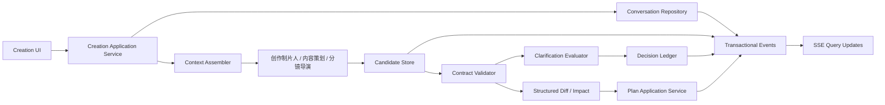
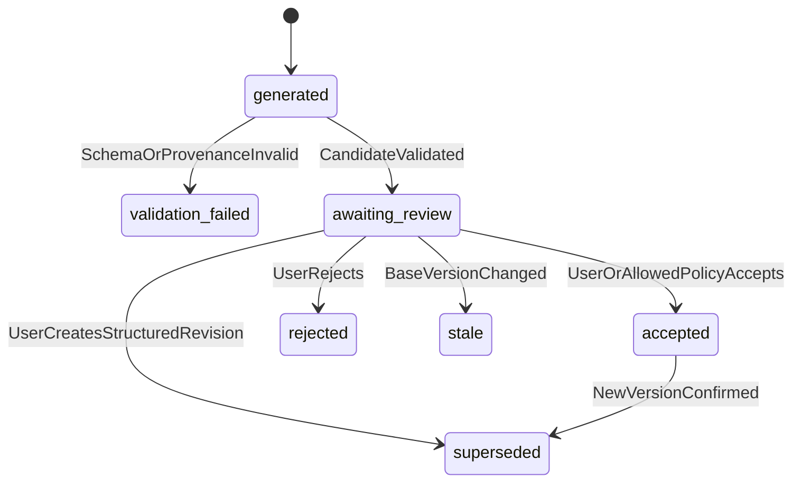

# 片场 V2 创作中心设计

> 状态：设计基线
> 版本：0.3
> 更新日期：2026-07-20
> 上位文档：[V2 产品设计文档](./V2_PRODUCT_DESIGN.md)
> 系统架构：[V2 系统架构](./V2_SYSTEM_ARCHITECTURE.md)

## 1. 目标

创作中心负责把用户的自然语言、附件和显式选择，转化为可确认、可追溯、可版本化的创作方案。

创作中心的最终产物是已确认的 `PlanVersion`，不是生产任务。创建 `ProductionSnapshot`、确认预计费用和提交付费工作项属于后续生产边界。

核心原则：

1. 对话是需求证据，不是生产命令。
2. Agent 只生成候选合同，不修改权威状态。
3. 字段完整性由 Schema 和确定性规则判断，不由模型自由决定。
4. 用户确认的事实和决策优先于 Agent 建议。
5. 每次 Agent 运行使用明确输入清单，不读取隐式共享记忆。
6. 旧版本、旧候选和迟到结果不能覆盖当前活动版本。
7. 不自动重试、不补写缺失字段、不重写用户需求、不套用隐藏模板。

## 2. 范围

### 2.1 首期包含

- 项目创作对话与附件
- 结构化需求候选与需求版本
- 字段完整性检查和澄清问题
- 风险分级决策账本
- 内容策划候选简报
- 分镜导演候选分镜方案
- 方案差异、影响和费用预估
- 用户确认与不可变 `PlanVersion`
- Agent 运行审计、并发守卫和持久事件

### 2.2 首期不包含

- 生产供应商调用
- WorkItem 创建和执行
- 自动模板选择
- 自动模型切换或降级
- 多用户协同编辑
- 自动接受高风险决策
- 对 Agent 无效输出的自动修复
- 从提示词推断人物、场景和服装引用

## 3. 逻辑架构



模块职责：

```text
creation/
├── conversations/       对话、消息和回复关系
├── attachments/         上传验证、分类候选和实体绑定
├── requirements/        需求候选、版本和字段规则
├── context/             Agent 输入清单组装
├── agents/              Agent 端口、运行记录和模型适配
├── candidates/          候选合同生命周期
├── clarification/       确定性缺失字段与提问策略
├── decisions/           风险分级决策账本
├── plans/               创意简报、分镜候选和 PlanVersion
├── impacts/             结构化差异与变更影响
└── queries/             创作中心只读视图
```

## 4. 主流程


从需求确认到方案确认：

```text
RequirementVersion confirmed
→ 内容策划生成 CreativeBriefCandidate
→ 用户检查创意摘要和决策
→ 分镜导演生成 ShotPlanCandidate
→ Schema、实体引用、时长和一致性验证
→ 用户查看 plan diff、影响范围和预计调用
→ ConfirmPlan
→ PlanVersion confirmed
```

## 5. 需求合同

### 5.1 RequirementCandidate

```json
{
  "schema_version": 1,
  "project_id": "project_01",
  "conversation_session_id": "conversation_01",
  "base_requirement_version_id": null,
  "supersedes_candidate_id": "candidate_00",
  "core_intent": "制作一条田径训练日记",
  "duration_seconds": 45,
  "aspect_ratio": "9:16",
  "orientation": "portrait",
  "audience": null,
  "narrative_goal": "记录清晨准备、力量训练和冲刺",
  "character_refs": ["entity_version_char_main_v1"],
  "scene_requirements": ["室外跑道", "力量训练区"],
  "audio_policy": "off",
  "delivery_requirements": {
    "container": "mp4",
    "subtitle_policy": "off"
  },
  "field_provenance": {
    "duration_seconds": ["message_01"],
    "character_refs": ["attachment_binding_01"],
    "audio_policy": ["decision_audio_off_v1"]
  },
  "unresolved_fields": [],
  "assumptions": []
}
```

`assumptions` 首期必须为空。缺失字段使用 `null` 或不提供，并进入确定性完整性检查；Agent 不得生成默认平台、受众、人物属性、品牌、风格、预算或生产路由。

`RequirementCandidate` 在创作阶段表达不可变的“需求草稿修订”，不是每轮必须立即审核的孤立候选。`conversation_session_id` 确定草稿所属会话，`supersedes_candidate_id` 构成修订链。新修订必须完整继承上一修订后再应用本轮更新；运行失败不得使上一修订失效。只有最终确认最新可审核修订时才创建 `RequirementVersion`。

### 5.2 字段策略

每个字段在版本化 Schema 中声明：

```text
field_key
value_type
required_level: blocking | conditional | optional
risk_level: low | medium | high
owner: user | system_config | agent_candidate
allowed_sources[]
confirmation_policy
impact_rule_id nullable
```

示例：

| 字段 | 完整性 | 风险 | 规则 |
|---|---|---|---|
| `core_intent` | blocking | high | 必须有用户消息来源 |
| `duration_seconds` | blocking | medium | 用户输入或用户确认的候选 |
| `character_refs` | conditional | high | 人物镜头存在时必须绑定实体版本 |
| `visual_style` | optional | medium | 可保持未指定或让用户确认建议 |
| `subtitle_font` | optional | low | 可使用可见、版本化系统默认值 |
| `audio_policy` | blocking | high | 必须明确 `off` 或已配置模式 |

确定性 `RequirementCompletenessEvaluator` 根据 Schema 判断阻断字段。Agent 可以解释缺失内容，但不能改变字段的完整性等级。

## 6. 澄清规则

### 6.1 何时提问

仅在以下条件全部满足时创建 `ClarificationRequest`：

1. 字段为 `blocking`，或当前条件使 `conditional` 字段成为阻断项。
2. 当前需求版本、已确认决策、系统配置和附件绑定均没有合法值。
3. 字段没有允许使用的已声明默认值。
4. 问题可以由用户提供一个明确值或从有限选项中选择。

非阻断字段保持未指定，不为了“让方案更完整”不断追问。

### 6.2 问题结构

```json
{
  "id": "clarification_01",
  "project_id": "project_01",
  "requirement_candidate_id": "candidate_01",
  "field_key": "audio_policy",
  "reason_code": "REQUIRED_FIELD_MISSING",
  "prompt": "这个项目是否需要音频？",
  "options": [
    {"value": "off", "label": "关闭音频"},
    {"value": "configured", "label": "使用系统音频配置"}
  ],
  "risk_level": "high",
  "status": "pending"
}
```

问题文案可以由 Agent 提出候选，但 `field_key`、选项值和是否阻断由系统合同决定。

### 6.3 合并提问

- 同一轮最多展示一组相关阻断字段。
- 可将同类中风险项分组确认。
- 高风险项逐项确认。
- 不把可选字段混入阻断问题。
- 用户回答后只解决对应字段，不从回答推断其他决策。

## 7. ContextAssembler

### 7.1 输入清单

每次 Agent 运行前生成不可变 `AgentInputManifest`：

```json
{
  "id": "agent_input_01",
  "project_id": "project_01",
  "agent_role": "creative",
  "base_requirement_version_id": "requirement_v1",
  "base_plan_version_id": null,
  "current_message_id": "message_09",
  "reply_context_message_ids": ["message_08"],
  "confirmed_decision_ids": ["decision_audio_off_v1"],
  "entity_version_ids": ["entity_version_char_main_v1"],
  "attachment_binding_ids": ["attachment_binding_01"],
  "system_config_version_id": "production_config_v3",
  "template_version_id": null,
  "prompt_contract_version": "creative_v1",
  "input_hash": "sha256:..."
}
```

### 7.2 上下文选择规则

允许输入：

- 当前用户消息
- 当前消息显式 `reply_to` 链上的必要消息
- 活动 `RequirementVersion`
- 当前已确认且未被替代的 Decision
- 明确绑定的 EntityVersion 和附件摘要
- 当前系统配置中非秘密、与创作相关的字段
- 用户明确选择的 TemplateVersion

禁止输入：

- 无边界的完整聊天记录
- 其他项目的消息或 Agent 输出
- 已被替代的决策值
- 旧快照中的提示词作为当前事实
- 浏览器本地缓存的未持久化状态
- 供应商密钥和运行凭据

用户使用“刚才那个”“保持上一版”等指代但没有唯一 `reply_to` 或版本目标时，创建澄清项，不做语义猜测。

### 7.3 上下文预算

上下文裁剪只能删除非权威解释文本，不能删减：

- 当前用户消息
- 已确认决策
- 字段来源
- 活动版本 ID
- 实体和附件绑定 ID
- 输出 Schema 与 Agent 边界

若权威输入超过模型上下文限制，本次 AgentRun 明确失败为 `CONTEXT_LIMIT_EXCEEDED`，等待用户或管理员处理；系统不静默摘要事实。

## 8. 候选生命周期

候选类型：

- `RequirementCandidate`
- `CreativeBriefCandidate`
- `ShotPlanCandidate`
- `DecisionProposal`
- `AttachmentClassificationCandidate`

统一状态：

```text
generated
validation_failed
awaiting_review
accepted
rejected
stale
superseded
```



规则：

- `validation_failed` 记录原始输出和字段错误，不自动修复或重试。
- `accepted` 通过应用服务提升为相应 Version，不能由 Agent 直接写入。
- 基础版本变化后，未处理候选立即 `stale`。
- `stale` 候选可以查看和比较，但不能确认。
- 候选确认命令必须携带候选 ID、基础版本 ID 和 `row_version`。
- `ShotPlanCandidate` 修订必须创建新候选并记录 `supersedes_candidate_id`，不得原地覆盖 `shots`。
- 分镜 patch 只接受合同定义的逐镜头字段；未知字段、重复目标和不存在的 `shot_code` 明确失败。
- 修订验证失败不改变来源候选；成功后只有新候选保持 `awaiting_review`。

## 9. 智能体编制与合同

### 9.1 编制原则

V2 使用五个有明确分工的智能体和一个确定性生产编译器。智能体负责理解、分析和产生候选；编译器负责把已确认事实转换为可执行合同。编译器不是智能体，不调用大模型，也不自由解释自然语言。

| 分工 | 产品职责 | 权威输入 | 候选输出 | 不负责 |
|---|---|---|---|---|
| 创作制片人 | 对话、理解需求、提供选择并登记用户明确表达 | 当前会话、活动需求、已确认决策和附件绑定 | `CreativeTurnProposal`、`RequirementCandidate` | 写脚本、拆分镜、选择生产路由 |
| 内容策划 | 把已确认需求组织成可拍摄的内容策略与脚本结构 | `RequirementVersion`、实体版本、已确认决策 | `CreativeBriefCandidate` | 与用户闲聊、生成镜头、创建任务 |
| 分镜导演 | 将已确认创意简报拆为结构化镜头 | 已确认 Brief、实体版本、交付约束 | `ShotPlanCandidate` | 选择 Provider、工作流或费用方案 |
| 质量审核智能体 | 基于素材和冻结合同给出可解释的内容质量发现 | Asset、镜头合同、实体参考、确定性检测证据 | `QCReportCandidate` | 修改素材、判定文件损坏、自动批准或重试 |
| 剪辑助理 | 基于已审核素材提出时间线方案 | 已批准素材、镜头方案、交付与音频合同 | `TimelineCandidate` | 使用未批准素材、渲染交付、擅自补素材 |
| 确定性生产编译器 | 精确解析已确认方案和已发布配置，生成 DAG | `PlanVersion`、配置版本、费用确认和快照输入 | `ProductionSnapshot`、DAG、WorkItem 合同 | 调用模型、猜测 ID、改写提示词或选择替代路线 |

所有智能体共同遵守：

- 每次运行只读取不可变 `AgentInputManifest`，不共享隐式记忆。
- 输出必须是版本化候选合同；模型生成的 ID 不作为系统主键。
- 运行成功不等于候选有效，候选有效不等于用户确认。
- 不直接修改 `RequirementVersion`、`PlanVersion`、项目状态、Asset、QC 权威结论或 Timeline 活动版本。
- 不调用生产 Provider，不创建 WorkItem，不发起付费重试。
- 合同缺失或输出无效时明确失败，不补默认值、不修复 JSON、不切换模型。

### 9.2 创作制片人

创作制片人是用户在创作中心直接对话的唯一智能体入口。它负责自然交流和需求形成，不承担脚本策划与分镜制作。当前合同采用 `creative-dialogue-input.v5`、`creative-dialogue-output.v6` 和 `creative-dialogue-prompt.v15`：

```text
输入：runtime_context.turn_intent + project_context.active_requirement + project_context.current_requirement_draft? + 当前 ConversationSession 的用户/助手消息 + proposal_history[] + selection_scope?
输出：assistant_reply + creative_diagnosis + suggestion_sets[] + proposal_selections[] + explicit_updates[] + clarifying_question?
```

- `assistant_reply` 先回答当前问题，不重复询问已有事实。
- `creative_diagnosis` 每轮提供项目类型、创作阶段、已明确字段、关键缺口、本轮唯一聚焦字段、聚焦原因和消息证据。它是可审计的引导解释，不是正式需求、系统状态或生产路由。
- `suggestion_sets` 是有差异的创意选项，不是项目事实。每个建议组必须声明一个唯一 `field_key`，组内每个选项只能提供该字段的一个候选值，不能捆绑修改其他字段。
- `proposal_history` 按助手消息保留不含系统 ID 的选项摘要和已经发生的选择，仅用于理解上下文，不能再次提交。
- `selection_scope` 只在最新用户消息通过 `reply_to` 精确回复一个仍有未选择建议组的助手提案时存在；它是该轮唯一包含可提交提案、建议组和选项 ID 的作用域。
- `proposal_selections` 只能引用 `selection_scope` 中真实存在的 ID；后端从原提案读取冻结更新，模型不得重写选项值。`selection_scope` 为空时必须返回空选择。
- `explicit_updates` 只允许引用用户消息作为来源，并由后端字段目录校验。
- `creative_constraints` 是可选的用户事实，只能在用户明确表达限制时作为字符串列表登记；它不得成为待补齐缺口、诊断焦点或建议组选项，缺失不影响需求收口。
- 每轮最多提出一个真正阻断的澄清问题；可提供选项时直接提供选项。
- 首次进入时执行一次持久化 `initial_guidance`，只给一组 2–3 个整体创作方向、不形成字段更新；刷新不重复调用，失败不自动重试。每个冻结方向值必须等于用户看到的短标签，详细说明不得夹带进草稿；方向不得越界描述声音、字幕、镜头、剪辑、转场、特效或生产方式。
- 用户选择建议或继续对话后创建继承上一修订的 `RequirementCandidate`；用户可继续丰富，最终确认一次才形成 `RequirementVersion` 并进入策划。
- 对话达到明确配置上限时返回 `CONVERSATION_CONTEXT_LIMIT_EXCEEDED`，不隐藏摘要、筛选或截断。

动态引导不采用固定问卷或主题关键词分支。模型结合活动需求、当前草稿和完整会话判断 `project_type` 与 `stage`，再从尚未明确且会显著影响创作方向的字段中选择一个 `focus_field`。后端要求已明确字段与缺口互斥、焦点必须来自缺口、诊断消息来源存在，且本轮建议必须回应焦点；首次引导的焦点固定为合同字段 `creative_direction`，这是阶段合同而不是内容兜底。除精确选项选择、用户只要求解释问题或建议收口外，创作制片人应围绕焦点主动给出 2–3 个有差异的选择，不再只回复“已记录”。

`stage=ready_to_confirm` 只表示创作制片人建议用户考虑收口。正式需求是否具备最低策划条件继续由后端字段目录和 `evaluate_requirement` 确定，是否确认只由用户命令决定。项目类型不会选择模板、模型、Provider、工作流或生产路线；诊断内容不会进入 `explicit_updates`，也不会成为 Decision。

诊断焦点采用严格的成对合同：非收口阶段的 `focus_field` 与 `focus_reason` 必须同时为非空值，且焦点必须属于 `open_gaps`；`ready_to_confirm` 阶段两者必须同时为 JSON `null`。空字符串不是合法的“无焦点”表达，后端也不会补写原因、修复输出或自动重试。

建议交互采用 2–3 个可点击选项：推荐项固定排第一并显示“推荐”，每项包含短名称、差异说明以及“选择后设置：字段 · 值”的精确预览，模型不得生成选项 ID。后端验证每组选项只修改同一个字段且候选值互不相同，再生成稳定的建议组 ID、选项 ID 与单字段冻结更新；页面另外提供“其他想法”入口，它只聚焦底部唯一的消息输入框，最终仍发送一条普通用户消息，不伪装成模型给出的第四个选项。历史多字段提案也逐项显示全部影响，不再隐藏。

点击选项提交精确 `proposal_id + suggestion_set_id + option_id`，保存 `CreativeSuggestionSelection`，并从该提案对应的草稿修订继承后创建下一修订。点击本身不修改正式需求，也不关闭输入区；人物身份、音频、费用等高风险字段仍按字段目录进入独立确认。每组建议只能选择一次，过期提案、旧需求版本、改名或不存在的 ID 明确失败。

用户也可以在对话中自然表达选择。前端把该消息精确关联到当前助手消息，模型只负责从本轮 `selection_scope` 返回选项 ID；应用服务校验项目、需求版本、会话消息、建议组、选项和来源消息，再用冻结值生成候选及选择记录。历史提案即使仍在会话中，也不再向模型授予可重复提交的 ID。任何不存在、重复、已选择或无法唯一确定的引用都明确失败或要求澄清，不使用序号关键词规则、名称相似度、模型改写值或后端猜测。

用户点击建议时执行一次明确的“保存选择并继续引导”命令。应用服务先按冻结 Option 保存选择、草稿修订和一条可读的结构化用户消息，再以 `turn_intent=selection_followup` 冻结新的输入清单并调用创作模型一次。模型不得重新解释或改写已点击选项，也不得把该选项再次登记为 `explicit_updates` 或 `proposal_selections`；它应先自然确认选择，再根据更新后的草稿诊断下一个最有价值的缺口，并提供 2–3 个可点击方向。后端不规定固定问卷顺序，只验证新建议没有重复刚选定的字段。

一次点击只授权一次模型调用，不后台循环、不自动重试。若诊断达到 `ready_to_confirm`，助手总结当前需求并停止强制给出下一组选项，但输入框继续开放。若模型调用失败，已保存的选择和草稿不回滚，页面明确显示“选择已保存，本轮引导失败”；用户确认模型费用后只能精确重跑 `NextAction.target_ids` 指向的失败 Run，继续使用相同输入清单、模型、Provider 和合同版本。成功重跑解决该失败链后，旧失败只保留在审计历史中，当前提示、阻断和重跑按钮必须退出；前端同时清理原选择命令的临时错误状态。

`explicit_updates` 和 `proposal_selections` 都只生成草稿修订，不直接修改活动需求。当前会话最新草稿是下一轮唯一继承基线，活动需求只作为草稿链起点。自然回复不能把草稿描述成“配置已更新或已生效”。最终确认最新草稿后才创建正式版本；进入策划后普通消息被阶段边界拒绝，修改必须显式开启下一版草稿。

用户在同一条消息中同时提出明确事实、限制和创意建议请求时，模型必须分别返回 `explicit_updates` 与 `suggestion_sets`，不能用自然回复中的口头遵守代替结构化登记。用户明确限制必须作为不超过 20 项的非空文本列表登记；类型错误、空项和确实超过上限分别返回准确错误，系统不把单个文本包装成列表，也不截断超限内容。与活动需求当前值完全相同的显式更新或建议值属于无效模型输出，系统明确失败并保留原字段来源，不静默忽略、不伪造变更。内容方向的标题、说明和值只描述内容意义和叙事选择，不得展开景别、机位、镜头切换、剪辑、转场或特效方案。

创作制片人的建议范围限于内容方向、创作目标、观看感受、受众和风格，不设计具体镜头、慢动作、分屏、剪辑、计时器或生产参数。`audio_mode=off` 只允许无声方案；画面文字是独立创作选择，用户未明确要求时不得自动加入字幕、标题或文字动画。

已归档提案中的上下文、字段目录、交互和评测细节已由本节吸收；代码实现状态仍以 [实现状态](./V2_IMPLEMENTATION_STATUS.md) 为准。

### 9.3 内容策划

内容策划在需求版本确认后运行，不读取自由聊天记录。输入合同 `content-planner-input.v2` 至少冻结：

```text
requirement_version_id
confirmed_decision_ids[]
entity_version_ids[]
delivery_constraints
audio_policy
platform nullable
template_version_id nullable
```

输出 `creative-brief-candidate.v2`：

```json
{
  "title": "清晨训练日记",
  "content_promise": "用一次完整训练展示坚持带来的变化",
  "audience_takeaway": "看到可执行的训练节奏",
  "hook": {"kind": "visual_action", "content": "从系紧鞋带开始"},
  "narrative_beats": [
    {"beat_code": "BEAT_01", "purpose": "建立目标", "summary": "清晨到达跑道", "target_duration_ms": 5000}
  ],
  "script_segments": [
    {"segment_code": "SEG_01", "beat_code": "BEAT_01", "kind": "visual_only", "spoken_text": null, "on_screen_text": null}
  ],
  "tone": "克制、真实",
  "pacing": "前快后稳",
  "platform_adaptation": null,
  "entity_version_ids": ["entity_version_char_main_v1"],
  "constraints_carried_forward": ["audio_policy=off"],
  "open_questions": [
    {
      "question_code": "QUESTION_01",
      "prompt": "是否需要展示具体研究数据？",
      "reason": "数据精度会影响脚本文案和画面信息密度。",
      "options": [
        {"option_code": "OPTION_01", "label": "展示核心数据", "description": "保留少量关键数字并标明来源。", "answer": "展示少量核心研究数据并标明来源。"},
        {"option_code": "OPTION_02", "label": "保持通俗", "description": "不展示具体数字，只解释结论。", "answer": "不展示具体研究数字，使用通俗结论表达。"}
      ]
    }
  ]
}
```

规则：

- `hook`、叙事节拍和脚本段必须能追溯到需求目标，不能引入未确认人物、品牌、地点或产品事实。
- `audio_policy=off` 时，`spoken_text` 必须为 `null`，不得建立旁白、对白或 TTS 依赖；可以描述无声的说话动作。
- 平台未指定时 `platform_adaptation` 保持 `null`，不得默认按抖音、小红书等平台改写。
- 可一次提供最多三个完整 Brief 备选，但每个备选分别形成候选并说明结构差异，不把多个方案拼成一个。
- 内容策划不生成镜头 ID、画面提示词、工作流参数和素材就绪声明。
- `constraints_carried_forward` 仅是可选的可读说明，不具有放行权。为空时不判失败；后端直接依据不可变输入合同验收脚本、平台适配、实体引用、时长和代码关系，不依赖模型复述约束。
- 待确认问题必须从 `QUESTION_01` 连续编号，每个问题提供 2–3 个从 `OPTION_01` 连续编号、互斥且答案不同的选项。用户可以点击选项或填写自定义答案；全部回答后明确调用一次 planner 形成新的 Brief 修订版，不能直接把答案写入正式需求或接受旧方案。
- 历史 `creative-brief-candidate.v1` 的字符串问题保持原样，不为其猜测选项。页面提供独立的“确认模型调用并生成可选项”命令，由用户授权后在同一需求版本下生成 v2 修订候选。

当前实现已经按 `content-planner-input.v2 / creative-brief-candidate.v2 / content-planner-prompt.v3` 接入独立 `planner` 模型配置和真实 OpenAI-compatible 网关。每个活动需求版本只自动尝试一次；失败会保存结构化错误、受控原始输出和 Provider 请求审计，不自动重试。用户可以在方案页明确确认模型费用后，重跑当前需求版本最近一次失败运行；重跑必须复用同一 `AgentInputManifest`，并校验生产配置、模型、Provider、Prompt 合同和输出 Schema 与原失败运行完全一致。新命令创建新的 `AgentRun`，不覆盖失败记录、不修复模型输出、不切换配置。模型输出经 Pydantic Schema 后还要通过确定性跨字段验证：节拍总时长必须精确匹配交付时长，节拍与脚本代码连续且引用存在，实体 ID 必须来自输入白名单，音频关闭和平台未指定约束必须由实际输出遵守。验证成功只创建 `CreativeBriefCandidate`，用户接受后才允许分镜导演读取。

方案页将修改分成三个明确命令：

- `调整方案`：适用于节奏、开场、内容顺序、表达方式等不改变已确认基础需求的修改。系统冻结原 Brief 和本次修改意见，在同一需求版本下调用一次当前内容策划模型，生成下一版 Brief 候选。
- `修改创作需求`：适用于主题、受众、目标、时长、画幅、音频策略或已确认实体等基础事实变化。系统拒绝当前 Brief 并返回 `collecting_requirements`；用户继续对话并再次确认后，才创建新的 `RequirementVersion`。
- `放弃方案`：只拒绝当前 Brief，不猜测用户要改什么，也不自动创建新需求或新方案。

`CreativeBriefCandidate` 使用 `supersedes_candidate_id`、`revision_number`、`source` 和 `created_by` 保存不可变修订链。成功修订将原待审核或已拒绝候选标记为 `superseded`；失败时不改变原候选和项目状态。失败修订的显式重跑复用其原 `AgentInputManifest`，不重新解释修改意见，不切换模型、Provider、Prompt、输出合同或配置。Brief 被拒绝后的项目状态必须由 `plan_review` 转回 `collecting_requirements`，前端同时刷新项目、策划中心和创作中心权威查询，不能用旧缓存继续禁用输入框。

### 9.4 分镜导演

分镜导演输入合同 `director-input.v1` 只接受已确认 `RequirementVersion`、已确认 Creative Brief、精确实体版本、交付约束和已确认决策。输出 `shot-plan.v2`，每个镜头至少包含：

```text
shot_code / sequence_number / duration_ms / narrative_beat_code
scene_entity_version_id nullable
character_entity_version_ids[] / outfit_entity_version_ids[]
product_entity_version_ids[] / primary_reference_entity_version_id nullable
continuity_group_id nullable / action_count = 1
face_visibility / text_policy / motion_requirement
composition / action / generation_description / negative_prompt nullable
audio_requirement: off | lip_motion_only | configured
```

- 所有实体、节拍和附件引用必须精确存在；缺失时验证失败，不从描述创建隐式实体。
- 同一连续场景必须引用同一场景版本；换装必须引用明确的 OutfitState 变化。
- 每个镜头只有一个主要动作目标。需要多个训练动作时拆成多个镜头，不假设普通首帧视频会消费多图。
- `face_visibility`、`text_policy` 和 `motion_requirement` 是后续 QC 的权威检查条件，不从提示词反推。
- 分镜导演不得选择 Provider、模型、工作流槽位、NodeInfoList 或价格规则。

当前实现使用独立 `director` 模型配置和 `director-input.v1 / shot-plan.v2 / director-prompt.v2`。输入清单冻结当前需求版本、唯一已接受 Brief 的完整节拍与脚本、已解决 Decision、已确认实体版本及其来源附件验证事实、交付规格和音频策略，不读取自由聊天，也不读取生产工作流配置。Prompt 明确定义 `required / optional / not_visible` 的画面语义，禁止将“未绑定人物”或“不确定”直接归为人脸不可见，并要求返回前逐镜头核对动作、构图、画面描述、实体引用和生成约束。输出经严格 Pydantic Schema 后继续执行确定性跨字段验证：镜头与顺序连续、每个节拍至少一个镜头且时长精确相等、实体与主参考来自白名单、同一连续组的场景/人物/服装签名完全一致、`action_count` 恒为 1、关闭音频时只允许 `off` 或 `lip_motion_only`。后端不通过动作描述关键词猜测复合动作或自动修改人脸约束。

每个活动需求版本只自动尝试一次。模型调用、Schema 或跨字段验证失败时只记录失败 `AgentRun`、原始输出和 Provider 审计，不创建候选，不修复输出、不自动重试、不切换配置。方案页可由用户明确确认再次调用模型后，精确重跑最近一次失败的分镜导演；重跑必须复用原 `AgentInputManifest`，且生产配置、模型、Provider、Prompt 与输出 Schema 全部相同。成功只创建待审核 `ShotPlanCandidate`，用户接受后才创建不可变 `PlanVersion`。

分镜候选的人工修订界面采用单镜头工作区：镜头导航显示编号、动作摘要、镜头类型、时长和修改状态，支持搜索以及“全部 / 已修改”筛选；编辑区只渲染当前镜头，提供上一个、下一个和重置当前镜头。桌面端左右两栏保持同一固定高度，镜头列表与右侧表单分别独立滚动，镜头数量不得撑高工作区或被底部操作栏截断。切换、搜索、筛选和重置只作用于前端内存草稿，提交时仍由原合同计算逐镜头 Patch 并一次创建下一版候选。页面不自动保存、不调用分镜导演，也不改变旧候选。

用户拒绝分镜后，页面必须继续显示被拒绝版本及其拒绝状态，不能退化为一个实际不可执行的“再次生成”按钮。最近被拒绝且未被替代的候选是合法修订源；用户点击具体镜头并提交结构化 Patch 后，系统创建新候选、将旧版本标记为 `superseded`，并通过正式状态转移回到 `plan_review`。拒绝后的修订不调用模型、不自动修改镜头，也不把分镜拒绝解释为内容方案或需求被拒绝。

工作区在桌面端左右排列并固定可视高度，导航与表单独立滚动；在移动端改为上方横向镜头列表和下方编辑区，避免镜头表单堆叠与横向溢出。修改总数、当前镜头未保存状态和提交数量必须可见，但不得把本地草稿描述为已保存或已生效。

### 9.5 质量审核智能体

质量审核分为确定性检查和智能内容分析，两者不可互相替代：

1. `FileContractAnalyzer` 先验证文件存在、MIME、哈希、可解码性、尺寸、时长和快照引用。确定性失败直接形成权威 `blocked`，不调用质量审核智能体。
2. 确定性检查通过后，用户或阶段命令可调用质量审核智能体，产生 `qc-report-candidate.v1`。
3. 候选经 Schema 与证据引用校验后进入人工审核；智能体不能自行写入 `passed`、`approved` 或 `rejected`。

输入至少冻结：

```text
asset_id / asset_hash / media_probe_id
snapshot_id / dag_node_id / shot_code
shot_contract_version / entity_reference_asset_ids[]
deterministic_check_ids[] / qc_policy_version
model_config_version / prompt_contract_version
```

输出结构：

```json
{
  "overall_recommendation": "review_required",
  "findings": [
    {
      "finding_code": "IDENTITY_SIMILARITY_UNCERTAIN",
      "category": "identity",
      "severity": "medium",
      "confidence": 0.78,
      "summary": "主角面部与参考存在明显差异",
      "evidence": [{"kind": "video_frame", "asset_id": "asset_01", "timestamp_ms": 1260}],
      "contract_refs": ["shot_004.character_entity_version_ids[0]"],
      "suggested_review_action": "compare_reference"
    }
  ],
  "analyzer_version": "visual-qc.v1"
}
```

规则：

- Finding 类别首期限定为 `identity`、`continuity`、`semantic_match`、`composition`、`visible_text`、`motion`、`audio_content`。
- 每条 Finding 必须同时有结构化证据和合同引用；只有主观描述的结果验证失败。
- `confidence` 只表示分析置信度，不能改变严重级别、项目状态或人工确认要求。
- 仅当镜头合同 `face_visibility=required` 时检查正脸；`not_visible` 的背影、脚部和远景不报正脸缺失。
- 动态检查读取 `motion_requirement`；氛围静态镜头与运动镜头使用不同已版本化规则。
- OCR、身份相似度和语义判断默认进入 `review_required`，不作为确定性硬失败。
- 不满意或不通过时只列出问题与受影响下游，不生成重试、替代素材或提示词修改。

当前首期实现采用 `qc-agent-input.v1 / qc-report-candidate.v1 / qc-agent-prompt.v1`。确定性文件、尺寸和时长检查先运行；只有单张图片通过这些检查后，才允许调用声明了 `vision_analysis` 能力的已发布 QC 模型。模型接收冻结素材哈希、镜头合同、证据白名单、待审图片和存在时的冻结主参考图片，只能创建 `QCReportCandidate`；参考文件会再次校验路径与哈希。候选不等于权威报告，用户批准或拒绝素材时才把候选发现写入正式 `QCReport` 和 `AssetReviewDecision`。

当前 OpenAI-compatible 合同不声称能够读取视频文件或音频内容。视频与音频在确定性检查后进入明确标记的人工审核路径，不创建虚假的智能体结论。后续接入视频抽帧或音频理解必须新增版本化媒体分析合同、证据时间戳和对应 Provider 能力，不得复用图片合同隐式降级。

质量智能体失败时素材保持 `verified`，失败 `AgentRun`、原始输出和 Provider 请求证据被保留。页面只允许用户确认模型费用后精确重跑同一 Manifest；生产配置、模型、Provider、Prompt 和输出 Schema 任一变化都拒绝重跑，不自动重试、不换模型、不修复输出。

### 9.6 剪辑助理

剪辑助理只能在质量阶段允许进入剪辑后运行。输入合同 `editor-assistant-input.v1` 至少冻结：

```text
plan_version_id / snapshot_id
approved_asset_ids[] / qc_report_ids[]
shot_plan_version / creative_brief_version
delivery_contract / audio_policy / subtitle_policy
timeline_policy_version
```

输出 `timeline-candidate.v1`：

```json
{
  "duration_ms": 30000,
  "tracks": [
    {
      "track_code": "V1",
      "kind": "video",
      "items": [
        {
          "timeline_item_code": "ITEM_001",
          "source_asset_id": "asset_01",
          "shot_code": "SHOT_001",
          "source_in_ms": 0,
          "source_out_ms": 4200,
          "timeline_in_ms": 0,
          "timeline_out_ms": 4200,
          "selection_reason": "动作完整且人物审核已通过",
          "qc_report_ids": ["qc_01"]
        }
      ]
    }
  ],
  "gaps": [],
  "rhythm_notes": ["开场四秒内完成目标建立"],
  "subtitle_cues": [],
  "audio_cues": []
}
```

规则：

- `source_asset_id` 必须属于活动快照且状态允许使用；不按文件名、镜头简称或创建顺序猜测。
- 每个时间线条目必须保留选择理由、对应镜头和 QC 证据，便于用户取舍。
- 缺少可用素材时写入 `gaps[]` 并保持候选不可确认；不得复用相邻素材、插黑帧或自行生成替代素材。
- 不自动裁切、变速、循环、补帧或重排来掩盖时长不足；允许的编辑操作必须在 `timeline_policy_version` 中显式声明。
- 音频关闭时不得创建音轨、旁白、对白、TTS 或对口型依赖；字幕策略关闭时 `subtitle_cues` 必须为空。
- 输出只形成候选。用户可逐项取舍或修订，确认后才创建不可变 TimelineVersion。

### 9.7 确定性生产编译器

生产编译器位于创作智能体之后、素材生产之前，详细实现边界以 [V2 系统架构](./V2_SYSTEM_ARCHITECTURE.md) 为准。它必须：

- 只读取已确认 `PlanVersion`、精确实体/附件版本、已发布系统配置和已确认费用。
- 对每个 `source_intent_id`、实体 ID、工作流槽位和 NodeInfoList 做精确解析；任一缺失即阻断。
- 普通首帧视频恰好绑定一张父图片，多图输入明确失败。
- 音频关闭时不生成 TTS、音频上传、对口型或音轨依赖。
- 不调用大模型，不分析员工文字，不改写提示词，不选择替代工作流，不自动重试。

### 9.8 智能体交接矩阵

智能体之间不互相直接调用，也不把自然语言输出传给下一个智能体。每一步由应用服务读取已持久化、已验证且满足确认级别的版本：

| 上游 | 可交接条件 | 下游读取内容 | 禁止传递 |
|---|---|---|---|
| 创作制片人 | `RequirementVersion` 已确认 | 内容策划读取需求、决策、实体与约束 | 助手聊天文案、未选择建议 |
| 内容策划 | Creative Brief 已确认 | 分镜导演读取 Brief 版本和精确节拍 | 原始模型输出、未确认备选 |
| 分镜导演 | `PlanVersion` 已确认 | 编译器读取结构化镜头与实体引用 | 提示解释、猜测的生产参数 |
| 生产编译器 | 快照锁定且生产完成 | 质量审核读取 Asset 与冻结合同 | 临时 Provider 响应文本 |
| 质量审核 | 必需素材已人工批准 | 剪辑助理读取批准素材与 QC 报告 | 未验证素材、模型的批准结论 |
| 剪辑助理 | TimelineCandidate 已验证并由用户确认 | 交付服务读取 TimelineVersion | 建议文本、缺口候选 |

任一交接条件不满足时，应用服务返回精确缺口；不能跳过上游、调用另一个智能体补写或把旧版本当作当前版本。

### 9.9 AgentRun

```text
id
project_id
agent_role
status: created | running | succeeded | validation_failed | failed | cancelled | stale
input_manifest_id
model_provider / model_name
prompt_contract_version
output_schema_version
raw_output_uri
parsed_candidate_id nullable
input_tokens / output_tokens nullable
estimated_cost / actual_cost nullable
latency_ms nullable
error_code / error_detail nullable
started_at / finished_at
```

AgentRun 成功只表示收到候选输出，不表示候选有效或已确认。

创作中心的运行历史使用普通用户可理解的智能体分工名称，默认展示状态、模型、耗时、输入消息/决策/附件绑定数量和候选登记结果。以下精确事实放在可展开审计详情中：

```text
prompt_contract_version
output_schema_version
system_config_version
base_requirement_version_id
input_hash
agent_run_id
error_code / error_detail
```

这些内容必须来自持久化 `AgentRun` 与其精确 `AgentInputManifest`，不得解析原始模型文本补齐。创作中心 API 不返回 `raw_output`，历史区保持只读，不提供取消、恢复或覆盖历史运行的命令。创作制片人失败时，主流程区域可以提供独立显式重跑命令，但必须绑定精确失败 Run、同一活动需求版本、完全一致的会话消息 ID 清单，并要求用户确认本次模型调用。内容策划失败采用相同的人为确认边界，但绑定的是当前需求版本最近一次失败 Run、原 `AgentInputManifest` 和完全一致的模型配置及合同。两类重跑都会创建新 AgentRun，不修改旧记录、不自动重跑、不切换模型，也不等同于生产 WorkItem 重试。

## 10. 附件与实体绑定

当前创作制片人使用纯文本模型。其输入清单只向模型提供附件文件 ID、文件名、MIME、大小、验证状态和已确认用途绑定，并固定声明 `content_access=metadata_only`。模型不得据此声称看过图片、听过音频或理解视频内容；需要媒体内容事实时必须请用户描述。媒体理解需要独立的多模态模型合同、调用费用和验收集，不能由附件上传状态隐式开启。

### 10.1 生命周期

```text
uploaded
→ verifying
→ verified
→ classification_required
→ bound
```

异常状态：`blocked`、`rejected`、`deleted`。

### 10.2 Attachment

```text
id
project_id
message_id
asset_id
original_filename
mime_type
byte_size
content_hash
verification_status
created_at
```

上传完成只创建 Attachment 和底层 Asset，不自动成为人物参考。

### 10.3 AttachmentBinding

```json
{
  "id": "attachment_binding_01",
  "attachment_id": "attachment_01",
  "binding_type": "identity_reference",
  "entity_id": "char_main",
  "entity_version_id": "entity_version_char_main_v1",
  "status": "confirmed",
  "confirmed_by": "user",
  "confirmed_at": "2026-07-15T10:00:00Z"
}
```

`binding_type` 为受控枚举：

- `identity_reference`
- `outfit_reference`
- `scene_reference`
- `product_reference`
- `voice_sample`
- `inspiration_only`
- `unclassified`

Agent 可以生成分类候选，但人物身份、声音样本和版权敏感绑定必须由用户确认。

### 10.4 文件验证

确定性验证包括：

- MIME 与文件内容一致
- 文件可读取且哈希完成
- 图片/音视频基础元数据有效
- 文件大小和类型符合系统限制
- 路径位于允许存储范围

验证失败明确阻断绑定，不转换文件格式、不替换文件、不生成占位资源。

### 10.5 媒体理解候选（暂缓）

媒体附件理解已记录为后续能力，当前不实现。实施顺序为图片、音频、视频；图片理解优先，视频理解延后到素材审核与剪辑阶段。独立媒体理解服务读取已验证附件，输出版本化 `MediaAnalysisCandidate`，至少保存媒体类型、模型与配置版本、输入附件哈希、结构化发现、置信度、证据、费用事实和状态。

分析结果只表示模型候选。用户确认后才能创建已确认媒体事实并交给创作制片人、内容策划或分镜导演；不得自动建立人物身份、服装、场景、产品或声音样本绑定，不得直接修改 RequirementVersion、EntityVersion、PlanVersion 或生产合同。图片、音频和视频理解分别使用独立合同、模型配置、费用提示和验收集，不复用当前 `metadata_only` 文本模型冒充多模态能力。

## 11. 决策确认

Decision 使用数据模型文档定义的不可变版本结构。

确认策略：

| 风险 | 行为 |
|---|---|
| `low` | 可物化已声明、可见且有版本的默认值；进入方案汇总供用户检查 |
| `medium` | 在需求或方案阶段分组确认 |
| `high` | 用户逐项明确确认 |

Agent 建议永远不是已确认 Decision。系统默认值必须记录 `source=declared_default` 和配置版本，模板默认值必须记录 `source=template` 和模板版本。

## 12. 结构化差异与变更影响

### 12.1 RequirementDiff

比较发生在两个结构化版本之间：

```json
{
  "base_version_id": "requirement_v1",
  "candidate_id": "candidate_09",
  "changes": [
    {
      "field_key": "duration_seconds",
      "before": 45,
      "after": 60,
      "source_message_id": "message_09",
      "risk_level": "medium"
    }
  ]
}
```

不使用自然语言段落相似度决定字段是否变化。

### 12.2 影响分析

若项目尚未生产，展示受影响方案字段和预计调用变化。

若已有活动快照，展示：

- 受影响 EntityVersion 和 Shot
- 将过期但不会删除的素材
- 需要重新编译的 DAG 节点
- 需要重新验证的时间线
- 预计新增调用和费用

用户确认变更后创建新的 Decision、RequirementVersion 和 `plan_v2` 草稿。系统不修改 `plan_v1` 或 `snapshot_001`，也不自动提交重做。

## 13. 并发、幂等与旧结果

### 13.1 命令幂等

所有写命令携带：

```text
command_id
project_id
expected_row_version
actor_id
issued_at
```

同一 `command_id` 重复提交返回第一次的持久结果，不重复创建消息、AgentRun、决策或版本。

### 13.2 Agent 并发

- 每个 AgentRun 绑定基础 RequirementVersion、PlanVersion 和输入哈希。
- 用户新消息使基于旧活动版本的未完成候选在落库时标为 `stale`。
- 旧 AgentRun 可以完成审计，但不能自动更新当前摘要。
- 同一项目允许保留多个候选，但只能确认仍匹配活动基础版本的候选。
- 不通过取消旧请求来假装供应商或模型没有执行；取消状态与成本照实记录。

### 13.3 乐观锁冲突

`expected_row_version` 不匹配时返回 `409 PROJECT_VERSION_CONFLICT`，响应包含当前版本和重新获取建议。后端不合并两次并发确认，也不采用最后写入覆盖。

## 14. API 草案

### 14.1 命令

```text
POST /api/v1/projects
POST /api/v1/projects/{project_id}/messages
POST /api/v1/projects/{project_id}/attachments
POST /api/v1/projects/{project_id}/attachments/{attachment_id}/bindings
POST /api/v1/projects/{project_id}/requirement-candidates:generate
POST /api/v1/projects/{project_id}/requirement-candidates/{candidate_id}:accept
POST /api/v1/projects/{project_id}/requirement-candidates/{candidate_id}:reject
POST /api/v1/projects/{project_id}/clarifications/{clarification_id}:resolve
POST /api/v1/projects/{project_id}/decisions/{decision_id}:confirm
POST /api/v1/projects/{project_id}/plan-candidates:generate
POST /api/v1/projects/{project_id}/plan-candidates/{candidate_id}:confirm
POST /api/v1/projects/{project_id}/agent-runs/{run_id}:retry
POST /api/v1/projects/{project_id}/agent-runs/{run_id}:cancel
```

冒号动作表示显式命令，不与资源更新混用。Agent 重试接口只在用户操作后创建新 AgentRun，不复用或覆盖旧运行。

### 14.2 查询

```text
GET /api/v1/projects/{project_id}/creation-center
GET /api/v1/projects/{project_id}/messages?after=...
GET /api/v1/projects/{project_id}/requirements
GET /api/v1/projects/{project_id}/candidates
GET /api/v1/projects/{project_id}/decisions
GET /api/v1/projects/{project_id}/plans
GET /api/v1/projects/{project_id}/agent-runs
GET /api/v1/projects/{project_id}/events?after_sequence=...
```

### 14.3 CreationCenterView

前端首屏使用聚合查询模型：

```json
{
  "project": {},
  "active_requirement": {},
  "active_plan": null,
  "messages": [],
  "pending_clarifications": [],
  "pending_decisions": [],
  "current_candidate": null,
  "agent_run": null,
  "attachments": [],
  "next_action": {
    "code": "RESOLVE_REQUIRED_DECISIONS",
    "target_ids": ["decision_01"]
  }
}
```

`next_action` 由后端状态评估器给出，前端不通过消息文本猜测。

## 15. 事件

使用统一事件信封，创作中心事件包括：

```text
conversation.message_added.v1
attachment.uploaded.v1
attachment.verified.v1
attachment.binding_confirmed.v1
agent.run_created.v1
agent.run_succeeded.v1
agent.run_failed.v1
candidate.generated.v1
candidate.validation_failed.v1
candidate.stale.v1
clarification.requested.v1
clarification.resolved.v1
requirement.confirmed.v1
decision.requested.v1
decision.resolved.v1
plan.candidate_created.v1
plan.confirmed.v1
```

状态更新和事件写入同一事务。SSE 仅传递已提交事件；断线重连不重复创建候选或 AgentRun。

## 16. 错误和恢复

错误响应至少包含：

```json
{
  "error_code": "CANDIDATE_BASE_VERSION_STALE",
  "message": "这个候选基于旧需求版本，不能确认。",
  "responsible_module": "creation.candidates",
  "project_id": "project_01",
  "candidate_id": "candidate_01",
  "field_errors": [],
  "allowed_actions": ["view", "generate_new_candidate"]
}
```

恢复规则：

- Agent 超时或模型错误：AgentRun `failed`，用户可明确重新生成。
- Schema 无效：候选 `validation_failed`，展示字段错误，不修复原输出。
- 上下文过期：候选 `stale`，重新读取活动版本后由用户发起新生成。
- 附件无效：绑定阻断，用户重新上传或删除附件。
- 决策冲突：返回 `409`，重新获取当前版本。
- 服务重启：从数据库恢复消息、候选、AgentRun 和项目状态。

任何错误都不自动切换模型、修改 Prompt、补默认值或发起第二次调用。

## 17. 安全与合规

- 附件文件名、MIME、路径和大小经过确定性验证。
- 用户上传的肖像、声音、品牌和版权素材保留来源与确认记录。
- 高风险身份和声音绑定必须用户确认。
- Agent 输入不包含供应商密钥、访问令牌或未授权项目数据。
- 原始 Agent 输出存储在受控位置，事件只保存 URI、哈希和必要摘要。
- 删除消息或附件前检查 RequirementVersion、Decision、EntityVersion 和 PlanVersion 引用。
- 已用于历史版本的证据默认归档，不做破坏审计链的级联删除。

## 18. 数据模型增量

在 [V2 系统架构](./V2_SYSTEM_ARCHITECTURE.md) 基础上，创作中心实现需要增加：

```text
Attachment
AttachmentBinding
ConversationSession
AgentInputManifest
AgentRun
CreativeTurnProposal
CreativeSuggestionSelection
RequirementCandidate
CreativeBriefCandidate
ShotPlanCandidate
ClarificationRequest
CandidateValidationResult
RequirementDiff
```

这些表在首个实现迁移中明确外键和唯一约束，不将候选混存进 Message 文本或 Project JSON。

## 19. 前端状态

需求对话输入框采用对话式键盘交互：`Enter` 提交当前非空消息，`Shift+Enter` 保留换行。中文输入法处于组词状态时不得触发提交，消息提交请求进行中也不得通过键盘或按钮重复发送。键盘提交和发送按钮复用同一条消息命令；保存成功后只发起一次独立智能体命令，助手回复与候选分别持久化，不创建生产任务。

创作中心桌面主工作区采用稳定高度：对话与结构化需求两列等高，消息列表和需求字段列表各自在内部滚动，输入区固定在对话面板底部。新增消息及回复渲染后定位到消息末尾，长文本必须在消息气泡内换行，不能扩大列宽或页面高度。移动端对话面板保持有界滚动，结构化需求面板恢复自然高度。

创作中心必须覆盖：

- 空项目
- 用户消息持久化中
- Agent 等待、运行、失败和取消
- 候选验证失败
- 等待澄清
- 等待中/高风险决策
- 需求候选待确认
- 分镜候选待确认
- 分镜候选已拒绝，等待用户调整具体镜头
- 候选过期
- 方案已确认，等待创建生产快照

页面始终显示：

- 当前活动需求和方案版本
- 内容来源：用户、系统默认、模板或 Agent 建议
- 当前等待的责任方
- 唯一明确的下一步操作
- 是否会触发模型费用或生产费用
- 智能体运行的输入清单摘要、候选登记结果与可展开审计证据

生产准备区默认使用普通用户术语，不在主要操作路径直接展示 `snapshot`、`preparing`、`DAG`、`WorkItem`、内部错误代码或长技术键。页面将其分别表达为“制作方案、等待确认/等待补充费用、制作步骤、制作任务、需要处理的问题和生成方案名称”；原始 ID、状态、合同哈希、节点与依赖数量保留在默认收起的“技术详情”中。该翻译只影响展示，不改变状态机、费用确认、不可变版本或显式路由选择。

前端不能使用本地消息数量、动画状态或 Agent 文案设置项目状态。

当前实现由权威项目状态转移器写入需求与规划阶段：消息、Decision、需求确认、Brief/分镜候选及方案确认各自提交显式触发器。pending Decision 存在时不能进入方案生成；最后一个 Decision 解决后，由决策服务根据活动需求的确定性完整性选择 `planning` 或 `collecting_requirements`。转移器不读取员工文本或提示词猜测状态。

## 20. 测试验收

### 20.1 需求与上下文

- 缺少 blocking 字段时创建精确 ClarificationRequest。
- 缺少 optional 字段时不阻断、不自动填值。
- AgentInputManifest 只包含允许的活动版本和显式引用。
- 已替代 Decision 不进入新 Agent 输入。
- 无唯一目标的“保持上一版”触发澄清，不猜版本。

### 20.2 候选与确认

- 无效 Agent JSON 保留原始输出并进入 `validation_failed`。
- Agent 成功不自动创建 RequirementVersion 或 PlanVersion。
- 基础版本变化后旧候选进入 `stale` 且确认返回 `409`。
- 重复确认命令不创建两个版本。
- 高风险决策不能由 Agent 或 declared default 确认。

### 20.3 附件

- 上传成功但未绑定的图片不能作为人物参考。
- 人物分类候选不等于身份绑定确认。
- 无效媒体明确阻断，不创建占位素材。
- 被历史版本引用的附件删除时返回引用清单。

### 20.4 并发与恢复

- 连续消息产生的旧 Agent 迟到结果不能覆盖新需求。
- 同一 `command_id` 重放不重复调用模型。
- API 重启后候选、运行状态和下一步操作一致。
- 创作制片人、内容策划与分镜导演的输入清单冻结同项目全部已解决 Decision 的精确 ID、键和值；Pending Decision 不进入清单，历史清单不补写。
- SSE 重连不重复应用事件。
- Agent 失败不触发自动重试。

### 20.5 完整 Demo

使用“30 秒竖屏健身广告、单一成年主角、音频关闭”跑通：

```text
创建项目
→ 上传并确认人物参考
→ 发送需求消息
→ 生成 RequirementCandidate
→ 解决高风险人物身份决策
→ 确认 RequirementVersion
→ 生成并确认 ShotPlanCandidate
→ 创建 plan_v1
→ 展示下一步为创建生产快照
```

测试期间不调用 RunningHub、CosyVoice 或其他生产供应商。

### 20.6 智能体合同验收

- 创作制片人可以理解上一轮助手给出的选项，但未被用户选择的建议不进入需求事实。
- 建议组只允许 2–3 个选项，推荐项排第一；“其他想法”只聚焦统一输入框，最终发送仍创建普通用户消息而不是建议选择记录。
- 点击建议只创建 `CreativeSuggestionSelection` 和继承当前内容的下一版草稿修订，活动 `RequirementVersion` 保持不变，用户仍可继续对话。
- 内容策划在 `audio_policy=off` 时不输出口播文本；平台未指定时不做平台适配。
- 内容策划引入未确认人物、品牌、场景或产品时，候选验证失败。
- 内容方案微调后 `RequirementVersion` ID 保持不变，新候选精确引用上一候选；基础需求修改后只有再次确认才创建新需求版本。
- 内容方案修订失败时原候选仍可审核，且不会自动重试；精确重跑复用失败修订的原输入清单。
- 分镜导演引用不存在的实体、节拍、附件或缩写 ID 时明确失败，不自动改名。
- 分镜中的复合动作必须拆成多个镜头；普通首帧视频不会因文字描述而获得多个输入图。
- 分镜修订只渲染当前选中镜头；搜索、筛选、切换和单镜头重置不提交后端，只有显式创建修订候选才写入不可变候选链。
- 质量审核的每条 Finding 均含证据和合同引用；无证据发现不能进入人工审核。
- `face_visibility=not_visible` 时不产生正脸缺失，运动镜头与静态氛围镜头使用不同动态规则。
- 质量审核建议不能把素材自动批准、拒绝或加入重试队列。
- 剪辑助理只引用活动快照内已批准素材，任一不存在、未批准或改名的素材 ID 均验证失败。
- 素材不足时 TimelineCandidate 显示精确 `gaps`，不自动复用、补帧、插黑帧或生成替代素材。
- 音频关闭时，内容策划、分镜、生产 DAG 和时间线均不存在音频依赖。
- 任一智能体输出无效时只记录本次失败，不自动调用第二个模型或下游智能体补写。

## 21. 实施顺序

### Creation Sprint 1：权威数据

- Conversation / Message / Attachment
- RequirementCandidate / RequirementVersion
- AgentInputManifest / AgentRun
- Candidate 生命周期和 Repository
- 命令幂等与乐观锁

### Creation Sprint 2：确认闭环

- RequirementCompletenessEvaluator
- ClarificationRequest
- 风险分级 Decision
- 创作制片人端口与 Mock Agent
- CreationCenterView 和 SSE

### Creation Sprint 3：方案闭环

- CreativeBriefCandidate
- 内容策划、分镜导演端口与 Mock Agent
- ShotPlanCandidate 验证
- RequirementDiff / ChangeImpact
- PlanVersion 确认

### Creation Sprint 4：创作模型接入

- 创作制片人 `creative-dialogue-input.v5 / output.v6 / prompt.v15`（已完成）
- 内容策划 `content-planner-input.v2 / creative-brief-candidate.v2 / content-planner-prompt.v3`，含 Brief 不可变修订链与结构化确认项（已完成）
- 分镜导演 `director-input.v1 / shot-plan.v2`
- 显式模型、PromptContract、Token、延迟和成本审计
- 固定验收集和用户触发的重新生成

### Creation Sprint 5：质量审核智能体

- 保持 `FileContractAnalyzer` 的确定性检查优先级
- `qc-report-candidate.v1`、证据引用与 Finding Schema
- 身份、连续性、语义、文字和动态的固定验收集
- 人工批准/拒绝门禁和受影响下游只读视图

实施状态：图片质量审核合同、候选持久化、运行审计、失败精确重跑和人工门禁已完成；视频与音频保持明确人工审核。真实图片理解验收仍需发布唯一 `qc` 模型配置，且 Provider 必须声明 `vision_analysis`。

### Creation Sprint 6：剪辑助理

- `editor-assistant-input.v1 / timeline-candidate.v1`
- 已批准素材白名单、选择依据和 QC 证据
- 素材缺口、音频关闭和字幕关闭验收
- 用户修订与不可变 TimelineVersion 确认

真实模型接入必须晚于对应 Mock Agent 和合同测试。质量审核智能体不得替代确定性文件检查，剪辑助理不得绕过人工素材批准；任何阶段都不增加自动重试或隐藏替代逻辑。

## 22. 当前实现迁移说明

当前 V2 骨架已有简化的 Project、Decision、ProjectEvent 和 `contract_validation` Worker 流程。迁移时：

- 保留现有 API 作为骨架验证，不将其简化 `draft / confirmed` 状态继续扩展为最终状态机。
- 先通过 Alembic 增加创作中心实体和 Repository，再替换服务层直接 SQLAlchemy 操作。
- `confirm_project` 拆分为确认需求、确认决策、确认方案和创建快照等独立命令。
- 现有 Decision 数据通过迁移赋予明确版本、风险、来源和状态；不能在读取时猜测补齐。
- 现有事件升级到统一事件信封，保留旧事件的可读迁移策略。

迁移完成前，V2 页面必须明确显示“骨架状态”，不能把简化确认流程展示为完整生产合同。

## 23. 创作智能体 V2 已确认设计

现有真实创作模型输入只包含用户消息，不能理解依赖助手回复的上下文指代；自然回复与字段提取共用同一个狭窄合同，也限制了主动提供方案的能力。已确认的下一版引入 `ConversationSession` 与不可变 `CreativeTurnProposal`，按持久化顺序向模型传递当前会话的用户和助手消息，并把自然回复、建议选项、显式用户更新和澄清问题分开验证。

创意建议只作为建议事实保存，不能直接写入 `RequirementVersion`、`Decision` 或项目状态。用户选择精确提案选项后才创建待确认需求候选；字段风险和确认等级由后端版本化目录决定。上下文达到配置上限时明确阻断，不自动摘要或截断，也不增加重试、模型切换、输出修复和生产兜底。

创作制片人及其与其他智能体的权威合同以本文第 9 节为准。原始评审过程保留在 [V2 创作智能体设计提案](./archive/proposals/V2_CREATIVE_AGENT_DESIGN_PROPOSAL.md)；设计已经确认，但本节仍不代表运行代码已实现。
