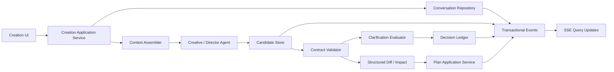
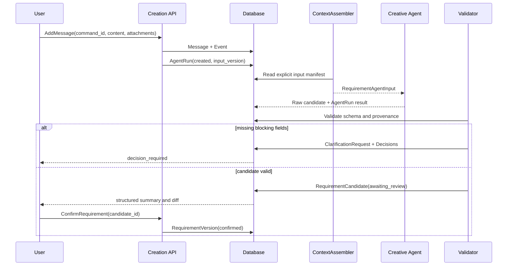
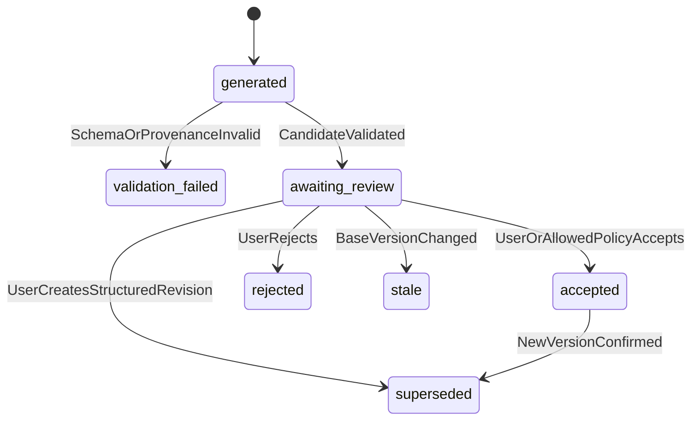

# 片场 V2 创作中心设计

> 状态：设计基线
> 版本：0.1
> 更新日期：2026-07-15
> 上位文档：[V2 产品设计文档](./V2_PRODUCT_DESIGN.md)
> 数据模型：[V2 数据模型设计](./V2_DATA_MODEL_DESIGN.md)
> 状态与事件：[V2 状态机与事件系统设计](./V2_STATE_MACHINE_EVENT_SYSTEM.md)

## 1. 目标

创作中心负责把用户的自然语言、附件和显式选择，转化为可确认、可追溯、可版本化的创作方案。

创作中心的最终产物是已确认的 `PlanVersion`，不是生产任务。创建 `ProductionSnapshot`、确认预计费用和提交付费工作项属于后续生产边界。

核心原则：

1. 对话是需求证据，不是生产命令。
2. Agent 只生成候选合同，不修改权威状态。
3. 字段完整性由 Schema 和确定性规则判断，不由模型自由决定。
4. 用户确认的事实和决策优先于 Agent 建议。
5. 每次 Agent 运行使用明确输入清单，不读取隐式共享记忆。
6. 旧版本、旧候选和迟到结果不能覆盖当前活动版本。
7. 不自动重试、不补写缺失字段、不重写用户需求、不套用隐藏模板。

## 2. 范围

### 2.1 首期包含

- 项目创作对话与附件
- 结构化需求候选与需求版本
- 字段完整性检查和澄清问题
- 风险分级决策账本
- Creative Agent 候选简报
- Director Agent 候选分镜方案
- 方案差异、影响和费用预估
- 用户确认与不可变 `PlanVersion`
- Agent 运行审计、并发守卫和持久事件

### 2.2 首期不包含

- 生产供应商调用
- WorkItem 创建和执行
- 自动模板选择
- 自动模型切换或降级
- 多用户协同编辑
- 自动接受高风险决策
- 对 Agent 无效输出的自动修复
- 从提示词推断人物、场景和服装引用

## 3. 逻辑架构



模块职责：

```text
creation/
├── conversations/       对话、消息和回复关系
├── attachments/         上传验证、分类候选和实体绑定
├── requirements/        需求候选、版本和字段规则
├── context/             Agent 输入清单组装
├── agents/              Agent 端口、运行记录和模型适配
├── candidates/          候选合同生命周期
├── clarification/       确定性缺失字段与提问策略
├── decisions/           风险分级决策账本
├── plans/               创意简报、分镜候选和 PlanVersion
├── impacts/             结构化差异与变更影响
└── queries/             创作中心只读视图
```

## 4. 主流程



从需求确认到方案确认：

```text
RequirementVersion confirmed
→ CreativeBriefCandidate
→ 用户检查创意摘要和决策
→ Director Agent 生成 ShotPlanCandidate
→ Schema、实体引用、时长和一致性验证
→ 用户查看 plan diff、影响范围和预计调用
→ ConfirmPlan
→ PlanVersion confirmed
```

## 5. 需求合同

### 5.1 RequirementCandidate

```json
{
  "schema_version": 1,
  "project_id": "project_01",
  "base_requirement_version_id": null,
  "core_intent": "制作一条田径训练日记",
  "duration_seconds": 45,
  "aspect_ratio": "9:16",
  "orientation": "portrait",
  "audience": null,
  "narrative_goal": "记录清晨准备、力量训练和冲刺",
  "character_refs": ["entity_version_char_main_v1"],
  "scene_requirements": ["室外跑道", "力量训练区"],
  "audio_policy": "off",
  "delivery_requirements": {
    "container": "mp4",
    "subtitle_policy": "off"
  },
  "field_provenance": {
    "duration_seconds": ["message_01"],
    "character_refs": ["attachment_binding_01"],
    "audio_policy": ["decision_audio_off_v1"]
  },
  "unresolved_fields": [],
  "assumptions": []
}
```

`assumptions` 首期必须为空。缺失字段使用 `null` 或不提供，并进入确定性完整性检查；Agent 不得生成默认平台、受众、人物属性、品牌、风格、预算或生产路由。

### 5.2 字段策略

每个字段在版本化 Schema 中声明：

```text
field_key
value_type
required_level: blocking | conditional | optional
risk_level: low | medium | high
owner: user | system_config | agent_candidate
allowed_sources[]
confirmation_policy
impact_rule_id nullable
```

示例：

| 字段 | 完整性 | 风险 | 规则 |
|---|---|---|---|
| `core_intent` | blocking | high | 必须有用户消息来源 |
| `duration_seconds` | blocking | medium | 用户输入或用户确认的候选 |
| `character_refs` | conditional | high | 人物镜头存在时必须绑定实体版本 |
| `visual_style` | optional | medium | 可保持未指定或让用户确认建议 |
| `subtitle_font` | optional | low | 可使用可见、版本化系统默认值 |
| `audio_policy` | blocking | high | 必须明确 `off` 或已配置模式 |

确定性 `RequirementCompletenessEvaluator` 根据 Schema 判断阻断字段。Agent 可以解释缺失内容，但不能改变字段的完整性等级。

## 6. 澄清规则

### 6.1 何时提问

仅在以下条件全部满足时创建 `ClarificationRequest`：

1. 字段为 `blocking`，或当前条件使 `conditional` 字段成为阻断项。
2. 当前需求版本、已确认决策、系统配置和附件绑定均没有合法值。
3. 字段没有允许使用的已声明默认值。
4. 问题可以由用户提供一个明确值或从有限选项中选择。

非阻断字段保持未指定，不为了“让方案更完整”不断追问。

### 6.2 问题结构

```json
{
  "id": "clarification_01",
  "project_id": "project_01",
  "requirement_candidate_id": "candidate_01",
  "field_key": "audio_policy",
  "reason_code": "REQUIRED_FIELD_MISSING",
  "prompt": "这个项目是否需要音频？",
  "options": [
    {"value": "off", "label": "关闭音频"},
    {"value": "configured", "label": "使用系统音频配置"}
  ],
  "risk_level": "high",
  "status": "pending"
}
```

问题文案可以由 Agent 提出候选，但 `field_key`、选项值和是否阻断由系统合同决定。

### 6.3 合并提问

- 同一轮最多展示一组相关阻断字段。
- 可将同类中风险项分组确认。
- 高风险项逐项确认。
- 不把可选字段混入阻断问题。
- 用户回答后只解决对应字段，不从回答推断其他决策。

## 7. ContextAssembler

### 7.1 输入清单

每次 Agent 运行前生成不可变 `AgentInputManifest`：

```json
{
  "id": "agent_input_01",
  "project_id": "project_01",
  "agent_role": "creative",
  "base_requirement_version_id": "requirement_v1",
  "base_plan_version_id": null,
  "current_message_id": "message_09",
  "reply_context_message_ids": ["message_08"],
  "confirmed_decision_ids": ["decision_audio_off_v1"],
  "entity_version_ids": ["entity_version_char_main_v1"],
  "attachment_binding_ids": ["attachment_binding_01"],
  "system_config_version_id": "production_config_v3",
  "template_version_id": null,
  "prompt_contract_version": "creative_v1",
  "input_hash": "sha256:..."
}
```

### 7.2 上下文选择规则

允许输入：

- 当前用户消息
- 当前消息显式 `reply_to` 链上的必要消息
- 活动 `RequirementVersion`
- 当前已确认且未被替代的 Decision
- 明确绑定的 EntityVersion 和附件摘要
- 当前系统配置中非秘密、与创作相关的字段
- 用户明确选择的 TemplateVersion

禁止输入：

- 无边界的完整聊天记录
- 其他项目的消息或 Agent 输出
- 已被替代的决策值
- 旧快照中的提示词作为当前事实
- 浏览器本地缓存的未持久化状态
- 供应商密钥和运行凭据

用户使用“刚才那个”“保持上一版”等指代但没有唯一 `reply_to` 或版本目标时，创建澄清项，不做语义猜测。

### 7.3 上下文预算

上下文裁剪只能删除非权威解释文本，不能删减：

- 当前用户消息
- 已确认决策
- 字段来源
- 活动版本 ID
- 实体和附件绑定 ID
- 输出 Schema 与 Agent 边界

若权威输入超过模型上下文限制，本次 AgentRun 明确失败为 `CONTEXT_LIMIT_EXCEEDED`，等待用户或管理员处理；系统不静默摘要事实。

## 8. 候选生命周期

候选类型：

- `RequirementCandidate`
- `CreativeBriefCandidate`
- `ShotPlanCandidate`
- `DecisionProposal`
- `AttachmentClassificationCandidate`

统一状态：

```text
generated
validation_failed
awaiting_review
accepted
rejected
stale
superseded
```



规则：

- `validation_failed` 记录原始输出和字段错误，不自动修复或重试。
- `accepted` 通过应用服务提升为相应 Version，不能由 Agent 直接写入。
- 基础版本变化后，未处理候选立即 `stale`。
- `stale` 候选可以查看和比较，但不能确认。
- 候选确认命令必须携带候选 ID、基础版本 ID 和 `row_version`。
- `ShotPlanCandidate` 修订必须创建新候选并记录 `supersedes_candidate_id`，不得原地覆盖 `shots`。
- 分镜 patch 只接受合同定义的逐镜头字段；未知字段、重复目标和不存在的 `shot_code` 明确失败。
- 修订验证失败不改变来源候选；成功后只有新候选保持 `awaiting_review`。

## 9. Agent 角色与合同

### 9.1 Creative Agent

输入：`CreativeAgentInput`。

输出：

```json
{
  "requirement_candidate": {},
  "creative_brief_candidate": {},
  "decision_proposals": [],
  "clarification_wording_candidates": [],
  "change_summary": []
}
```

不得输出生产 WorkItem、供应商、工作流 ID 或“素材已就绪”。

### 9.2 Director Agent

输入：已确认 RequirementVersion、CreativeBrief、实体版本和显式决策。

输出：`ShotPlanCandidate`，至少包含：

```text
shot_code
sequence_number
duration_ms
scene_entity_version_id
character_entity_version_ids[]
outfit_entity_version_ids[]
face_visibility
text_policy
motion_requirement
composition
action
```

所有实体引用必须精确存在。缺少场景或人物版本时返回候选验证错误，不从文字描述创建隐式实体。

### 9.3 AgentRun

```text
id
project_id
agent_role
status: created | running | succeeded | validation_failed | failed | cancelled | stale
input_manifest_id
model_provider / model_name
prompt_contract_version
output_schema_version
raw_output_uri
parsed_candidate_id nullable
input_tokens / output_tokens nullable
estimated_cost / actual_cost nullable
latency_ms nullable
error_code / error_detail nullable
started_at / finished_at
```

AgentRun 成功只表示收到候选输出，不表示候选有效或已确认。

创作中心的运行历史使用普通用户可理解的智能体分工名称，默认展示状态、模型、耗时、输入消息/决策/附件绑定数量和候选登记结果。以下精确事实放在可展开审计详情中：

```text
prompt_contract_version
output_schema_version
system_config_version
base_requirement_version_id
input_hash
agent_run_id
error_code / error_detail
```

这些内容必须来自持久化 `AgentRun` 与其精确 `AgentInputManifest`，不得解析原始模型文本补齐。创作中心 API 不返回 `raw_output`，历史区也不提供运行、重试、取消或恢复命令。

## 10. 附件与实体绑定

### 10.1 生命周期

```text
uploaded
→ verifying
→ verified
→ classification_required
→ bound
```

异常状态：`blocked`、`rejected`、`deleted`。

### 10.2 Attachment

```text
id
project_id
message_id
asset_id
original_filename
mime_type
byte_size
content_hash
verification_status
created_at
```

上传完成只创建 Attachment 和底层 Asset，不自动成为人物参考。

### 10.3 AttachmentBinding

```json
{
  "id": "attachment_binding_01",
  "attachment_id": "attachment_01",
  "binding_type": "identity_reference",
  "entity_id": "char_main",
  "entity_version_id": "entity_version_char_main_v1",
  "status": "confirmed",
  "confirmed_by": "user",
  "confirmed_at": "2026-07-15T10:00:00Z"
}
```

`binding_type` 为受控枚举：

- `identity_reference`
- `outfit_reference`
- `scene_reference`
- `product_reference`
- `voice_sample`
- `inspiration_only`
- `unclassified`

Agent 可以生成分类候选，但人物身份、声音样本和版权敏感绑定必须由用户确认。

### 10.4 文件验证

确定性验证包括：

- MIME 与文件内容一致
- 文件可读取且哈希完成
- 图片/音视频基础元数据有效
- 文件大小和类型符合系统限制
- 路径位于允许存储范围

验证失败明确阻断绑定，不转换文件格式、不替换文件、不生成占位资源。

## 11. 决策确认

Decision 使用数据模型文档定义的不可变版本结构。

确认策略：

| 风险 | 行为 |
|---|---|
| `low` | 可物化已声明、可见且有版本的默认值；进入方案汇总供用户检查 |
| `medium` | 在需求或方案阶段分组确认 |
| `high` | 用户逐项明确确认 |

Agent 建议永远不是已确认 Decision。系统默认值必须记录 `source=declared_default` 和配置版本，模板默认值必须记录 `source=template` 和模板版本。

## 12. 结构化差异与变更影响

### 12.1 RequirementDiff

比较发生在两个结构化版本之间：

```json
{
  "base_version_id": "requirement_v1",
  "candidate_id": "candidate_09",
  "changes": [
    {
      "field_key": "duration_seconds",
      "before": 45,
      "after": 60,
      "source_message_id": "message_09",
      "risk_level": "medium"
    }
  ]
}
```

不使用自然语言段落相似度决定字段是否变化。

### 12.2 影响分析

若项目尚未生产，展示受影响方案字段和预计调用变化。

若已有活动快照，展示：

- 受影响 EntityVersion 和 Shot
- 将过期但不会删除的素材
- 需要重新编译的 DAG 节点
- 需要重新验证的时间线
- 预计新增调用和费用

用户确认变更后创建新的 Decision、RequirementVersion 和 `plan_v2` 草稿。系统不修改 `plan_v1` 或 `snapshot_001`，也不自动提交重做。

## 13. 并发、幂等与旧结果

### 13.1 命令幂等

所有写命令携带：

```text
command_id
project_id
expected_row_version
actor_id
issued_at
```

同一 `command_id` 重复提交返回第一次的持久结果，不重复创建消息、AgentRun、决策或版本。

### 13.2 Agent 并发

- 每个 AgentRun 绑定基础 RequirementVersion、PlanVersion 和输入哈希。
- 用户新消息使基于旧活动版本的未完成候选在落库时标为 `stale`。
- 旧 AgentRun 可以完成审计，但不能自动更新当前摘要。
- 同一项目允许保留多个候选，但只能确认仍匹配活动基础版本的候选。
- 不通过取消旧请求来假装供应商或模型没有执行；取消状态与成本照实记录。

### 13.3 乐观锁冲突

`expected_row_version` 不匹配时返回 `409 PROJECT_VERSION_CONFLICT`，响应包含当前版本和重新获取建议。后端不合并两次并发确认，也不采用最后写入覆盖。

## 14. API 草案

### 14.1 命令

```text
POST /api/v1/projects
POST /api/v1/projects/{project_id}/messages
POST /api/v1/projects/{project_id}/attachments
POST /api/v1/projects/{project_id}/attachments/{attachment_id}/bindings
POST /api/v1/projects/{project_id}/requirement-candidates:generate
POST /api/v1/projects/{project_id}/requirement-candidates/{candidate_id}:accept
POST /api/v1/projects/{project_id}/requirement-candidates/{candidate_id}:reject
POST /api/v1/projects/{project_id}/clarifications/{clarification_id}:resolve
POST /api/v1/projects/{project_id}/decisions/{decision_id}:confirm
POST /api/v1/projects/{project_id}/plan-candidates:generate
POST /api/v1/projects/{project_id}/plan-candidates/{candidate_id}:confirm
POST /api/v1/projects/{project_id}/agent-runs/{run_id}:retry
POST /api/v1/projects/{project_id}/agent-runs/{run_id}:cancel
```

冒号动作表示显式命令，不与资源更新混用。Agent 重试接口只在用户操作后创建新 AgentRun，不复用或覆盖旧运行。

### 14.2 查询

```text
GET /api/v1/projects/{project_id}/creation-center
GET /api/v1/projects/{project_id}/messages?after=...
GET /api/v1/projects/{project_id}/requirements
GET /api/v1/projects/{project_id}/candidates
GET /api/v1/projects/{project_id}/decisions
GET /api/v1/projects/{project_id}/plans
GET /api/v1/projects/{project_id}/agent-runs
GET /api/v1/projects/{project_id}/events?after_sequence=...
```

### 14.3 CreationCenterView

前端首屏使用聚合查询模型：

```json
{
  "project": {},
  "active_requirement": {},
  "active_plan": null,
  "messages": [],
  "pending_clarifications": [],
  "pending_decisions": [],
  "current_candidate": null,
  "agent_run": null,
  "attachments": [],
  "next_action": {
    "code": "RESOLVE_REQUIRED_DECISIONS",
    "target_ids": ["decision_01"]
  }
}
```

`next_action` 由后端状态评估器给出，前端不通过消息文本猜测。

## 15. 事件

使用统一事件信封，创作中心事件包括：

```text
conversation.message_added.v1
attachment.uploaded.v1
attachment.verified.v1
attachment.binding_confirmed.v1
agent.run_created.v1
agent.run_succeeded.v1
agent.run_failed.v1
candidate.generated.v1
candidate.validation_failed.v1
candidate.stale.v1
clarification.requested.v1
clarification.resolved.v1
requirement.confirmed.v1
decision.requested.v1
decision.resolved.v1
plan.candidate_created.v1
plan.confirmed.v1
```

状态更新和事件写入同一事务。SSE 仅传递已提交事件；断线重连不重复创建候选或 AgentRun。

## 16. 错误和恢复

错误响应至少包含：

```json
{
  "error_code": "CANDIDATE_BASE_VERSION_STALE",
  "message": "这个候选基于旧需求版本，不能确认。",
  "responsible_module": "creation.candidates",
  "project_id": "project_01",
  "candidate_id": "candidate_01",
  "field_errors": [],
  "allowed_actions": ["view", "generate_new_candidate"]
}
```

恢复规则：

- Agent 超时或模型错误：AgentRun `failed`，用户可明确重新生成。
- Schema 无效：候选 `validation_failed`，展示字段错误，不修复原输出。
- 上下文过期：候选 `stale`，重新读取活动版本后由用户发起新生成。
- 附件无效：绑定阻断，用户重新上传或删除附件。
- 决策冲突：返回 `409`，重新获取当前版本。
- 服务重启：从数据库恢复消息、候选、AgentRun 和项目状态。

任何错误都不自动切换模型、修改 Prompt、补默认值或发起第二次调用。

## 17. 安全与合规

- 附件文件名、MIME、路径和大小经过确定性验证。
- 用户上传的肖像、声音、品牌和版权素材保留来源与确认记录。
- 高风险身份和声音绑定必须用户确认。
- Agent 输入不包含供应商密钥、访问令牌或未授权项目数据。
- 原始 Agent 输出存储在受控位置，事件只保存 URI、哈希和必要摘要。
- 删除消息或附件前检查 RequirementVersion、Decision、EntityVersion 和 PlanVersion 引用。
- 已用于历史版本的证据默认归档，不做破坏审计链的级联删除。

## 18. 数据模型增量

在 [V2 数据模型设计](./V2_DATA_MODEL_DESIGN.md) 基础上，创作中心实现需要增加：

```text
Attachment
AttachmentBinding
AgentInputManifest
AgentRun
RequirementCandidate
CreativeBriefCandidate
ShotPlanCandidate
ClarificationRequest
CandidateValidationResult
RequirementDiff
```

这些表在首个实现迁移中明确外键和唯一约束，不将候选混存进 Message 文本或 Project JSON。

## 19. 前端状态

需求对话输入框采用对话式键盘交互：`Enter` 提交当前非空消息，`Shift+Enter` 保留换行。中文输入法处于组词状态时不得触发提交，消息提交请求进行中也不得通过键盘或按钮重复发送。键盘提交和发送按钮复用同一条消息命令；保存成功后只发起一次独立智能体命令，助手回复与候选分别持久化，不创建生产任务。

创作中心桌面主工作区采用稳定高度：对话与结构化需求两列等高，消息列表和需求字段列表各自在内部滚动，输入区固定在对话面板底部。新增消息及回复渲染后定位到消息末尾，长文本必须在消息气泡内换行，不能扩大列宽或页面高度。移动端对话面板保持有界滚动，结构化需求面板恢复自然高度。

创作中心必须覆盖：

- 空项目
- 用户消息持久化中
- Agent 等待、运行、失败和取消
- 候选验证失败
- 等待澄清
- 等待中/高风险决策
- 需求候选待确认
- 分镜候选待确认
- 候选过期
- 方案已确认，等待创建生产快照

页面始终显示：

- 当前活动需求和方案版本
- 内容来源：用户、系统默认、模板或 Agent 建议
- 当前等待的责任方
- 唯一明确的下一步操作
- 是否会触发模型费用或生产费用
- 智能体运行的输入清单摘要、候选登记结果与可展开审计证据

生产准备区默认使用普通用户术语，不在主要操作路径直接展示 `snapshot`、`preparing`、`DAG`、`WorkItem`、内部错误代码或长技术键。页面将其分别表达为“制作方案、等待确认/等待补充费用、制作步骤、制作任务、需要处理的问题和生成方案名称”；原始 ID、状态、合同哈希、节点与依赖数量保留在默认收起的“技术详情”中。该翻译只影响展示，不改变状态机、费用确认、不可变版本或显式路由选择。

前端不能使用本地消息数量、动画状态或 Agent 文案设置项目状态。

当前实现由权威项目状态转移器写入需求与规划阶段：消息、Decision、需求确认、Brief/分镜候选及方案确认各自提交显式触发器。pending Decision 存在时不能进入方案生成；最后一个 Decision 解决后，由决策服务根据活动需求的确定性完整性选择 `planning` 或 `collecting_requirements`。转移器不读取员工文本或提示词猜测状态。

## 20. 测试验收

### 20.1 需求与上下文

- 缺少 blocking 字段时创建精确 ClarificationRequest。
- 缺少 optional 字段时不阻断、不自动填值。
- AgentInputManifest 只包含允许的活动版本和显式引用。
- 已替代 Decision 不进入新 Agent 输入。
- 无唯一目标的“保持上一版”触发澄清，不猜版本。

### 20.2 候选与确认

- 无效 Agent JSON 保留原始输出并进入 `validation_failed`。
- Agent 成功不自动创建 RequirementVersion 或 PlanVersion。
- 基础版本变化后旧候选进入 `stale` 且确认返回 `409`。
- 重复确认命令不创建两个版本。
- 高风险决策不能由 Agent 或 declared default 确认。

### 20.3 附件

- 上传成功但未绑定的图片不能作为人物参考。
- 人物分类候选不等于身份绑定确认。
- 无效媒体明确阻断，不创建占位素材。
- 被历史版本引用的附件删除时返回引用清单。

### 20.4 并发与恢复

- 连续消息产生的旧 Agent 迟到结果不能覆盖新需求。
- 同一 `command_id` 重放不重复调用模型。
- API 重启后候选、运行状态和下一步操作一致。
- 创建、Creative 与 Director Agent 的输入清单冻结同项目全部已解决 Decision 的精确 ID、键和值；Pending Decision 不进入清单，历史清单不补写。
- SSE 重连不重复应用事件。
- Agent 失败不触发自动重试。

### 20.5 完整 Demo

使用“30 秒竖屏健身广告、单一成年主角、音频关闭”跑通：

```text
创建项目
→ 上传并确认人物参考
→ 发送需求消息
→ 生成 RequirementCandidate
→ 解决高风险人物身份决策
→ 确认 RequirementVersion
→ 生成并确认 ShotPlanCandidate
→ 创建 plan_v1
→ 展示下一步为创建生产快照
```

测试期间不调用 RunningHub、CosyVoice 或其他生产供应商。

## 21. 实施顺序

### Creation Sprint 1：权威数据

- Conversation / Message / Attachment
- RequirementCandidate / RequirementVersion
- AgentInputManifest / AgentRun
- Candidate 生命周期和 Repository
- 命令幂等与乐观锁

### Creation Sprint 2：确认闭环

- RequirementCompletenessEvaluator
- ClarificationRequest
- 风险分级 Decision
- Creative Agent 端口与 Mock Agent
- CreationCenterView 和 SSE

### Creation Sprint 3：方案闭环

- CreativeBriefCandidate
- Director Agent 端口与 Mock Agent
- ShotPlanCandidate 验证
- RequirementDiff / ChangeImpact
- PlanVersion 确认

### Creation Sprint 4：真实模型接入

- 显式模型配置
- PromptContract 版本
- Token、延迟和成本审计
- 用户触发的重新生成

真实模型接入必须晚于 Mock Agent 合同测试。创作中心完整通过后，再进入 ProductionSnapshot 和 DAG 实现。

## 22. 当前实现迁移说明

当前 V2 骨架已有简化的 Project、Decision、ProjectEvent 和 `contract_validation` Worker 流程。迁移时：

- 保留现有 API 作为骨架验证，不将其简化 `draft / confirmed` 状态继续扩展为最终状态机。
- 先通过 Alembic 增加创作中心实体和 Repository，再替换服务层直接 SQLAlchemy 操作。
- `confirm_project` 拆分为确认需求、确认决策、确认方案和创建快照等独立命令。
- 现有 Decision 数据通过迁移赋予明确版本、风险、来源和状态；不能在读取时猜测补齐。
- 现有事件升级到统一事件信封，保留旧事件的可读迁移策略。

迁移完成前，V2 页面必须明确显示“骨架状态”，不能把简化确认流程展示为完整生产合同。
