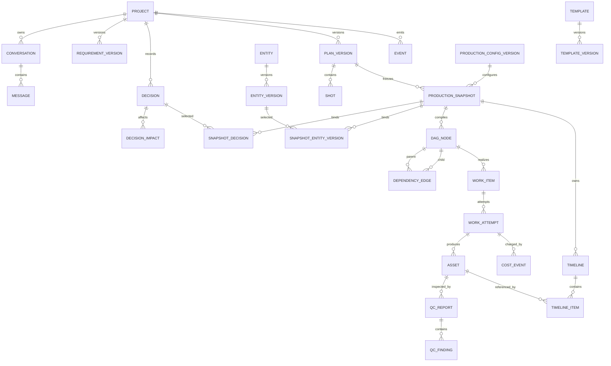

# 片场 V2 数据模型设计

> 状态：设计基线
> 版本：0.1
> 更新日期：2026-07-15
> 上位文档：[V2 产品设计文档](./V2_PRODUCT_DESIGN.md)
> 配套文档：[V2 状态机与事件系统设计](./V2_STATE_MACHINE_EVENT_SYSTEM.md)

## 1. 目标

本文定义片场 V2 的权威数据实体、版本边界、引用规则和持久化约束。目标是让每个生产结果都能回答：由哪个用户决策、方案版本、生产快照、工作项尝试、供应商调用和质量结论产生。

本文不定义页面布局，也不允许通过兼容代码绕过缺失关系。

## 2. 设计原则

1. 数据库事实优先于 Agent 文本、前端状态和运行日志。
2. 用户决策、方案、实体和模板采用不可变版本；修改创建新版本。
3. 每次实际生产绑定唯一 `ProductionSnapshot`，工作项和素材不得脱离快照。
4. 所有引用使用稳定 ID 和外键，不从名称、提示词或顺序猜测。
5. 付费调用、工作尝试和成本事件一一可追溯。
6. Agent 只提交候选合同，不直接写生产权威表。
7. 业务层通过 Repository 接口访问数据，不直接散落 SQLAlchemy 查询。
8. 删除前检查引用；历史审计记录不做级联物理删除。

## 3. 总体关系



## 4. 通用字段规范

除纯关联表外，核心实体统一包含：

```text
id                  UUID/ULID，外部不可推断
created_at          UTC 时间
created_by          user / system / agent:<role>
updated_at          仅可变聚合使用
row_version         乐观锁版本
```

规则：

- 业务 ID 不使用展示名称生成。
- JSON 字段必须有 Pydantic Schema 和 `schema_version`，不能存放无约束对象。
- 时间统一存 UTC，前端按用户时区显示。
- 金额使用定点小数和 ISO 4217 币种，不使用浮点数。
- 密钥、令牌和完整供应商凭据不进入项目数据库、快照或事件。

## 5. 项目与对话

### 5.1 Project

```text
id
title
state
blocked_from_state nullable
active_requirement_version_id nullable
active_plan_version_id nullable
active_snapshot_id nullable
delivery_asset_id nullable
state_reason_code nullable
created_at / updated_at / row_version
```

约束：

- `state` 只能由项目状态评估器或显式项目命令更新。
- `delivery_asset_id` 必须指向已验证、未删除的最终交付素材。
- `active_snapshot_id` 必须属于同一项目和 `active_plan_version_id`。

### 5.2 Conversation 与 Message

```text
Conversation: id, project_id, status, created_at
Message: id, conversation_id, role, content, attachment_refs, created_at
```

`Message` 是需求证据，不是生产合同。Agent 不能从未被需求版本或决策引用的历史消息补全生产字段。

### 5.3 RequirementVersion

```text
id
project_id
version_number
source_message_ids[]
structured_requirement
schema_version
status: candidate | confirmed | superseded
created_at / confirmed_at
```

唯一约束：`(project_id, version_number)`。确认后内容不可变。

## 6. 决策与影响

### 6.1 Decision

```text
id
project_id
decision_key
category: content | visual | production | audio | delivery | compliance
version_number
value_json
source: user | declared_default | template | agent_proposal
source_ref_id nullable
risk_level: low | medium | high
status: pending | confirmed | rejected | superseded
breaking_change
locked
created_at / resolved_at / resolved_by
supersedes_decision_id nullable
```

约束：

- 同一 `decision_key` 可有历史版本，但同一项目只能有一个当前确认版本。
- `declared_default` 必须关联可见的配置版本；`template` 必须关联 `TemplateVersion`。
- `high` 风险只能由用户确认。
- 已确认记录不可原位修改，修改时通过 `supersedes_decision_id` 新建记录。

### 6.2 DecisionImpact

```text
id
decision_id
target_type: entity | entity_version | shot | plan | snapshot | asset | timeline
target_id nullable
selector nullable
impact_kind: invalidates | regenerates | recomputes | informational
reason_code
estimated_work_count nullable
estimated_cost nullable
currency nullable
```

`selector` 只能用于尚未实例化的候选范围，并使用受控语法，例如 `shot.character_id=char_01`。快照创建前必须解析为精确目标；不能在执行时模糊匹配。

## 7. 方案、快照与模板

### 7.1 PlanVersion

```text
id
project_id
version_number
requirement_version_id
status: candidate | review | confirmed | superseded
creative_brief_json
contract_schema_version
confirmed_at / confirmed_by
created_at
```

确认后的 `PlanVersion` 和所属 `Shot` 不可变。修改创建下一版本。

### 7.2 ProductionSnapshot

```text
id
project_id
plan_version_id
snapshot_number
status: preparing | locked | active | superseded | archived
decision_set_hash
entity_set_hash
system_config_version_id
template_version_id nullable
output_spec_json
contract_json
contract_hash
locked_at / created_at
```

快照冻结：

- 已确认决策的精确版本
- 人物、服装、场景、产品和声音的精确实体版本
- 分镜与生产合同
- 显式选择的模板、供应商槽位和输出规格版本
- 音频开关；关闭时合同中不得存在 TTS 依赖

`locked` 后禁止修改。任何变化创建新快照。旧快照结果可保留和查看，但不能推进活动快照状态。

精确冻结关系：

```text
SnapshotDecision
  snapshot_id
  decision_id
  decision_key

SnapshotEntityVersion
  snapshot_id
  entity_version_id
  role
```

两个关联表都使用复合唯一约束。`decision_set_hash` 和 `entity_set_hash` 只用于完整性校验，不能代替精确关联记录。

### 7.3 ProductionConfigVersion

```text
id
version_number
video_spec_json
audio_policy_json
provider_slot_bindings_json
workflow_registry_version
created_at
```

生产配置版本不保存密钥。快照通过 `system_config_version_id` 精确绑定配置；运行时凭据只由后端密钥存储按已选供应商注入，不能改变供应商、模型或工作流选择。

### 7.4 Template 与 TemplateVersion

```text
Template: id, key, display_name, status
TemplateVersion: id, template_id, version_number, contract_schema,
                 declared_defaults, shot_pattern, output_constraints,
                 status, created_at
```

模板必须被明确选择并写入快照。合同缺字段时禁止自动套用模板。

## 8. 类型化实体

### 8.1 Entity 与 EntityVersion

```text
Entity: id, project_id nullable, entity_type, display_name, status
EntityVersion: id, entity_id, version_number, detail_schema_version,
               detail_json, reference_asset_ids[], status, created_at
SnapshotEntityVersion: snapshot_id, entity_version_id, role
```

`entity_type` 为 `character`、`outfit`、`scene`、`product` 或 `voice`。不同类型详情由判别联合 Schema 验证。

### 8.2 类型详情

```text
CharacterDetail
  identity_reference_asset_ids[]
  immutable_identity_traits
  aliases[]

OutfitDetail
  character_entity_id
  description
  reference_asset_ids[]
  continuity_label

SceneDetail
  master_asset_id
  environment_constraints
  continuity_label

VoiceDetail
  provider
  provider_voice_id
  clone_metadata_without_secret
  sample_asset_id
  model_family
```

同一实体的更新创建新 `EntityVersion`。服装与人物通过 ID 关联，不从描述判断所属关系。

## 9. 分镜、DAG 与依赖

### 9.1 Shot

```text
id
plan_version_id
shot_code
sequence_number
scene_entity_version_id nullable
character_entity_version_ids[]
outfit_entity_version_ids[]
duration_ms
shot_type
face_visibility: required | optional | not_visible
text_policy: required | allowed | forbidden
motion_requirement: static_allowed | moderate | significant
composition / action
output_spec_id
```

唯一约束：`(plan_version_id, shot_code)` 和 `(plan_version_id, sequence_number)`。

### 9.2 DAGNode

```text
id
snapshot_id
node_key
kind
shot_id nullable
input_contract
output_contract
provider_slot_id nullable
estimated_cost nullable
currency nullable
```

唯一约束：`(snapshot_id, node_key)`。节点只引用同一快照冻结的资源。

### 9.3 DependencyEdge

```text
id
snapshot_id
parent_node_id
child_node_id
dependency_type: required | optional | informational
input_slot nullable
```

语义：

- `required`：父节点未完成且输出未验证时，子节点不能领取。
- `optional`：父节点缺失不会阻断，但系统不得自动寻找替代输入。
- `informational`：仅用于追踪影响，不参与可执行性判断。

不定义含糊的 `replaceable`。若确需替换，必须记录替换目标、用户决策并创建新快照或显式的新工作项合同。

编译约束：DAG 必须无环；普通 I2V 节点只能有一个图片输入；所有边端点必须属于同一快照。

## 10. 工作项与幂等

### 10.1 WorkItem

```text
id
project_id
snapshot_id
dag_node_id
kind
state
priority
request_fingerprint
current_attempt_id nullable
available_at
created_at / updated_at / row_version
```

唯一约束：`(snapshot_id, dag_node_id)`；若产品允许用户明确重做，则重做表现为同一工作项的新 `WorkAttempt`，而不是复制含糊节点。

### 10.2 WorkAttempt

```text
id
work_item_id
attempt_number
trigger: initial_user_confirmed | user_retry
provider
provider_task_id nullable
request_fingerprint
request_manifest
response_manifest nullable
state
execution_lock_owner nullable
execution_lock_expires_at nullable
submitted_at / started_at / finished_at
error_code / error_detail nullable
```

约束：

- `(work_item_id, attempt_number)` 唯一。
- `(provider, provider_task_id)` 在非空时唯一。
- `request_fingerprint` 由规范化输入合同、快照、供应商槽位和配置版本计算。
- Worker 通过有期限执行租约领取，不使用永久布尔锁。
- 超时租约只允许重新对账，不代表允许再次提交付费请求。
- 自动尝试次数固定为 1；新尝试必须由用户命令创建。

## 11. 素材与质量

### 11.1 Asset

```text
id
project_id
snapshot_id
work_attempt_id nullable
asset_type: image | video | audio | subtitle | project_file | final_delivery
role
uri
storage_backend
content_hash
mime_type
byte_size
width / height / duration_ms nullable
state: created | verified | review_required | approved | used | archived | deleted
verified_at / approved_at / deleted_at nullable
```

状态变化见状态机文档。`uri` 不等于文件存在，必须完成文件探测和哈希验证后进入 `verified`。

删除规则：

- 检查 DAG 输入、实体参考、QC、时间线和最终交付引用。
- 被活动快照或时间线引用时阻止删除，并列出引用。
- 审计要求保留时使用 `archived`；物理删除后保留墓碑和哈希，不复用 ID。

### 11.2 QCReport 与 QCFinding

```text
QCReport: id, asset_id, snapshot_id, ruleset_version, status,
          analyzer, created_at, reviewed_at, reviewed_by
QCFinding: id, qc_report_id, code, severity, evidence_json,
           contract_field, disposition
```

`QCReport.status` 为 `passed`、`review_required` 或 `blocked`。检测证据不能直接宣称人物身份；人工结论必须记录审核人和时间。

## 12. 时间线与交付

```text
Timeline
  id, project_id, snapshot_id, version_number
  status: candidate | review | confirmed | exported | superseded
  output_spec_json, created_at, confirmed_at

TimelineItem
  id, timeline_id, track_type, sequence_number
  asset_id, source_in_ms, source_out_ms
  timeline_in_ms, timeline_out_ms, transform_json
```

约束：

- 时间线只能引用同一项目中 `approved` 或 `used` 的素材。
- 源区间不能超过素材真实时长。
- 确认后的时间线不可变；修改创建新版本。
- 导出成功不等于项目完成，最终交付素材还必须存在并验证。

## 13. 事件与成本

### 13.1 Event

`Event` 使用配套状态机文档定义的统一信封，核心索引为：

```text
(project_id, sequence) unique
(aggregate_type, aggregate_id, sequence)
(correlation_id)
(occurred_at)
```

事件仅记录事实和必要快照，不保存密钥、大段二进制或完整供应商凭据。

### 13.2 CostEvent

```text
id
project_id
snapshot_id
work_attempt_id
provider
provider_operation
kind: estimated | charged | adjusted | refunded
amount
currency
provider_reference nullable
status: pending | confirmed | disputed
occurred_at
```

同一供应商账单事件通过 `provider_reference + kind` 去重。预计费用与实际扣费分开记录，退款不覆盖原扣费。

## 14. Repository 边界

建议接口：

```text
ProjectRepository
ConversationRepository
DecisionRepository
PlanRepository
SnapshotRepository
EntityRepository
DagRepository
WorkRepository
AssetRepository
QualityRepository
TimelineRepository
EventRepository
CostRepository
```

规则：

- API、状态评估器、DAG 编译器和 Worker 只依赖接口。
- Repository 负责事务内约束和持久化，不包含产品决策。
- 跨聚合操作由应用服务开启一个事务，并在同一事务写 Outbox 事件。
- 测试提供内存或 SQLite 实现，但必须运行同一组 Repository 合同测试。

## 15. SQLite 与 PostgreSQL 边界

SQLite 适用于本地单用户首期，但必须限制：

- 保持短事务，供应商网络调用不占用数据库事务。
- 开启外键、WAL 和合理 busy timeout。
- 领取工作项使用条件更新和 `row_version`，不假设行级锁。
- 单独建立事件序列分配策略，避免依赖数据库自增值作为业务顺序。
- JSON 内容由应用 Schema 验证，不依赖 SQLite 特有 JSON 查询完成核心约束。

迁移 PostgreSQL 时可替换 Repository 和锁实现，业务合同、状态机、ID、事件信封及迁移历史保持不变。

## 16. 索引与迁移

首期必要索引：

```text
project(state, updated_at)
decision(project_id, decision_key, status)
production_snapshot(project_id, status)
work_item(state, available_at, priority)
work_item(snapshot_id, dag_node_id)
work_attempt(provider, provider_task_id)
asset(project_id, snapshot_id, state)
qc_report(asset_id, status)
event(project_id, sequence)
cost_event(project_id, snapshot_id, occurred_at)
```

所有 Schema 变化通过 Alembic：先增加可兼容字段和回填脚本，再启用非空/唯一约束。禁止在应用启动时临时修改表结构或用默认对象掩盖迁移失败。

## 17. 完整数据链示例

```text
project_01
  requirement_v1
  decision_identity_v1 + decision_audio_off_v1
  plan_v1
    SH-001 ... SH-005
  snapshot_001 (locked, active)
    character_main@v1
    outfit_training@v1
    scene_gym@v1
    dag_image_SH001 -> dag_video_SH001 -> dag_timeline
    work_image_SH001
      attempt_1
        asset_keyframe_SH001
        qc_report_01: approved
    work_video_SH001
      attempt_1
        cost_estimated_01
        cost_charged_01
        asset_video_SH001
        qc_report_02: review_required
    timeline_v1
      item_01 -> asset_video_SH001
```

音频决策为关闭，因此快照、DAG 和工作项中都不存在 TTS。若用户修改人物身份，则创建 `decision_identity_v2`、`plan_v2` 和 `snapshot_002`；`snapshot_001` 的素材保留可审计，但不能推进活动项目状态。

## 18. 数据模型验收

- 任一素材可追溯到快照、工作尝试和输入合同。
- 任一付费调用可追溯到用户确认和成本事件。
- 方案或实体修改不会覆盖历史版本。
- 不存在跨快照 DAG 边或靠名称解析的引用。
- 普通 I2V 多图片输入在编译期失败。
- 音频关闭的快照不存在 TTS 节点。
- 删除被引用素材时明确阻止并列出引用。
- Worker 崩溃恢复不会仅因租约过期而重复付费提交。
- SQLite 和 PostgreSQL Repository 通过同一合同测试。
