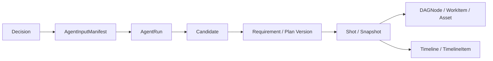

# 片场 V2 决策影响证据图实现

版本：v0.1

状态：已实现已观测链路；前瞻报告由独立不可变分析聚合实现

实现目录：`v2/backend/app/impact/`、`v2/frontend/src/pages/DecisionImpactPage.tsx`

## 1. 目标

决策影响证据图回答“某个决策实际进入过哪些 Agent 输入，并沿持久化合同传播到了哪些记录”。首期只展示已观测事实，不声明未观测决策没有影响，也不执行失效、重做、重试或费用确认。

## 2. 输入冻结修复

`AgentInputManifest.decision_ids` 是决策传播的唯一直接起点。创建和规划 Agent 现在只读取同项目、`status=resolved` 的 Decision，并同时冻结：

```text
decision_ids[]
payload.confirmed_decisions[]:
  id, key, label, value, source
```

Pending Decision 不进入清单。历史清单的 `decision_ids=[]` 保持原样，不补写、不按键名建立关系。决策值进入规范化清单后参与 `input_hash`，但不改变候选确认边界。

## 3. 精确传播链



每条边只来自 JSON 中的精确 ID 或数据库外键。服务不会使用 Decision.key、label、value、错误文本、节点名称或自然语言内容推断影响。

## 4. 查询合同

```text
GET /api/v1/projects/{project_id}/decision-impact-graph
```

响应包含：

- `scope=observed_lineage`。
- 每个决策的 `observed / not_observed` 结论。
- 直接消费该决策的清单 ID。
- 下游节点 ID、按记录类型计数和活动记录计数。
- 去重后的节点与有向关系。
- 明确的证据边界说明。

该 GET 查询不创建 CommandReceipt、ProjectEvent、WorkItem、CostEvent 或任何影响记录。变更提案使用独立 POST 命令和持久化聚合，见 [V2 前瞻决策变更影响分析实现](./V2_PROSPECTIVE_DECISION_IMPACT_IMPLEMENTATION.md)。

## 5. Repository 边界

`ImpactRepository` 按项目读取 Decision、Manifest、AgentRun、候选、需求版本、方案、分镜、实体、快照、DAG、工作项、素材和时间线，并持久化独立的变更影响报告及目标。应用服务负责节点建模、精确边连接、可达性计算和摘要，不把图计算规则下沉到 SQL 查询。图 GET 仍严格只读。

## 6. 页面

前端路由：`/projects/{project_id}/decision-impact`。

页面左侧列出决策及已观测状态，右侧按记录类型展示选中决策的传播证据、关系名称、状态与活动权威标记。页面只有刷新和返回控制台，不提供失效、重做、重试或生产按钮。

## 7. 独立前瞻报告边界

当前已持久化 `DecisionChangeImpactAnalysis/Target`，并使用活动快照已有 DAG 价格估算潜在工作量和费用。它不会估算不存在的节点、猜测未来路由或写入 CostEvent。

仍未实现已确认 Decision 的新版本、supersedes 链、变更确认命令或任何自动失效。实际应用变更会改变决策版本、项目状态、付费范围或重做边界，实施前必须再次确认。

## 8. 验收

- 已解决决策精确写入创建与规划清单；Pending Decision 不写入。
- 同一决策可沿三个清单传播到需求版本、方案和分镜。
- 未消费决策返回 `not_observed` 且无下游节点。
- 跨项目记录不会进入图。
- 查询前后项目事件数量不变。
- 页面在桌面和手机宽度下无横向溢出或内容重叠。
- 不产生供应商调用、费用、重试、兜底、路由替换或状态转移。
