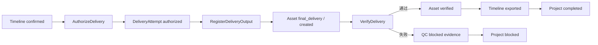

# 片场 V2 最终交付合同实现

版本：v0.1

状态：已实现

实现目录：`v2/backend/app/delivery/`、`v2/frontend/src/pages/EditorPage.tsx`

## 1. 范围

首期交付实现把已确认时间线与最终 MP4 文件建立可审计关系。它不实现媒体渲染，不调用 FFmpeg 或供应商，不创建付费调用，也不提供重试。

唯一执行方式是 `external_upload`：外部完成渲染后，用户把 MP4 上传到当前 V2 本地存储策略，再由系统验证文件事实。

## 2. 权威链路



## 3. 冻结请求

授权清单 `v2.delivery-request.v1` 包含：

- 项目、活动快照、确认时间线和时间线合同哈希。
- 每个时间线项的轨道、顺序、素材 ID、素材内容哈希、源区间、目标区间和变换。
- 输出容器、尺寸、FPS、编码规格和项目时长。

清单使用稳定 JSON 序列化计算 SHA-256。创建时间、临时路径、文件名等可变事实不进入请求指纹。

## 4. 文件登记与验证

API 以 1 MiB 分块读取 multipart 文件，同时计算字节数和 SHA-256。超过当前快照存储策略上限立即拒绝，任何成功、冲突或异常路径都会清理临时上传文件。

登记后 Asset 仍是 `created`，其内容哈希字段保持为空。验证命令重新打开落盘文件并检查：

1. 实际 SHA-256 和字节数与上传流记录一致。
2. 文件头包含有效 MP4 `ftyp` 签名。
3. MP4 box 中的宽度、高度和时长符合交付请求。
4. MIME 和文件大小符合快照绑定的已发布存储策略。
5. 当前活动快照、确认时间线和全部输入素材哈希仍与授权清单一致。

调用方提交的扩展名、MIME、尺寸或时长不能替代后端探测结果。

## 5. 失败语义

确定性验证失败会：

- 创建 `v2.delivery-file-contract.v1` QCReport 和单条 blocked QCFinding。
- 归档失败的最终 Asset。
- 将 DeliveryAttempt 与 Project 标记为 `blocked`。
- 保留原确认时间线，不修改素材取舍。

失败不会创建第二个 DeliveryAttempt、WorkAttempt、供应商请求、成本事件或替代文件。重试和解除阻断需未来另行设计显式命令、影响范围与费用确认。

## 6. API

```text
GET  /api/v1/projects/{project_id}/delivery-workspace
POST /api/v1/projects/{project_id}/deliveries:authorize
POST /api/v1/projects/{project_id}/delivery-attempts/{attempt_id}/output
POST /api/v1/projects/{project_id}/delivery-attempts/{attempt_id}:verify
GET  /api/v1/projects/{project_id}/assets/{asset_id}/content
```

所有命令要求 `command_id`；授权和验证使用精确哈希或 `row_version` 进行并发保护。

## 7. 验收

- 未勾选明确授权时不能创建 DeliveryAttempt。
- 命令重放返回第一次结果；新命令不能创建第二次尝试。
- 错误请求指纹和过期行版本拒绝上传，且不残留临时文件。
- 合规 MP4 验证后项目才进入 `completed`，并可通过 Asset 内容接口读取。
- 错误尺寸、时长、哈希、签名或存储策略产生持久阻断证据。
- 交付流程不增加 WorkAttempt、Provider 调用或 CostEvent。
- 阻断后确认时间线保持不变，不出现自动重试按钮。
