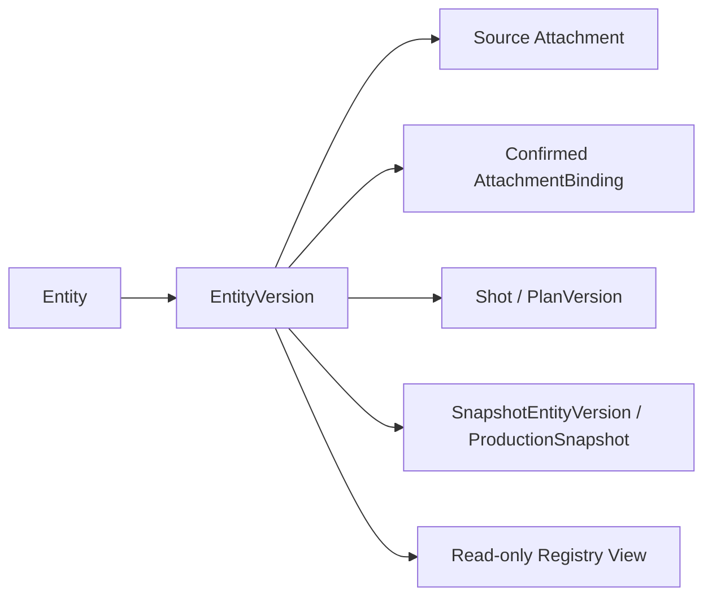

# 片场 V2 实体资产库实现

版本：v0.1

状态：已实现

实现目录：`v2/backend/app/registry/`、`v2/frontend/src/pages/AssetLibraryPage.tsx`

## 1. 范围

实体资产库提供人物、服装、场景、产品和声音实体的全局只读视图。它解决“当前有哪些可追溯实体、哪个版本活动、来源是什么、被哪些方案和快照引用”，不提供实体创建、版本切换、删除或生产选择命令。

## 2. 权威链路



活动版本只读取 `is_active=true`。不存在活动版本时显示空值，不选择最高版本作为替代。

## 3. 查询内容

每个实体返回：

- 所属项目、类型、名称和状态。
- 全部不可变版本及活动版本 ID。
- 结构化属性、创建者和创建时间。
- 来源附件的文件名、MIME、大小和 SHA-256。
- 确认绑定类型、操作者和状态。
- 分镜 ID、方案版本、镜头编号和引用角色。
- 生产快照编号、状态和冻结角色。

列表支持项目、实体类型和文本筛选。筛选只发生在前端展示层。

## 4. 来源附件读取

```text
GET /api/v1/projects/{project_id}/attachments/{attachment_id}/content
```

读取守卫要求附件属于指定项目、`verification_status=verified`、存储路径解析后位于 V2 `RUNTIME_ROOT` 内且文件存在。失败返回确定性 404 或 409，不搜索其他目录或替换文件。

浏览器无法解码已登记媒体时，页面显示“来源附件无法预览”，仍展示文件哈希和引用。注册表不做转码、修复或格式替换。

## 5. 前端路由

资产库使用 `/library`。Vite 生产构建继续使用 `/assets/*` 提供 JS/CSS，因此业务页面不复用 `/assets` 路径，保证直达和刷新都进入 SPA 路由。

页面包含：

- 五类实体数量概览。
- 类型分段控件、项目筛选和搜索。
- 实体列表及活动版本标记。
- 版本来源预览、结构化属性和引用证据。
- 明确的只读提示。

## 6. API

```text
GET /api/v1/entity-registry
GET /api/v1/projects/{project_id}/attachments/{attachment_id}/content
```

两个接口都不创建 CommandReceipt、ProjectEvent、WorkItem 或 CostEvent。

## 7. 验收

- 未绑定附件不会产生实体。
- 确认绑定后实体、版本、来源和绑定记录可查询。
- 活动版本由持久字段确定，不按顺序猜测。
- 分镜和快照引用使用精确实体版本 ID。
- 跨项目附件读取返回 404。
- 路径越界、文件缺失和未验证附件明确失败。
- 页面选择实体不会写库或改变生产合同。
- `/library` 可直接访问和刷新，Vite `/assets/*` 静态文件保持正常。
- 不产生供应商调用、费用、重试、兜底或状态转移。
