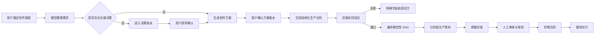
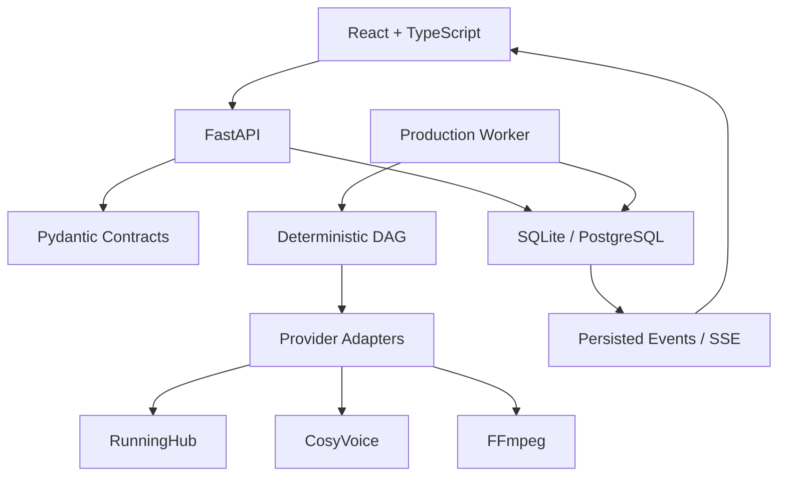

# 片场 V2 产品设计文档

> 状态：框架阶段  
> 版本：0.1  
> 更新日期：2026-07-15  
> 产品原型：<http://127.0.0.1:8765/prototype-v2/>  
> V2 应用骨架：<http://127.0.0.1:8766/>

## 1. 产品定义

片场 V2 是一个面向 AI 视频批量创作的本地生产系统。它负责把用户的自然语言创作意图，转化为可确认、可追踪、可恢复的结构化生产流程。

产品不追求让模型自由决定全部流程，而是建立以下协作关系：

- 模型负责理解、提出方案和生成候选内容。
- 用户负责影响主题、身份、预算、生产方式和交付结果的关键决策。
- 后端负责合同验证、依赖编译、状态管理和确定性执行。
- 供应商适配器只执行已经确定的任务，不参与产品决策。

## 2. 核心问题

V1 已验证视频生产能力，但管理台逐渐承担了过多职责：

- 页面、配置、任务状态和生产执行集中在同一文件。
- 员工自然语言输出同时承担规划、路由和执行合同。
- 前后步骤引用容易失配，错误往往到生产阶段才暴露。
- 页面显示的完成状态不一定代表真实文件已经就绪。
- 失败后的自动修补、重试或降级可能改变用户原始意图。
- 人物、服装、场景和声音缺少统一的类型化实体关系。

V2 的目标不是继续拆补旧流程，而是建立新的状态权威和模块边界。

## 3. 产品原则

### 3.1 明确优先

缺少关键字段时阻断并展示原因，不猜测、不补写、不替换。

### 3.2 用户拥有决策

模型可以推荐选项，但影响生产结果或费用的决定必须进入决策账本，由用户明确确认。

### 3.3 数据库是状态权威

员工文本、前端状态和任务日志都不能直接宣称素材就绪。项目、决策、工作项、事件和文件状态由后端数据库计算。

### 3.4 规划与执行分离

创作方案确认后先生成结构化生产合同，再由确定性 DAG 编译器生成工作项。

### 3.5 失败必须可解释

错误必须指向具体合同字段、工作项、供应商请求或文件，不使用笼统的“任务卡住”。

### 3.6 不擅自兜底

未经用户许可，不增加：

- 关键词特殊判断
- 提示词重写
- ID 猜测或改名
- 工作流替换
- 模型降级
- 输出修复
- 自动付费重试
- 隐藏默认值

## 4. 目标用户

### 4.1 主要用户

- 需要批量生产短视频或长视频的个人创作者
- 需要保持人物、产品和场景一致性的内容团队
- 希望使用多个 AI 供应商但需要统一管理生产状态的用户

### 4.2 用户关注点

- 生产之前能否准确看懂方案
- 当前任务到底运行到哪一步
- 为什么失败，是否产生费用
- 哪些内容由模型决定，哪些由用户决定
- 素材是否保持人物、服装和场景一致
- 重做一个素材会影响哪些下游内容

## 5. 产品范围

### 5.1 V2 首期范围

- 对话式创作需求收集
- 项目合同和决策账本
- 人物、服装、场景、声音实体管理
- 分镜合同
- 确定性生产 DAG
- 图片、视频和音频分阶段生产
- 素材质量报告和人工审核
- 基础剪辑时间线合同
- 项目事件流、错误诊断和恢复

### 5.2 暂不纳入首期

- 多租户和团队权限
- 云端协同编辑
- 完整非线性专业剪辑器
- 自动发布到内容平台
- 自动选择最便宜或最快供应商
- 无需确认的全自动批量生产

## 6. 信息架构

```text
工作区
├── 创作台
│   ├── 对话沟通
│   ├── 需求摘要
│   ├── 决策清单
│   └── 方案版本
├── 生产队列
│   ├── 阶段状态
│   ├── 工作项
│   ├── 实际路由
│   └── 执行事件
├── 素材审核
│   ├── 联络表
│   ├── 质量结论
│   ├── 人工选择
│   └── 指定重做
├── 剪辑台
│   ├── 时间线
│   ├── 素材取舍
│   ├── 字幕与音频轨
│   └── 交付检查
├── 资产库
│   ├── 人物
│   ├── 服装状态
│   ├── 场景
│   ├── 产品
│   └── 声音
└── 系统配置
    ├── 模型
    ├── 供应商
    ├── 工作流槽位
    ├── 视频规格
    └── 音频配置
```

## 7. 核心用户流程



## 8. 创作台设计

### 8.1 对话区

用户可以用自然语言继续补充需求，但对话内容本身不直接成为生产命令。

系统每轮对话应输出：

- 已确认事实
- 新发现的待决策项
- 可选建议及影响
- 当前方案变更摘要

### 8.2 决策清单

决策按影响分组：

- 内容：主题、叙事结构、人物关系
- 视觉：风格、人物身份、服装状态、场景
- 生产：规格、工作流、预算或调用次数
- 音频：关闭、系统音色、复刻音色
- 交付：时长、画幅、字幕、最终格式

每个决策必须记录：

```json
{
  "id": "decision_xxx",
  "key": "visual_style",
  "label": "画面质感",
  "status": "pending",
  "source": "user",
  "value": null,
  "created_at": "2026-07-15T10:00:00Z",
  "resolved_at": null
}
```

已解决的决策不能被静默覆盖。修改时创建新版本并保留历史。

## 9. 方案确认设计

方案确认页不是普通文本预览，而是生产合同进入执行前的审阅界面。

必须展示：

- 主题和叙事结构
- 总时长与画幅
- 人物及身份参考
- 服装状态和换装节点
- 场景基准及复用关系
- 镜头列表和镜头时长
- 音频与字幕策略
- 预计素材数量和供应商调用次数
- 未解决决策和阻断项

用户确认后生成不可变方案版本，例如 `plan_v1`。后续修改创建 `plan_v2`，不能直接覆盖已进入生产的版本。

## 10. 类型化实体

### 10.1 人物实体

```text
Character
├── id
├── display_name
├── identity_reference_ids[]
├── aliases[]
├── status
└── version
```

### 10.2 服装状态

```text
OutfitState
├── id
├── character_id
├── description
├── reference_asset_ids[]
├── valid_from_shot
└── valid_until_shot
```

### 10.3 场景实体

```text
Scene
├── id
├── display_name
├── master_asset_id
├── environment_constraints
└── version
```

### 10.4 声音实体

```text
Voice
├── id
├── provider
├── provider_voice_id
├── clone_metadata
├── sample_asset_id
└── status
```

项目合同只引用实体 ID，不从提示词猜测实体关系。

## 11. 分镜合同

每个镜头至少包含：

```json
{
  "shot_id": "SH-003",
  "scene_id": "scene_track_01",
  "character_ids": ["char_main"],
  "outfit_state_id": "outfit_training_01",
  "duration_seconds": 4.0,
  "shot_type": "character_action",
  "face_visibility": "optional",
  "text_policy": "forbidden",
  "motion_requirement": "significant",
  "composition": "侧面中景跟拍",
  "action": "跑道边动态热身",
  "source_asset_ids": [],
  "output_spec_id": "vertical_working_480p"
}
```

约束字段由规划明确指定，后端不能从提示词推断。

## 12. 生产 DAG

### 12.1 编译原则

- 每个节点具有稳定 ID。
- 每条依赖引用必须精确存在。
- 普通首帧视频只允许一个上游图片输入。
- 多帧工作流必须由合同显式选择。
- 音频关闭时不创建 TTS、音频注入或字幕依赖。
- 未配置工作流时阻断，不替换为其他工作流。

### 12.2 节点状态

```text
queued
running
completed
review_required
blocked
cancelled
skipped
```

`pending` 或 `queued` 只代表等待，不显示成运行中。

### 12.3 工作项

工作项记录：

- 类型
- 项目和方案版本
- 输入合同
- 精确依赖 ID
- 供应商及工作流槽位
- 请求指纹
- 供应商任务 ID
- 实际输出文件
- 状态和错误
- 开始与结束时间
- 是否由用户重试

## 13. 分阶段生产

建议默认阶段：

1. 一致性基准：人物、产品、服装和场景基准。
2. 镜头关键帧：所有视觉镜头的静态验证。
3. 动态视频：只使用已确认关键帧。
4. 音频与字幕：仅在系统配置明确开启时执行。
5. 剪辑装配：只使用审核通过的素材。

每个阶段完成后进入人工确认，不自动开始下一批付费任务。

## 14. 质量检查

### 14.1 状态定义

- `passed`：确定性检查通过。
- `review_required`：需要人判断的相似度、文字、构图或动态问题。
- `blocked`：文件损坏、引用缺失、尺寸无效等确定性错误。

### 14.2 检查边界

- 人脸检测仅用于 `face_visibility=required`。
- 背影、脚部和远景不做正脸硬失败。
- OCR 结果属于人工复核提示，除非合同明确禁止任何文字且检测置信度达到约定阈值。
- 低动态根据镜头类型判断，静态氛围镜头和动作镜头使用不同标准。
- 身份一致性必须对比绑定的人物参考，不能用“检测到一张脸”代替。

### 14.3 重试规则

质量检查不自动重试。系统列出：

- 问题素材
- 检查证据
- 实际工作流
- 原始输入
- 受影响下游节点
- 预计重试调用次数

用户选中素材并确认后，才创建新的重试工作项。

## 15. 剪辑台

剪辑是素材取舍的主要位置，不应反向修改原始生产记录。

首期能力：

- 主视频轨
- 音频和字幕轨开关
- 镜头入点与出点
- 审核通过素材替换
- 缺失素材空位
- 时间线引用校验
- 输出时长检查

时间线中的 `source_asset_id` 必须精确对应审核通过的素材。缺失引用时阻断导出。

## 16. 错误与诊断

错误详情至少包括：

```text
错误层级：合同 / DAG / Worker / Provider / 文件 / QC / 剪辑
责任模块：具体模块名
项目 ID：project_xxx
工作项 ID：work_xxx
错误代码：稳定机器码
用户说明：可读原因
技术详情：供应商或验证器原始信息
允许操作：修改合同 / 重新提交 / 取消 / 无
```

不使用“可能是模型超时”之类与真实错误无关的建议。

## 17. 技术架构



### 17.1 前端

- React
- TypeScript
- Vite
- React Router
- TanStack Query
- Zustand
- CSS Modules
- Lucide React

### 17.2 后端

- FastAPI
- Pydantic v2
- SQLAlchemy 2
- Alembic
- SQLite，本地单用户阶段使用
- PostgreSQL，未来多人和高并发阶段使用
- SSE，传递持久任务事件

### 17.3 进程

- API：提供合同和查询接口。
- Worker：领取并执行数据库工作项。
- Provider：供应商适配模块，不拥有产品决策。
- FFmpeg：媒体处理子进程。

## 18. 后端模块边界

```text
v2/backend/app/
├── api/             HTTP 路由
├── contracts/       Pydantic 合同
├── projects/        项目生命周期
├── decisions/       用户决策账本
├── db/              SQLAlchemy 与数据库会话
├── events/          持久事件和 SSE
├── orchestration/   DAG 编译
├── workers/         工作项执行
├── providers/       供应商适配器
└── quality/         QC 报告和人工门禁
```

模块之间通过结构化合同交互，不读取其他模块的页面状态或自然语言文本来补全字段。

## 19. API 设计原则

- 命令和查询分离。
- 创建、确认、排队和重试是不同接口。
- 所有写操作返回数据库中的新状态。
- 冲突返回 `409`，字段错误返回 `422`，资源不存在返回 `404`。
- 密钥不返回前端，不进入项目合同和事件数据。
- 事件流来源于持久数据库，不能只保存在 API 进程内存。

当前基础接口：

```text
GET  /api/v1/health
GET  /api/v1/projects
POST /api/v1/projects
GET  /api/v1/projects/{project_id}
POST /api/v1/projects/{project_id}/decisions
POST /api/v1/projects/{project_id}/decisions/{decision_id}/resolve
POST /api/v1/projects/{project_id}/confirm
POST /api/v1/projects/{project_id}/queue
GET  /api/v1/projects/{project_id}/events
```

## 20. 权限与安全

本地单用户阶段仍遵循：

- 供应商密钥仅保存在后端运行配置。
- API 不返回密钥原文。
- 上传文件名和路径必须经过安全校验。
- 静态文件只能从指定目录提供。
- 项目事件不得写入密钥和完整供应商凭据。
- 删除素材需要明确用户操作，并检查引用关系。

## 21. V1 与 V2 关系

- V1 固定在 `v1` 分支，作为当前可运行版本。
- `main` 用于 V2 迭代。
- V2 不导入 V1 管理台代码。
- 后续只迁移已经验证稳定的 Provider Adapter。
- 迁移时为每个适配器增加 V2 接口包装和合同测试。
- 不复制 V1 中的员工文本解析、路由猜测和历史兼容补丁。

## 22. 实施路线

### 阶段 A：基础框架

- [x] React + TypeScript + Vite
- [x] FastAPI + Pydantic
- [x] SQLAlchemy + SQLite
- [x] Alembic 目录
- [x] 数据库工作队列
- [x] 独立 Worker
- [x] SSE 事件流
- [x] 项目和决策账本

### 阶段 B：创作合同

- [ ] 对话消息实体
- [ ] 需求摘要版本
- [ ] 方案版本
- [ ] 类型化人物、服装、场景和声音实体
- [ ] 分镜合同编辑器
- [ ] 方案确认页面

### 阶段 C：确定性编排

- [ ] DAG 合同
- [ ] 依赖验证器
- [ ] 工作流槽位注册表
- [ ] 生产调用估算
- [ ] 阶段确认门禁

### 阶段 D：供应商迁移

- [ ] RunningHub 图片适配器
- [ ] RunningHub 视频适配器
- [ ] CosyVoice 适配器
- [ ] OSS 临时音频上传
- [ ] FFmpeg 合成适配器

### 阶段 E：审核与剪辑

- [ ] 素材联络表
- [ ] QC 结构化报告
- [ ] 人工审核操作
- [ ] 精确依赖重试
- [ ] 剪辑时间线合同
- [ ] 最终交付检查

## 23. 首期验收标准

- 用户可以通过对话建立一个项目草稿。
- 关键决策全部进入决策账本。
- 有未确认决策时不能确认方案。
- 方案确认后生成不可变版本和结构化分镜合同。
- DAG 中任何不存在的引用都会明确失败。
- Worker 重启后可以继续读取数据库工作项。
- API 重启不会丢失项目进度。
- 关闭音频时不创建任何 TTS 工作项。
- 质量问题不会触发自动付费重试。
- 用户可以只重做选中的素材和真实依赖项。
- 前端能够显示实际供应商路由、任务 ID 和文件状态。
- 最终视频不存在时，项目不能显示为完成。

## 24. 当前运行方式

首次安装和构建：

```powershell
python -m pip install -r v2/backend/requirements-dev.txt
cd v2/frontend
npm.cmd install
npm.cmd run build
cd ../..
```

启动 V2：

```powershell
v2\start_v2.bat -NoBrowser
```

地址：

- V1：<http://127.0.0.1:8765/>
- V2：<http://127.0.0.1:8766/>
- V2 API 文档：<http://127.0.0.1:8766/api/docs>

## 25. 设计变更规则

后续开发出现以下情况时，先更新本文档并由用户确认，再进入实现：

- 新增自动重试或自动修复
- 新增工作流替换或供应商降级
- 改变项目状态机
- 改变用户确认边界
- 改变素材引用和依赖规则
- 改变付费调用触发时机
- 引入新的生产供应商

普通 UI 文案和不改变业务语义的样式调整可以直接实施，但仍需通过桌面和手机布局检查。
