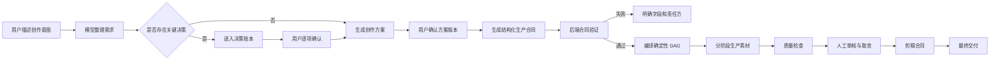
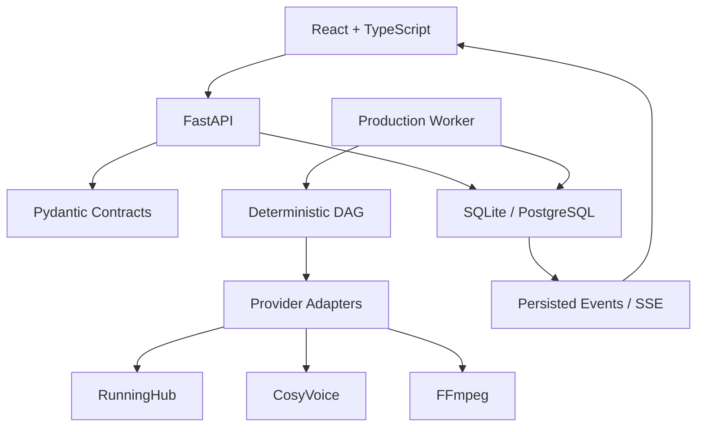

# 片场 V2 产品设计文档

> 状态：框架阶段
> 版本：0.3
> 更新日期：2026-07-15
> 产品原型：<http://127.0.0.1:8765/prototype-v2/>
> V2 应用骨架：<http://127.0.0.1:8766/>
> 详细设计：[V2 数据模型设计](./V2_DATA_MODEL_DESIGN.md) · [V2 状态机与事件系统设计](./V2_STATE_MACHINE_EVENT_SYSTEM.md)

## 1. 产品定义

片场 V2 是一个面向 AI 视频批量创作的本地生产系统。它负责把用户的自然语言创作意图，转化为可确认、可追踪、可恢复的结构化生产流程。

产品不追求让模型自由决定全部流程，而是建立以下协作关系：

- 模型负责理解、提出方案和生成候选内容。
- 用户负责影响主题、身份、预算、生产方式和交付结果的关键决策。
- 后端负责合同验证、依赖编译、状态管理和确定性执行。
- 供应商适配器只执行已经确定的任务，不参与产品决策。

## 2. 核心问题

V1 已验证视频生产能力，但管理台逐渐承担了过多职责：

- 页面、配置、任务状态和生产执行集中在同一文件。
- 员工自然语言输出同时承担规划、路由和执行合同。
- 前后步骤引用容易失配，错误往往到生产阶段才暴露。
- 页面显示的完成状态不一定代表真实文件已经就绪。
- 失败后的自动修补、重试或降级可能改变用户原始意图。
- 人物、服装、场景和声音缺少统一的类型化实体关系。

V2 的目标不是继续拆补旧流程，而是建立新的状态权威和模块边界。

## 3. 产品原则

### 3.1 明确优先

缺少关键字段时阻断并展示原因，不猜测、不补写、不替换。

### 3.2 用户拥有决策

模型可以推荐选项，但影响生产结果或费用的决定必须进入决策账本，由用户明确确认。

### 3.3 数据库是状态权威

员工文本、前端状态和任务日志都不能直接宣称素材就绪。项目、决策、工作项、事件和文件状态由后端数据库计算。

### 3.4 规划与执行分离

创作方案确认后先生成结构化生产合同，再由确定性 DAG 编译器生成工作项。

### 3.5 失败必须可解释

错误必须指向具体合同字段、工作项、供应商请求或文件，不使用笼统的“任务卡住”。

### 3.6 不擅自兜底

未经用户许可，不增加：

- 关键词特殊判断
- 提示词重写
- ID 猜测或改名
- 工作流替换
- 模型降级
- 输出修复
- 自动付费重试
- 隐藏默认值

## 4. 目标用户

### 4.1 主要用户

- 需要批量生产短视频或长视频的个人创作者
- 需要保持人物、产品和场景一致性的内容团队
- 希望使用多个 AI 供应商但需要统一管理生产状态的用户

### 4.2 用户关注点

- 生产之前能否准确看懂方案
- 当前任务到底运行到哪一步
- 为什么失败，是否产生费用
- 哪些内容由模型决定，哪些由用户决定
- 素材是否保持人物、服装和场景一致
- 重做一个素材会影响哪些下游内容

## 5. 产品范围

### 5.1 V2 首期范围

- 对话式创作需求收集
- 项目合同和决策账本
- 人物、服装、场景、声音实体管理
- 分镜合同
- 确定性生产 DAG
- 图片、视频和音频分阶段生产
- 素材质量报告和人工审核
- 基础剪辑时间线合同
- 项目事件流、错误诊断和恢复

### 5.2 暂不纳入首期

- 多租户和团队权限
- 云端协同编辑
- 完整非线性专业剪辑器
- 自动发布到内容平台
- 自动选择最便宜或最快供应商
- 无需确认的全自动批量生产

## 6. 信息架构

```text
工作区
├── 创作台
│   ├── 对话沟通
│   ├── 需求摘要
│   ├── 决策清单
│   └── 方案版本
├── 生产队列
│   ├── 阶段状态
│   ├── 工作项
│   ├── 实际路由
│   └── 执行事件
├── 素材审核
│   ├── 联络表
│   ├── 质量结论
│   ├── 人工选择
│   └── 指定重做
├── 剪辑台
│   ├── 时间线
│   ├── 素材取舍
│   ├── 字幕与音频轨
│   └── 交付检查
├── 资产库
│   ├── 人物
│   ├── 服装状态
│   ├── 场景
│   ├── 产品
│   └── 声音
└── 系统配置
    ├── 模型
    ├── 供应商
    ├── 工作流槽位
    ├── 视频规格
    └── 音频配置
```

## 7. 核心用户流程



## 8. 创作台设计

### 8.1 对话区

用户可以用自然语言继续补充需求，但对话内容本身不直接成为生产命令。

系统每轮对话应输出：

- 已确认事实
- 新发现的待决策项
- 可选建议及影响
- 当前方案变更摘要

### 8.2 决策清单

决策按影响分组：

- 内容：主题、叙事结构、人物关系
- 视觉：风格、人物身份、服装状态、场景
- 生产：规格、工作流、预算或调用次数
- 音频：关闭、系统音色、复刻音色
- 交付：时长、画幅、字幕、最终格式

每个决策必须记录：

```json
{
  "id": "decision_xxx",
  "category": "visual",
  "key": "visual_style",
  "label": "画面质感",
  "status": "pending",
  "source": "user",
  "value": null,
  "risk_level": "medium",
  "impact_scope": ["plan", "shot.*"],
  "breaking_change": false,
  "locked": false,
  "created_at": "2026-07-15T10:00:00Z",
  "resolved_at": null
}
```

已解决的决策不能被静默覆盖。修改时创建新版本并保留历史。

### 8.3 确认等级

确认强度由决策风险决定，不能用大量弹窗打断所有创作步骤：

| 风险 | 示例 | 产品行为 |
|---|---|---|
| `low` | 字幕字体、镜头编号格式 | 可采用系统中已声明、可见且有版本的默认值；用户可在方案页统一检查 |
| `medium` | 视觉风格、叙事节奏、字幕策略 | 在阶段结束时分组快速确认 |
| `high` | 人物身份、版权、预算、付费重做、最终发布 | 必须逐项明确确认，不能由模型或默认值代替 |

默认值不是隐藏兜底。每个默认值必须记录来源、版本和影响范围，并在生成生产快照前对用户可见。

### 8.4 变更影响

用户修改已确认决策时，系统先展示影响分析：

- 受影响的人物、服装、场景和镜头
- 已生成但会过期的素材
- 需要重新编译的工作项和时间线
- 预计新增供应商调用次数和费用

用户确认后创建新方案版本和生产快照；系统不修改旧快照，也不自动重做受影响素材。详细关系见 [V2 数据模型设计](./V2_DATA_MODEL_DESIGN.md)。

## 9. 方案确认设计

方案确认页不是普通文本预览，而是生产合同进入执行前的审阅界面。

必须展示：

- 主题和叙事结构
- 总时长与画幅
- 人物及身份参考
- 服装状态和换装节点
- 场景基准及复用关系
- 镜头列表和镜头时长
- 音频与字幕策略
- 预计素材数量和供应商调用次数
- 未解决决策和阻断项

用户确认后生成不可变方案版本，例如 `plan_v1`。后续修改创建 `plan_v2`，不能直接覆盖已进入生产的版本。

每次实际生产还必须创建不可变的 `ProductionSnapshot`，冻结方案版本、决策版本、实体版本、系统规格和显式选择的供应商配置。所有工作项和素材必须绑定该快照。旧快照仍可审计，但其迟到结果不能推进当前活动方案的项目状态。

生产准备采用两次显式命令：先提交已确认 `PlanVersion`、已发布 `ProductionConfigVersion`、视频规格、关键帧槽位、视频槽位和按音频模式需要的 TTS 槽位，生成带哈希的影响分析；用户确认该精确范围后才创建不可修改的 `preparing` 快照并编译 DAG。若价格目录尚未配置，快照保留 `cost_status=not_configured` 和 `COST_ESTIMATE_REQUIRED`，不得锁定、激活、创建 WorkItem 或调用供应商；系统不得把未知成本写成零。

## 10. 类型化实体

### 10.1 人物实体

```text
Character
├── id
├── display_name
├── identity_reference_ids[]
├── aliases[]
├── status
└── version
```

### 10.2 服装状态

```text
OutfitState
├── id
├── character_id
├── description
├── reference_asset_ids[]
├── valid_from_shot
└── valid_until_shot
```

### 10.3 场景实体

```text
Scene
├── id
├── display_name
├── master_asset_id
├── environment_constraints
└── version
```

### 10.4 声音实体

```text
Voice
├── id
├── provider
├── provider_voice_id
├── clone_metadata
├── sample_asset_id
└── status
```

项目合同只引用实体 ID，不从提示词猜测实体关系。

## 11. 分镜合同

每个镜头至少包含：

```json
{
  "shot_id": "SH-003",
  "scene_id": "scene_track_01",
  "character_ids": ["char_main"],
  "outfit_state_id": "outfit_training_01",
  "duration_seconds": 4.0,
  "shot_type": "character_action",
  "face_visibility": "optional",
  "text_policy": "forbidden",
  "motion_requirement": "significant",
  "composition": "侧面中景跟拍",
  "action": "跑道边动态热身",
  "source_asset_ids": [],
  "output_spec_id": "vertical_working_480p"
}
```

约束字段由规划明确指定，后端不能从提示词推断。

## 12. 生产 DAG

### 12.1 编译原则

- 每个节点具有稳定 ID。
- 每条依赖引用必须精确存在。
- 普通首帧视频只允许一个上游图片输入。
- 多帧工作流必须由合同显式选择。
- 音频关闭时不创建 TTS、音频注入或字幕依赖。
- 未配置工作流时阻断，不替换为其他工作流。

### 12.2 节点状态

```text
queued
running
completed
review_required
blocked
cancelled
skipped
```

`pending` 或 `queued` 只代表等待，不显示成运行中。

### 12.3 工作项

工作项记录：

- 类型
- 项目和方案版本
- 输入合同
- 精确依赖 ID
- 供应商及工作流槽位
- 请求指纹
- 供应商任务 ID
- 实际输出文件
- 状态和错误
- 开始与结束时间
- 是否由用户重试

DAG 依赖分为 `required`、`optional` 和 `informational`。`optional` 仅表示缺失不会阻断该节点，不代表系统可以寻找替代输入；任何替换都必须建模为新的用户决策和新快照。完整约束见 [V2 数据模型设计](./V2_DATA_MODEL_DESIGN.md)。

## 13. 分阶段生产

建议默认阶段：

1. 一致性基准：人物、产品、服装和场景基准。
2. 镜头关键帧：所有视觉镜头的静态验证。
3. 动态视频：只使用已确认关键帧。
4. 音频与字幕：仅在系统配置明确开启时执行。
5. 剪辑装配：只使用审核通过的素材。

每个阶段完成后进入人工确认，不自动开始下一批付费任务。

## 14. 质量检查

### 14.1 状态定义

- `passed`：确定性检查通过。
- `review_required`：需要人判断的相似度、文字、构图或动态问题。
- `blocked`：文件损坏、引用缺失、尺寸无效等确定性错误。

### 14.2 检查边界

- 人脸检测仅用于 `face_visibility=required`。
- 背影、脚部和远景不做正脸硬失败。
- OCR 结果属于人工复核提示，除非合同明确禁止任何文字且检测置信度达到约定阈值。
- 低动态根据镜头类型判断，静态氛围镜头和动作镜头使用不同标准。
- 身份一致性必须对比绑定的人物参考，不能用“检测到一张脸”代替。

### 14.3 重试规则

质量检查不自动重试。系统列出：

- 问题素材
- 检查证据
- 实际工作流
- 原始输入
- 受影响下游节点
- 预计重试调用次数

用户选中素材并确认后，才创建新的重试工作项。

## 15. 剪辑台

剪辑是素材取舍的主要位置，不应反向修改原始生产记录。

首期能力：

- 主视频轨
- 音频和字幕轨开关
- 镜头入点与出点
- 审核通过素材替换
- 缺失素材空位
- 时间线引用校验
- 输出时长检查

时间线中的 `source_asset_id` 必须精确对应审核通过的素材。缺失引用时阻断导出。

## 16. 错误与诊断

错误详情至少包括：

```text
错误层级：合同 / DAG / Worker / Provider / 文件 / QC / 剪辑
责任模块：具体模块名
项目 ID：project_xxx
工作项 ID：work_xxx
错误代码：稳定机器码
用户说明：可读原因
技术详情：供应商或验证器原始信息
允许操作：修改合同 / 重新提交 / 取消 / 无
```

不使用“可能是模型超时”之类与真实错误无关的建议。

### 16.1 项目控制台

项目首页必须让用户不进入日志也能判断下一步：

- 当前项目阶段和活动方案/快照版本
- 工作项完成数、审核数、阻断数和仍在执行数
- 当前阻断原因、责任模块及受影响下游
- 已发生费用、已退款费用和待确认的预计费用
- 最近事件和实际供应商路由
- 唯一明确的下一步操作，例如“确认方案”“审核 3 个素材”或“选择要重做的镜头”

控制台状态来自后端状态评估器和持久事件，不能由员工文本、前端计数或供应商任务状态直接推断。

## 17. 技术架构



### 17.1 前端

- React
- TypeScript
- Vite
- React Router
- TanStack Query
- Zustand
- CSS Modules
- Lucide React

### 17.2 后端

- FastAPI
- Pydantic v2
- SQLAlchemy 2
- Alembic
- SQLite，本地单用户阶段使用
- PostgreSQL，未来多人和高并发阶段使用
- SSE，传递持久任务事件

### 17.3 进程

- API：提供合同和查询接口。
- Worker：领取并执行数据库工作项。
- Provider：供应商适配模块，不拥有产品决策。
- FFmpeg：媒体处理子进程。

## 18. 后端模块边界

```text
v2/backend/app/
├── api/             HTTP 路由
├── contracts/       Pydantic 合同
├── projects/        项目生命周期
├── decisions/       用户决策账本
├── db/              SQLAlchemy 与数据库会话
├── events/          持久事件和 SSE
├── orchestration/   DAG 编译
├── workers/         工作项执行
├── providers/       供应商适配器
└── quality/         QC 报告和人工门禁
```

模块之间通过结构化合同交互，不读取其他模块的页面状态或自然语言文本来补全字段。

业务模块通过 Repository 接口访问持久数据，不直接依赖 SQLAlchemy 查询细节。SQLite 只用于本地单用户阶段；事务、索引、锁和 Repository 边界必须允许后续迁移 PostgreSQL。

### 18.1 AI Agent 角色与边界

V2 将“员工”收敛为只生成候选合同的独立 Agent：

| Agent | 输入 | 输出 |
|---|---|---|
| Creative Agent | 用户消息、已确认决策 | `CreativeBriefCandidate` |
| Director Agent | 已确认创意简报、实体版本 | `ShotPlanCandidate` |
| Production Planner | 已确认分镜、系统能力清单 | `ProductionContractCandidate` |
| QC Analyst | 素材、合同检查规则、检测证据 | `QCReportCandidate` |
| Editor Assistant | 已审核素材、交付合同 | `TimelineCandidate` |

所有 Agent 均不得：

- 创建或领取 `WorkItem`
- 调用供应商或触发付费请求
- 修改项目、快照、素材或 QC 的权威状态
- 从共享聊天记忆补写结构化合同缺失字段
- 直接写入生产素材或最终交付文件

候选合同必须经过 Pydantic 验证、用户确认边界和确定性编译器后，才能成为权威记录。Agent 之间通过已持久化、带版本的输入输出合同传递，不共享隐式聊天状态。

## 19. API 设计原则

- 命令和查询分离。
- 创建、确认、排队和重试是不同接口。
- 所有写操作返回数据库中的新状态。
- 冲突返回 `409`，字段错误返回 `422`，资源不存在返回 `404`。
- 密钥不返回前端，不进入项目合同和事件数据。
- 事件流来源于持久数据库，不能只保存在 API 进程内存。

当前基础接口：

```text
GET  /api/v1/health
GET  /api/v1/projects
POST /api/v1/projects
GET  /api/v1/projects/{project_id}
POST /api/v1/projects/{project_id}/decisions
POST /api/v1/projects/{project_id}/decisions/{decision_id}/resolve
POST /api/v1/projects/{project_id}/confirm
POST /api/v1/projects/{project_id}/queue
GET  /api/v1/projects/{project_id}/events
```

## 20. 权限与安全

本地单用户阶段仍遵循：

- 供应商密钥仅保存在后端运行配置。
- API 不返回密钥原文。
- 上传文件名和路径必须经过安全校验。
- 静态文件只能从指定目录提供。
- 项目事件不得写入密钥和完整供应商凭据。
- 删除素材需要明确用户操作，并检查引用关系。

## 21. V1 与 V2 关系

- V1 固定在 `v1` 分支，作为当前可运行版本。
- `main` 用于 V2 迭代。
- V2 不导入 V1 管理台代码。
- 后续只迁移已经验证稳定的 Provider Adapter。
- 迁移时为每个适配器增加 V2 接口包装和合同测试。
- 不复制 V1 中的员工文本解析、路由猜测和历史兼容补丁。

## 22. 实施路线

实施顺序以状态和数据基础优先，页面不能先于权威模型自行定义业务状态。

### Sprint 1：状态与数据基础

- [x] React + TypeScript + Vite
- [x] FastAPI + Pydantic
- [x] SQLAlchemy + SQLite
- [x] Alembic 目录
- [x] 数据库工作队列
- [x] 独立 Worker
- [x] SSE 事件流
- [x] 项目和决策账本
- [ ] 项目状态机与状态评估器
- [ ] 完整数据模型与 Repository 接口
- [ ] 事件信封、Outbox 和 SSE 游标
- [ ] 方案版本与生产快照

### Sprint 2：决策、合同与编排

- [ ] 对话消息实体
- [ ] 需求摘要版本
- [ ] 方案版本
- [ ] 类型化人物、服装、场景和声音实体
- [ ] 分镜合同编辑器
- [ ] 决策影响分析
- [ ] DAG 合同
- [ ] 依赖验证器
- [ ] 工作流槽位注册表
- [ ] 生产调用估算
- [ ] 阶段确认门禁

### Sprint 3：执行、供应商与资产

- [ ] RunningHub 图片适配器
- [ ] RunningHub 视频适配器
- [ ] CosyVoice 适配器
- [ ] OSS 临时音频上传
- [ ] FFmpeg 合成适配器
- [ ] Worker 幂等与执行租约
- [ ] 素材生命周期与引用检查
- [ ] 成本账本

### Sprint 4：产品界面与完整闭环

- [ ] 项目控制台
- [ ] 方案确认页面
- [ ] 素材联络表
- [ ] QC 结构化报告
- [ ] 人工审核操作
- [ ] 精确依赖重试
- [ ] 剪辑时间线合同
- [ ] 最终交付检查

## 23. 首期验收标准

- 用户可以通过对话建立一个项目草稿。
- 关键决策全部进入决策账本。
- 有未确认决策时不能确认方案。
- 方案确认后生成不可变版本和结构化分镜合同。
- DAG 中任何不存在的引用都会明确失败。
- Worker 重启后可以继续读取数据库工作项。
- API 重启不会丢失项目进度。
- 关闭音频时不创建任何 TTS 工作项。
- 质量问题不会触发自动付费重试。
- 用户可以只重做选中的素材和真实依赖项。
- 前端能够显示实际供应商路由、任务 ID 和文件状态。
- 最终视频不存在时，项目不能显示为完成。

## 24. 当前运行方式

首次安装和构建：

```powershell
python -m pip install -r v2/backend/requirements-dev.txt
cd v2/frontend
npm.cmd install
npm.cmd run build
cd ../..
```

启动 V2：

```powershell
v2\start_v2.bat -NoBrowser
```

地址：

- V1：<http://127.0.0.1:8765/>
- V2：<http://127.0.0.1:8766/>
- V2 API 文档：<http://127.0.0.1:8766/api/docs>

## 25. 设计变更规则

后续开发出现以下情况时，先更新本文档并由用户确认，再进入实现：

- 新增自动重试或自动修复
- 新增工作流替换或供应商降级
- 改变项目状态机
- 改变用户确认边界
- 改变素材引用和依赖规则
- 改变付费调用触发时机
- 引入新的生产供应商

普通 UI 文案和不改变业务语义的样式调整可以直接实施，但仍需通过桌面和手机布局检查。

## 26. 模板系统预留

模板属于 V2.1 能力，V2 首期只预留数据边界，不将模板作为隐式生成来源。

模板由 `Template` 和不可变的 `TemplateVersion` 组成，可声明默认决策、合同 Schema、镜头模式和适用交付规格。使用模板时必须：

- 由用户明确选择，或明确接受模型提出的模板建议
- 在方案和生产快照中记录模板版本
- 将模板默认值作为可见、可覆盖的决策来源
- 在模板升级时创建新版本，不改变历史项目

未选择模板时，系统不能因为合同缺字段而自动套用模板。

## 27. 成本与付费确认

系统为每次供应商调用记录成本账本，区分预计、实际、已扣费和已退款金额。项目控制台按项目、快照、供应商和工作项汇总，但不以日志文本估算已发生费用。

以下操作前必须展示预计新增费用并获得明确确认：

- 首次提交一批付费生产工作项
- 对审核不满意的素材发起重做
- 修改决策后重新生产受影响素材
- 更换供应商或工作流后重新执行

失败不会自动触发第二次付费调用。成本记录与工作项尝试一一对应，供应商返回未知费用时明确显示“待对账”，不能填入猜测值。

## 28. 完整 Demo 场景

首个端到端验收项目固定为“30 秒竖屏健身广告”，用于证明系统闭环，而不是作为业务特殊判断。

1. 用户输入：制作 30 秒竖屏健身广告，单一成年主角，5 个镜头，关闭音频。
2. Creative Agent 生成候选简报；系统记录人物身份、画幅、时长和音频关闭等决策。
3. 用户分组确认中风险项，并逐项确认人物身份和预算上限。
4. Director Agent 生成 5 个带精确实体 ID、场景 ID、服装状态和动作要求的分镜候选。
5. 用户确认 `plan_v1`，系统创建冻结后的 `snapshot_001`。
6. Production Planner 生成候选生产合同；后端验证精确引用并编译 DAG，普通首帧视频每个节点只接受一张图片。
7. 用户查看调用数和预计费用后提交生产；音频关闭，因此 DAG 中不存在 TTS 节点。
8. Worker 逐项执行并记录实际路由、尝试、费用、素材和事件；API 或 Worker 重启后继续读取持久状态。
9. QC 将确定性损坏标为 `blocked`，将人物相似度或动态问题标为 `review_required`，不自动重试。
10. 用户审核素材，只对选中的镜头确认付费重做；系统创建新尝试并使真实下游结果失效。
11. Editor Assistant 只用已审核素材生成时间线候选；用户取舍并确认剪辑合同。
12. FFmpeg 生成并验证最终视频后，状态评估器才允许项目进入 `completed`。

该 Demo 的数据链、状态转移和事件轨迹分别见 [V2 数据模型设计](./V2_DATA_MODEL_DESIGN.md) 与 [V2 状态机与事件系统设计](./V2_STATE_MACHINE_EVENT_SYSTEM.md)。

## 29. 文档职责与权威顺序

- 本文档定义产品目标、用户边界、产品流程和验收口径。
- [V2 数据模型设计](./V2_DATA_MODEL_DESIGN.md) 定义实体、字段、关系、约束、版本和持久化边界。
- [V2 状态机与事件系统设计](./V2_STATE_MACHINE_EVENT_SYSTEM.md) 定义状态、命令、守卫、事件和恢复语义。
- Pydantic Schema、数据库迁移和自动化测试是实现证据；实现与文档冲突时先停止开发并更新设计，不静默兼容。

项目状态以状态机文档为准，实体字段以数据模型文档为准。本文中的简化示例不得覆盖专项文档中的完整约束。

## 30. 系统配置设计

### 30.1 目标与边界

系统配置负责声明 V2 可以使用哪些模型、供应商、工作流和媒体规格，以及这些能力如何被生产快照精确引用。它不负责替用户选择创作内容，也不能在运行时根据错误自动改变路由。

系统配置遵循以下原则：

- 配置先形成草稿，通过确定性验证后才能发布为不可变版本。
- 项目和生产快照只引用已发布的精确配置版本，不读取“当前页面最新值”。
- 发布新配置不修改已有 RequirementVersion、PlanVersion、ProductionSnapshot、WorkItem 或素材。
- 供应商、模型、工作流或输出规格发生变化时，必须创建新配置版本；需要重做时再由用户确认新的影响范围和费用。
- 密钥、令牌和签名材料只保存于后端密钥存储；配置记录只保存 `credential_ref`。
- 未配置、已停用、能力不匹配或凭据不可用时明确阻断，不切换供应商、模型、工作流或输出格式。

### 30.2 配置模块

| 模块 | 用户可管理内容 | 关键约束 |
|---|---|---|
| 模型注册表 | 模型用途、供应商模型 ID、上下文限制、输入输出 Schema、Prompt 合同版本、启用状态 | 一个 AgentRun 必须记录精确模型配置版本；不允许自动切换模型 |
| 供应商注册表 | 适配器类型、区域、API 地址、能力声明、凭据引用、请求超时、轮询策略、并发上限 | 凭据不返回前端；适配器不参与路由决策 |
| 工作流槽位 | 稳定槽位键、媒体类型、供应商、工作流 ID/版本、模型绑定、NodeInfoList、输入输出合同 | 槽位必须显式选择并完整验证；缺失或不匹配时阻断 |
| 视频规格 | 宽高、画幅、FPS、时长范围、帧数规则、编码器、码率、容器、安全裁切区域 | 所有视觉工作流输出必须归一到快照冻结的视频规格 |
| 音频配置 | 音频模式、TTS 槽位、模型、系统音色与复刻音色选择范围、采样率、格式、语速和响度范围 | 项目音频关闭时不创建任何 TTS、音频注入或字幕音频依赖 |
| 存储与临时上传 | 本地或 OSS 后端、Bucket/区域引用、允许 MIME、文件上限、公网 URL 策略、生命周期 | 访问密钥仅后端持有；临时对象按明确生命周期删除 |
| 质量策略 | 文件完整性、尺寸、人脸、OCR、身份相似度、重复度、动态阈值及适用镜头类型 | 主观或概率性问题进入 `review_required`，不触发自动付费重试 |
| 执行策略 | Worker 并发、租约、轮询间隔、提交超时、对账窗口 | 不提供自动付费重试、路由替换或降级开关 |
| 成本目录 | 币种、供应商操作、估算单价、生效时间和费用确认阈值 | 预计、实际、扣费和退款分开记录，不从日志猜费用 |

### 30.3 模型配置

每个模型配置至少展示：

```text
config_key / display_name
agent_role: creative | director | qc | editor
provider_config_version_id
provider_model_id
input_contract_version / output_schema_version
prompt_contract_version
context_window / max_output_tokens
capability_tags[]
status
```

`temperature`、采样参数或结构化输出模式若允许配置，也必须进入模型配置版本和 AgentRun 审计。模型配置不能包含“失败时改用其他模型”字段。

### 30.4 供应商与工作流槽位

供应商配置声明能力和连接边界；工作流槽位声明一次具体生产调用的合同。二者分开管理，避免把业务槽位直接等同于供应商接口。

工作流槽位至少包括：

```text
slot_key / display_name
operation_kind
provider_config_version_id
provider_workflow_id / provider_workflow_version
model_config_version_id nullable
input_schema_version / output_schema_version
node_info_list_json
supported_video_spec_ids[]
capability_tags[]
validation_status / tested_at
status
```

`slot_key` 是计划和 DAG 使用的稳定语义 ID，例如首帧视频、多帧视频、图片生成或语音合成。供应商工作流 ID、节点映射或模型发生变化时创建新槽位版本，不覆盖已发布版本。

NodeInfoList 必须逐项记录节点 ID、字段路径、值来源和类型。编译器只能使用已登记映射；不得根据节点名称、提示词或历史配置猜测缺失字段。

### 30.5 视频与音频规格

视频规格至少定义：

```text
width / height / aspect_ratio
fps
duration_min_seconds / duration_max_seconds
frame_count_rule
container / video_codec / pixel_format
bitrate_policy
safe_crop_json
```

音频配置至少定义：

```text
supported_modes[]
tts_workflow_slot_id nullable
default_voice_entity_version_id nullable
sample_rate / channels / format
speaking_rate_min / speaking_rate_max
loudness_target
temporary_upload_policy_id nullable
```

默认音色只有在声明、可见、带版本且允许低风险默认时才能物化。复刻声音必须是用户明确确认的 `voice_sample` 绑定和声音实体版本，上传成功不能自动选中。

### 30.6 配置管理体验

系统配置页面包含以下视图：

1. 配置版本列表：显示草稿、验证失败、可发布、已发布和已停用版本。
2. 配置编辑器：按模块编辑草稿，显示字段来源、引用对象和确定性校验错误。
3. 版本差异：展示供应商、模型、工作流节点、媒体规格、质量阈值和成本变化。
4. 引用关系：展示哪些项目、方案和生产快照仍引用该版本。
5. 发布确认：列出影响范围；发布本身不创建项目快照、不启动 Worker，也不产生供应商费用。

已发布版本只读。被任何历史快照引用的版本不能删除，只能停用；停用仅阻止新快照选择，不影响历史审计和已提交供应商任务的对账。

### 30.7 配置确认等级

| 变化 | 确认要求 |
|---|---|
| 展示名称、说明文字 | 普通保存草稿 |
| 非付费运行参数、质量审核阈值 | 发布前显示差异并确认 |
| 模型、供应商、工作流 ID、NodeInfoList、视频或音频规格 | 强确认并创建新配置版本 |
| 凭据引用、区域、成本规则 | 管理员确认；前端不显示密钥原文 |
| 已有项目改用新配置 | 单独执行影响分析，确认新快照和预计费用 |

任何配置确认都不等于确认生产。生产仍要求项目合同、快照、工作项和费用边界分别成立。

### 30.8 首期实施范围

系统配置首期按以下顺序实现：

1. ProductionConfigVersion 与配置发布状态机。
2. 模型、供应商和工作流槽位注册表。
3. 视频规格、音频配置和存储策略。
4. 快照绑定、引用检查与配置差异。
5. 质量策略、执行策略和成本目录。

在注册表与版本合同完成前，不接入真实生产 Provider Adapter，也不把 V1 管理台 JSON 直接作为 V2 权威配置。

### 30.9 配置 API 边界

命令使用显式动作并携带 `command_id`、`expected_row_version` 和操作者：

```text
POST /api/v1/system-config/versions
POST /api/v1/system-config/versions/{id}:validate
POST /api/v1/system-config/versions/{id}:publish
POST /api/v1/system-config/versions/{id}:retire
POST /api/v1/system-config/versions/{id}:clone-draft
POST /api/v1/system-config/versions/{id}:evaluate-impact
```

查询接口：

```text
GET /api/v1/system-config/versions
GET /api/v1/system-config/versions/{id}
GET /api/v1/system-config/versions/{id}/diff?base_version_id=...
GET /api/v1/system-config/versions/{id}/references
GET /api/v1/system-config/components/{component_type}
GET /api/v1/system-config/workflow-slots/{slot_key}/versions
```

组件草稿写入必须使用类型化 Schema，不提供接收任意 JSON 并直接发布的通用接口。凭据写入使用独立后端秘密管理边界，所有读取响应只返回引用 ID、掩码状态和验证时间。

### 30.10 验收标准

- 任意发布版本都能列出全部精确组件版本和配置哈希。
- 修改已发布字段只能产生新草稿，不原地更新。
- 工作流节点映射不完整时发布失败并列出节点与字段。
- 发布和停用不修改现有生产快照。
- 被引用版本不能删除，引用项目和快照可以查询。
- API、事件和前端均不返回供应商密钥原文。
- 音频关闭的快照不包含 TTS 工作项。
- 配置错误不会触发模型、供应商、工作流或输出格式替换。
- 发布配置不会调用生产供应商或产生生产费用。
