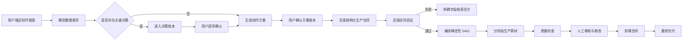
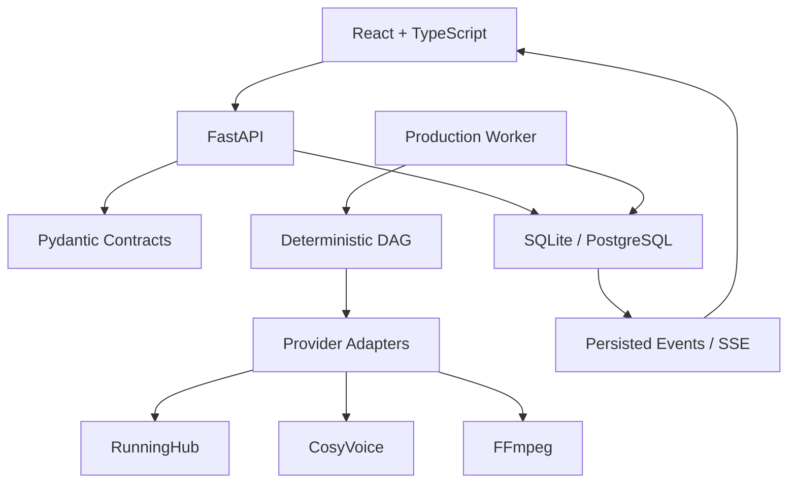

# 片场 V2 产品设计文档

> 状态：设计基线
> 版本：0.4
> 更新日期：2026-07-29
> 产品原型：<http://127.0.0.1:8765/prototype-v2/>
> V2 应用骨架：<http://127.0.0.1:8766/>
> 系统架构：[V2 系统架构](./V2_SYSTEM_ARCHITECTURE.md)
> 配音与剪辑路线：[V2 配音与剪辑完善路线图](./V2_AUDIO_EDITING_ROADMAP.md)

## 1. 产品定义

片场 V2 是一个面向 AI 视频批量创作的本地生产系统。它负责把用户的自然语言创作意图，转化为可确认、可追踪、可恢复的结构化生产流程。

产品不追求让模型自由决定全部流程，而是建立以下协作关系：

- 模型负责理解、提出方案和生成候选内容。
- 用户负责影响主题、身份、预算、生产方式和交付结果的关键决策。
- 后端负责合同验证、依赖编译、状态管理和确定性执行。
- 供应商适配器只执行已经确定的任务，不参与产品决策。

## 2. 核心问题

V1 已验证视频生产能力，但管理台逐渐承担了过多职责：

- 页面、配置、任务状态和生产执行集中在同一文件。
- 员工自然语言输出同时承担规划、路由和执行合同。
- 前后步骤引用容易失配，错误往往到生产阶段才暴露。
- 页面显示的完成状态不一定代表真实文件已经就绪。
- 失败后的自动修补、重试或降级可能改变用户原始意图。
- 人物、服装、场景和声音缺少统一的类型化实体关系。

V2 的目标不是继续拆补旧流程，而是建立新的状态权威和模块边界。

## 3. 产品原则

### 3.1 明确优先

缺少关键字段时阻断并展示原因，不猜测、不补写、不替换。

### 3.2 用户拥有决策

模型可以推荐选项，但影响生产结果或费用的决定必须进入决策账本，由用户明确确认。

### 3.3 数据库是状态权威

员工文本、前端状态和任务日志都不能直接宣称素材就绪。项目、决策、工作项、事件和文件状态由后端数据库计算。

### 3.4 规划与执行分离

创作方案确认后先生成结构化生产合同，再由确定性 DAG 编译器生成工作项。

### 3.5 失败必须可解释

错误必须指向具体合同字段、工作项、供应商请求或文件，不使用笼统的“任务卡住”。

### 3.6 不擅自兜底

未经用户许可，不增加：

- 关键词特殊判断
- 提示词重写
- ID 猜测或改名
- 工作流替换
- 模型降级
- 输出修复
- 自动付费重试
- 隐藏默认值

## 4. 目标用户

### 4.1 主要用户

- 需要批量生产短视频或长视频的个人创作者
- 需要保持人物、产品和场景一致性的内容团队
- 希望使用多个 AI 供应商但需要统一管理生产状态的用户

### 4.2 用户关注点

- 生产之前能否准确看懂方案
- 当前任务到底运行到哪一步
- 为什么失败，是否产生费用
- 哪些内容由模型决定，哪些由用户决定
- 素材是否保持人物、服装和场景一致
- 重做一个素材会影响哪些下游内容

## 5. 产品范围

### 5.1 V2 首期范围

- 对话式创作需求收集
- 项目合同和决策账本
- 人物、服装、场景、声音实体管理
- 分镜合同
- 确定性生产 DAG
- 图片、视频和音频分阶段生产
- 素材质量报告和人工审核
- 基础剪辑时间线合同
- 项目事件流、错误诊断和恢复

### 5.2 暂不纳入首期

- 多租户和团队权限
- 云端协同编辑
- 完整非线性专业剪辑器
- 自动发布到内容平台
- 自动选择最便宜或最快供应商
- 无需确认的全自动批量生产

## 6. 信息架构

```text
工作区
├── 创作台
│   ├── 对话沟通
│   ├── 需求摘要
│   ├── 决策清单
│   └── 方案版本
├── 生产队列
│   ├── 阶段状态
│   ├── 工作项
│   ├── 实际路由
│   └── 执行事件
├── 素材审核
│   ├── 联络表
│   ├── 质量结论
│   ├── 人工选择
│   └── 指定重做
├── 剪辑台
│   ├── 时间线
│   ├── 素材取舍
│   ├── 字幕与音频轨
│   └── 交付检查
├── 资产库
│   ├── 人物
│   ├── 服装状态
│   ├── 场景
│   ├── 产品
│   └── 声音
└── 系统配置
    ├── 模型
    ├── 供应商
    ├── 工作流槽位
    ├── 视频规格
    └── 音频配置
```

## 7. 核心用户流程



## 8. 创作台设计

### 8.1 对话区

用户可以用自然语言继续补充需求，但对话内容本身不直接成为生产命令。

首次进入一个尚未开始的创作会话时，页面调用一次显式初始化命令。创作制片人根据项目主题主动提供 2–3 个需求方向；初始化事实、AgentRun 和助手回复全部持久化，刷新页面不得重复调用。初始化输出只能是引导与建议，不能写入正式需求或草稿字段；失败后也不自动重试。

输入框采用标准对话交互：`Enter` 发送当前非空消息，`Shift+Enter` 换行。中文输入法仍在组词时不得误发送；消息请求进行中禁止键盘或按钮重复提交。两种发送方式先调用同一个消息命令；消息保存成功后，前端仅发起一次明确的创作智能体命令。该命令可以产生模型费用和待确认候选，但不启动生产。

桌面创作工作区中的对话面板与结构化需求面板保持相同固定高度。消息和需求字段超出可视区域后分别在面板内部滚动，不得继续撑高页面；对话输入框固定在面板底部且不能通过拖拽改变工作区高度。新消息、等待回复或持久化助手回复出现后，对话区定位到最新内容。移动端对话区保持有界，结构化需求区按单列页面自然展开。

系统每轮对话应输出：

- 已确认事实
- 新发现的待决策项
- 可选建议及影响
- 当前方案变更摘要

助手回复必须作为 `Message(role=assistant)` 持久化并精确关联 `AgentRun`。模型失败时显示结构化失败证据，同一批消息不自动或重复调用；完整边界见 [V2 对话式创作实现](./archive/implementation-notes/V2_CONVERSATIONAL_CREATION_IMPLEMENTATION.md)。

当创作制片人需要用户选择时，回复下方显示 2–3 个结构化选项，推荐项排第一并带一句差异说明，同时提供“其他想法”入口。该入口只聚焦页面底部唯一的消息输入框，不展开第二套输入控件；最终内容仍按普通用户消息提交。模型只返回选项内容，后端生成稳定 ID；点击执行一次“保存选择并继续引导”，先保存精确选择记录和新的不可变草稿修订，再由该次用户动作授权一次模型调用，基于新草稿讨论下一个最有价值的创作缺口。点击不直接修改正式需求，也不强迫用户立即确认；每组只能选择一次，旧提案或旧需求版本不能继续选择。

持续引导不是后台循环或固定问卷。每次用户发送消息或点击选项只产生一次可审计 AgentRun；模型结合当前草稿和完整会话选择下一个焦点，后端只验证它没有重复刚选字段、没有重新登记已保存选择且没有越过创作制片人职责。`creative_constraints` 只登记用户明确表达的可选限制，不属于必须补齐字段，不得成为诊断缺口、焦点或建议组选项。非收口阶段必须同时给出非空 `focus_field` 与 `focus_reason`；达到 `ready_to_confirm` 时两者必须同时为 JSON `null`，助手总结并停止强制给选项，输入框仍开放。空字符串不会被系统补写或转换。模型失败时选择事实和草稿保留，用户确认费用后精确重跑失败 Run，不自动重试、切换模型或修复输出。

一个建议组只能对应一个需求字段，每个选项只能给出该字段的一个候选值。选项必须直接展示“选择后设置”的字段和值；模型不能在一个可点击选项中暗中捆绑视觉风格、语气或其他字段。用户同一条消息中的明确事实与限制必须独立形成显式更新，不能因为同时请求建议而只存在于自然回复中。候选值与当前正式值相同时明确判为无效输出，不生成假变更或改写来源。

自然语言选择遵循最小权限输入：历史提案只向模型提供不含系统 ID 的可读摘要和已选结果；只有最新消息通过 `reply_to` 精确指向的提案，才形成该轮唯一可选择的 ID 作用域。每轮新草稿修订从同一会话的上一修订完整继承，再叠加本轮明确更新或冻结选项；模型失败时上一修订继续有效。只有用户点击“确认需求并进入策划”才创建新的 `RequirementVersion` 并转入 `planning`。进入策划后的修改必须显式开启下一版草稿，不能由普通消息偷偷回退状态。

### 8.2 决策清单

决策按影响分组：

- 内容：主题、叙事结构、人物关系
- 视觉：风格、人物身份、服装状态、场景
- 生产：规格、工作流、预算或调用次数
- 音频：关闭、系统音色、复刻音色
- 交付：时长、画幅、字幕、最终格式

每个决策必须记录：

```json
{
  "id": "decision_xxx",
  "category": "visual",
  "key": "visual_style",
  "label": "画面质感",
  "status": "pending",
  "source": "user",
  "value": null,
  "risk_level": "medium",
  "impact_scope": ["plan", "shot.*"],
  "breaking_change": false,
  "locked": false,
  "created_at": "2026-07-15T10:00:00Z",
  "resolved_at": null
}
```

已解决的决策不能被静默覆盖。修改时创建新版本并保留历史。

### 8.3 确认等级

确认强度由决策风险决定，不能用大量弹窗打断所有创作步骤：

| 风险 | 示例 | 产品行为 |
|---|---|---|
| `low` | 字幕字体、镜头编号格式 | 可采用系统中已声明、可见且有版本的默认值；用户可在方案页统一检查 |
| `medium` | 视觉风格、叙事节奏、字幕策略 | 在阶段结束时分组快速确认 |
| `high` | 人物身份、版权、预算、付费重做、最终发布 | 必须逐项明确确认，不能由模型或默认值代替 |

默认值不是隐藏兜底。每个默认值必须记录来源、版本和影响范围，并在生成生产快照前对用户可见。

### 8.4 变更影响

用户提出修改已确认决策时，系统先生成不可变影响分析报告：

- 受影响的人物、服装、场景和镜头
- 候选受影响的素材、工作项和时间线
- 当前活动快照中潜在工作单元和已冻结价格证据

报告只提供审核证据，不会确认或应用决策变更，不修改旧快照，也不自动使素材失效、重做或重试。未来应用变更必须使用另行设计并确认的版本命令。详细关系见 [V2 系统架构](./V2_SYSTEM_ARCHITECTURE.md)。

当前已实现两层能力：只读“已观测决策传播图”证明历史传播；持久化 `DecisionChangeImpactAnalysis` 冻结提议值、精确候选目标、活动快照潜在工作量和已有价格证据。未观测表示证据不足，不表示无影响。完整边界见 [V2 决策影响证据图实现](./archive/implementation-notes/V2_DECISION_IMPACT_IMPLEMENTATION.md) 和 [V2 前瞻决策变更影响分析实现](./archive/implementation-notes/V2_PROSPECTIVE_DECISION_IMPACT_IMPLEMENTATION.md)。

## 9. 方案确认设计

方案确认页不是普通文本预览，而是生产合同进入执行前的审阅界面。

必须展示：

- 主题和叙事结构
- 总时长与画幅
- 人物及身份参考
- 服装状态和换装节点
- 场景基准及复用关系
- 镜头列表和镜头时长
- 音频与字幕策略
- 预计素材数量和供应商调用次数
- 未解决决策和阻断项

用户确认后生成不可变方案版本，例如 `plan_v1`。后续修改创建 `plan_v2`，不能直接覆盖已进入生产的版本。

确认前的分镜候选同样不允许原地覆盖。用户通过逐镜头结构化字段创建新的 `ShotPlanCandidate` 修订，新候选记录 `supersedes_candidate_id`，旧候选进入 `superseded`；只有最新待审候选可以确认并生成 `PlanVersion`。修订接口不接受自由 JSON、供应商字段、工作流 ID 或提示词覆盖，完整实现见 [V2 结构化分镜候选修订实现](./archive/implementation-notes/V2_SHOT_PLAN_REVISION_IMPLEMENTATION.md)。

拒绝分镜只表示当前候选不能直接成为正式方案，不等于放弃已接受的内容方案或强制修改基础需求。系统保留最近被拒绝且尚未被替代的分镜供查看，并把唯一下一步切换为逐镜头结构化调整；用户提交至少一处明确 Patch 后创建新的待审候选，原拒绝版本进入 `superseded`，项目由 `planning` 显式返回 `plan_review`。该路径不再次调用分镜导演、不产生模型费用，也不自动猜测、重写或修复镜头。若用户要改变内容结构或基础需求，必须通过对应的内容方案或需求修订命令另行处理。

分镜修订采用“镜头导航 + 单镜头编辑器”，不把全部镜头表单同时展开。用户从列表点击具体镜头后，只编辑该镜头的结构化字段；列表支持按编号、类型、动作和内容节拍搜索，以及查看全部或仅已修改镜头。页面明确显示修改镜头数量、当前镜头未保存状态，并允许只重置当前镜头。镜头选择分为独立的“批量人物”和“AI 调整”模式：批量人物只把用户选择的人物版本、主参考图、人脸主体和身份一致性要求应用到用户明确勾选的镜头，追加人物时保留镜头已有的其他人物；AI 模式只授权模型修改另一组明确勾选的镜头，两套选择状态不能混用。所有人工修改仍保存在本地草稿中，只有用户点击创建修订候选时才一次性提交原有逐镜头 Patch；切换镜头、搜索、筛选、勾选和批量应用均不直接写入后端。

桌面端使用左右工作区，移动端改为上方横向镜头导航、下方编辑器。工作区保持稳定高度，镜头列表和表单分别滚动，不能随镜头数量无限拉长页面。该交互调整不改变 `ShotPlanCandidate` 合同、候选版本链、行版本冲突或人工确认边界。

每次实际生产还必须创建不可变的 `ProductionSnapshot`，冻结方案版本、决策版本、实体版本、系统规格和显式选择的供应商配置。所有工作项和素材必须绑定该快照。旧快照仍可审计，但其迟到结果不能推进当前活动方案的项目状态。

成品回改采用版本化闭环，不把“不满意”直接等同于生成失败。用户在素材审核或剪辑预览中必须先明确选择 `storyboard / production / editing` 三类问题之一，再选择该范围内的结构化 `issue_code`；系统据此创建不可变 `AssetRevisionRequest`，冻结来源素材、生产快照、方案版本、精确镜头以及当时可观测的下游节点。`rationale` 是可选补充说明，只有用户选择 `other` 时必填。问题范围与原因均由用户点击决定，后端只校验合法组合，不扫描说明文本猜测、改写或覆盖分类。

- `production` 只登记生成质量问题并导航到制作记录，不自动重跑、改提示词或换工作流。
- `editing` 只登记取舍、节奏或时间线问题并导航到剪辑台，不自动替换时间线素材。
- `storyboard` 必须能从 `DAGNode.shot_id` 精确解析来源镜头；系统从来源不可变 `PlanVersion` 创建 `revision_draft`，用户人工 Patch 或显式授权分镜导演调整后才形成待确认候选。
- 历史方案素材不能直接创建新的分镜回改草稿；用户必须回到当前活动方案重新选择目标，系统不把历史镜头映射、改名或猜测为当前镜头。
- 同一项目只允许一个未完成的分镜回改请求。用户可以显式放弃该请求；系统将本次草稿和待审候选标记为 `cancelled`，保留来源素材、旧方案、旧快照、理由与事件证据，不自动恢复、重做或创建替代候选。

新分镜候选确认前，活动方案、活动快照、已有素材和时间线均不变化。确认后创建下一版 `PlanVersion`，旧方案与旧快照转为历史并继续可审计；项目返回生产准备，重新进行能力、调用量、影响范围和费用分析。系统不自动重制受影响镜头，不自动迁移旧素材，也不把旧素材标记为新方案可用。

生产准备采用两次显式命令：先提交已确认 `PlanVersion`、已发布 `ProductionConfigVersion`、视频规格、关键帧槽位、视频槽位和按音频模式需要的 TTS 槽位，生成带哈希的影响分析；用户确认该精确范围后才创建不可修改的 `preparing` 快照并编译 DAG。若价格目录尚未配置，快照保留 `cost_status=not_configured` 和 `COST_ESTIMATE_REQUIRED`，不得锁定、激活、创建 WorkItem 或调用供应商；系统不得把未知成本写成零。

制作计划允许重复计算，以便用户在修改显式选择后重新检查步骤和费用；同一项目内仍未结束的制作方案不得重复保存完全相同的冻结合同。唯一性依据是 `production-snapshot.v2` 完整合同的 `contract_hash` 与制作方案生命周期，不使用影响分析 ID、方案名称、预计费用或创建顺序判断。影响分析返回候选快照合同哈希，页面若存在状态不是 `superseded` 的匹配快照，则显示已有制作方案编号并取消重复保存入口；后端执行相同的权威 `409 PRODUCTION_SNAPSHOT_DUPLICATE` 门禁。

用户明确结束阻断生产后，旧快照进入 `superseded`，只保留历史审计，不再占用当前制作方案。此时重新分析并保存完全相同的冻结合同必须创建新的 `snapshot_id` 与递增制作方案编号，重新经过费用锁定和开始制作确认；不得复活旧快照、复用旧 WorkItem、自动提交或自动重试。相同 `contract_hash` 跨越两个已明确分隔的生产轮次是合法历史，不表示数据库重复。

生产准备页面采用面向创作者的双层术语。默认界面使用“制作配置、画面规格、图片生成方案、视频生成方案、计费方案、制作步骤、制作方案、等待补充费用、开始制作”等业务语言；`ProductionSnapshot`、`DAGNode`、`WorkItem`、内部状态、错误代码、技术键、ID 和合同哈希只放在默认收起的“技术详情”中。展示层翻译不得修改后端合同、状态、确认边界或成本门禁，也不得隐藏真实阻断。制作配置选择只返回按发布时间确定的当前发布版本，不把历史发布版平铺到下拉框；下拉选项默认只显示人类可读名称，精确技术键仍作为值提交并可在技术详情中审计。历史快照和分析继续按冻结配置 ID 读取旧版本，不受当前选择列表影响。

生产队列中的已登记素材缩略图必须以 `project_id + asset_id` 精确跳转到素材审核页，不得只传项目后让审核页默认选择第一项。审核页首次读取深链接时应根据目标素材的真实状态切换到待审核、已批准、已归档或全部筛选，并选中该素材；之后用户手动切换筛选不再受初始链接约束。目标素材不存在或不属于当前活动快照时不得猜测同镜头或相邻素材，只回到当前筛选的正常首项。

生产队列左侧任务标题保持单行省略，避免长项目名挤压状态标签；前端必须根据元素实际 `scrollWidth / clientWidth` 判断是否溢出。只有真实溢出的标题在鼠标悬停或任务行键盘聚焦时显示完整标题浮层，短标题不产生多余浮层；提示层不得拦截项目选择点击。

制作准备中的任一下拉框若恰好只有一个可用候选，页面应直接回填该候选；适用范围包括制作配置、画面规格、计费方案，以及只有一个候选时的图片、视频和配音方案。该规则只减少无意义的单选操作，选中结果必须保持可见且可修改；多个候选时不得猜测或沿用历史选择。自动回填不得进一步触发批量应用、智能体调用、影响分析、快照保存、费用确认、生产提交或供应商调用。

制作准备投影必须显式区分 `current_snapshot` 与 `snapshots`：前者由后端从项目活动绑定或尚未完成的 `preparing / locked` 制作准备记录中确定，后者是按审计顺序返回的完整历史。锁定、激活、提交、费用弹窗、当前状态和下一步只能使用 `current_snapshot`，前端不得读取历史列表第一项或按状态过滤猜测当前快照。`superseded` 快照只显示为“已结束”的历史记录，不提供制作命令，也不参与当前合同重复占用；当前快照为空时，页面立即恢复当前发布配置、逐镜头路线选择、重新分析和保存新制作方案的入口。

执行中的快照因确定性错误或图片阶段人工拒绝进入 `execution_blocked` 后，系统不得自动重跑、替换配置或修改冻结合同。图片阶段拒绝会归档被拒素材、取消尚未开始的 `queued / waiting_phase` 工作项并把项目显式置为 `blocked`；已完成素材、供应商结果与费用证据保持只读。生产页提供独立的“返回制作准备”命令；用户二次确认后，将旧快照标记为 `superseded`，保留失败任务、已完成任务、费用估算和事件证据，并把项目返回 `contract_ready`。仍有供应商任务正在提交或轮询时拒绝该命令。该操作不创建新快照、不提交供应商，也不产生新的生产费用。

若失败属于结果明确的单个生产工作项，用户可以在生产页选择该步骤并确认新增供应商费用后精确重跑。命令必须同时绑定当前活动快照合同哈希、当前失败 WorkAttempt ID 和原请求指纹；系统创建新的 WorkAttempt，完整复用旧尝试的冻结请求清单，旧失败记录保持只读，并为新尝试登记独立费用事件。提交结果未知、需要人工对账或冻结请求不符合当前适配器严格合同的尝试禁止直接重跑；历史请求缺少当前必需字段时必须返回制作准备并用当前配置创建新快照，不从数据库或新配置补值。命令不得修改提示词、节点映射、Provider、工作流、输入文件或请求指纹，也不得连带重跑其他失败项或下游任务。

生产影响分析的默认结果按结构化错误码聚合同类问题，并从 `shots.<shot_code>.<field>` 精确路径匹配已冻结镜头编号，显示问题类型、影响镜头数量和编号；逐条原始错误仍完整保留在技术详情。主参考图状态必须按实际关键帧 DAG 节点计数，并明确显示为“关键帧输入”而不是“镜头”；首中尾三帧需要分别显示首帧、中帧和尾帧状态。聚合只改变展示，不合并或解除后端校验，也不从错误文案猜测镜头、字段或修复方式。

智能体的原始响应只作为 AgentRun 审计证据。候选中的用户说明必须是普通用户可读的中文：制作规划理由若返回英文或暴露 `production_profile / three_frame / operation_kind` 等内部合同词，后端根据冻结项目策略与镜头能力要求生成确定性中文说明；内容策划的创意拓展若引用这些内部词，则替换为“项目制作策略、首中尾三帧、生成类型”等用户术语。前端对已有候选采用同一展示规则。该处理不改变制作规划选择的工作流 ID、必需输入、内容方案结构、候选状态或原始响应。

价格目录在配置创建、校验、发布、规划和合同生成阶段可选；这些操作本身不产生供应商费用。正式付费生产必须显式选择同一 `ProductionConfigVersion` 中覆盖全部付费工作流槽位的已发布价格目录。每条规则精确绑定一个工作流槽位，支持按调用、按输出秒数或按云端实际运行秒数计价。`runtime_second` 必须单独配置该工作流的预计单次运行秒数，生产前按此估价，禁止从成片时长、历史任务或默认零值推算。影响分析按节点计算数量、单价、最低收费和六位小数金额；缺少规则或计价单位不适用时阻断。`preparing -> locked` 使用独立高风险命令，同时提交合同哈希、预计总额和币种；三者完全一致并明确确认后才写入 `estimated / confirmed` 成本事件。锁定不是扣费，也不创建 WorkItem 或调用供应商。

## 10. 类型化实体

### 10.1 人物实体

```text
Character
├── id
├── display_name
├── identity_reference_ids[]
├── aliases[]
├── status
└── version
```

### 10.2 服装状态

```text
OutfitState
├── id
├── character_id
├── description
├── reference_asset_ids[]
├── valid_from_shot
└── valid_until_shot
```

### 10.3 场景实体

```text
Scene
├── id
├── display_name
├── master_asset_id
├── environment_constraints
└── version
```

### 10.4 声音实体

```text
Voice
├── id
├── provider
├── provider_voice_id
├── clone_metadata
├── sample_asset_id
└── status
```

项目合同只引用实体 ID，不从提示词猜测实体关系。

### 10.5 实体资产库

资产库是类型化实体的查询与追溯界面，不是生产路由选择器。首期支持按项目和实体类型筛选，展示实体活动版本、历史版本、确认绑定、来源附件、分镜合同引用和生产快照引用。

查看某个实体或版本只改变前端查看状态，不会建立 AttachmentBinding、修改活动版本、写入方案或选择生产输入。来源附件只有在 `verification_status=verified` 且文件仍位于 V2 运行目录内时可读取；浏览器不能解码时明确显示预览失败，保留哈希和引用证据，不自动转码、替换或修复。

后端通过只读 `RegistryRepository` 获取项目、实体版本、来源附件、确认绑定、方案/分镜和生产快照引用。Repository 不计算活动版本或引用关系；应用服务只接受持久化的 `is_active` 与精确外键，不以版本号、名称或描述推断缺失事实。

前端路由使用 `/library`。`/assets` 保留给 Vite 构建静态资源，不能同时作为 SPA 业务页面直达路径。

接口：

```text
GET /api/v1/entity-registry
GET /api/v1/projects/{project_id}/attachments/{attachment_id}/content
```

## 11. 分镜合同

每个镜头至少包含：

```json
{
  "shot_id": "SH-003",
  "scene_id": "scene_track_01",
  "character_ids": ["char_main"],
  "outfit_state_id": "outfit_training_01",
  "duration_seconds": 4.0,
  "shot_type": "character_action",
  "face_visibility": "optional",
  "text_policy": "forbidden",
  "motion_requirement": "significant",
  "composition": "侧面中景跟拍",
  "action": "跑道边动态热身",
  "source_asset_ids": [],
  "output_spec_id": "vertical_working_480p"
}
```

约束字段由规划明确指定，后端不能从提示词推断。

正式分镜合同必须直接显示每个镜头的画面结构，不允许只展示一段总提示词。普通镜头显示“单画面 · 1 张关键帧”和唯一画面描述；`multi_frame_required=true` 的镜头显示“首中尾三画面 · 3 张独立关键帧”，并逐项展示首帧、中帧、尾帧的独立画面描述及视频运动描述。缺少任一画面描述时原样标记为未填写，不自动补写或复制其他帧。

候选编辑只允许修改上述结构化镜头字段，并按原 `shot_code` 精确定位。修改先在内存副本中进行完整合同验证；验证失败不创建候选版本、不替代旧候选，也不调用分镜导演。首期不在修订命令中增加或删除镜头。

## 12. 生产 DAG

### 12.1 编译原则

- 每个节点具有稳定 ID。
- 每条依赖引用必须精确存在。
- 普通首帧视频只允许一个上游图片输入。
- 多帧工作流必须由合同显式选择。
- 音频关闭时不创建 TTS、音频注入或字幕依赖。
- 未配置工作流时阻断，不替换为其他工作流。
- `text_policy=required` 表示最终成品必须出现 `required_on_screen_text`，默认可由剪辑文字轨完成；只有用户明确要求文字必须由生成模型直接绘制进原始素材像素时，才声明 `precise_text_required=true`。

### 12.2 节点状态

```text
waiting_phase
queued
running
completed
review_required
blocked
cancelled
skipped
```

`waiting_phase` 表示该工作项已经按冻结 DAG 创建，但尚未通过上一生产阶段的用户确认门禁；它不能被 Worker 租约。`pending`、`queued` 或 `waiting_phase` 都只代表等待，不显示成运行中。

### 12.3 工作项

工作项记录：

- 类型
- 项目和方案版本
- 输入合同
- 精确依赖 ID
- 供应商及工作流槽位
- 请求指纹
- 供应商任务 ID
- 实际输出文件
- 状态和错误
- 开始与结束时间
- 是否由用户重试

DAG 依赖分为 `required`、`optional` 和 `informational`。`optional` 仅表示缺失不会阻断该节点，不代表系统可以寻找替代输入；任何替换都必须建模为新的用户决策和新快照。完整约束见 [V2 系统架构](./V2_SYSTEM_ARCHITECTURE.md)。

外部供应商工作项还必须服从冻结供应商配置的 `max_concurrency`。Worker 领取任务时由数据库在同一原子条件中统计该 `provider_key` 当前 `in_progress` 工作项；容量已满时候选继续保持 `queued`，不创建新 Attempt、不记录失败、不产生额外费用事件。已有任务完成或明确失败并释放容量后，下一项才允许被领取。并发等待属于正常队列调度，不得实现为先提交、收到“队列已满”后自动重试。

外部任务提交后的轮询租约同样采用数据库原子领取。SQLite 会将 `DateTime(timezone=True)` 读回为无时区对象，而 Worker 的 `utc_now()` 为带 UTC 时区对象；租约过期条件只能由 SQL 执行，ORM 必须使用查询结果同步当前 Attempt，不得在 Python 中求值比较。Worker 崩溃或服务重启后，已保存 `provider_task_id` 的过期租约必须恢复轮询同一供应商任务，不重新提交、不创建新 Attempt 或费用。

## 13. 分阶段生产

首期视觉生产采用两个真实执行阶段：

1. 分镜图片：按已确认制作方案生成全部镜头关键帧。单画面镜头生成 1 张；首中尾镜头生成 3 张独立关键帧。
2. 视频与后续制作：视频只使用图片阶段冻结并批准的素材；音频与字幕仅在系统配置明确开启时执行，之后再进入剪辑装配。

只要快照包含关键帧节点，提交生产时只有图片节点进入 `queued`，视频、音频与后续节点进入 `waiting_phase`。图片节点全部成功完成后，用户必须逐项审核；每个图片 DAG 节点必须恰好存在一份 `approved` 或 `used` 素材。用户显式确认图片阶段时，命令同时提交合同哈希、完整图片节点清单和完整已批准素材清单；后端冻结节点 ID、素材 ID 与内容哈希后，才把后续工作项放行为 `queued`。

Worker 生成视频前必须再次核对冻结素材的节点归属、审核状态和内容哈希，只能消费图片阶段确认清单中的素材。清单缺失、增加、重复、状态变化或哈希不一致均明确阻断，不猜测素材、不自动批准、不替换工作流、不自动重试。若快照全部使用纯文本生视频且没有关键帧节点，则 `image_phase_required=false`，视频任务提交后直接进入队列，不创建空的图片确认门禁。

## 14. 质量检查

### 14.1 状态定义

- `passed`：确定性检查通过。
- `review_required`：需要人判断的相似度、文字、构图或动态问题。
- `blocked`：文件损坏、引用缺失、尺寸无效等确定性错误。

### 14.2 检查边界

- 人脸检测仅用于 `face_visibility=required`。
- 背影、脚部和远景不做正脸硬失败。
- OCR 结果属于人工复核提示，除非合同明确禁止任何文字且检测置信度达到约定阈值。
- 低动态根据镜头类型判断，静态氛围镜头和动作镜头使用不同标准。
- 身份一致性必须对比绑定的人物参考，不能用“检测到一张脸”代替。

### 14.3 重试规则

质量检查不自动重试。系统列出：

- 问题素材
- 检查证据
- 实际工作流
- 原始输入
- 受影响下游节点
- 预计重试调用次数

用户选中素材并确认后，才创建新的重试工作项。

## 15. 剪辑台

剪辑是素材取舍的主要位置，不应反向修改原始生产记录。

首期能力：

- 主视频轨
- 音频和字幕轨开关
- 镜头入点与出点
- 审核通过素材替换
- 缺失素材空位
- 时间线引用校验
- 输出时长检查

时间线中的 `source_asset_id` 必须精确对应审核通过的素材。缺失引用时阻断导出。

## 16. 错误与诊断

错误详情至少包括：

```text
错误层级：合同 / DAG / Worker / Provider / 文件 / QC / 剪辑
责任模块：具体模块名
项目 ID：project_xxx
工作项 ID：work_xxx
错误代码：稳定机器码
用户说明：可读原因
技术详情：供应商或验证器原始信息
允许操作：修改合同 / 重新提交 / 取消 / 无
```

不使用“可能是模型超时”之类与真实错误无关的建议。

### 16.1 项目控制台

项目首页必须让用户不进入日志也能判断下一步：

- 当前项目阶段和活动方案/快照版本
- 当前生产精确绑定的已确认需求、内容策划和分镜方案
- 工作项完成数、审核数、阻断数和仍在执行数
- 当前阻断原因、责任模块及受影响下游
- 已发生费用、已退款费用和待确认的预计费用
- 最近事件和实际供应商路由
- 可分页查看完整事件信封和逐笔费用事实
- 唯一明确的下一步操作，例如“确认方案”“审核 3 个素材”或“选择要重做的镜头”

控制台状态来自后端状态评估器和持久事件，不能由员工文本、前端计数或供应商任务状态直接推断。

首期控制台使用只读投影，不新增或覆盖项目状态。接口同时返回 `persisted_status` 与 `evaluated_stage`：前者是命令写入的权威生命周期状态，后者仅根据当前方案、活动快照、工作项、素材、时间线和交付记录计算页面导航阶段。两者不一致时必须同时展示，禁止前端把展示阶段写回数据库。

后端通过只读 `ControlRepository` 获取方案、快照、执行、素材/QC、费用、时间线、交付与事件事实。Repository 不计算阶段、不归类阻塞、不汇总跨币种费用，也不从错误文本推断路由。控制台把类型化事实交给纯函数项目状态评估器；评估器不依赖 ORM、不写状态、不执行下一步。权威 Project 状态写入统一由显式触发器和 `status + row_version` 条件更新完成，并在同一事务产生状态事件；页面阶段投影不能替代转移器。

进入生产阶段后，控制台必须继续显示“本次生产依据”。需求从当前活动 `PlanVersion.requirement_version_id` 精确读取，内容策划从该 `PlanVersion.creative_brief` 冻结副本读取，分镜数量从同一方案版本的 Shot 记录计算。页面以“创作需求 / 内容策划 / 分镜方案”只读页签展示，并提供完整方案与创作记录入口；不得读取最新聊天、最新需求、未确认 Brief 或其他方案版本来补齐内容，也不得在生产页提供编辑入口。

阻断按记录类型收集，包括快照执行阻断、blocked WorkItem、blocked QCReport 和 blocked DeliveryAttempt；不得通过错误文案关键词归类。供应商、适配器、工作流和任务 ID 只读取已冻结的 WorkAttempt 请求清单与执行记录。费用按币种分别汇总，不跨币种折算，也不把预计费用显示为实际扣费。

项目控制台主界面统一使用普通中文名称与说明，覆盖当前阻断、最近事件、项目状态、制作方案状态、制作步骤状态、执行状态、状态来源、操作者类型和责任对象。翻译只按结构化状态、`error_code` 或 `event_type` 精确查表，不解析英文消息、不推断状态；未知类型使用中性中文。原始代码、事件类型、触发器、动作代码、历史消息、ID、指纹和证据完整保留在默认收起的技术详情中。

项目控制台是阻断恢复的首要入口。当前活动快照处于 `execution_blocked` 时，控制台必须在当前阶段与阻断摘要之间直接显示“返回制作准备”及二次确认，不要求用户先进入全局生产队列。任何跳转到生产队列、审核台或剪辑台的项目级下一步都必须携带精确项目上下文；生产阻断链接使用 `/production?project=<project_id>`，页面打开后自动选中对应项目。展示入口不得改变恢复命令的后端确认、执行中任务门禁和审计边界。

项目工作区以无需浏览器缩放即可连续阅读为排版基线。桌面端业务标签和辅助说明不低于 `11px`，常规正文与事实值使用 `12–13px`，区块标题使用 `14–15px`；仅默认收起的技术 ID、指纹和原始证据可使用 `10px`。字号提升不得通过按视口宽度缩放实现，表格在窄屏使用自身横向滚动，页面主体不得产生横向溢出。

真实外部生产执行使用进程环境中的显式总开关授权。开启总开关只允许后续由用户显式提交的新执行请求访问已配置 Provider，不得自动重跑历史失败或阻断任务，不得在开启时发送探测性付费请求。本地单用户阶段 Provider 密钥来自已发布系统配置的普通 `api_key` 字段；不得写入项目事件、错误证据、日志或仓库文件。

项目列表支持显式归档和恢复。归档只从默认工作列表隐藏项目，保留原项目状态、方案、快照、素材、费用和事件；它不等于取消或删除。存在排队或执行中的工作项时必须先由用户另行取消，系统不得以归档替代取消。归档和恢复使用行版本、幂等命令与独立审计事件；生产项目首期不提供物理删除。完整边界见 [V2 项目归档与恢复实现](./archive/implementation-notes/V2_PROJECT_ARCHIVING_IMPLEMENTATION.md)。

首期查询接口：

```text
GET /api/v1/project-controls
GET /api/v1/projects/{project_id}/control-center
GET /api/v1/projects/{project_id}/audit-ledger?limit=50&before_sequence={sequence}
```

审计账本使用项目内 `project_sequence` 倒序读取，下一页只接受明确的 `before_sequence` 并查询更小序号。费用区域展示全部原始 CostEvent；逐节点预计费用不得在明细中合并成一条伪造记录。该查询不创建事件、费用、命令回执或任何执行任务。详细实现见 [V2 费用与事件审计账本实现](./archive/implementation-notes/V2_AUDIT_LEDGER_IMPLEMENTATION.md)。

## 17. 技术架构



### 17.1 前端

- React
- TypeScript
- Vite
- React Router
- TanStack Query
- Zustand
- CSS Modules
- Lucide React

### 17.2 后端

- FastAPI
- Pydantic v2
- SQLAlchemy 2
- Alembic
- SQLite，本地单用户阶段使用
- PostgreSQL，未来多人和高并发阶段使用
- SSE，传递持久任务事件

### 17.3 进程

- API：提供合同和查询接口。
- Worker：领取并执行数据库工作项。
- Provider：供应商适配模块，不拥有产品决策。
- FFmpeg：媒体处理子进程。

## 18. 后端模块边界

```text
v2/backend/app/
├── api/             HTTP 路由
├── contracts/       Pydantic 合同
├── projects/        项目生命周期
├── decisions/       用户决策账本
├── db/              SQLAlchemy 与数据库会话
├── events/          持久事件和 SSE
├── orchestration/   DAG 编译
├── workers/         工作项执行
├── providers/       供应商适配器
└── quality/         QC 报告和人工门禁
```

模块之间通过结构化合同交互，不读取其他模块的页面状态或自然语言文本来补全字段。

业务模块通过 Repository 接口访问持久数据，不直接依赖 SQLAlchemy 查询细节。SQLite 只用于本地单用户阶段；事务、索引、锁和 Repository 边界必须允许后续迁移 PostgreSQL。

### 18.1 AI Agent 角色与边界

V2 将“员工”收敛为只生成候选合同的独立 Agent：

| Agent | 输入 | 输出 |
|---|---|---|
| 创作制片人 | 当前对话、活动需求、已确认决策与附件绑定 | `CreativeTurnProposal`、`RequirementCandidate` |
| 内容策划 | 已确认需求、实体版本和创作约束 | `CreativeBriefCandidate` |
| 分镜导演 | 已确认创意简报、实体版本和交付约束 | `ShotPlanCandidate` |
| 制作规划智能体 | 已确认分镜、用户选定制作配置和画面规格、工作流能力合同 | `ProductionPlanCandidate` |
| 质量审核智能体 | 素材、镜头合同、实体参考和确定性检测证据 | `QCReportCandidate` |
| 剪辑助理 | 已审核素材、创意简报、分镜和交付合同 | `TimelineCandidate` |

所有 Agent 均不得：

- 创建或领取 `WorkItem`
- 调用供应商或触发付费请求
- 修改项目、快照、素材或 QC 的权威状态
- 从共享聊天记忆补写结构化合同缺失字段
- 直接写入生产素材或最终交付文件

候选合同必须经过 Pydantic 验证、用户确认边界和确定性编译器后，才能成为权威记录。Agent 之间通过已持久化、带版本的输入输出合同传递，不共享隐式聊天状态。

确定性生产编译器不属于 Agent。它不调用模型，只将已确认 `PlanVersion`、已发布配置、精确 ID 和费用确认编译为 `ProductionSnapshot`、DAG 与 WorkItem 合同。六个智能体的输入输出 Schema、证据要求、交接条件和验收集统一定义在 [创作中心设计](./V2_CREATION_CENTER_DESIGN.md#9-智能体编制与合同)。

## 19. API 设计原则

- 命令和查询分离。
- 创建、确认、排队和重试是不同接口。
- 所有写操作返回数据库中的新状态。
- 冲突返回 `409`，字段错误返回 `422`，资源不存在返回 `404`。
- 密钥不返回前端，不进入项目合同和事件数据。
- 事件流来源于持久数据库，不能只保存在 API 进程内存。

当前基础接口：

```text
GET  /api/v1/health
GET  /api/v1/projects
POST /api/v1/projects
GET  /api/v1/projects/{project_id}
POST /api/v1/projects/{project_id}/decisions
POST /api/v1/projects/{project_id}/decisions/{decision_id}/resolve
POST /api/v1/projects/{project_id}/confirm
POST /api/v1/projects/{project_id}/queue
GET  /api/v1/projects/{project_id}/events
```

## 20. 权限与安全

本地单用户阶段仍遵循：

- 供应商密钥作为系统配置中的普通字段保存在本地数据库，仅配置详情 API 可以原样返回并用于设置页回填。
- 项目、事件、生产、错误和供应商证据 API 不返回密钥原文。
- 上传文件名和路径必须经过安全校验。
- 静态文件只能从指定目录提供。
- 项目事件不得写入密钥和完整供应商凭据。
- 删除素材需要明确用户操作，并检查引用关系。

## 21. V1 与 V2 关系

- V1 固定在 `v1` 分支，作为当前可运行版本。
- `main` 用于 V2 迭代。
- V2 不导入 V1 管理台代码。
- 后续只迁移已经验证稳定的 Provider Adapter。
- 迁移时为每个适配器增加 V2 接口包装和合同测试。
- 不复制 V1 中的员工文本解析、路由猜测和历史兼容补丁。

## 22. 实施路线

实施顺序以状态和数据基础优先，页面不能先于权威模型自行定义业务状态。

### Sprint 1：状态与数据基础

- [x] React + TypeScript + Vite
- [x] FastAPI + Pydantic
- [x] SQLAlchemy + SQLite
- [x] Alembic 目录
- [x] 数据库工作队列
- [x] 独立 Worker
- [x] SSE 事件流
- [x] 项目和决策账本
- [ ] 项目状态机与状态评估器
- [ ] 完整数据模型与 Repository 接口
- [x] 事件信封、Outbox 和 SSE 项目游标
- [x] 方案版本与生产快照

其中只读阶段评估器和当前命令面的权威状态转移器均已实现；该复合条目仍未勾选，因为 `ResolveBlock`、取消和重新开版命令尚未实现。边界见 [V2 项目状态评估器实现](./archive/implementation-notes/V2_PROJECT_STATE_EVALUATOR_IMPLEMENTATION.md) 与 [V2 权威项目状态转移器实现](./archive/implementation-notes/V2_PROJECT_STATE_TRANSITION_IMPLEMENTATION.md)。

### Sprint 2：决策、合同与编排

- [x] 对话消息实体
- [x] 需求摘要版本
- [x] 方案版本
- [x] 类型化人物、服装、场景和声音实体
- [x] 分镜合同编辑器
- [x] 决策影响分析
- [x] DAG 合同
- [x] 依赖验证器
- [x] 工作流槽位注册表
- [x] 生产调用估算
- [x] 阶段确认门禁

### Sprint 3：执行、供应商与资产

- [x] RunningHub 图片适配器（已注册，真实执行默认关闭，尚未联网验收）
- [x] RunningHub 首帧视频适配器（已注册，严格单父图片，真实执行默认关闭，尚未联网验收）
- [x] CosyVoice 预设音色 WAV 适配器、确定性音频素材登记与剪辑混音；配置 v56 已补齐 API Key，真实调用仍等待用户付费授权
- [ ] OSS 临时音频上传
- [x] FFmpeg 本地合成适配器
- [x] Worker 幂等与执行租约
- [x] 素材生命周期与引用检查
- [x] 成本账本

### Sprint 4：产品界面与完整闭环

- [x] 项目控制台
- [x] 方案确认页面
- [x] 素材联络表
- [x] QC 结构化报告
- [x] 人工审核操作
- [ ] 精确依赖重试
- [x] 剪辑时间线合同
- [x] 最终交付检查

逐项完成度、证据和仍需确认的边界见 [V2 实现状态](./V2_IMPLEMENTATION_STATUS.md)。复合条目只有全部实现后才勾选；部分完成不会以勾选代替缺口说明。

Repository 的已迁移聚合、事务责任和剩余范围见 [V2 Repository 边界实现](./archive/implementation-notes/V2_REPOSITORY_IMPLEMENTATION.md)。
当前创作中心的对话、需求候选、澄清、附件绑定和创作阶段实体访问已统一通过 `CreationRepository`；该迁移不改变候选或确认语义。
当前规划中心的 Brief、分镜候选版本链、不可变方案版本、Shot 和实体引用已统一通过 `PlanningRepository`；方案页支持待审及最近被拒绝分镜的逐镜头结构化修订，旧候选不可覆盖且只有最新待审候选可以确认。
当前生产服务的影响分析、快照、DAG、费用明细、WorkItem/Attempt 编译和准备/执行投影已统一通过 `ProductionRepository`；费用确认、激活和提交仍是三个独立显式命令。
当前质量服务的素材登记、文件验证记录、QC findings、人工审核证据和 DAG 下游影响已统一通过 `QualityRepository`；内容分析器未连接时仍进入 `review_required`，不会伪装为通过。
当前剪辑服务的时间线版本链、轨道条目、素材验证读取、确认版本替代和素材箱投影已统一通过 `EditorRepository`；Repository 不自动补位、重排、裁切或变速。
当前交付服务的确认时间线、冻结输入素材、DeliveryAttempt、最终 Asset URI 和交付 QC 已统一通过 `DeliveryRepository`；失败仍只记录阻断证据，不创建第二次交付尝试。
当前 Worker 的候选领取、必需父依赖、WorkAttempt、项目/快照权威读取和乐观锁 claim 已统一通过 `WorkRepository`；候选排序与原子领取条件保持不变。

## 23. 首期验收标准

- 用户可以通过对话建立一个项目草稿。
- 关键决策全部进入决策账本。
- 有未确认决策时不能确认方案。
- 方案确认后生成不可变版本和结构化分镜合同。
- DAG 中任何不存在的引用都会明确失败。
- Worker 重启后可以继续读取数据库工作项。
- API 重启不会丢失项目进度。
- 关闭音频时不创建任何 TTS 工作项。
- 质量问题不会触发自动付费重试。
- 用户可以只重做选中的素材和真实依赖项。
- 前端能够显示实际供应商路由、任务 ID 和文件状态。
- 最终视频不存在时，项目不能显示为完成。

## 24. 当前运行方式

首次安装和构建：

```powershell
python -m pip install -r v2/backend/requirements-dev.txt
cd v2/frontend
npm.cmd install
npm.cmd run build
cd ../..
```

启动 V2：

```powershell
v2\start_v2.bat -NoBrowser
```

地址：

- V1：<http://127.0.0.1:8765/>
- V2：<http://127.0.0.1:8766/>
- V2 API 文档：<http://127.0.0.1:8766/api/docs>

## 25. 设计变更规则

后续开发出现以下情况时，先更新本文档并由用户确认，再进入实现：

- 新增自动重试或自动修复
- 新增工作流替换或供应商降级
- 改变项目状态机
- 改变用户确认边界
- 改变素材引用和依赖规则
- 改变付费调用触发时机
- 引入新的生产供应商

普通 UI 文案和不改变业务语义的样式调整可以直接实施，但仍需通过桌面和手机布局检查。

## 26. 模板系统预留

模板属于 V2.1 能力，V2 首期只预留数据边界，不将模板作为隐式生成来源。

模板由 `Template` 和不可变的 `TemplateVersion` 组成，可声明默认决策、合同 Schema、镜头模式和适用交付规格。使用模板时必须：

- 由用户明确选择，或明确接受模型提出的模板建议
- 在方案和生产快照中记录模板版本
- 将模板默认值作为可见、可覆盖的决策来源
- 在模板升级时创建新版本，不改变历史项目

未选择模板时，系统不能因为合同缺字段而自动套用模板。

## 27. 成本与付费确认

系统为每次供应商调用记录成本账本，区分预计、实际、已扣费和已退款金额。项目控制台按项目、快照、供应商和工作项汇总，但不以日志文本估算已发生费用。云端 ComfyUI 按运行时长计费时，生产前预计金额使用价格规则中人工确认的 `estimated_runtime_seconds`；接入真实 Provider Adapter 后，实际金额只能使用供应商返回的权威任务运行时长，不得用输出视频时长替代。

以下操作前必须展示预计新增费用并获得明确确认：

- 首次提交一批付费生产工作项
- 对审核不满意的素材发起重做
- 修改决策后重新生产受影响素材
- 更换供应商或工作流后重新执行

失败不会自动触发第二次付费调用。成本记录与工作项尝试一一对应，供应商返回未知费用时明确显示“待对账”，不能填入猜测值。

## 28. 完整 Demo 场景

首个端到端验收项目固定为“30 秒竖屏健身广告”，用于证明系统闭环，而不是作为业务特殊判断。

1. 用户输入：制作 30 秒竖屏健身广告，单一成年主角，5 个镜头，关闭音频。
2. 内容策划生成候选简报；系统记录人物身份、画幅、时长和音频关闭等决策。
3. 用户分组确认中风险项，并逐项确认人物身份和预算上限。
4. 分镜导演生成 5 个带精确实体 ID、场景 ID、服装状态和动作要求的分镜候选。
5. 用户确认 `plan_v1`，系统创建冻结后的 `snapshot_001`。
6. 确定性生产编译器读取已确认方案并编译 DAG；后端验证精确引用，普通首帧视频每个节点只接受一张图片。
7. 用户查看调用数和预计费用后提交生产；音频关闭，因此 DAG 中不存在 TTS 节点。
8. Worker 逐项执行并记录实际路由、尝试、费用、素材和事件；API 或 Worker 重启后继续读取持久状态。
9. QC 将确定性损坏标为 `blocked`，将人物相似度或动态问题标为 `review_required`，不自动重试。
10. 用户审核素材，只对选中的镜头确认付费重做；系统创建新尝试并使真实下游结果失效。
11. Editor Assistant 只用已审核素材生成时间线候选；用户取舍并确认剪辑合同。
12. FFmpeg 生成并验证最终视频后，状态评估器才允许项目进入 `completed`。

该 Demo 的数据链、状态转移和事件轨迹见 [V2 系统架构](./V2_SYSTEM_ARCHITECTURE.md)。

## 29. 文档职责与权威顺序

- 本文档定义产品目标、用户边界、产品流程和验收口径。
- [V2 系统架构](./V2_SYSTEM_ARCHITECTURE.md) 定义模块、实体、版本、状态、命令、事件、Provider 和持久化边界。
- Pydantic Schema、数据库迁移和自动化测试是实现证据；实现与文档冲突时先停止开发并更新设计，不静默兼容。

项目状态与实体边界以系统架构和当前代码合同为准。本文中的简化示例不得覆盖架构文档中的完整约束。

## 30. 系统配置设计

### 30.1 目标与边界

系统配置负责声明 V2 可以使用哪些模型、供应商、工作流和媒体规格，以及这些能力如何被生产快照精确引用。它不负责替用户选择创作内容，也不能在运行时根据错误自动改变路由。

系统配置遵循以下原则：

- 配置先形成草稿，通过确定性验证后才能发布为不可变版本。
- 项目和生产快照只引用已发布的精确配置版本，不读取“当前页面最新值”。
- 发布新配置不修改已有 RequirementVersion、PlanVersion、ProductionSnapshot、WorkItem 或素材。
- 供应商、模型、工作流或输出规格发生变化时，必须创建新配置版本；需要重做时再由用户确认新的影响范围和费用。
- 本地单用户阶段，API 供应商的 API Key 作为供应商配置普通字段保存、返回和回填，方便用户直接维护；修改后必须发布新配置版本才生效。
- 当前普通字段方案不视为多用户或公网部署的安全方案；进入多用户阶段前必须迁移到独立凭据存储、权限控制和脱敏接口。
- 未配置、已停用、能力不匹配或凭据不可用时明确阻断，不切换供应商、模型、工作流或输出格式。

### 30.2 配置模块

| 模块 | 用户可管理内容 | 关键约束 |
|---|---|---|
| 模型注册表 | 模型用途、供应商模型 ID、上下文限制、输入输出 Schema、Prompt 合同版本、启用状态 | 一个 AgentRun 必须记录精确模型配置版本；不允许自动切换模型 |
| 供应商注册表 | 适配器类型、区域、API 地址、API Key、能力声明、请求超时、轮询策略、并发上限 | 本地单用户阶段 API Key 随配置版本保存和回填；适配器不参与路由决策 |
| 工作流槽位 | 稳定槽位键、媒体类型、供应商、工作流 ID/版本、模型绑定、NodeInfoList、输入输出合同 | 槽位必须显式选择并完整验证；缺失或不匹配时阻断 |
| 视频规格 | 宽高、画幅、FPS、时长范围、帧数规则、编码器、码率、容器、安全裁切区域 | 所有视觉工作流输出必须归一到快照冻结的视频规格 |
| 音频配置 | 音频模式、TTS 槽位、模型、系统音色与复刻音色选择范围、采样率、格式、语速和响度范围 | 项目音频关闭时不创建任何 TTS、音频注入或字幕音频依赖 |
| 存储与临时上传 | 系统已连接的本地素材库，或 OSS 后端、Bucket/区域引用、允许 MIME、文件上限、公网 URL 策略、生命周期 | 本地素材库使用系统固定连接引用，不允许用户手填内部路径；创建、修订和发布均精确校验。访问密钥仅后端持有；临时对象按明确生命周期删除 |
| 质量策略 | 文件完整性、尺寸、人脸、OCR、身份相似度、重复度、动态阈值及适用镜头类型 | 主观或概率性问题进入 `review_required`，不触发自动付费重试 |
| 执行策略 | Worker 并发、租约、轮询间隔、提交超时、对账窗口 | 不提供自动付费重试、路由替换或降级开关 |
| 成本目录 | 币种、工作流槽位、计价单位、单价、预计单次运行秒数、生效时间和费用确认阈值 | 配置阶段可选；付费执行前必须完整覆盖。预计、实际、扣费和退款分开记录，不从成片时长或日志猜费用 |

### 30.3 模型配置

每个模型配置至少展示：

```text
config_key / display_name
agent_role: creative | planner | director | qc | editor
provider_config_version_id
provider_model_id
input_contract_version / output_schema_version
prompt_contract_version
context_window / max_output_tokens
capability_tags[]
status
```

`temperature`、采样参数或结构化输出模式若允许配置，也必须进入模型配置版本和 AgentRun 审计。模型配置不能包含“失败时改用其他模型”字段。

### 30.4 供应商与工作流槽位

供应商配置指外部能力或 API 服务供应商，不只指大模型厂商。它可以是提供大模型或 CosyVoice 的 DashScope、执行图片/视频工作流的 RunningHub、本地执行服务或仅供开发验证的 Mock Provider。模型和工作流分别显式引用所属服务供应商，供应商本身不获得自动路由权。

供应商配置声明能力和连接边界；工作流槽位声明一次具体生产调用的合同。二者分开管理，避免把业务槽位直接等同于供应商接口。

工作流槽位至少包括：

```text
slot_key / display_name
operation_kind
provider_config_version_id
provider_workflow_id / provider_workflow_version
model_config_version_id nullable
input_schema_version / output_schema_version
node_info_list_json
supported_video_spec_ids[]
capability_tags[]
validation_status / tested_at
status
```

`slot_key` 是计划和 DAG 使用的稳定语义 ID，例如首帧视频、多帧视频、图片生成或语音合成。供应商工作流 ID、节点映射或模型发生变化时创建新槽位版本，不覆盖已发布版本。

NodeInfoList 必须逐项记录节点 ID、字段路径、值来源、类型和是否必填。编译器只能使用已登记映射；不得根据节点名称、提示词或历史配置猜测缺失字段。可空合同字段只有在当前工作流绑定明确声明 `required=true` 时才成为该工作流的生产前置条件；`required=false` 表示缺值时不提交该节点绑定，不得补默认值。`reference_image.present` 可以继续作为明确布尔输入描述是否存在主参考图。

Provider 的连接状态必须拆成独立事实：配置已发布、适配器合同兼容、API Key 已填写、后端适配器已注册、供应商网络可达、本次付费执行已确认。任一事实不得代替其他事实。设置页展示执行组件、生成配置、API Key 和执行授权四项本地前置状态；全部通过仍不代表网络可达。页面不得把 API Key 已填写误报为供应商网络已经连通，也不得为了展示状态发起供应商请求。

供应商合同使用可空 `api_key` 普通字段，不再接受 `credential_ref` 或运行时环境变量回退。字段随不可变配置版本保存，配置详情 API 原样返回，编辑当前配置时直接回填；创作、策划、分镜、制作规划、剪辑和外部工作流执行均读取其所属已发布供应商版本中的精确值。配置发布后修改 API Key 必须创建并发布新版本，旧快照和历史任务继续引用原版本。API Key 不得写入 Git、错误消息或供应商失败证据；当前方案只适用于本地单用户开发环境。

Worker 只按 WorkAttempt 冻结清单中的精确 `adapter_kind + work_kind` 解析注册表。未注册或能力不匹配时明确阻断，不借用 V1 适配器，不按名称猜测，也不选择另一个 Provider。

RunningHub 使用独立的提交与轮询合同。Worker 在外部请求前持久化 `submitting`，返回后立即保存精确 `provider_task_id`；重启只轮询已保存任务号。提交结果未知或可能在任务号落库前中断时进入人工对账阻断，禁止重新提交。真实外部执行还必须由后端 `V2_EXTERNAL_PROVIDER_EXECUTION_ENABLED` 明确开启，默认关闭；注册适配器、凭据可读和允许真实执行是三个独立事实。

RunningHub V2 的创建任务、查询任务和媒体上传请求必须使用 `Authorization: Bearer <API_KEY>` 请求头。创建任务正文不得再携带旧式 `apiKey` 字段，`usePersonalQueue` 按供应商 V2 合同提交字符串 `"false"`。鉴权失败保留供应商明确拒绝证据，不改写密钥、不切换接口，也不自动重试。

RunningHub 的 WorkAttempt 必须使用 `production-work-request.v3` 冻结 Provider、Workflow、完整 NodeInfoList、结构化 Shot、视频规格和存储策略。适配器只解析声明的结构化来源和 `literal:<JSON>`；不支持旧式 `{{prompt}}` 占位符，不生成或重写提示词。I2V 必须恰好绑定并消费一个父图片输出，多个输入不得静默取第一项。完整边界见 [V2 RunningHub 图片/视频适配器实现](./archive/implementation-notes/V2_RUNNINGHUB_ADAPTER_IMPLEMENTATION.md)。

RunningHub 工作流可以同时返回目标媒体和日志、文本等辅助输出。适配器必须先按冻结的 `output_contract.media_type` 选择目标媒体，明确声明为其他媒体类型的结果只记录为 `ignored_outputs`，不得拿存储素材白名单误判为失败，也不得登记为 Asset。目标媒体必须下载后以文件签名识别真实 MIME，并与供应商 `outputType`、URL 后缀、非通用 HTTP `Content-Type` 及冻结存储策略交叉校验；不一致时阻断并持久化完整验证证据。该选择顺序属于输出合同校验，不得扩展为 MIME 猜测、格式转换或自动重试。

配置发布校验和连接准备检查必须共用同一 RunningHub NodeInfoList 合同校验器。设置页用普通名称选择镜头字段、视频规格、单父关键帧或固定值；固定值由界面编码为严格 `literal:<JSON>`。历史旧来源只显示“不兼容并需创建新版本”，禁止自动转换。完整实现见 [V2 生成服务连接准备实现](./archive/implementation-notes/V2_PROVIDER_CONNECTION_READINESS_IMPLEMENTATION.md)。

严格关键帧生产已经按用户确认实现完整视觉描述、可空负向描述和显式主参考实体附件合同。历史提案保留在 [V2 分镜生成输入合同提案](./archive/proposals/V2_SHOT_GENERATION_INPUT_CONTRACT_PROPOSAL.md)，实际能力与边界以第 37 节和实现状态为准；历史方案不会自动迁移。

### 30.5 视频与音频规格

视频规格至少定义：

```text
width / height / aspect_ratio
fps
duration_min_seconds / duration_max_seconds
frame_count_rule
container / video_codec / pixel_format
bitrate_policy
safe_crop_json
```

音频配置至少定义：

```text
supported_modes[]
tts_workflow_slot_id nullable
default_voice_entity_version_id nullable
voice_presets[] / default_voice_key
sample_rate / channels / format
speaking_rate_min / speaking_rate_default / speaking_rate_max
volume_min / volume_default / volume_max
duration_tolerance_ms
loudness_target
temporary_upload_policy_id nullable
```

默认音色只有在声明、可见、带版本且允许低风险默认时才能物化。复刻声音必须是用户明确确认的 `voice_sample` 绑定和声音实体版本，上传成功不能自动选中。

旁白制作准备必须显式提交音色键、语速和音量。后端只能从当前已发布音频配置解析音色，并把音色显示名、供应商音色 ID、语速、音量、目标时长、允许超时、响度、格式、采样率和声道一起冻结进 `audio-execution-selection.v2`、生产快照、TTS DAG 与执行请求。`production-preparation` 的发布配置响应合同必须显式包含 `audio_config`，不能因响应模型投影而静默剥离服务层已经解析的音频配置。关闭音频时禁止提交该选择；缺选、未知音色或超范围参数必须返回结构化阻断，不能使用默认值静默补齐。真实 WAV 时长超过目标时长加版本化容差时，确定性 QC 必须阻断；自动门禁不能代替用户试听和人工内容确认。

### 30.6 配置管理体验

系统配置页面包含以下视图：

1. 当前生产配置：主页面始终只展示最新发布版本，不把历史版本平铺成配置列表。
2. 未发布修改：同一配置系列最多突出显示一个当前修订草稿；用户点击“编辑配置”时，系统复用该草稿，或在后台基于当前发布版本创建下一版草稿。
3. 配置编辑器：按模块编辑草稿，显示字段来源、引用对象和确定性校验错误。
4. 历史版本：旧发布版、失败草稿、已停用版本和其他历史配置统一收进折叠的只读历史入口。
5. 版本差异：展示供应商、模型、工作流节点、媒体规格、质量阈值和成本变化。
6. 引用关系：展示哪些项目、方案和生产快照仍引用该版本。
7. 发布确认：列出影响范围；发布本身不创建项目快照、不启动 Worker，也不产生供应商费用。

“当前配置”是用户工作区概念，不是可变数据库记录。发布修订后，新版本成为当前配置；上一版本自动进入历史入口。页面可以让用户感觉是在维护同一份配置，但后端仍必须创建不可变版本，不能覆盖已经被快照、工作项或智能体运行引用的记录。生成服务连接准备和新制作方案的配置选择只展示当前生产配置；历史版本的连接事实仅在历史审计中读取，旧制作方案仍按冻结 ID 精确追溯。

数据库主键和稳定业务键均由系统生成。用户只填写显示名称和影响生产行为的配置字段，不填写 `config_key`、`provider_key`、`slot_key`、`spec_key`、策略键或目录键。系统生成的键在草稿修订和版本链中保持稳定，仍作为精确引用、差异比较和审计证据。关联控件按显示名称呈现，提交时保存对应的精确键；一对多关系使用明确的列表或勾选控件，不要求用户输入逗号分隔的内部键。

已发布版本只读。用户编辑当前配置时不需要手工执行“复制新草稿”；该版本化动作由明确的编辑命令在后台完成并在页面上说明。被任何历史快照引用的版本不能删除，只能停用；停用仅阻止新快照选择，不影响历史审计和已提交供应商任务的对账。所谓“清理配置列表”只清理主页面展示，不物理删除历史版本，也不改变旧快照绑定。

### 30.7 配置确认等级

| 变化 | 确认要求 |
|---|---|
| 展示名称、说明文字 | 普通保存草稿 |
| 非付费运行参数、质量审核阈值 | 发布前显示差异并确认 |
| 模型、供应商、工作流 ID、NodeInfoList、视频或音频规格 | 强确认并创建新配置版本 |
| API Key、区域、成本规则 | 本地用户确认；API Key 在系统配置编辑页作为普通字段显示 |
| 已有项目改用新配置 | 单独执行影响分析，确认新快照和预计费用 |

任何配置确认都不等于确认生产。生产仍要求项目合同、快照、工作项和费用边界分别成立。

### 30.8 首期实施范围

系统配置首期按以下顺序实现：

1. ProductionConfigVersion 与配置发布状态机。
2. 模型、供应商和工作流槽位注册表。
3. 视频规格、音频配置和存储策略。
4. 快照绑定、引用检查与配置差异。
5. 质量策略、执行策略和成本目录。

在注册表与版本合同完成前，不接入真实生产 Provider Adapter，也不把 V1 管理台 JSON 直接作为 V2 权威配置。

### 30.9 配置 API 边界

命令使用显式动作并携带 `command_id`、`expected_row_version` 和操作者：

```text
POST /api/v1/system-config/versions
POST /api/v1/system-config/versions/{id}:validate
POST /api/v1/system-config/versions/{id}:publish
POST /api/v1/system-config/versions/{id}:retire
POST /api/v1/system-config/versions/{id}:clone-draft
POST /api/v1/system-config/versions/{id}:evaluate-impact
```

查询接口：

```text
GET /api/v1/system-config/versions
GET /api/v1/system-config/versions/{id}
GET /api/v1/system-config/versions/{id}/diff?base_version_id=...
GET /api/v1/system-config/versions/{id}/references
GET /api/v1/system-config/components/{component_type}
GET /api/v1/system-config/workflow-slots/{slot_key}/versions
```

组件草稿写入必须使用类型化 Schema，不提供接收任意 JSON 并直接发布的通用接口。凭据写入使用独立后端秘密管理边界，所有读取响应只返回引用 ID、掩码状态和验证时间。

### 30.10 验收标准

- 任意发布版本都能列出全部精确组件版本和配置哈希。
- 修改已发布字段只能产生新草稿，不原地更新。
- 工作流节点映射不完整时发布失败并列出节点与字段。
- 发布和停用不修改现有生产快照。
- 被引用版本不能删除，引用项目和快照可以查询。
- 除本地单用户设置页使用的配置详情 API 外，项目、事件、生产、错误和供应商证据均不返回供应商密钥原文。
- 音频关闭的快照不包含 TTS 工作项。
- 配置错误不会触发模型、供应商、工作流或输出格式替换。
- 发布配置不会调用生产供应商或产生生产费用。

## 31. 生产授权与首期执行边界

生产必须依次经过四个独立命令边界：

```text
preparing -> locked -> active -> submitted -> execution_completed | execution_blocked
```

- `locked` 只表示合同和预计费用已确认，不创建 WorkItem。
- `active` 只表示该快照成为项目唯一活动快照，仍不创建 WorkItem。
- `submitted` 必须再次提交精确合同哈希、金额、币种和完整 DAG 节点 ID；随后一对一创建 WorkItem 与首个 WorkAttempt。
- 用户界面将 `locked -> active -> submitted` 合并为一次“确认并开始制作”操作，但后端仍保留两个独立命令与事件边界。由于该用户操作最终会提交外部生成任务，`locked` 状态的下一步必须标记 `incurs_production_cost=true`，确认弹窗必须明确说明会调用外部生成服务并可能产生实际费用。
- 包含关键帧节点时，`submitted` 只放行图片 WorkItem；其余 WorkItem 使用 `waiting_phase` 等待图片阶段显式确认。图片阶段确认清单冻结节点、素材和内容哈希，且每个图片节点必须恰好对应一份已批准素材。
- 每次领取外部供应商工作项必须原子校验冻结 Provider 的 `max_concurrency`；容量不足时工作项继续排队，不能先提交后把供应商限流当作自动重试信号。
- 节点 ID 缺失、重复或额外添加均阻断，不做名称猜测或部分提交。
- 首期 Worker 只执行明确配置为 `mock` 的适配器和本地时间线合同节点。其他适配器返回 `PROVIDER_ADAPTER_NOT_CONNECTED`，不发送网络请求。
- Mock 响应只证明编排路径可执行，不伪造图片、视频、音频、供应商任务 ID 或实际扣费。
- 系统不创建第二次尝试；后续重试必须由单独的用户确认命令设计并实现。
- 制作页面的步骤顺序由活动快照中持久化的 `DAGNode + DependencyEdge` 做确定性拓扑排序；同一层只以稳定节点键打破并列，不从节点名称、类型或创建时间推断依赖。边引用缺失节点或图中存在环时明确失败。
- 制作页面按结构化 `error_code` 合并同类阻塞摘要并显示影响步骤数量；原始节点键、错误代码和错误详情仍逐项保留在技术详情中。界面不解析错误字符串，也不因合并展示而合并、修改或解除任何 WorkItem。
- Provider 提交必须区分“明确业务拒绝”和“提交结果未知”。RunningHub 返回非成功业务码或明确错误字段且没有任务 ID 时，记录 `RUNNINGHUB_SUBMISSION_REJECTED`，并把白名单内的 `code / msg / errorMessage / failedReason` 脱敏保存到 WorkAttempt 响应清单；余额不足等已知业务码在业务界面显示中文原因。网络超时、响应损坏或成功响应缺少任务 ID 等无法证明是否创建任务的情况使用 `RUNNINGHUB_SUBMISSION_OUTCOME_UNKNOWN`，要求人工核对。两类错误都不得自动重试、改换工作流或创建新快照；只有结果明确的失败才能由用户确认费用后对单个工作项发起精确新尝试，结果未知仍禁止重跑。

接口：

```text
POST /api/v1/projects/{project_id}/production-snapshots/{snapshot_id}:activate
POST /api/v1/projects/{project_id}/production-snapshots/{snapshot_id}:submit
POST /api/v1/projects/{project_id}/production-snapshots/{snapshot_id}:approve-image-phase
GET  /api/v1/projects/{project_id}/production-execution
```

## 32. 素材登记与质量审核实现边界

质量审核首期必须区分三种事实来源：确定性文件与规格检查、质量审核智能体候选、用户最终审核决定。图片在确定性检查通过后可调用 `qc` 模型形成 `QCReportCandidate`；候选必须绑定素材哈希、生产快照、制作步骤、镜头合同、合同引用白名单和结构化证据。候选不得直接把素材标记为批准或拒绝，只有用户操作才能创建权威 `QCReport` 与 `AssetReviewDecision`。

当前图片模型合同要求 Provider 显式声明 `vision_analysis`。视频和音频在没有各自版本化多模态合同前保持人工审核，不把元数据检查描述为内容理解。失败运行只允许用户确认费用后复用原输入、原模型和原合同精确重跑；不自动重试、切换模型、修复输出或生成替代素材。

供应商任务完成不等于素材可用。适配器必须先持久化不可变响应清单：

```json
{
  "media_created": true,
  "outputs": [{
    "uri": "runtime://assets/...",
    "storage_backend": "local",
    "asset_type": "image",
    "role": "keyframe",
    "mime_type": "image/png",
    "content_hash": "sha256..."
  }]
}
```

正常供应商生产路径在同一次 Worker 完成事务中按精确 `output_index` 登记 Asset，并立即读取本地文件完成 SHA-256、MIME、尺寸、时长和存储策略验证；全部输出验证通过后才同时提交 WorkItem 完成与 `verified` Asset。任一输出缺失、损坏或与响应清单不一致时，工作项明确阻断且不创建部分素材。该自动步骤不调用模型、不审核内容、不产生供应商费用，也不把素材标记为已批准。

显式素材登记 API 仍用于已经完成但尚未进入素材生命周期的明确输出；它再次校验整个响应清单哈希，先创建 `created` Asset，再由确定性验证命令推进。两条路径都不信任前端传入的文件事实。随后：

1. `VerifyAsset` 读取真实文件、计算 SHA-256、探测 MIME、尺寸和时长；不信任前端或适配器传入的文件事实。
2. 文件缺失、哈希不符、媒体损坏或 MIME 不符会产生持久化 `blocked` QC 证据、归档 Asset 并阻断对应 WorkItem。
3. `RunAssetQC` 使用版本化 `v2.file-contract.v1` 检查输出尺寸、视频时长和 DAG 引用。
4. 尚未连接视觉或音频分析器时，确定性验证通过的 `verified` 素材直接开放人工审核，不伪装成模型已分析，也不强制用户先运行不可用的智能审核。
5. `ApproveAsset` 与 `RejectAsset` 必须记录审核依据、审核人和 QCReport；没有智能体候选时创建独立的 `human-review.v1` 报告。通过可使用明确的标准人工依据，拒绝仍必须填写具体原因。图片阶段拒绝除归档素材外，还必须阻断当前快照并取消尚未开始的后续任务，使用户可以显式结束失败制作并返回制作准备；拒绝不创建重试、不自动重新生成。
6. Mock 响应的 `media_created=false` 无法登记为素材，审核页明确显示模拟执行没有媒体结果。

制作页面按 `dag_node_id` 将已验证 Asset 精确关联回对应完成步骤，直接展示稳定尺寸的图片或视频缩略预览；点击预览进入审核页。没有 Asset 时只显示明确占位，不从文件名、节点名称或响应文案猜测关联。

素材审核采用连续工作台：顶部选择项目并显示已处理进度，左侧按分镜顺序展示当前活动快照的缩略图、状态、筛选和显式多选，中间按素材真实宽高比提供大图、适应窗口、原始大小、缩放、全屏及前后切换，右侧展示冻结分镜要求、文件事实、可用的 QC 建议和人工操作。“适应窗口”必须把图片和视频按各自固有宽高比完整收纳在预览安全区内，允许留黑边但不得裁剪或强制拉伸；“原始大小”与缩放模式按素材像素尺寸计算，超出预览区时只在预览区内部滚动，不得造成页面级横向溢出。通过后自动定位下一项；单项通过不要求重复填写说明，拒绝和“需要调整”仍要求具体原因。用户可明确点击“全选”勾选当前筛选结果中仍可审核的素材，再次点击则仅取消这些条目；不跨筛选、项目或状态扩大范围。批量通过只处理用户明确勾选且仍处于可审核状态的素材，并在确认前逐项列出编号；页面加载时不自动全选，也不猜测范围。

审核页 URL 带精确 `project` 参数时优先打开该项目；没有参数时，只在首次加载且尚未选择项目的情况下，按项目持久化 `updated_at` 倒序默认打开最新的待审核项目。用户手动选择后、列表轮询刷新或出现更新项目时不得自动切换当前项目。有待审核项目时下拉框不显示空占位项；没有候选时显示明确空状态。

已批准素材在下游放行前可以由用户显式“撤销通过”：命令把 Asset 从 `approved` 恢复为 `verified`，清空当前批准时间，并在原报告上追加 `approval_revoked` 决定和版本化事件；原批准决定、QC 报告与证据不可删除或改写。撤销后再次通过必须创建新的审核报告。图片阶段已经确认放行、素材已被任一时间线引用、项目已进入剪辑/交付，或素材不属于当前活动快照时禁止直接撤销，并提示用户改走“需要调整”或剪辑修订；系统不自动取消下游任务、回滚快照或重跑素材。

审核页默认只读取当前活动快照，归档素材通过独立筛选查看。尚未执行的 `queued / waiting_phase / running` 节点不属于输出缺口；只有工作项已进入终态且仍没有可登记媒体时才显示缺口。只有每个必需媒体节点至少存在一个 `approved` 或 `used` 素材时，质量阶段才可进入剪辑。

## 33. 时间线剪辑合同实现边界

剪辑阶段通过单独的 `ApproveQualityStage` 命令从 `quality_review` 进入 `editing`，不能由员工字段或前端按钮状态直接放行。时间线先作为候选保存，确定性校验通过后进入 `review`，用户精确确认合同哈希后才成为 `confirmed`。

时间线仅引用当前活动快照、同一项目且状态为 `approved` 或 `used` 的素材。显式空位可以留在候选中用于取舍，但不能确认；系统不自动补素材、裁切、变速或重排。已有时间线后必须从指定版本创建修订，确认版本不可原地修改。

时间线 v3 把 `pixels_per_second`、`snap_interval_ms` 与 `audio_mastering` 作为轨道配置的一部分保存，使缩放、吸附和母带目标不是仅存在于浏览器的临时状态。同轨拖放必须重算明确的 `sequence_number` 和连续时间区间；源入出点与成片入出点的裁切联动仍需满足无隐式变速。音频波形由后端读取已验证 PCM WAV，按素材内容哈希与采样点数生成 `audio-waveform-cache.v1`，不得从文件名或浏览器解码结果猜测。视频淡入淡出与音频 `volume_envelope` 关键点进入 TimelineItem.transform：后端校验类型、时长、严格递增时点、片段首尾覆盖和 -60dB～12dB 范围，交付渲染器按冻结值生成 FFmpeg filter；页面显示不构成执行依据。

BGM 是音频片段的显式 `background_music` 混音角色，不通过文件名或素材 role 猜测。时间线必须冻结用户确认、`owned/licensed/royalty_free` 权利依据和可读证据；循环仅允许源片段短于成片区间，并由渲染器确定性重复后裁到精确出点。启用 ducking 时，冻结区间必须由当前时间线中与 BGM 相交的旁白片段精确投影得到，任何旁白移动都会使旧区间校验失败；attack、release 和 reduction 进入同一不可变合同。轨道级 `audio_mastering` 冻结 -24～-9 LUFS 目标、-3～-0.1 dBTP 上限和 limiter 控制，FFmpeg 执行 `loudnorm + alimiter`。执行参数和命令证据不等于输出已通过音频 QC，实际响度、true peak、削波与静音测量仍由后续确定性 QC 报告负责。

`audio-qc.v1` 是音频技术放行权威。对 PCM16 WAV 直接读取帧并记录采样率、声道、样本位宽、帧数、时长、样本峰值、-50dBFS 静音比例、最长连续静音和接近满量程的削波样本比例；用冻结的本机 FFmpeg EBU R128 分析器记录 integrated loudness 与 true peak。采样率/声道与 DAG 输出合同不一致、静音比例超过 50%、连续静音超过 3000ms、削波样本比例超过 0.01%、响度偏离目标超过 3LU、true peak 高于 -0.1dBTP 或分析器不可用均阻断旁白素材。最终 MP4 有音频轨时再按时间线冻结的母带目标复测，响度容差 4LU，true peak 容差 0.2dB。技术通过报告只把素材置为 `review_required`；音频批准命令必须引用含 `AUDIO_TECHNICAL_QC_PASSED` 的报告并显式提交 `confirm_audio_listened=true`。审核页只有在用户启动真实音频播放器后才开放“试听后通过”，音频不参加批量通过。

授权声音复刻使用不可变 `VoiceCloneAuthorizationVersion`。每个版本必须精确绑定项目、授权标识、批准的音频样本及其内容哈希、声音主体、供应商音色 ID、`self/contract/guardian` 授权依据、包含 `tts` 的显式范围、可审计证据、授权人和生效/到期时间，并保存合同哈希。修订必须显式引用最新被替代版本；撤销只改变该版本后续可选状态，不改写已经冻结它的历史生产快照。制作准备的音频执行选择必须在发布预设与授权复刻版本中二选一；选择复刻版本时，`audio-execution-selection.v2` 冻结授权版本 ID/合同哈希、样本 ID/哈希和供应商音色 ID。新影响分析遇到未生效、已到期、已撤销、缺少 `tts` 范围、样本不再 approved/used 或样本哈希变化时必须明确阻断。授权登记本身不调用供应商创建声音，也不能作为真实克隆或真实试听已完成的证据。

真实 CosyVoice 验收分为只读预检和一次性付费执行。只读预检从指定已发布配置精确解析唯一 CosyVoice Provider、音频合同、TTS 工作流和本地 WAV 存储策略，并冻结配置哈希、验收文本哈希、发布默认音色、语速、音量及输出合同；不得联网或写入验收成功。只有凭据已配置、外部执行授权开启、配置哈希与文本哈希未变化，且用户在独立确认框勾选“执行一次可能产生费用的真实调用”后，才允许发起一次请求。每次已授权尝试创建不可变 `CosyVoiceValidationRun`，保存配置/Provider/工作流版本、是否真正进入网络传输、供应商请求 ID、非敏感用量、WAV URI/哈希/字节数/时长/采样率/声道，或明确失败码与说明；不得保存或返回 API Key。同一命令 ID 必须幂等，不能形成第二次调用。缺凭据或执行授权时不创建尝试记录，页面按钮保持禁用。七项验收只有存在 `status=passed`、`network_probe_performed=true` 且包含真实请求 ID 和完整 WAV 探测事实的记录时才能声明完成。

生产精确重试不修改原 WorkAttempt。单项命令必须绑定当前阻断快照、最新明确失败 Attempt、完整冻结请求及 SHA-256 指纹，并再次确认精确费用；TTS 使用原工作流价格。没有工作流、冻结请求未指定 Provider 且 Adapter 明确为 `local/local_subtitle` 的本地确定性节点以零费用创建确认的 CostEvent，operation 使用节点 kind，不为未知路由推断零费用。依赖级重试先由独立分析命令从用户选择的失败根项计算 DAG 下游闭包，只纳入仍为明确失败且请求清单/指纹未变化的 WorkItem；上述本地确定性后代必须作为零费用精确项进入闭包，使依赖恢复能够完整执行。分析冻结 `ProductionRetryBatch`：根项、实际重试项、受影响节点、保留的 approved/used 素材、逐项与总费用、币种和分析哈希。页面必须在执行前展示节点、请求指纹、保留产物和费用；授权命令复验全部冻结事实后才创建 `user_confirmed_dependency_retry` Attempt。已经成功的产物不得被重建或覆盖，旧尝试保持只读；供应商提交结果未知或需要人工对账的请求禁止进入单项或批量重试。

具体表结构、命令、错误码、API 和验收矩阵见 [V2 时间线剪辑合同实现](./archive/implementation-notes/V2_TIMELINE_EDITOR_IMPLEMENTATION.md)。

## 34. 最终交付实现边界

最终交付只消费当前活动快照中精确一个 `confirmed` 时间线。用户必须显式选择 `external_upload` 或 `local_ffmpeg`，系统不会默认选择或在失败时切换方式。两种方式都先冻结 `v2.delivery-request.v3` 请求清单和 SHA-256 指纹；清单除时间线、素材、规格和执行合同外，还必须引用与当前时间线合同哈希一致的 `editor-preview-review.v1` 人工复核记录、预览缓存键和预览文件内容哈希。本机方式还冻结 FFmpeg 路径、版本、`libx264`、preset 与 CRF。缺少精确预览复核时交付工作区必须导航回新版剪辑台，不得创建 DeliveryAttempt 或 WorkItem。

`local_ffmpeg` 接受连续、无空位、无变速、`cover` 适配的主视频轨，并可消费经过相同哈希复验的 WAV 音频时间线；音频按源区间裁剪、时间线入点延迟和同轨非重叠规则混合为 AAC。字幕轨仍必须关闭。授权前必须证明配置的 `V2_FFMPEG_PATH` 存在、版本可读取且包含 `libx264`；不满足时不创建 DeliveryAttempt 或 WorkItem。授权后创建独立 `render_delivery` WorkItem/WorkAttempt，它不属于生产 DAG，也不参与 ProductionSnapshot 的生产状态汇总。

Worker 执行前重新核对当前活动快照、确认时间线、素材 URI、数据库内容哈希和本地文件实际哈希。执行环境或输入事实变化时直接阻断，不启动 FFmpeg。渲染只执行一次，使用冻结的裁切、缩放、FPS 和编码参数，输出路径禁止覆盖。失败保存 DeliveryAttempt、WorkAttempt、项目阻断和 FFmpeg 尾部输出证据；不修改时间线、不自动重试，也不切换为 `external_upload`。

上传的 MP4 先登记为 `created` 的 `final_delivery` Asset。完成态只能由后端读取真实文件后计算：

- SHA-256 与字节数必须和上传流事实一致。
- 文件签名必须是 MP4，不能只依赖扩展名或 MIME 声明。
- 宽度、高度和时长必须符合快照输出规格。
- 文件必须位于快照绑定的明确存储策略中。
- 当前时间线、素材哈希、活动快照和请求指纹必须保持不变。

本机生成或外部上传的 MP4 都只登记为 `created` 的 `final_delivery` Asset，必须由用户再执行确定性验证。验证通过后，Asset 进入 `verified`、时间线进入 `exported`、项目写入 `delivery_asset_id` 并进入 `completed`。验证失败会持久化 `blocked` QC 证据并归档该文件；时间线保持 `confirmed`。系统不自动再上传、不创建第二次 DeliveryAttempt，也不更换渲染方式。

接口：

```text
GET  /api/v1/projects/{project_id}/delivery-workspace
POST /api/v1/projects/{project_id}/deliveries:authorize
POST /api/v1/projects/{project_id}/delivery-attempts/{attempt_id}/output
POST /api/v1/projects/{project_id}/delivery-attempts/{attempt_id}:verify
```

完整合同见 [V2 最终交付合同实现](./archive/implementation-notes/V2_DELIVERY_IMPLEMENTATION.md)。

## 35. 系统配置持久化边界

系统配置应用服务通过独立的 `ConfigurationRepository` 访问配置版本、组件版本、价格规则、引用、配置事件与全局配置命令回执。Repository 只保存和读取事实，不决定配置是否可校验、发布、停用或克隆。

以下规则继续由应用服务掌握：

- `draft / validation_failed / ready / published / retired` 生命周期守卫与 `row_version` 冲突检查。
- NodeInfoList 完整性、重复绑定、供应商能力、媒体规格、音频和价格规则的确定性校验。
- `config_hash` 计算、发布后的组件不可变语义、高风险发布确认和停用引用影响确认。
- 命令 ID 类型冲突与回执结果缺失必须明确失败，不重新执行、不猜测结果。

配置聚合的 `ConfigurationCommandReceipt` 是全局作用域，不与项目级 `(project_id, command_id)` 回执合并。草稿修订只删除目标配置版本的组件链接、价格规则和组件记录；不得影响同系列其他版本。该边界不引入自动工作流选择、供应商替换、默认路由、重试或降级。

## 36. 素材联络表实现边界

素材联络表是当前活动生产快照的项目级只读证据视图。它按编号并排展示 Asset、分镜合同、实际 WorkAttempt 路由、DependencyEdge、实体版本来源、QC 报告和人工审核结论，帮助用户在剪辑取舍前核对素材连续性与生产事实。

联络表只读取 `Project.active_snapshot_id`；没有活动快照时显示空态，不自动采用最新或历史快照。依赖区展示声明父节点及其全部登记输出。由于当前执行清单没有冻结实际消费的上游 `asset_id`，系统不得猜测或标记某个输出被采用。

后端通过只读 `ContactSheetRepository` 获取活动快照、DAG/依赖、素材、WorkItem/WorkAttempt、分镜和实体来源事实。Repository 不生成卡片编号、不选择上游素材、不推断路由或实体引用；应用服务只组合精确持久化记录，并继续复用质量模块的确定性 QC 投影。

该页面没有批准、拒绝、重试、替换或生产按钮。预览失败只显示错误并保留证据，不触发转码、文件修复、路由切换或重新生成。详细合同见 [V2 素材联络表实现](./archive/implementation-notes/V2_CONTACT_SHEET_IMPLEMENTATION.md)。

## 37. 分镜生成输入与主参考图

新确认的分镜方案使用 `shot-plan.v4`。每个镜头必须提供可直接交给视觉工作流的画面生成描述、结构化镜头语言、脚本段引用、精确人脸/文字约束、新增信息和生产能力要求；避免内容仍可不设置，系统不补默认负面词。主参考图必须由分镜导演候选或用户显式选择，不能自动采用列表第一项。声明 `multi_frame_required=true` 的镜头还必须提供独立的 `guide_frame_prompts.start / middle / end`，分别描述同一主体、服装、场景、光线、机位和构图下，同一动作在三个时间点的画面状态；普通镜头必须保持该字段为 `null`。

分镜编辑器只允许从该镜头已声明且具有已验证图片附件的实体中选择主参考图，并显示缩略图。移除对应实体时同步清除该次修订中的主参考选择；这属于同一条用户编辑命令，不会寻找替代图片。开发环境不提供旧分镜合同的运行时兼容分支，必须创建并确认新的 v4 候选后才能进入严格视觉生产。

已确认方案的人物补充采用显式版本链：方案页可以上传并登记人物参考版本，但上传本身不改变任何镜头；用户点击“绑定人物到具体镜头”后，后端从当前活动 PlanVersion 复制一份不可直接确认的修订草稿。用户可以逐镜头设置，也可以显式勾选多个镜头后批量应用同一人物、主参考图、人脸主体和身份一致性要求；批量操作只生成所选镜头的本地 Patch，不调用模型、不选择未勾选镜头、不清空已有其他人物。提交 Patch 后生成待审候选，再次确认才创建新 PlanVersion；旧活动制作快照同时转为历史并解绑，必须基于新方案重新准备制作。该路径不猜测人物或参考图，并允许用户显式放弃未提交草稿。

分镜修订器的人物、服装和产品版本选项显示已验证来源图片的缩略图，用户先辨认画面再勾选；选中状态同时使用复选框、边框和底色表达。无图片或浏览器加载失败时显示明确“无预览”占位，保留显示名称与版本，不自动转码、替换附件或改变绑定状态。

人物、声音、服装、场景和产品实体的数据库主键由后端统一生成。上传新参考文件时，前端只明确请求“登记新实体”并提交显示名称；选择已有人物时提交精确实体 ID，两种模式不可混用。上传和登记分别反馈状态，登记失败保留已经验证的附件并展示再次登记入口，不重复上传、不静默重试。

生产影响分析为每个关键帧节点写入明确的 `reference_image`：选中时冻结附件 ID、运行时 URI、MIME、字节数和 SHA-256；未选择时写入 `null`。快照创建、生产提交和 RunningHub 上传前都会重新核对冻结事实。任一事实不一致、工作流缺少恰好一个画面生成描述映射，或必填主参考图/避免内容不存在时明确阻断，不创建替代输入、不切换工作流、不重试。

方案页当前命令失败使用内容区顶部粘性状态条展示。状态条随页面滚动保持可见，明确区分内容策划、分镜、人物参考、制作规划和制作设置阶段，并显示后端原始用户可读错误；不在侧栏底部重复展示。用户可用右侧关闭按钮收起当前页面提示，关闭时短暂淡出；该操作只改变页面可见性，不清除后端失败记录、不自动重试或改变失败状态。窄屏允许错误内容换行，桌面长错误保持单行省略，完整技术证据仍由对应运行或技术详情承载。

系统配置将新来源显示为“画面生成描述、避免内容、分镜主参考图、是否选择了主参考图”。关键帧参考图与首帧视频的“上一步生成的关键帧”是两类独立输入，不得互换。素材联络表展示分镜的产品实体、主参考标记、画面生成描述、避免内容和快照冻结的文件事实，便于用户在剪辑前核对实际生产依据。

历史发布配置 v25 保持关键帧工作流 `2072296894507872257`、Provider、模型、视频工作流和价格不变，仅将 `shot.negative_prompt` 与 `reference_image.primary` 两个关键帧绑定声明为可选，`reference_image.present` 仍为必填布尔开关。配置 v33 继续保持这些路由并升级导演合同为 v3；当前配置 v35 保持三个文本智能体使用 `deepseek-v4-flash`。DeepSeek 官方 [Chat API](https://api-docs.deepseek.com/api/create-chat-completion) 当前将用户消息 `content` 定义为字符串，官方文档目录也没有视觉输入端点，因此系统不为该 Provider 声明 `vision_analysis`，也不注册 DeepSeek QC 模型。RunningHub 工作流、NodeInfoList、视频规格、音频、存储和价格均不变。

本能力不启用真实 Provider 执行，不修改已发布配置，不回填历史方案，也不引入提示词拼接、主参考猜测、供应商替换、工作流替换、自动重试或无参考图降级。详细实现见 [V2 分镜生成输入合同实现](./archive/implementation-notes/V2_SHOT_GENERATION_INPUT_IMPLEMENTATION.md)。

## 38. 智能体运行审计视图

创作中心将不同分工统一表达为智能体：创作制片人、内容策划、分镜导演、制作规划、质量审核和剪辑助理。每次运行必须绑定不可变 `AgentInputManifest`，页面默认展示智能体分工、运行状态、模型、耗时、输入消息数、已确认决策数、附件绑定数以及是否登记候选；提示词合同、输出合同、系统配置版本、基础需求版本、输入哈希和运行 ID 收进可展开的审计详情。确定性生产编译器显示为系统步骤，不伪装成智能体运行。

审计视图只读取持久化事实。`raw_output` 不通过创作中心接口返回；结构化错误代码和错误说明可以展示，但不能从错误文本推断状态、自动生成修复动作或改写输入。运行成功只代表一次智能体调用结束，登记候选不代表候选已确认。

运行历史本身保持只读，不提供取消、恢复或覆盖历史运行的按钮。创作制片人运行失败时，主流程区域可以提供独立的“确认模型调用并重跑本轮”命令；命令必须精确绑定 `NextAction.target_ids` 指向的失败 AgentRun、活动需求版本和完整消息 ID 清单，并由用户明确确认模型调用。它创建新的 AgentRun，不覆盖旧运行、不自动触发、不换模型、不修复输出，也不属于生产 WorkItem 的依赖重试。成功重跑通过新运行输入清单中的 `retry_of_agent_run_id` 解决其失败链；已解决失败仍保留在历史中，但不得继续成为当前阻断或重跑入口。Token 与实际费用事实必须来自对应不可变合同和账本，不从现有字段估算。详细实现见 [V2 智能体运行审计实现](./archive/implementation-notes/V2_AGENT_RUN_AUDIT_IMPLEMENTATION.md)。

## 39. 创作智能体体系确认

创作智能体已经升级为“创作制片人”：完整读取当前活动会话中持久化的用户与助手消息，可以直接回答并提出结构化创意选项，但建议不自动成为项目事实。

模型输出拆分为助手回复、结构化创作诊断、单字段建议集合、当前作用域内的历史提案精确选择、用户显式更新和最多一个澄清问题。创作诊断记录项目类型、创作阶段、已明确字段、关键缺口、本轮唯一焦点及消息证据；它只解释智能体为什么这样引导，不修改正式需求、不决定系统就绪状态，也不选择模板或生产路由。后端验证诊断字段互斥、来源存在、焦点属于缺口且建议回应焦点。澄清问题是正式输出合同的一部分，页面必须直接展示，不能只保存而隐藏。只读提案历史不携带可提交 ID，最新 `reply_to` 对应的 `selection_scope` 才提供冻结 ID 与值；自然语言选择只能返回真实 `proposal_id + suggestion_set_id + option_id`，后端从原选项取值，不解析“第二个”等固定字样、不按名称相似度猜测、不接受模型改写选项值。只有用户消息可以成为显式更新来源；点击或自然语言选择都只形成不可变草稿修订，正式需求仍由最终确认命令创建。风险等级与最低策划条件由后端版本化规则决定，不接受模型判断。

长对话不做隐藏摘要、相关性筛选或静默截断；达到明确上限后阻断并要求用户显式开启新会话。当前文本创作模型只读取附件文件 ID、文件名、MIME、大小、验证状态和用途绑定，并明确标记 `content_access=metadata_only`；这不代表模型看过画面或听过媒体，模型不得编造附件内容。真正的图片、音频和视频理解必须作为独立模型能力另行设计和确认。所有会产生模型调用的下一步必须如实显示费用提示；需求面板只声明“已具备最低策划条件”，不得把未指定的可选信息展示成已完整。该方案不增加自动重试、模型切换、输出修复、供应商替换、路由选择或生产动作。

媒体附件理解已确认为后续方向，但暂缓实施。优先级为图片理解、音频理解、视频理解：图片阶段识别人、服装、场景、产品、构图、视觉风格和画面文字；音频阶段处理转写、音质和声音特征；视频阶段需等素材审核与剪辑能力成熟后再设计抽帧和时序分析。媒体模型只能生成版本化 `MediaAnalysisCandidate`，用户确认后才形成可供创作制片人和后续智能体读取的媒体事实；上传、验证或模型分析成功均不得自动写入需求、实体、身份、声音样本或生产合同。每种媒体能力必须单独配置模型、费用提示、输入输出合同和固定验收集，不得由当前纯文本创作模型隐式开启。

创作制片人的完整会话、结构化诊断与动态引导、结构化建议、点击与自然语言精确选择、选择后连续引导、待确认候选、新会话边界和失败审计已经实现。自然语言选择使用只读提案历史与当前 `reply_to` 选择作用域分离的最小权限合同，历史选择不能在无关轮次重复提交；结构化点击则由系统直接应用冻结值，模型只负责下一轮引导。动态引导结合当前草稿和会话选择一个最值得讨论的创作维度，不使用主题关键词特判或固定问卷顺序；创作限制只在用户明确提出时登记为可选事实，不由智能体主动补齐。建议范围仍限于内容方向、创作目标、观看感受、受众和风格，不替内容策划或分镜导演设计镜头、剪辑与生产参数。内容策划、分镜导演、制作规划和剪辑助理均已按独立模型分工与版本化合同实现；质量审核保留已实现的合同与人工边界，但 QC 图片模型暂不接入。确定性生产编译器独立于智能体。角色边界、合同和交接条件详见 [创作中心设计](./V2_CREATION_CENTER_DESIGN.md#9-智能体编制与合同)，逐项完成度见 [实现状态](./V2_IMPLEMENTATION_STATUS.md)。

## 40. 内容策划智能体实现

内容策划使用 `content-planner-input.v3 / creative-brief-candidate.v4 / content-planner-prompt.v7`。输入清单不包含会话消息，只冻结活动需求版本、已解决 Decision、活动实体版本、项目生产策略、时长/画幅交付约束、音频策略、可空平台和可空模板版本。模型配置使用独立 `planner` 分工，不能复用 `creative` 分工作为隐式路由。开发环境直接采用当前合同，不为旧版策划输出增加运行时兼容分支；测试数据需要时显式重建。

输出模型是 Prompt 结构的单一权威来源：运行时将 `ContentPlannerOutput` 生成的 JSON Schema 原样附入 Prompt。脚本段按 `kind` 使用互斥联合类型，非法字段组合无法进入候选；跨对象规则仍由确定性验证器执行。响应内容缺失、JSON 无效、Schema 不符和项目合同冲突使用不同错误码，并保存原始响应证据、结束原因、请求 ID、Token 与解析位置。相同合同精确重跑复用原 Manifest；合同升级后的重新生成必须由用户明确确认费用，创建新的 Manifest 和 AgentRun。两者均不自动重试、修补输出或切换模型。

输出必须提供方案名称、内容承诺、观众收获、开场设计、连续编号的内容节拍与脚本段、语气、节奏、可空平台适配、精确实体版本、可选约束说明、`creative_additions`、`facts_requiring_confirmation` 和结构化待确认问题。内容策划应主动补充叙事结构、钩子、表达方式、示例、视觉策略与行动引导；每项拓展必须引用输入清单中真实存在的需求字段、Decision 或实体版本，页面将其明确标为“策划拓展”。输入未确认的数字、结果、身份、经历、时间、地点、品牌或产品信息如需使用，必须作为待确认事实显式列出，并一对一关联真实 `open_questions`；存在待确认事实或问题时方案不能接受。每个问题包含连续 `question_code`、问题、影响原因以及 2–3 个互斥且可直接执行的答案选项；每个选项包含连续 `option_code`、短标签、影响说明和完整答案。用户逐项选择后显式调用一次当前 planner 生成新的 Brief 修订版；已解决事实必须从新候选的待确认列表移除。

后端只验证结构化字段、连续代码和不可变清单引用，不通过关键词判断文本是否包含事实，也不自动改写或补齐模型输出。总时长、节拍引用、实体白名单、音频关闭和平台边界均严格验证；平台为空时适配必须为空，平台已指定时适配必须非空。`constraints_carried_forward` 只用于说明，不参与放行。失败只记录本次 AgentRun，不修复 JSON、不调用第二个评审模型、不自动重试、不切换模型。每个需求版本只自动尝试一次；用户可以明确确认模型费用后精确重跑原失败运行，且必须复用原输入清单和完全一致的配置合同。内容策划不选择 Provider、工作流、价格或生产路由。

方案审核提供三个互不混用的修改入口：`调整方案` 在当前 `RequirementVersion` 不变的前提下提交一条明确修改意见，创建新的 `CreativeBriefCandidate` 修订；`修改创作需求` 放弃当前方案并返回创作中心，用户继续对话后再次确认才创建新的需求版本；`放弃方案` 只拒绝当前候选并返回需求收集状态。Brief 修订通过 `supersedes_candidate_id` 与 `revision_number` 形成不可变版本链，原方案、修改意见、输入清单和 AgentRun 均保留。修订失败时原方案保持可审核，不自动重试；用户只能在确认费用后精确重跑该次失败修订。

方案页在内容策划调用期间必须显示 `WAIT_FOR_CREATIVE_BRIEF` 只读等待态，不得退回首次生成按钮；失败重跑开始时清除上一条首次生成命令的页面错误，避免旧 409 与当前运行并列展示。等待态不会轮询触发新调用，也不提供重复提交入口。

## 41. 分镜导演智能体实现

分镜导演使用 `director-input.v3 / shot-plan.v4 / director-prompt.v7` 和独立 `director` 模型分工。输入只冻结已确认需求、唯一已接受内容方案、精确实体版本与来源附件事实、已解决决策、项目生产策略、交付约束和音频策略；不读取自由会话，不读取 Provider、工作流、NodeInfoList、价格或生产任务。唯一 Prompt 必须完整列出与输出 Schema 相同的连续组格式和全部枚举，不能依赖模型猜测“合同枚举”。每个镜头必须精确引用所属叙事节拍与至少一个脚本段，最终方案必须覆盖 Brief 的全部脚本段。项目锁定首中尾三帧时，每个镜头都必须声明 `multi_frame_required=true` 并给出 start/middle/end 三个连续状态；后端确定性拒绝单画面、首尾帧或纯文本视频要求。

每个镜头必须结构化声明 `shot_purpose`、`framing`、`camera_angle`、`camera_motion`、`subject_motion`、`continuity_relation`、唯一主动作、实体版本、精确人脸主体、精确画面文字、`new_information` 和 `generation_requirements`。`face_visibility=required` 必须列出已声明人物实体；`text_policy=required` 必须给出准确文字，`forbidden` 时必须为 `null`；场景与服装变化必须显式声明对应关系。后端只验证结构字段，不解析提示词语义或关键词，不猜测和修正枚举。

导演只声明参考图、多帧、身份一致性和生成素材像素内精确文字能力要求，不选择工作流。`text_policy=required` 与 `required_on_screen_text` 约束最终成品；普通标题、字幕、箭头说明和教学标注保留给剪辑文字轨，不因此要求图片工作流具备 `precise_text`。制作准备阶段由确定性校验将生成能力要求与用户选择的槽位标签及 NodeInfoList 比对；不满足时按镜头阻断，不自动替换工作流。模型只调用一次，失败不创建候选；系统不补字段、不修复 JSON、不改写 ID、不自动重试、不切换模型或生产路由。

方案页增加“节拍 → 脚本段 → 镜头”覆盖视图，并并列提供两条明确修订路径：人工 Patch 不调用模型；“AI 调整选中镜头”冻结完整来源候选、选中编号和修改意见，用户确认模型费用后只调用一次导演。AI 必须返回完整 v3 方案，未选镜头必须结构完全一致；失败保留来源候选，精确重跑复用原清单，不扩展授权范围。

## 42. 逐镜头工作流选择与首批工作流库

制作准备不再使用“整部视频统一一个图片槽位和一个视频槽位”的选择合同。用户必须为当前 `PlanVersion` 的每个 `shot_code` 提交唯一 `ShotWorkflowAssignment`；缺少、重复或引用不存在镜头均明确阻断。批量应用只是用户一次显式地把同一组合写入全部镜头，不是默认值、继承或自动路由。快照冻结逐镜头槽位 ID，编译器按该映射创建节点，不读取提示词决定工作流，也不自动更换不匹配槽位。

逐镜头制作方案在工作流选择控件之前必须重复展示该镜头已确认的单画面或首中尾三画面结构、关键帧数量和每帧描述，使用户能在选择生成方案前核对合同。该区域只读取分镜合同；图片或视频工作流选择不得反向开启多帧要求、生成三帧描述或改写任何分镜字段。

视频槽位分为首帧生视频、首中尾帧生视频与纯文本视频。首帧生视频必须同时明确选择一个图片槽位，并只消费该镜头唯一关键帧父节点；首中尾帧生视频只允许用于已声明多帧要求且具有三个引导画面描述的镜头，编译为三个独立图片父节点，并通过 `source_image.start / middle / end` 三条依赖边精确传入视频节点；缺少任一父图都必须阻断。三张父图的画面生成描述必须同时包含同一镜头的共同视觉基础、景别、镜头角度、构图和主体/服装/器具/场景/光线/机位连续性锁定，只在末尾追加当前帧状态；三帧共用按 `plan_id + shot_code.keyframe` 生成的确定性 seed，不能按帧角色产生三个随机种子。纯文本视频不得选择关键帧，不创建图片节点和父图片依赖。其他单帧与视频节点仍按 `plan_id + node_key` 生成并冻结确定性 seed，保证同一合同可审计重算；seed 不参与路由选择。可空避免内容在 NodeInfoList 中必须声明 `required=false`，缺值时不提交该绑定。

当前配置 v49 提供 6 个可执行镜头工作流槽位：纯文本关键帧 `2069402773254397953`、人物一致性关键帧 `2073414172825706497`、风格参考关键帧 `2066342754241835010`、首帧生视频 `2069607607387639810`、首中尾帧生视频 `2072296894507872257`、纯文本 B-roll 视频 `2071227330307125249`。`2072296894507872257` 的权威语义是生视频，不是生图；NodeInfoList 分别将节点 `447 / 448 / 449` 绑定到首、中、尾三张父图，并关闭工作流内部提示词改写分支。系统不复用同一张图片填充三个槽位，不自动替换工作流。

配置 v53 修正人物一致性关键帧 `2073414172825706497` 的冻结运行参数：节点 `24.denoise` 使用 V1 多次真实成功请求已经证明的 `1.0`，不再采用从旧节点说明文字误读出的 `0.32`。配置 v54 在此基础上新增唯一 CosyVoice TTS 槽位，冻结 `cosyvoice-v1 / longxiaochun / WAV / 24000Hz`，并把音频策略扩展为 `off / voiceover`；旁白文本直接来自已确认方案的有序 `voiceover/dialogue` 脚本段。配置 v55 增加版本化音色、语速、音量和时长容差；配置 v56 通过一次性显式迁移从 V1 运行时文件补齐同一 CosyVoice Provider 的 API Key，其他音频、工作流、存储和价格合同保持不变。V1 当前选择的 V3 复刻音色与 MP3 设置不成为 V2 系统默认值；V2 复刻音色仍必须经过项目级授权版本选择。v56 只读预检不联网且为 `ready_for_paid_validation`，在真实请求与成功证据产生前仍不得宣称供应商已验收。工作流迁移必须以真实请求和成功任务为证据，节点描述、建议区间或界面提示不得替代实际运行值。

V1 中缺少工作流 ID 或 NodeInfoList 的多人物、首尾帧、真人转动漫、动作迁移、口型、增强和修复槽位不迁入；`empty_transition_video` 的映射含提示词改写与固定业务文本，也不迁入。人物+场景双参考需要独立多参考图片合同，基础资产图和转面图属于实体生产阶段，均不得伪装成当前镜头生产能力。

## 43. 制作规划智能体实现

制作规划智能体使用独立 `production_planner` 模型分工及 `production-planner-input.v2 / production-plan-candidate.v1 / production-planner-prompt.v3`。它只在用户选定已发布制作配置和画面规格后运行，读取当前已确认 `shot-plan.v4` 分镜、项目生产策略及该配置中已发布图片/视频工作流的精确能力合同。它不能更改用户在项目创建时已选的生产策略；首中尾三帧项目只允许选择 `multi_frame_video_generation`。它不选择配置、Provider、计费方案、TTS 路线，不读取价格，也不创建生产任务。

模型逐镜头返回精确关键帧槽位、视频槽位、必需输入来源和普通用户可读理由。调用模型前，后端先确定性证明每个镜头在当前已发布配置中至少存在一个合法图片/视频工作流组合；任一镜头无解时直接列出镜头和能力冲突，不创建 Manifest、AgentRun 或模型费用。通过预检后，模型结果仍必须满足镜头集合与顺序、槽位 ID、操作类型、规格支持、NodeInfoList 必需输入和 `generation_requirements`。未知、停用、不支持规格、缺少参考图、缺少多帧或生成素材像素内精确文字能力均使整次运行失败；不接受部分候选，不自动替换或退化。

`required_input_sources` 按无序集合校验：成员必须与所选槽位的必需输入完全一致且不得重复，但数组排列位置不承载执行语义。缺少、增加、改名或重复仍整次失败；后端不重排或修复模型输出。

页面展示候选理由并允许逐镜头人工修改。用户明确采用后保存独立 `confirmed_assignments`，原始 `proposed_assignments` 保持可审计。采用动作不生成费用分析、快照、DAG 或 WorkItem；后续仍必须独立查看制作计划、保存不可变制作方案、确认费用并确认开始制作。后端在最后一次用户确认中仍按顺序记录快照激活和任务提交两个审计动作，但前端不再要求用户额外点击“设为当前制作方案”；激活成功而提交失败时停留在可继续提交状态，不自动重试。精确重跑必须绑定原失败 Run、原 Manifest 和完全一致的配置、模型、Provider、Prompt 与输出 Schema。

## 44. 剪辑助理智能体实现

剪辑助理使用独立 `editor` 模型分工及 `editor-assistant-input.v2 / timeline-candidate.v1 / editor-assistant-prompt.v2`。输入清单冻结活动方案、活动生产快照、项目生产策略、快照内已批准视频素材、这些素材的正式 QC 报告、交付规格和音频策略；生产策略只作为素材来源依据，不能被改写，也不能据此编造素材或生产任务。它不读取未批准素材、历史快照素材、自由聊天、Provider 路由或价格，也不创建生产任务。

模型必须逐条返回精确素材 ID、分镜编号、源素材区间、时间线区间、选择理由和 QC 报告 ID。后端验证素材与快照归属、批准状态、分镜归属、QC 引用、源区间、时间线连续性和交付总时长。音频关闭时不得返回音频 cue。素材不足只能声明结构化空位及受影响区间，不能自行复用、循环、变速、补帧、替换或编造素材；存在空位的候选不能确认。

通过验证的模型输出创建现有 `Timeline` 候选，不另建重复时间线模型；选择理由、QC 证据和智能体运行引用保存在 `TimelineItem.transform.editor_assistant`。智能体运行成功只表示候选已生成，项目继续停留在剪辑阶段，必须经过用户修订和显式确认后才能进入交付。失败只记录本次运行；用户确认模型调用后可按原 Manifest 和配置精确重跑，不自动重试、不修复输出、不切换模型，也不触发渲染或供应商调用。

剪辑台生成或选择已有候选后必须立即把该版本加载到轨道并进入只读审核，不得显示空白编辑草稿让用户误以为生成结果丢失。用户选中片段时直接看到普通用户可读的素材区间、成片区间、对应分镜、选用理由、QC 报告引用或空位原因；技术 ID 收进可展开证据。已有版本只有通过“创建修订”才进入可编辑状态，查看版本、切换版本和生成候选均不自动保存、校验或确认。

新版剪辑台交互原型采用首屏内固定工作区，不再把项目列表、预览、素材、时间线、属性和版本历史纵向堆叠。顶部负责项目/版本、本地草稿状态、撤销/重做和唯一主操作；左侧是可筛选素材箱；中间上方是按时间线播放的监看窗口；右侧只展示当前片段或缺口的任务属性；底部时间线始终可见。版本历史、技术证据、母带和交付参数后续进入按需抽屉，不长期挤占剪辑空间。

原型读取真实 EditorWorkspace 和素材内容。所有剪辑操作先写入以项目和基线时间线为作用域的浏览器本地草稿；草稿冻结基线 Timeline ID、`row_version`、轨道条目、时间线缩放和保存时间，刷新后只在基线事实完全匹配时恢复，基线已变化或草稿损坏时必须显式丢弃，禁止把旧草稿套到新版本。用户可以随时丢弃草稿并恢复当前服务端版本。

监看与时间码必须读取 Timeline `output_spec.fps`，不能固定假设 25fps。源播放器以 TimelineItem 的 `source_in_ms / source_out_ms` 为唯一片段边界：播放到冻结源出点立即切换下一主画面条目，同一 Asset 的拆分片段也必须重新挂载并定位；原生媒体结束事件只能作为匹配当前元素与源出点的兜底，不能让陈旧事件跳过片段。播放头位于显式空位时禁止启动播放并定位缺口任务；位于成片末端时再次播放从首个合法片段开始。分割和把手裁切必须共享当前 `snap_interval_ms`，用户可临时关闭磁吸，但保存仍保留服务端冻结的吸附配置。

预览拖动条、时间线背景点击、跳到开头和跳到结尾必须进入同一个定位入口：先按目标成片时点选择覆盖它的主画面条目或显式空位，再更新播放头并停止播放。暂停定位到合法片段内部时，媒体源时点必须严格映射为 `source_in_ms + (playhead_ms - timeline_in_ms)`，并限制在冻结源区间内；媒体重新挂载或元数据晚到时不得把用户定位回弹到片段入点。定位到成片终点时必须选择覆盖终点的显式空位并展示缺口任务。时间尺不得写死项目时长；刻度间隔按 Timeline 总时长与当前像素/秒动态选择，必须包含真实终点，首末标签向时间线内部对齐，不能因缩放或边界裁剪而缺字。

播放头导航必须同时支持鼠标/触控笔拖动与键盘精确寻帧。预览拖动条和时间尺按下后持续监听指针移动，跨片段时同步选择与源时点，松开、取消或指针离开都必须清理监听；开始拖动前显式聚焦当前 slider，避免 `preventDefault` 形成键盘死路。方向键每次移动一个输出帧，Shift+方向键移动一秒，PageUp/PageDown 移动五秒，Home/End 到首尾，并同步可读 `aria-valuetext`。时间线缩放除 range 外必须提供明确的缩小/放大按钮，避免 WebView 无法拖动原生 range 时无替代入口。放大后的长时间线在跳转和播放时自动把播放头带回可视区；直接拖动时间尺时不自动抢夺滚动位置。

片段属性中的入场/出场转场必须读取并修改当前 TimelineItem 的 `transform.transition_in / transition_out`，不能使用与合同脱离的无状态控件。`cut` 固定为 `0ms`；切换到 `fade` 时默认 `300ms`，允许在 `100ms` 到 `min(2000ms, 片段时长一半)` 内调整。主监看按当前播放头即时显示淡入淡出透明度，保存后的低清预览和最终 FFmpeg 渲染继续以冻结合同为准；类型、时长修改均进入同一撤销/重做与本地草稿链。

主监看提供“适应窗口 / 100% 像素”两种真实缩放状态。适应窗口按素材固有比例完整收纳并允许黑边；100% 按素材验证宽高显示，超出区域只在监看容器内部滚动，不得扩大页面或裁剪素材。全屏按钮调用浏览器 Fullscreen API，仅把监看容器放大；退出全屏后保持原缩放状态。浏览器拒绝全屏时保持按钮状态与真实 `fullscreenElement` 一致并显示明确提示。

素材箱搜索必须与素材类型筛选、缺口“仅未使用素材”条件共同生效；搜索字段匹配素材节点名、角色和媒体类型，不读取文件内容或猜测语义。零结果区分普通“没有匹配素材”和缺口模式“没有匹配的未使用视频”。清空按钮恢复当前筛选内的全部候选，Escape 清空并关闭搜索；搜索是纯视图状态，不改变时间线选择、草稿或素材事实。

顶部版本入口提供按需的只读证据抽屉，按新到旧列出状态、来源、创建时间、输出规格、轨道数量、行版本、创建者、合同哈希、精确校验问题和同合同预览复核。抽屉不能切换可编辑基线、覆盖历史 Timeline 或把本地草稿套到旧版本；最新基线仍由 EditorWorkspace 权威顺序决定。

“保存并检查”必须先展示新版本号、基线版本、片段数量和显式空位数量，再从当前基线创建不可变 Timeline 修订并立即调用既有确定性校验。保存不等于确认，不触发生产、渲染、交付或供应商费用；含空位的版本允许作为 `candidate` 留存，但不能进入确认。校验问题展示中文原因、审计代码与精确路径，点击 `items.<track_type>.<sequence_number>` 问题时必须选择对应时间线条目并同步监看窗口、播放头和属性面板。显式空位仍提供缩短目标时长、生成明确补充镜头、选择其他已批准素材三类合法路径；不得用循环、拉伸、隐式复用或自动补帧伪造闭环。

主画面轨不得重复引用同一个视频 Asset 来补齐时长，即使重复片段使用了不同源区间也必须由后端确定性校验阻断。缺口的“选择其他素材”只展示当前主画面尚未使用的已批准视频并允许直接填入；没有候选时显示明确空状态。“缩短成片”必须先进入需求变更影响分析，“补充镜头”必须返回生产流程登记并另行授权，剪辑台不能用仅显示提示的按钮冒充请求已经创建，也不能在导航时产生费用。

剪映式剪辑台按四阶段实施。第一阶段建立可用手感：真实连续预览、素材拖放、片段拖拽排序、两侧把手裁切、播放头分割、删除后的波纹前移、撤销/重做、快捷键、时间线横向缩放和轨道锁定/隐藏/静音。第二阶段接入可恢复本地 DraftSession 与不可变 Timeline 修订：用户执行“保存并检查”后才创建新候选版本，后端继续校验素材范围、连续性、空位、音频与交付合同，校验问题可从路径反向定位片段。第三阶段完善声音与字幕：真实波形、旁白/BGM 轨、字幕块、ducking 简化控制和同步监看。第四阶段补齐低清预渲染、原片/结果对比、黑帧/音画/字幕/响度检查与正式交付。四阶段功能均已接入：低清预渲染、预览质量报告、源时间线/渲染结果同步双窗、人工复核恢复、时间线确认、交付方式授权、外部上传、本机渲染状态、输出复验和成片下载均在同一工作台编排；仍需用一条无缺口真实项目完成整条链路的最终浏览器验收。

第三阶段的轨道素材仍只能来自当前活动快照内已批准的音频或字幕 Asset。素材支持拖入对应轨道，也支持点击素材卡的加号直接加入，避免原生拖放在触控板或 WebView 中不可用时形成死路。加入声音轨时默认创建 `voiceover + trim` 与覆盖片段首尾的零增益包络；改为 BGM 后必须展示并冻结自有、已许可或免版税依据、证据说明和用户确认，未确认时允许保存候选但确定性校验不能通过。Ducking 只能从当前时间线与 BGM 相交的旁白区间重新生成，不接受手写的伪重叠区间。

波形读取后端按内容哈希缓存的真实 PCM 峰值，选中音频时播放器读取同一 Asset 内容；字幕块读取真实 SRT 内容并保持 `burn_in` 合同。非播放状态下音频和字幕条目必须保持用户选择，不能被同一播放头位置上的画面条目抢占；开始时间线播放后，画面成为监看主条目，所有覆盖播放头的音频按素材源入点、时间线入点和显式循环合同同步推进，允许小于 160ms 的纠偏阈值。当前字幕按 SRT cue 时点叠加到监看窗口，播放头跨 cue 后立即切换。轨道静音和隐藏仅影响编辑预览，不改写冻结混音或字幕合同。

第四阶段的低清预渲染是独立的本机缓存，不是交付。用户必须先保存本地草稿并取得冻结 Timeline 合同哈希；服务再次执行完整时间线校验和本机渲染合同检查，有空位、未批准素材、文件/哈希变化、BGM 权利缺失、字幕偏移或 FFmpeg 不可用时返回结构化阻断，不启动渲染。合法版本按项目画幅生成长边 640 像素、最高 24fps、`libx264 / veryfast / CRF 30` 的 `draft_360p` MP4，缓存键包含不可变时间线合同、质量配置和 FFmpeg 版本；每次读取缓存仍复验输入文件哈希以及输出 MP4 的格式、尺寸和时长。缓存不创建 Asset、DeliveryAttempt、交付 WorkItem、CostEvent，不确认时间线，也不改变项目状态。

合法预览生成或命中缓存后必须形成 `editor-preview-qc.v1` 报告，并在缓存读取时重新实测。MP4 格式、画幅和成片时长是技术硬合同；黑画面使用冻结 FFmpeg `blackdetect=d=0.5:pix_th=0.10` 检测，结果只作为警告和人工判断依据，不能把合法转场轻率判为失败。启用声音时必须实测 EBU R128 综合响度、true peak 以及音轨实际结束时间：分析失败、响度超出目标 ±4 LU、峰值超过冻结上限加 0.2 dB 容差，或音画时长偏差超过 250ms，均阻断放行但不剥夺预览播放。启用字幕只能自动证明时间线合同有效、采用烧录模式且渲染成功；文字、换行、遮挡和安全区继续要求人工观看。无论技术项是否通过，视觉连续性和主观音画同步都必须人工复核，因此技术通过的通常状态是 `review_required`，而不是自动批准。

用户观看合法预览后必须逐项勾选视觉连续性、主观音画同步、启用字幕时的字幕可读性，以及存在警告时的警告确认。服务在提交时重新复验 Timeline 行版本/合同哈希、缓存键、预览文件哈希和质量报告；技术阻断、旧预览或缺少必需勾选均拒绝。成功后只新增不可变 `timeline.preview_reviewed.v1` 事件并投影为 `editor-preview-review.v1`，不确认时间线、不授权交付、不产生费用。时间线可以在 `review` 阶段先复核，也允许尚未交付的 `confirmed` 时间线补做复核，避免先确认后形成流程死路。

低清预览弹窗必须允许在“只看结果”和“源时间线对比”之间切换。对比模式以渲染结果播放头为唯一主时钟，按当前主画面 TimelineItem 的 `timeline_in_ms` 与 `source_in_ms` 映射源素材时点；跨片段边界时必须切换源素材并重新定位，源窗静音，避免把两个播放器的声音叠加。复核事件由 Timeline 读取接口按精确合同哈希投影，刷新或重新命中同一预览缓存时应恢复“已复核”，不得要求用户重复勾选。

已复核且状态为 `review` 的时间线可以直接在新版剪辑台显式确认；确认成功后再展示交付方式授权，不把两个命令合并成一次隐式操作。用户仍须明确选择 `local_ffmpeg` 或 `external_upload`，页面每次授权前重新读取 DeliveryWorkspace 并复验确认时间线与同合同复核。授权失败不自动重试或切换方式。授权后同一工作台展示最新 DeliveryAttempt：本机 `queued / rendering` 期间只轮询只读状态；外部 `authorized` 时接受用户选定 MP4 并调用上传登记；`output_registered` 仍要求用户显式验证；`blocked` 展示确定性证据且不给自动重试；`verified` 才显示最终规格与下载入口。上传、验证和下载继续使用交付模块的独立命令与媒体接口，不因前端一站式呈现而弱化合同边界。

剪映式交互不等于复制剪映全部产品范围。首期不引入曲线变速、蒙版、关键帧动画、滤镜/贴纸商城或任意特效；任何新效果必须先扩展版本化 TimelineItem transform、确定性校验、FFmpeg 执行与交付复验，不能只增加前端控件。AI 能力继续以可审计任务出现：时间线缺口可以生成明确补充镜头，剪辑助理保留选用理由，分镜/生成/剪辑问题按范围返回对应工作流。

## 45. 项目创建时冻结生产策略

用户必须在创建项目、首次调用任何智能体之前选择项目生产策略。该合同为不可变 `project-production-profile.v1`，将“视频如何控制运动”和“关键帧如何使用参考”拆成两个独立维度：

- `video_motion_strategy`：当前开放 `three_frame`（首中尾三帧，推荐）和 `adaptive`（按镜头匹配）；`start_end` 因没有经过真实验证的首尾帧工作流而显示但禁用。
- `keyframe_strategy`：当前只开放 `adaptive`；`omni_reference` 因尚无 V2 多参考输入合同、供应商节点绑定和真实成功证据而显示但禁用。
- `enforcement=required`：生产策略是项目边界，不是智能体建议。创建后不得由内容策划、分镜导演、制作规划或工作流选择反向改写。

每个版本保存选择人、版本号、必需帧角色、规范化合同 hash 与创建时间。迁移 `20260728_39` 将历史项目显式回填为 `adaptive/adaptive`，`selected_by=migration`；运行时代码不根据记录缺失猜测旧默认值。新项目缺少 `production_profile` 时 API 直接拒绝，不静默采用推荐项。

冻结策略进入六个智能体的 `AgentInputManifest`，并进入生产影响分析、快照与控制台投影。首中尾模式采用多层确定性强制：内容策划必须设计成可拆分的单动作短镜头；分镜导演每个镜头必须给出 start/middle/end 三个连续状态并声明多帧；制作规划只能选择具备 `multi_frame` 的 `multi_frame_video_generation`；影响分析和生产编译再次验证三帧父节点与依赖输入。任一层不满足都明确阻断，不降级为首帧、首尾帧或纯文本视频，也不更换工作流。

已发布配置 v57 在 v56 基础上只升级 5 个已启用文本智能体的输入与 Prompt 合同：创作制片人 v6/v16、内容策划 v3/v7、分镜导演 v3/v7、制作规划 v2/v3、剪辑助理 v2/v2。质量审核合同升级为 v2/v2，但当前仍未发布视觉模型。视觉工作流、CosyVoice、Provider、NodeInfoList、存储和价格合同保持不变。
