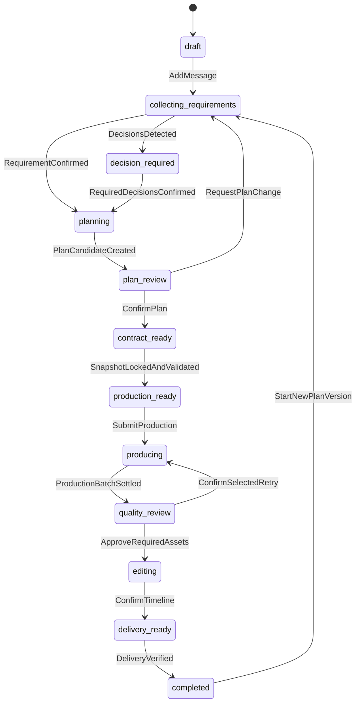
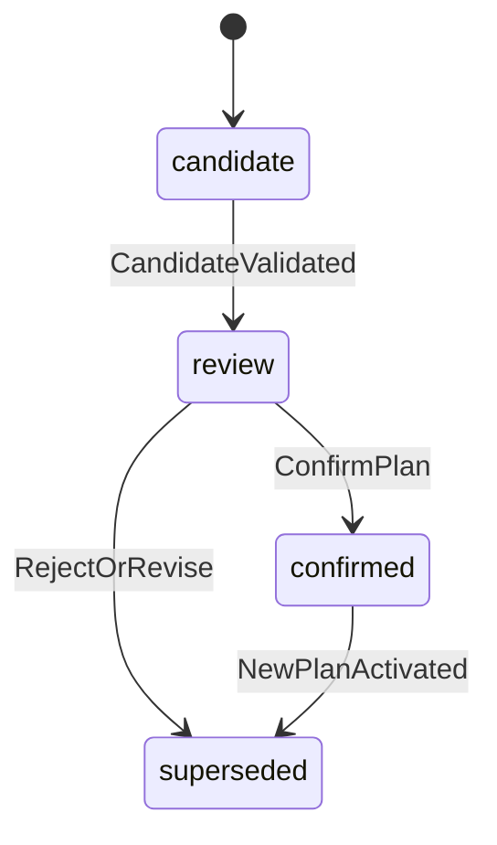
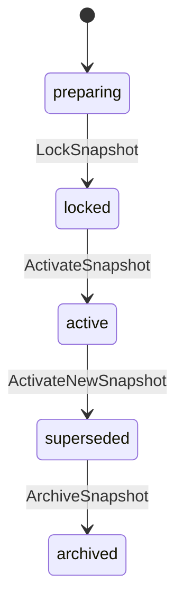
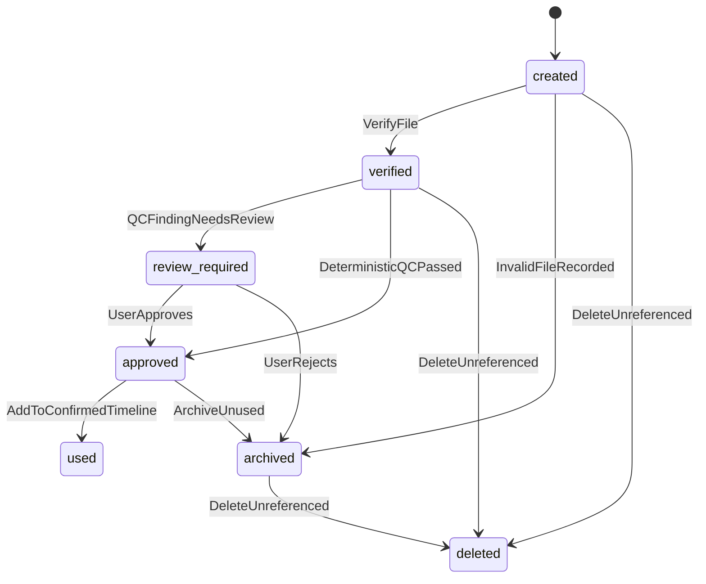
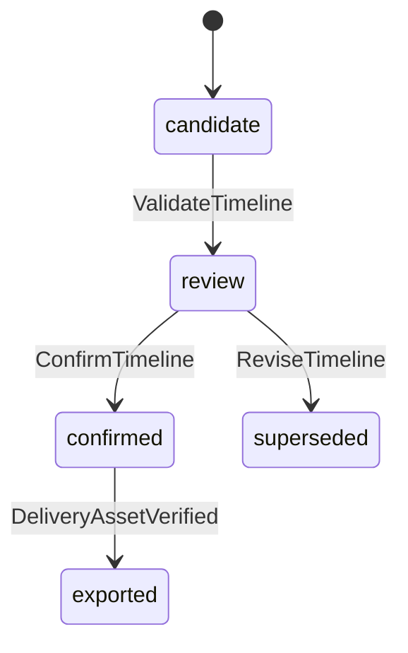
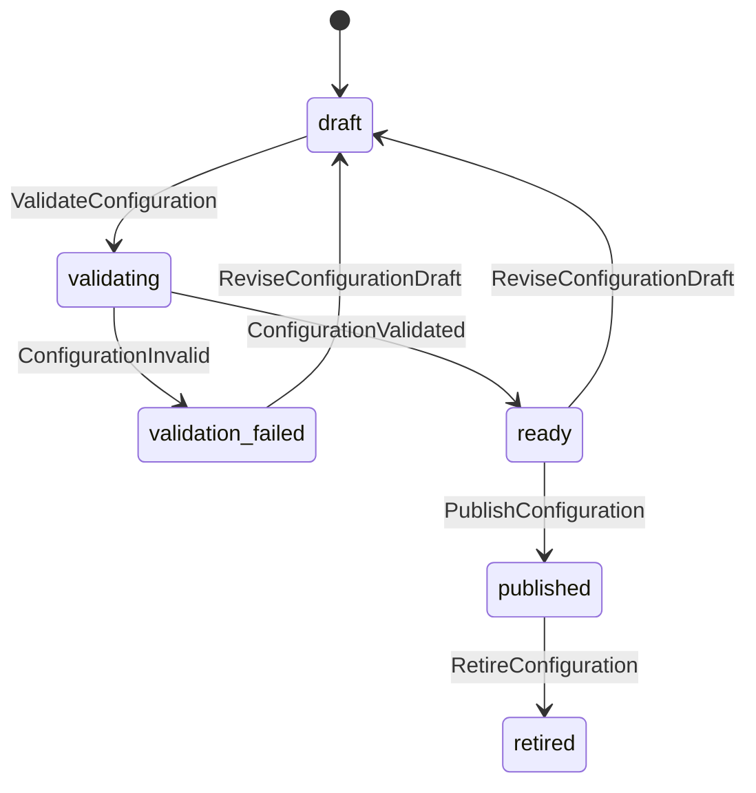

# 片场 V2 状态机与事件系统设计

> 状态：设计基线
> 版本：0.4
> 更新日期：2026-07-16
> 上位文档：[V2 产品设计文档](./V2_PRODUCT_DESIGN.md)
> 配套文档：[V2 数据模型设计](./V2_DATA_MODEL_DESIGN.md)

## 1. 目标

本文定义项目、工作项、素材、方案、快照、质量审核与交付的状态语义，以及驱动状态变化的命令、守卫和持久事件。

核心约束：

- 状态变化必须源于显式命令或已验证事实。
- Worker 只能报告工作事实，不能直接宣称项目完成。
- 项目状态由活动方案和活动快照的持久事实计算。
- 阻断、恢复、取消和用户重做都必须有事件证据。
- 不自动重试、不替换工作流、不降级供应商、不修复输出。

## 2. 状态职责

| 聚合 | 状态所有者 | 禁止行为 |
|---|---|---|
| Project | ProjectStateTransitioner + 显式项目命令/已验证事实 | Worker、应用服务或前端直接赋值 `status` |
| PlanVersion | PlanApplicationService | Agent 直接确认方案 |
| ProductionSnapshot | SnapshotService | 锁定后修改合同 |
| WorkItem / WorkAttempt | WorkOrchestrator | 供应商回调直接改项目状态 |
| Asset | AssetService | 仅凭 URI 标记文件可用 |
| QCReport | QualityService + 用户审核命令 | 检测器替用户做主观通过决定 |
| Timeline / Delivery | EditorService / DeliveryService | 最终文件不存在时完成项目 |

## 3. 项目状态机

### 3.1 状态定义

```text
draft                    项目已创建，尚无可确认需求
collecting_requirements  正在形成新的需求版本
decision_required        存在必须由用户处理的决策
planning                 正在形成方案候选
plan_review              方案候选等待用户确认
contract_ready           已确认方案，生产合同待冻结或验证
production_ready         活动快照已锁定且生产前检查通过
producing                活动快照存在运行中或待执行生产工作
quality_review           生产素材需要人工审核或确定性问题处理
editing                   正在生成或确认时间线
delivery_ready           时间线已确认，可执行最终导出
completed                最终交付文件存在且验证通过
blocked                  确定性问题阻止当前阶段继续
cancelled                用户明确取消项目
```

`failed` 不作为项目终态。具体失败属于工作尝试、素材验证或交付尝试；项目根据是否仍有合法用户动作进入 `blocked` 或相应审核状态。

### 3.2 主流程



任一非终态可因确定性守卫失败进入 `blocked`；任一非 `completed` 状态可由用户取消。图中省略这些公共边，具体规则见下表。

### 3.3 项目转移矩阵

| 来源 | 命令/事实 | Actor | 守卫 | 目标 | 事件 |
|---|---|---|---|---|---|
| `draft` | `AddMessage` | user | 消息有效持久化 | `collecting_requirements` | `message.added.v1`, `project.state_changed.v1` |
| `collecting_requirements` | `ConfirmRequirement` | user | 需求候选有效；无高/中风险待决策 | `planning` | `requirement.confirmed.v1` |
| `collecting_requirements` | `DecisionsDetected` | system | 存在待用户处理决策 | `decision_required` | `decision.requested.v1` |
| `decision_required` | `ResolveDecisionSet` | user | 所有阻断决策已确认或拒绝 | `planning` | `decision.resolved.v1`, `project.state_changed.v1` |
| `planning` | `SubmitPlanCandidate` | agent | 候选通过 Schema，输入版本仍有效 | `plan_review` | `plan.candidate_created.v1` |
| `plan_review` | `ConfirmPlan` | user | 无未解决高/中风险决策；影响和费用可见 | `contract_ready` | `plan.confirmed.v1` |
| `plan_review` | `RequestPlanChange` | user | 变更请求已记录 | `collecting_requirements` | `plan.change_requested.v1` |
| `contract_ready` | `LockSnapshot` | user/system | 合同、引用、配置和成本预估验证通过 | `production_ready` | `snapshot.locked.v1` |
| `production_ready` | `SubmitProduction` | user | 付费范围已确认；快照仍为活动版本 | `producing` | `production.submitted.v1` |
| `producing` | `EvaluateProduction` | system | 当前批次无 queued/running；素材事实已落库 | `quality_review` | `production.batch_settled.v1` |
| `quality_review` | `ConfirmSelectedRetry` | user | 精确工作项、影响范围和预计费用已确认 | `producing` | `work.retry_requested.v1` |
| `quality_review` | `ApproveRequiredAssets` | user | 剪辑所需素材均 approved；无确定性阻断 | `editing` | `quality.stage_approved.v1` |
| `editing` | `ConfirmTimeline` | user | 引用、时长、规格验证通过 | `delivery_ready` | `timeline.confirmed.v1` |
| `delivery_ready` | `VerifyDelivery` | system | 最终文件存在、可读、哈希与规格有效 | `completed` | `delivery.verified.v1`, `project.completed.v1` |
| `completed` | `StartNewPlanVersion` | user | 保留旧交付和审计链 | `collecting_requirements` | `plan.revision_started.v1` |
| 任一非终态 | `BlockProject` | system | 存在确定性、不可继续的问题 | `blocked` | `project.blocked.v1` |
| `blocked` | `ResolveBlock` | user/system | 原状态守卫重新评估通过 | 动态返回所记录的原状态 | `project.block_resolved.v1` |
| 任一非 `completed` | `CancelProject` | user | 明确确认取消影响 | `cancelled` | `project.cancelled.v1` |

### 3.4 Blocked 语义

进入 `blocked` 时必须持久化：

```text
blocked_from_state
reason_code
responsible_aggregate_type / id
allowed_commands[]
blocked_at
```

解除阻断不是“继续运行”按钮的别名。`ResolveBlock` 必须重新执行原目标状态守卫；通过后只回到 `blocked_from_state`，再由显式命令推进。若守卫仍失败，保留 `blocked` 并追加新的诊断事件。

项目阻断不触发自动重试或合同修改。

### 3.5 当前转移器实现边界

Sprint 31 已实现 `orchestration/project_transitions.py`：所有当前应用服务和 Worker 的 Project 状态写入均使用枚举触发器，经 `ProjectStateRepository` 按 `status + row_version` 原子更新，并与 `project.state_changed.v1` 或 `project.blocked.v1` 在同一调用方事务提交。

Creative Brief 生成命令自身具备需求完整性和 pending Decision 守卫，因此初始需求已经完整的项目可从 `draft/collecting_requirements` 直接进入 `plan_review`。最后一个 Decision 解决时，决策服务先明确判断活动需求是否完整，再提交进入 `planning` 或返回 `collecting_requirements` 的不同触发器；转移器不读取需求并自行决定。

首次 blocked 冻结 `blocked_from_state`、`state_reason_code`、责任聚合、允许命令和时间。后续阻断只追加 `project.block_diagnostic.v1`，不能覆盖首次证据。

当前实现尚未开放矩阵中的 `ResolveBlock`、`CancelProject`、`StartNewPlanVersion` 和 `ConfirmSelectedRetry`。这些设计行仍是目标合同，不代表 API 已实现。旧 `/confirm -> /queue` 本地合同验证使用独立 `legacy_*` 触发器，不属于正式生产状态链。

## 4. 活动版本与迟到结果

项目同时只能有一个 `active_plan_version_id` 和一个 `active_snapshot_id`，历史快照可继续展示或完成正在进行的供应商对账。

规则：

1. 新快照激活后，旧快照标记 `superseded`。
2. 旧快照的供应商结果仍按原工作尝试入库并产生事件。
3. 状态评估器只读取活动快照事实；旧快照迟到成功不能推进项目。
4. 旧快照迟到失败不会把新快照项目设为 `blocked`，但会产生带快照 ID 的诊断事件。
5. 用户希望采用旧结果时，必须通过明确的素材选用/方案变更命令建立新引用，不能自动搬运。

## 5. 方案与快照生命周期

### 5.1 PlanVersion



`confirmed` 内容不可变。方案确认只代表创意合同被接受，不代表生产素材就绪。

### 5.2 ProductionSnapshot



快照锁定守卫包括：所有 ID 精确解析、DAG 无环、输出规格有效、系统槽位显式存在、音频关闭时无 TTS 节点、预计成本已计算。任一失败进入项目 `blocked`，不补字段或替换配置。

影响分析确认可以创建不可修改的 `preparing` 快照，以冻结选择并生成可审计 DAG；这不等同于锁定或激活。若 `cost_status=not_configured`，快照必须保留 `COST_ESTIMATE_REQUIRED`，且禁止创建 WorkItem。`preparing -> locked` 仍要求价格目录、实际预计成本和独立费用确认全部存在。

锁定命令必须验证快照仍为 `preparing`、合同哈希未变化、价格目录仍已发布且在有效期内、所有供应商节点均有精确价格规则、节点金额合计等于快照总额，并要求用户回传同币种的精确预计金额与高风险确认。成功后转为 `locked / cost_status=confirmed` 并记录 `production.snapshot_locked.v1`；不激活快照、不创建 WorkItem、不调用供应商。

## 6. 工作项与尝试状态机

### 6.1 WorkItem 状态

```text
queued
running
completed
review_required
blocked
cancelled
skipped
```

`WorkItem` 表达节点总体状态，`WorkAttempt` 表达一次实际执行。一个用户确认的重做创建新尝试并重新评估工作项，不覆盖旧尝试。

### 6.2 WorkAttempt 状态

```text
created
claimed
submitting
submitted
polling
succeeded
failed
cancel_requested
cancelled
reconciliation_required
```

### 6.3 尝试转移矩阵

| 来源 | 命令/事实 | Actor | 守卫 | 目标 | 事件 |
|---|---|---|---|---|---|
| `created` | `ClaimAttempt` | worker | 依赖满足；租约条件更新成功 | `claimed` | `work.attempt_claimed.v1` |
| `claimed` | `BeginSubmit` | worker | 指纹与快照仍有效 | `submitting` | `provider.submit_started.v1` |
| `submitting` | `ProviderAccepted` | adapter | 任务 ID 已持久化 | `submitted` | `provider.task_accepted.v1` |
| `submitted` | `PollProvider` | worker | 租约有效 | `polling` | `provider.poll_started.v1` |
| `polling` | `ProviderCompleted` | adapter | 响应可验证 | `succeeded` | `provider.task_completed.v1` |
| `claimed/submitting/submitted/polling` | `ExecutionFailed` | worker | 真实错误已分类 | `failed` | `work.attempt_failed.v1` |
| `submitting` | `SubmissionOutcomeUnknown` | worker | 可能已提交但任务 ID 未确认 | `reconciliation_required` | `provider.reconciliation_required.v1` |
| 非终态 | `RequestCancel` | user | 记录取消影响 | `cancel_requested` | `work.cancel_requested.v1` |
| `cancel_requested` | `ProviderCancelled` | adapter/system | 供应商或本地执行确认停止 | `cancelled` | `work.attempt_cancelled.v1` |

失败后不自动创建第二次尝试。工作项根据失败类型进入 `blocked` 或 `review_required`；只有 `ConfirmSelectedRetry` 才能创建下一尝试。

### 6.4 依赖就绪

节点可领取需要同时满足：

- 所有 `required` 父节点 `completed`，且所需输出素材已 `verified` 或 `approved`
- 当前快照为活动快照，或命令明确允许完成历史对账
- 工作项为 `queued` 且 `available_at` 已到
- 不存在有效执行租约
- 用户已确认本批付费范围

`optional` 父节点失败不阻断，但不会自动注入其他素材。`informational` 边不参与领取。

## 7. Worker 崩溃与幂等

### 7.1 供应商提交前崩溃

若尚未进入 `submitting`，租约过期后可由另一个 Worker 重新领取同一尝试。若已写 `submitting` 但没有网络提交证据，仍先进入对账流程，不直接假设未提交。

### 7.2 提交后、任务 ID 持久化前崩溃

这是重复扣费风险最高的状态。处理方式：

1. 将尝试置为 `reconciliation_required`。
2. 使用请求指纹和供应商幂等键查询；供应商不支持查询时要求人工处理。
3. 未证明原请求未提交前，不得重新提交。
4. 用户选择再次付费执行时，创建新尝试并明确展示风险。

### 7.3 供应商完成后、素材落库前崩溃

使用已持久化的 `provider_task_id` 重新获取同一结果，按内容哈希幂等创建素材。不得发起新生成请求。

### 7.4 租约

租约包含 owner、过期时间和心跳。租约过期只释放处理权，不改变业务尝试次数，也不授权付费重试。

## 8. 素材与 QC 状态

### 8.1 Asset 生命周期



确定性损坏不把无效文件标记为 `verified`，对应工作项进入 `blocked`。删除前必须通过引用检查。

### 8.2 QC 结论

```text
passed           确定性规则通过，可按合同进入 approved
review_required  身份相似度、疑似文字、构图、低动态等需要人判断
blocked          文件损坏、尺寸无效、引用缺失等确定性问题
```

`face_visibility=not_visible` 不运行正脸要求；OCR 和身份相似度默认是审核证据，不直接触发付费重试。

### 8.3 人工审核命令

| 命令 | 结果 |
|---|---|
| `ApproveAsset` | 记录审核人和依据，素材进入 `approved` |
| `RejectAsset` | 素材进入 `archived`，列出受影响下游 |
| `RequestAssetRetry` | 展示精确节点、依赖和费用，确认后创建新尝试 |
| `KeepForAlternative` | 保留素材但不进入当前时间线 |

## 9. 时间线与交付状态



导出尝试失败时项目进入 `blocked`，时间线仍保持 `confirmed`。用户处理真实错误后可明确重新导出；系统不改时间线、不关闭音频、不移除字幕来兜底。

时间线命令细化为：

```text
ApproveQualityStage: quality_review -> editing
CreateTimelineCandidate: editing -> candidate
ReviseTimelineCandidate: candidate | review | confirmed -> new candidate version
ValidateTimeline: candidate -> review | candidate(with errors)
ConfirmTimeline: review -> confirmed; Project -> delivery_ready; referenced Asset -> used
```

已有版本后禁止创建无父版本的平行候选。确认新版本时，旧 `confirmed` 版本进入 `superseded`；创建修订本身不会提前废弃仍在交付使用的确认版本。

完整守卫见 [V2 时间线剪辑合同实现](./V2_TIMELINE_EDITOR_IMPLEMENTATION.md)。

项目完成守卫：

- 当前活动快照对应的确认时间线存在
- 最终交付 `Asset` 类型为 `final_delivery`
- 文件实际存在、可读取、哈希和媒体规格验证通过
- 交付素材绑定当前项目和活动快照
- 无未解决的交付级阻断

## 10. 取消语义

- 项目取消由用户显式发起，记录影响和可能已发生费用。
- 尚未提交供应商的工作尝试直接取消。
- 已提交供应商的任务调用供应商取消能力；不支持取消时继续对账，但结果不得推进已取消项目。
- 取消不删除已生成素材、成本和事件。
- 重新开始通过新方案/快照命令完成，不把 `cancelled` 原地改回 `producing`。

## 11. 事件信封

所有领域事件使用同一结构：

```json
{
  "event_id": "evt_01",
  "event_type": "work.attempt_failed.v1",
  "aggregate_type": "work_attempt",
  "aggregate_id": "attempt_01",
  "project_id": "project_01",
  "snapshot_id": "snapshot_001",
  "sequence": 42,
  "causation_id": "cmd_01",
  "correlation_id": "flow_01",
  "actor": {
    "type": "worker",
    "id": "worker_local_01"
  },
  "occurred_at": "2026-07-15T10:00:00Z",
  "schema_version": 1,
  "payload": {
    "error_code": "PROVIDER_TIMEOUT",
    "retry_created": false
  }
}
```

字段规则：

- `sequence` 在项目内严格递增，用于 SSE 游标和顺序恢复。
- `causation_id` 指向触发当前事实的命令或事件。
- 同一用户操作、Worker 执行或供应商调用共享 `correlation_id`。
- `snapshot_id` 对非生产事件可为空。
- `payload` 使用按事件类型注册的版本化 Schema。
- 不写入密钥、完整供应商请求头或二进制内容。

## 12. 事件命名与版本

命名格式：`<domain>.<fact>.v<major>`，使用已发生事实，例如：

```text
project.state_changed.v1
decision.resolved.v1
decision.change_impact_analyzed.v1
snapshot.locked.v1
work.attempt_claimed.v1
provider.task_accepted.v1
asset.verified.v1
quality.review_required.v1
timeline.confirmed.v1
delivery.verified.v1
cost.charged.v1
```

只新增字段且旧消费者可忽略时不提升 major；删除字段、改变语义或单位时创建新 major，旧事件永久保持可读。

## 13. 事务、Outbox 与 SSE

### 13.1 写入事务

每次状态变化在一个数据库事务中完成：

1. 校验命令幂等键和聚合 `row_version`。
2. 读取并验证当前状态守卫。
3. 更新权威聚合。
4. 插入 Event/Outbox 记录并分配项目序列。
5. 提交事务。

SSE 只读取已提交事件。状态更新成功但事件缺失、或事件存在但状态未提交都不允许发生。

### 13.2 SSE 游标

- 客户端使用 `Last-Event-ID` 或 `after_sequence` 重连。
- 服务端按 `(project_id, sequence)` 返回事件。
- 心跳不进入领域事件表。
- 游标早于保留窗口时返回明确的 `resync_required`，客户端重新获取项目快照后续订。
- SSE 断开不影响 Worker 和项目状态。

### 13.3 消费者幂等

消费者记录 `(consumer_name, event_id)` 或最后处理序列。重复事件必须无副作用；不得因 SSE 重连重复创建工作项、素材、成本或通知。

## 14. 状态评估器

`ProjectStateEvaluator` 接收项目 ID，在同一活动版本范围内读取持久事实，给出目标状态和原因，不直接执行供应商调用。

优先级：

1. 用户已取消 -> `cancelled`
2. 存在当前阶段确定性阻断 -> `blocked`
3. 最终交付通过完成守卫 -> `completed`
4. 存在待用户决策 -> `decision_required`
5. 根据活动方案、快照、工作项、QC 和时间线计算主流程状态

状态评估必须可重复：相同数据库事实得到相同结果。Agent 文本中的 `all_assets_ready`、供应商页面状态和前端本地计数都不是输入事实。

## 15. 端到端事件轨迹

30 秒竖屏健身广告、音频关闭的最小轨迹：

```text
001 project.created.v1
002 message.added.v1
003 requirement.candidate_created.v1
004 decision.requested.v1              人物身份，高风险
005 decision.resolved.v1               用户确认
006 requirement.confirmed.v1
007 plan.candidate_created.v1
008 plan.confirmed.v1
009 snapshot.locked.v1                 合同中无 TTS
010 production.estimate_created.v1
011 production.submitted.v1            用户确认预计费用
012 work.attempt_claimed.v1
013 provider.task_accepted.v1
014 cost.charged.v1
015 provider.task_completed.v1
016 asset.created.v1
017 asset.verified.v1
018 quality.review_required.v1
019 asset.approved.v1                   用户审核
020 quality.stage_approved.v1
021 timeline.candidate_created.v1
022 timeline.confirmed.v1
023 delivery.export_started.v1
024 asset.created.v1                    final_delivery
025 delivery.verified.v1
026 project.completed.v1
```

若第 18 步用户不满意，系统只产生审核结论；直到用户确认费用并选择目标后才产生 `work.retry_requested.v1` 和新的 `WorkAttempt`。

## 16. 状态与事件验收

- Worker 完成一个节点不会直接把项目设为完成。
- 最终文件不存在或未验证时，`completed` 守卫失败。
- 任一阻断记录原状态、稳定原因码和允许操作。
- 解除阻断重新评估守卫，不自动继续付费生产。
- 旧快照迟到结果不会推进活动项目状态。
- API/Worker 重启后，事件序列和 SSE 游标连续可恢复。
- 供应商提交结果未知时进入对账，不重复提交。
- 失败不会自动创建新工作尝试。
- 取消后结果可审计，但不能推进项目。
- 每个状态转移都有对应持久事件，重复消费无副作用。

## 17. 系统配置状态机

### 17.1 配置版本状态

```text
draft
validating
validation_failed
ready
published
retired
```



`published` 和 `retired` 均不可编辑。修改已发布配置必须创建新草稿版本；`retired` 只禁止新快照选择，不使历史快照、工作尝试、素材或成本记录失效。

### 17.2 转移守卫

| 当前状态 | 命令 | 责任方 | 守卫 | 目标状态 | 事件 |
|---|---|---|---|---|---|
| `draft` | `ValidateConfiguration` | user/admin | 草稿 `row_version` 匹配 | `validating` | `configuration.validation_started.v1` |
| `validating` | `ConfigurationInvalid` | system | 存在确定性字段或引用错误 | `validation_failed` | `configuration.validation_failed.v1` |
| `validating` | `ConfigurationValidated` | system | 全部确定性守卫通过 | `ready` | `configuration.validated.v1` |
| `validation_failed` | `ReviseConfigurationDraft` | user/admin | 提交明确字段修改 | `draft` | `configuration.draft_revised.v1` |
| `ready` | `PublishConfiguration` | user/admin | 差异已展示；强确认字段已确认 | `published` | `configuration.published.v1` |
| `published` | `RetireConfiguration` | user/admin | 已展示引用范围 | `retired` | `configuration.retired.v1` |

发布验证至少包括：

- 所有组件引用精确存在且处于可发布或已发布状态。
- 模型用途、输入合同、输出 Schema 和 Agent 角色兼容。
- 供应商能力覆盖工作流槽位声明的操作类型。
- 工作流 NodeInfoList 的必填节点、字段路径、值来源和类型完整且无重复绑定。
- 视频规格与工作流输出尺寸、画幅、FPS 和帧数能力兼容。
- 音频关闭策略不会产生 TTS、音频注入或字幕音频依赖。
- OSS 或其他外部存储只保存可解析的凭据引用，不保存密钥原文。
- QC 结果映射只能产生 `passed`、`review_required` 或 `blocked`，不能配置自动重试。
- 执行策略不存在备用供应商、备用工作流、自动付费重试或输出修复规则。
- 成本目录的币种、单位和生效时间明确，不使用猜测价格。

### 17.3 发布与项目影响

发布配置只产生一个新的可选权威版本，不执行以下动作：

- 不修改项目当前需求、方案或决策。
- 不替换活动 ProductionSnapshot 的 `system_config_version_id`。
- 不取消、重提或迁移已有 WorkItem 和 WorkAttempt。
- 不调用供应商，不产生模型或生产费用。
- 不使旧配置生成的素材自动过期。

项目希望采用新配置时必须执行配置影响分析，展示变化的模型、供应商、工作流、媒体规格、预计调用和费用。用户确认后创建新的 ProductionSnapshot；已有快照保持不可变。

### 17.4 运行时配置错误

发布时验证成功不代表运行时外部条件永远有效。凭据过期、供应商工作流被删除、区域不可达或供应商能力变化时：

1. 当前 WorkAttempt 记录真实错误并进入 `blocked` 或 `reconciliation_required`。
2. 项目显示责任模块、配置版本、供应商槽位和原始错误摘要。
3. 系统不尝试其他凭据、模型、供应商、工作流、输出格式或本地替代路径。
4. 管理员修复配置时创建并发布新版本。
5. 项目是否改用新版本必须由用户执行影响确认和新快照命令。

### 17.5 并发与引用

- 配置草稿写命令携带 `command_id` 和 `expected_row_version`。
- 同一 `command_id` 重放返回第一次结果，不重复验证或发布。
- 发布使用唯一约束保证同一个配置集合版本只发布一次。
- 快照创建事务读取已发布配置并写入精确组件引用；发布状态在事务内变化时返回版本冲突。
- 被引用配置不能删除。停用和引用检查必须在同一事务中写入持久事件。

### 17.6 配置事件

```text
configuration.draft_created.v1
configuration.draft_revised.v1
configuration.validation_started.v1
configuration.validation_failed.v1
configuration.validated.v1
configuration.published.v1
configuration.retired.v1
configuration.impact_evaluated.v1
snapshot.configuration_selected.v1
configuration.runtime_blocked.v1
```

事件保存配置版本 ID、组件版本 ID、操作者、关联命令和必要差异摘要，不保存密钥、完整请求头、NodeInfoList 中的秘密值或供应商令牌。

### 17.7 配置验收

- 草稿存在无效组件引用时不能发布，并返回逐字段错误。
- 工作流缺少必填 NodeInfoList 映射时明确失败，不从其他版本复制。
- 发布新版本不改变已有快照的配置 ID。
- 停用被历史快照引用的版本后，历史任务仍可审计和对账。
- 音频关闭配置编译出的 DAG 不包含 TTS 节点。
- 运行时凭据失败不触发供应商、模型或工作流切换。
- 配置发布不创建 WorkItem、不调用供应商、不记录生产费用。
- 项目采用新配置前必须展示影响范围并创建新快照。

## 18. 快照激活与执行状态机

```text
locked --ActivateSnapshot--> active --SubmitProduction--> submitted
submitted --all work completed--> execution_completed
submitted --any deterministic blocker--> execution_blocked
```

守卫条件：

- 激活要求锁定快照、已确认费用、合同哈希匹配、无执行阻断，且项目没有其他活动快照。
- 激活事件不创建 WorkItem，不调用供应商，不记录 charged 成本。
- 提交要求活动快照、合同哈希匹配、金额与币种匹配、完整且无重复的 DAG 节点 ID，以及高风险提交确认。
- 提交命令重放返回第一次执行视图；不同命令 ID 不能对已经提交的快照再次编译任务。
- Required 父节点未完成时子节点不可领取；父节点 blocked 时子节点明确进入 `DEPENDENCY_BLOCKED`。
- 未连接适配器只阻断当前真实节点及其依赖，不创建替代节点、第二次尝试或隐藏路由。

新增事件：

```text
production.snapshot_activated.v1
production.submitted.v1
production.work_finished.v1
```

## 19. 素材验证与人工审核命令

```text
RegisterAttemptAsset: completed WorkAttempt + exact response hash + exact output index
VerifyAsset: created -> verified | archived(blocked evidence)
RunAssetQC: verified -> approved | review_required | archived
ApproveAsset: review_required -> approved
RejectAsset: review_required -> archived
```

守卫与事件：

- `RegisterAttemptAsset` 要求响应明确 `media_created=true`，输出类型与 DAG output contract 一致，存储适配器已连接。
- 文件验证失败不是瞬时 API 错误：系统持久化 QCReport/QCFinding，事件为 `quality.blocked.v1`，对应 WorkItem 与 Project 可见阻断。
- `RunAssetQC` 的规则集版本写入报告。尺寸与时长不符为 `blocked`；未连接主观分析器的内容为 `review_required`。
- 人工审核要求匹配最新 QCReport、Asset row_version 和非空依据；一个 QCReport 只能产生一次人工决定。
- 所有命令通过 CommandReceipt 幂等重放；命令重放不创建第二份素材、报告或决定。
- 拒绝素材不创建 WorkAttempt，不触发付费重试，不改变工作流选择。

事件：

```text
asset.created.v1
asset.verified.v1
quality.review_required.v1
quality.blocked.v1
asset.approved.v1
asset.rejected.v1
```

## 20. 最终交付状态机

```text
Project delivery_ready
  --AuthorizeDelivery--> DeliveryAttempt authorized
  --RegisterDeliveryOutput--> output_registered
  --VerifyDelivery passed--> verified + Timeline exported + Project completed
  --VerifyDelivery failed--> blocked + Project blocked
```

守卫：

- 授权要求当前活动快照精确存在一个 `confirmed` 时间线、合同哈希匹配且用户明确确认。
- 授权只创建请求清单和指纹，不执行渲染、不创建 WorkItem、WorkAttempt 或 charged CostEvent。
- 文件登记要求精确请求指纹、DeliveryAttempt `row_version`、`video/mp4` 和快照存储策略。
- 验证前再次计算当前交付清单；快照、时间线或输入素材事实变化时拒绝旧结果。
- 完成要求真实文件哈希、字节数、MP4 签名、尺寸、时长和存储策略全部通过。
- 失败后时间线保持 `confirmed`，项目进入 `blocked`；当前版本没有解除阻断或重试命令。

事件：

```text
delivery.authorized.v1
asset.created.v1
delivery.blocked.v1
delivery.verified.v1
project.completed.v1
```

命令重放通过 CommandReceipt 返回第一次结果。不同命令 ID 不能为同一时间线创建第二个交付尝试；租约、刷新、服务重启或再次上传都不是重试授权。

## 21. 项目控制台阶段投影

控制台的 `evaluated_stage` 是只读导航投影，不是第二套项目状态机。当前实现由 `orchestration/project_state.py` 中不依赖 ORM 的纯函数评估器负责。Control 服务只把精确读取的 Project、活动/最新快照、方案、工作项、素材、时间线和交付事实转换为 `ProjectStateFacts`。

投影优先级由已存在的权威记录决定：

```text
completed
delivery
editing
quality_review
production
production_preparation
planning
requirements
```

较后阶段的确定记录优先，例如已验证交付优先于历史 blocked WorkItem，确认时间线优先于生产快照。投影不消费事件、不写 Project.status，也不触发任何状态转移。

活动快照存在时是生产阶段判断的唯一快照权威；最新历史快照只能在没有活动快照时用于展示准备事实。评估器不激活历史快照，也不通过错误文本、员工输出、提示词或文件名补全输入。

`next_action` 是确定性页面导航建议，只能指向已有显式命令所在页面。它不能执行命令、代替确认、创建重试或改变费用边界。刷新控制台只重新查询数据库；不得触发 Worker、供应商轮询、状态修复或事件写入。

验收要求：

- 同一数据库事实重复查询得到相同阶段与下一步。
- `persisted_status` 与 `evaluated_stage` 同时可见，不互相覆盖。
- 阻断分类不依赖错误消息中的特殊字样。
- 不同币种成本保持分离，未确认事件只计数不计入已确认金额。
- 实际路由只展示冻结 WorkAttempt 记录，不猜测或替换供应商与工作流。
- 评估器不依赖 Session/Repository，重复输入结果相同且不修改输入事实。
- 本节实现不代表第 3 节的权威状态转移器已经完成；现有 Project.status 写入点尚未迁移。

## 22. 实体注册表查询边界

实体资产库没有独立状态机，也不产生事件。`GET /entity-registry` 和来源附件读取只投影已存在的 Entity、EntityVersion、AttachmentBinding、Shot 与 SnapshotEntityVersion 记录。

页面筛选、搜索、展开版本和选择查看项均不是命令，不能改变活动实体版本或生产合同。来源文件缺失、路径越界或不可预览只返回明确错误或显示证据，不触发文件修复、版本替换、重新上传或实体解绑。

## 23. 素材联络表查询边界

`GET /projects/{project_id}/contact-sheet` 不是命令，没有独立状态机，也不产生事件。它只投影 `Project.active_snapshot_id` 指向快照内已经持久化的 DAG、工作尝试、素材、QC、分镜和实体版本事实。

无活动快照时返回空态，不发生状态回退或历史快照替代。预览失败、输出缺口、缺少 WorkAttempt 或缺少实体来源均保持为可见证据，不触发 Worker、供应商轮询、状态修复、重试、路由替换或费用记录。
