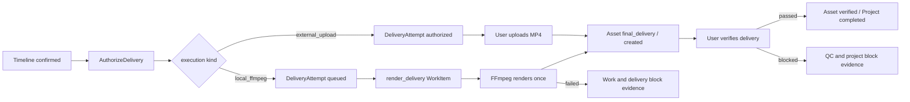

# 片场 V2 最终交付合同实现

版本：v0.2

状态：已实现

实现目录：`v2/backend/app/delivery/`、`v2/backend/app/workers/worker.py`、`v2/frontend/src/pages/EditorPage.tsx`

## 1. 范围

最终交付只消费当前活动快照中精确一个 `confirmed` 时间线。用户必须显式选择：

- `local_ffmpeg`：在本机生成 MP4。
- `external_upload`：上传已经生成的 MP4。

系统没有默认方式，不在失败后切换方式，也不创建第二次尝试。

## 2. 权威链路



## 3. 冻结请求

`v2.delivery-request.v3` 包含：

- 项目、活动快照、确认时间线和合同哈希。
- 轨道配置。
- 每个时间线项的顺序、素材 ID、URI、存储后端、内容哈希、源区间、目标区间和变换。
- 输出容器、尺寸、FPS、编码规格和项目时长。
- 交付执行合同。
- 与当前时间线合同一致的 `editor-preview-review.v1`：复核事件 ID、预览缓存键、预览文件内容哈希、质量检查代码、人工勾选、复核人和时间。

外部上传冻结 `{"kind":"external_upload"}`。本机合成额外冻结：

- `renderer_contract=v2.ffmpeg-render.v1`
- FFmpeg 可执行文件规范路径和完整版本行
- `video_encoder=libx264`
- `preset=medium`
- `crf=18`

清单使用稳定 JSON 序列化计算 SHA-256。创建时间和临时文件不进入指纹。

## 4. 本机合成

授权前必须通过 `V2_FFMPEG_PATH` 检查：路径存在、`ffmpeg -version` 成功、编码器清单包含 `libx264`。失败时不创建 DeliveryAttempt、WorkItem 或 WorkAttempt。

首期只接受：

- 单一连续主视频轨，从 0 开始且没有空位。
- 源时长与时间线时长一致，不变速。
- `fit=cover`。
- 音频和字幕轨关闭。

授权后同事务创建一条 `render_delivery` WorkItem 和唯一 WorkAttempt。该工作项不设置生产 `snapshot_id`，快照权威只从 DeliveryAttempt 读取，因此不参与生产 DAG、图片阶段、生产列表或 ProductionSnapshot 状态汇总。

Worker 执行前重新计算完整交付请求，并复验每个本地输入文件的实际 SHA-256。随后使用 `trim + setpts + scale + crop + fps + format + concat` 生成 H.264 MP4，输出使用 `-n` 禁止覆盖。输入变化、执行环境变化或 FFmpeg 失败都会停止本次工作并保存证据；没有第二次执行。

## 5. 文件登记与验证

外部上传按 1 MiB 分块计算字节数和 SHA-256。本机生成完成后同样计算输出事实。两条路径都只登记 `state=created` 的 `final_delivery` Asset，不自动验证或完成项目。

用户验证时后端重新打开文件并检查：

1. 实际 SHA-256 和字节数与登记事实一致。
2. 文件头包含有效 MP4 `ftyp`。
3. 宽度、高度和时长符合冻结输出规格。
4. MIME 和大小符合快照存储策略。
5. 当前活动快照、确认时间线、全部输入素材与冻结请求一致。

通过后 Asset 进入 `verified`、Timeline 进入 `exported`、Project 进入 `completed`。

## 6. 失败语义

FFmpeg 执行失败会：

- 将唯一 WorkItem/WorkAttempt 标记为 blocked。
- 将 DeliveryAttempt 和 Project 标记为 blocked。
- 保存错误码、FFmpeg 返回码及 stdout/stderr 尾部证据。
- 保留确认时间线和全部输入素材。

交付验证失败会创建 `v2.delivery-file-contract.v1` QCReport/QCFinding，并归档失败输出。

两类失败都不会自动重试、补素材、修改时间线、切换 Provider、切换 `external_upload`、覆盖目标文件或创建第二个 DeliveryAttempt。

## 7. API

```text
GET  /api/v1/projects/{project_id}/delivery-workspace
POST /api/v1/projects/{project_id}/deliveries:authorize
POST /api/v1/projects/{project_id}/delivery-attempts/{attempt_id}/output
POST /api/v1/projects/{project_id}/delivery-attempts/{attempt_id}:verify
GET  /api/v1/projects/{project_id}/assets/{asset_id}/content
```

`delivery-workspace` 返回两种交付方式的可用性、不可用原因和本机渲染器版本。

新版 `/editor-prototype` 在保存精确预览复核并显式确认时间线后读取同一 DeliveryWorkspace，展示 `local_ffmpeg / external_upload` 两种方式并调用既有授权接口。前端不会默认选择方式；授权前重新读取确认时间线和同合同复核，失败不自动重试或切换。授权后继续复用同一投影：本机 `queued / rendering` 期间轮询状态；外部 `authorized` 时选择并上传 MP4；`output_registered` 时显式验证；`blocked` 显示结构化证据；`verified` 时通过 Asset 内容接口下载。各步骤仍由下述独立交付命令负责。

## 8. 验收

- 未选择方式或未确认授权时不能创建 DeliveryAttempt。
- 未配置 FFmpeg 时在授权前失败，不创建交付或工作记录。
- 本机合成必须由用户显式选择，并且只执行一次。
- 输入文件哈希变化时不启动渲染器，保存确定性阻断证据。
- 成功只登记待验证 Asset，不自动完成项目。
- `render_delivery` 不改变 ProductionSnapshot 的生产汇总状态。
- 失败不创建第二次 WorkAttempt，不切换外部上传。
- 外部上传现有链路继续通过。
