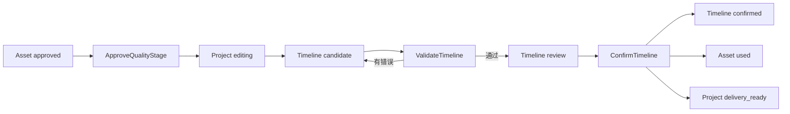

# 片场 V2 时间线剪辑合同实现

版本：v0.2

状态：已实现
实现目录：`v2/backend/app/editor/`、`v2/frontend/src/pages/EditorPage.tsx`

## 1. 目标与边界

剪辑台负责素材取舍和交付前的时间线合同，不实现完整非线性编辑器；可生成无交付副作用的本机低清预览缓存，正式媒体导出仍属于独立交付模块。

本阶段实现：

- 当前活动快照的质量阶段显式放行。
- 主视频、音频和字幕轨道合同。
- 审核通过素材的精确引用。
- 素材源入点、源出点、时间线入点和时间线出点。
- 显式空位、轨道开关、版本修订和确定性校验。
- 用户确认后形成不可变时间线权威版本。
- 引用素材进入 `used`，项目进入 `delivery_ready`。

本阶段不把低清预览登记为媒体导出或正式成片，也不实现自动补空位、自动变速、自动裁切、素材 ID 猜测、跨快照复用、自动重试或供应商调用。

## 2. 权威链路



员工或前端只能提交候选。只有显式命令能够推进权威状态。

## 3. 数据模型

### 3.1 Timeline

```text
id, project_id, snapshot_id, version_number
supersedes_timeline_id nullable
status: candidate | review | confirmed | exported | superseded
source: user | editor_assistant
source_agent_run_id nullable
output_spec, track_config, validation_report
contract_hash nullable, row_version
created_by, created_at, validated_at, confirmed_at
```

约束：

- `(project_id, version_number)` 唯一。
- 首个候选使用创建命令；已有版本后必须从指定版本修订。
- `editor_assistant` 来源必须绑定同项目、角色为 `editor`、状态为 `completed` 的 AgentRun。
- `confirmed` 内容不可原地修改。
- 新确认版本会把此前 `confirmed` 版本标记为 `superseded`。

### 3.2 TimelineItem

```text
id, timeline_id
track_type: main_video | audio | subtitle
sequence_number, asset_id nullable
label, gap_reason nullable
source_in_ms nullable, source_out_ms nullable
timeline_in_ms, timeline_out_ms
transform, created_at
```

`asset_id=null` 表示用户明确保留的空位，不代表系统可以自行补素材。空位可保存为候选，但不能通过校验。

## 4. 命令

| 命令 | 前置条件 | 结果 |
|---|---|---|
| `ApproveQualityStage` | 项目为 `quality_review`；当前快照全部必需媒体节点有 `approved/used` 素材 | 项目进入 `editing` |
| `CreateTimelineCandidate` | 项目为 `editing/delivery_ready`；当前项目没有时间线版本 | 创建 `candidate` |
| `ReviseTimelineCandidate` | 指定版本属于当前快照且行版本匹配 | 创建下一版本；不修改确认版本内容 |
| `ValidateTimeline` | 状态为 `candidate`；行版本匹配 | 通过后进入 `review`，失败仍为 `candidate` |
| `ConfirmTimeline` | 状态为 `review`；合同哈希和行版本匹配；用户明确确认 | 时间线 `confirmed`，素材 `used`，项目 `delivery_ready` |

所有写命令使用 `CommandReceipt` 幂等。相同命令 ID 不能用于另一命令类型。

## 5. 确定性校验

校验器不改写候选，仅返回结构化错误：

| 错误码 | 条件 |
|---|---|
| `TIMELINE_GAP_UNRESOLVED` | 时间线仍有 `asset_id=null` 的显式空位 |
| `TIMELINE_GAP_REASON_REQUIRED` | 空位没有记录原因 |
| `TIMELINE_ASSET_NOT_FOUND` | 精确素材 ID 不存在 |
| `TIMELINE_ASSET_PROJECT_MISMATCH` | 素材属于其他项目 |
| `TIMELINE_ASSET_SNAPSHOT_MISMATCH` | 素材不属于当前时间线快照 |
| `TIMELINE_ASSET_NOT_APPROVED` | 素材状态不是 `approved/used` |
| `TIMELINE_ASSET_TYPE_MISMATCH` | 素材放入错误轨道 |
| `SOURCE_RANGE_INVALID` | 源区间缺失或无效 |
| `SOURCE_RANGE_EXCEEDS_ASSET` | 源出点超过素材真实时长 |
| `ASSET_DURATION_UNKNOWN` | 视频或音频没有已验证时长 |
| `TIMELINE_SPEED_CHANGE_UNDECLARED` | 源区间和时间线区间不等长 |
| `TIMELINE_ITEMS_OVERLAP` | 同一轨道片段重叠 |
| `MAIN_VIDEO_TRACK_GAP` | 主视频轨有未声明时间空洞 |
| `MAIN_VIDEO_DURATION_INCOMPLETE` | 主视频轨未覆盖完整输出时长 |
| `TIMELINE_OUTPUT_OVERRUN` | 片段超出项目输出时长 |
| `AUDIO_TRACK_DISABLED` | 关闭音频时仍提交音频片段 |
| `SUBTITLE_TRACK_DISABLED` | 关闭字幕时仍提交字幕片段 |
| `AUDIO_TRACK_EMPTY` | 启用音频但没有音频片段 |
| `SUBTITLE_TRACK_EMPTY` | 启用字幕但没有字幕片段 |

首期不支持隐式变速。后续如增加变速，必须引入明确速度字段和新合同版本。

## 6. API

```text
GET  /api/v1/projects/{project_id}/editor-workspace
POST /api/v1/projects/{project_id}/quality-stage:approve
POST /api/v1/projects/{project_id}/timeline-candidates
POST /api/v1/projects/{project_id}/timelines/{timeline_id}:revise
POST /api/v1/projects/{project_id}/timelines/{timeline_id}:validate
POST /api/v1/projects/{project_id}/timelines/{timeline_id}:render-preview
GET  /api/v1/projects/{project_id}/timelines/{timeline_id}/previews/{preview_key}/content
POST /api/v1/projects/{project_id}/timelines/{timeline_id}:confirm
```

`editor-workspace` 返回项目状态、活动快照、输出时长、质量缺口、可用素材、全部时间线版本和唯一下一步操作。

## 7. 前端剪辑台

剪辑台按原型实现：可编辑项目列表、输出摘要、质量阶段确认门、预览监视器、批准素材箱、三类轨道、显式空位、四个时间字段、版本历史、校验结果、修订和合同确认。

前端排序和时间输入只是候选编辑状态。只有提交成功的版本具有数据库权威性。

新版 `/editor-prototype` 另提供 `editor-preview.v1` 低清预渲染。它只读取已保存 Timeline，不消费浏览器未提交草稿；服务复验行版本、合同哈希、时间线校验、本机渲染合同、输入文件哈希以及缓存 MP4 的格式/尺寸/时长。合法版本按项目画幅生成长边 640、最高 24fps 的本机缓存；该缓存不是 Asset，不创建 DeliveryAttempt、WorkItem、CostEvent，不确认时间线或改变项目状态。

生成或读取合法缓存时返回 `editor-preview-qc.v1`。报告用冻结 FFmpeg 执行持续黑画面检测；启用声音时复用 EBU R128 实测并检查综合响度、true peak 和音轨实际结束时间；启用字幕时记录烧录成功但保留文字、换行、遮挡和安全区人工复核。视觉连续性与主观音画同步始终是人工项。质量报告的技术阻断不删除预览文件或伪装成渲染失败，用户仍可观看定位问题；预览也不会因此进入正式确认或交付。

合法报告可提交 `ReviewTimelinePreview`。命令要求精确 Timeline 行版本/合同哈希、预览缓存键和预览文件内容哈希，并要求用户逐项确认视觉连续性、主观同步、启用字幕时的可读性和所有警告。服务重新运行输出与质量检查后创建 `timeline.preview_reviewed.v1`；相同命令幂等返回同一 `editor-preview-review.v1`，不创建独立可变审核表。时间线后续修订会改变合同哈希，旧事件因此不能用于新版本。正式交付 `v2.delivery-request.v3` 必须冻结匹配事件，否则授权被 `DELIVERY_PREVIEW_REVIEW_REQUIRED` 阻断。

## 8. 事件

```text
quality.stage_approved.v1
timeline.candidate_created.v1
timeline.validated.v1
timeline.validation_failed.v1
timeline.confirmed.v1
```

## 9. 迁移与索引

Alembic 修订：`20260716_09`。

核心索引覆盖项目、快照、状态、合同哈希、来源 AgentRun、时间线项、素材引用和轨道类型。

## 10. 验收矩阵

- 缺少任一必需批准素材时不能进入剪辑。
- 相同命令重放不创建第二份时间线。
- 未批准、跨项目或跨快照素材不能通过校验。
- 显式空位、源区间越界、轨道重叠和输出时长不足不能确认。
- 合同哈希或行版本变化后确认失败。
- 音频关闭时不能提交音频片段。
- 确认后引用素材进入 `used`，项目进入 `delivery_ready`。
- 修订创建新版本，旧确认版本内容不变。
- 全流程不创建 WorkAttempt，不调用供应商，不产生 CostEvent。
- 合法预览的新生成与缓存读取都返回质量报告；启用音轨但分析失败、响度/峰值越限或音画时长偏差超过 250ms 时报告阻断。
- 持续黑画面只形成警告；字幕可读性、视觉连续性和主观音画同步保持人工复核，不自动批准。
- 缺少人工勾选、预览哈希变化或技术阻断时不能创建复核事件；相同命令重放不创建第二条事件。
- 未冻结同一时间线合同的 `editor-preview-review.v1` 时不能授权正式交付；交付清单重建继续复验原 review ID。

## 11. 后续接口

交付模块只能读取当前活动快照的 `confirmed` 时间线。导出必须另建 `DeliveryAttempt`，并在最终文件登记、验证和规格检查通过后创建 `final_delivery` Asset。导出失败不得修改时间线、移除音频、关闭字幕或替换素材。
