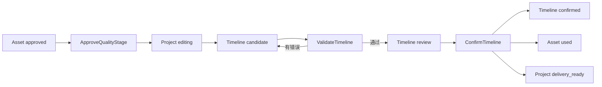

# 片场 V2 时间线剪辑合同实现

版本：v0.2

状态：已实现
实现目录：`v2/backend/app/editor/`、`v2/frontend/src/pages/EditorPage.tsx`

## 1. 目标与边界

剪辑台负责素材取舍和交付前的时间线合同，不实现完整非线性编辑器；可生成无交付副作用的本机低清预览缓存，正式媒体导出仍属于独立交付模块。

本阶段实现：

- 当前活动快照的质量阶段显式放行。
- 主视频、音频和字幕轨道合同。
- 审核通过素材的精确引用。
- 素材源入点、源出点、时间线入点和时间线出点。
- 显式空位、轨道开关、版本修订和确定性校验。
- 用户确认后形成不可变时间线权威版本。
- 引用素材进入 `used`，项目进入 `delivery_ready`。

本阶段不把低清预览登记为媒体导出或正式成片，也不实现自动补空位、自动变速、自动裁切、素材 ID 猜测、跨快照复用、自动重试或供应商调用。

## 2. 权威链路



员工或前端只能提交候选。只有显式命令能够推进权威状态。

## 3. 数据模型

### 3.1 Timeline

```text
id, project_id, snapshot_id, version_number
supersedes_timeline_id nullable
status: candidate | review | confirmed | exported | superseded
source: user | editor_assistant
source_agent_run_id nullable
output_spec, track_config, validation_report
contract_hash nullable, row_version
created_by, created_at, validated_at, confirmed_at
```

约束：

- `(project_id, version_number)` 唯一。
- 首个候选使用创建命令；已有版本后必须从指定版本修订。
- `editor_assistant` 来源必须绑定同项目、角色为 `editor`、状态为 `completed` 的 AgentRun。
- `confirmed` 内容不可原地修改。
- 新确认版本会把此前 `confirmed` 版本标记为 `superseded`。

### 3.2 TimelineItem

```text
id, timeline_id
track_type: main_video | audio | subtitle
sequence_number, asset_id nullable
label, gap_reason nullable
source_in_ms nullable, source_out_ms nullable
timeline_in_ms, timeline_out_ms
transform, created_at
```

`asset_id=null` 表示用户明确保留的空位，不代表系统可以自行补素材。空位可保存为候选，但不能通过校验。

## 4. 命令

| 命令 | 前置条件 | 结果 |
|---|---|---|
| `ApproveQualityStage` | 项目为 `quality_review`；当前快照全部必需媒体节点有 `approved/used` 素材 | 项目进入 `editing` |
| `CreateTimelineCandidate` | 项目为 `editing/delivery_ready`；当前项目没有时间线版本 | 创建 `candidate` |
| `ReviseTimelineCandidate` | 指定版本属于当前快照且行版本匹配 | 创建下一版本；不修改确认版本内容 |
| `ValidateTimeline` | 状态为 `candidate`；行版本匹配 | 通过后进入 `review`，失败仍为 `candidate` |
| `ConfirmTimeline` | 状态为 `review`；合同哈希和行版本匹配；用户明确确认 | 时间线 `confirmed`，素材 `used`，项目 `delivery_ready` |

所有写命令使用 `CommandReceipt` 幂等。相同命令 ID 不能用于另一命令类型。

## 5. 确定性校验

校验器不改写候选，仅返回结构化错误：

| 错误码 | 条件 |
|---|---|
| `TIMELINE_GAP_UNRESOLVED` | 时间线仍有 `asset_id=null` 的显式空位 |
| `TIMELINE_GAP_REASON_REQUIRED` | 空位没有记录原因 |
| `TIMELINE_ASSET_NOT_FOUND` | 精确素材 ID 不存在 |
| `TIMELINE_ASSET_PROJECT_MISMATCH` | 素材属于其他项目 |
| `TIMELINE_ASSET_SNAPSHOT_MISMATCH` | 素材不属于当前时间线快照 |
| `TIMELINE_ASSET_NOT_APPROVED` | 素材状态不是 `approved/used` |
| `TIMELINE_ASSET_TYPE_MISMATCH` | 素材放入错误轨道 |
| `SOURCE_RANGE_INVALID` | 源区间缺失或无效 |
| `SOURCE_RANGE_EXCEEDS_ASSET` | 源出点超过素材真实时长 |
| `ASSET_DURATION_UNKNOWN` | 视频或音频没有已验证时长 |
| `TIMELINE_SPEED_CHANGE_UNDECLARED` | 源区间和时间线区间不等长 |
| `TIMELINE_ITEMS_OVERLAP` | 同一轨道片段重叠 |
| `MAIN_VIDEO_TRACK_GAP` | 主视频轨有未声明时间空洞 |
| `MAIN_VIDEO_DURATION_INCOMPLETE` | 主视频轨未覆盖完整输出时长 |
| `TIMELINE_OUTPUT_OVERRUN` | 片段超出项目输出时长 |
| `AUDIO_TRACK_DISABLED` | 关闭音频时仍提交音频片段 |
| `SUBTITLE_TRACK_DISABLED` | 关闭字幕时仍提交字幕片段 |
| `AUDIO_TRACK_EMPTY` | 启用音频但没有音频片段 |
| `SUBTITLE_TRACK_EMPTY` | 启用字幕但没有字幕片段 |

首期不支持隐式变速。后续如增加变速，必须引入明确速度字段和新合同版本。

## 6. API

```text
GET  /api/v1/projects/{project_id}/editor-workspace
POST /api/v1/projects/{project_id}/quality-stage:approve
POST /api/v1/projects/{project_id}/timeline-candidates
POST /api/v1/projects/{project_id}/timelines/{timeline_id}:revise
POST /api/v1/projects/{project_id}/timelines/{timeline_id}:validate
POST /api/v1/projects/{project_id}/timelines/{timeline_id}:render-preview
GET  /api/v1/projects/{project_id}/timelines/{timeline_id}/previews/{preview_key}/content
POST /api/v1/projects/{project_id}/timelines/{timeline_id}:confirm
```

`editor-workspace` 返回项目状态、活动快照、输出时长、质量缺口、可用素材、全部时间线版本和唯一下一步操作。

## 7. 前端剪辑台

剪辑台按原型实现：可编辑项目列表、输出摘要、质量阶段确认门、预览监视器、批准素材箱、三类轨道、显式空位、四个时间字段、版本历史、校验结果、修订和合同确认。

前端排序和时间输入只是候选编辑状态。只有提交成功的版本具有数据库权威性。

新版 `/editor-prototype` 另提供 `editor-preview.v1` 低清预渲染。它只读取已保存 Timeline，不消费浏览器未提交草稿；服务复验行版本、合同哈希、时间线校验、本机渲染合同、输入文件哈希以及缓存 MP4 的格式/尺寸/时长。合法版本按项目画幅生成长边 640、最高 24fps 的本机缓存；首次生成写入按命令隔离的临时 MP4，验证与质量探测完成后原子替换确定性缓存，异常始终清理临时文件。页面生成和重检期间禁用重复提交。该缓存不是 Asset，不创建 DeliveryAttempt、WorkItem、CostEvent，不确认时间线或改变项目状态。

人工复核成功回调必须等待 `editor-prototype-workspace / editor-workspace / editor-prototype-delivery / delivery-workspace` 四类查询完成失效与活动重取，随后才把本地 `previewReviewSaved` 置为真。复核 mutation 进行中，缓存重检和时间线确认保持禁用；因此同一预览刚保存复核时不会被闭包中陈旧的 `sourceTimeline.preview_review` 重新清空。

确认成功后读取 `deliveryWorkspace.refetch()` 的权威结果：已存在 Attempt 时打开交付状态，否则才打开方式授权。授权、外部上传登记和显式验证的成功响应都是完整 DeliveryAttempt；页面先按 Attempt ID 更新 `editor-prototype-delivery / delivery-workspace` 两套缓存，再失效重取。因此弹窗打开时不会先显示旧的“等待授权/等待上传/等待验证”动作，也不会因跨窗口已授权而引导重复提交。

监看时间码从 Timeline `output_spec.fps` 计算，分割与裁切按冻结 `snap_enabled + snap_interval_ms` 磁吸。磁吸开关与缩放同样进入本地草稿，刷新可恢复；保存并检查时两者均写入新的不可变 Timeline 修订，丢弃草稿或切换基线会恢复服务端值并停止当前播放。主画面连续播放以 `source_out_ms` 为片段推进门限，并以当前媒体元素匹配的结束事件兜底；切片时按 TimelineItem ID 重新挂载视频，避免同 Asset 多片段沿用错误源时点。显式空位不启动媒体播放。

暂停定位由 `seekTimeline(positionMs)` 统一处理预览拖动条、时间线背景和首尾跳转：目标时点先解析覆盖的主画面条目（终点允许匹配同终点空位），再原子更新选择、播放头和暂停状态。暂停视频 effect 与 `loadedmetadata` 都按 `source_in + timeline offset` 计算同一源时点，并限制到冻结源出点，避免新视频元素晚加载后重置到源入点。时间尺从 `durationMs / timelineZoom` 派生刻度步长，强制追加非整步终点；首标签不左移、末标签左移自身宽度，保证边界内完整显示。

真实咖啡 v4 浏览器验收在约 9.958 秒定位到 SH-003，暂停源时点 0.547 秒，与 9.418 秒片段入点的差值一致；结尾选择 873ms 显式空位，开头恢复 SH-002/0 秒。15 秒、60px/s 刻度为 `00:00, 00:02, …, 00:14, 00:15`，末标签右边界为 1280px，页面没有横向或纵向溢出。

`beginScrub` 为预览拖动条与时间尺共用指针会话：pointer down 先聚焦 slider，再按初始边界把移动位置映射为成片毫秒；pointer up/cancel 统一移除全局监听。时间尺拖动期间用 ref 暂停自动居中，避免滚动改变指针映射；预览拖动、键盘定位和正常播放则由 viewport effect 在播放头越界时居中。`handleSeekKeyDown` 以真实 fps 计算单帧步长，并提供秒级、五秒和首尾跳转。缩放 range 与 ±20px/s 按钮统一走 `changeTimelineZoom`，限制 40–180px/s 并标记本地草稿。每次缩放前记录 `播放头画布位置 - viewport.scrollLeft`，新宽度提交后按同一锚点反算滚动位置，并把锚点限制在 24px 视口安全边界内。`fitTimelineToViewport` 从 `viewport.clientWidth - 84px 轨道头 - 12px 安全边距` 与总时长计算 px/s；按钮与 `\` 快捷键调用同一函数并回到起点，窗口过窄时停在 40px/s 并保留横向滚动。计算结果等于当前缩放时直接复位 `scrollLeft`，清除待处理锚点且不调用 `setDirty`。刷新从 `editor-local-draft.v2.timeline_zoom` 恢复，丢弃草稿恢复服务端 `track_config.pixels_per_second`。

声音片段移动由 `buildMovedAudioItems` 和 `beginAudioTrackDrag` 组成。前者从会话冻结基线按 `snap_enabled / snap_interval_ms` 计算合法入点、保持片段时长、检查同类声音重叠并按新入点重排音频 `sequence_number`；旁白与 BGM 是唯一允许的交叉重叠组合。后者使用全局 pointer move/up/cancel 会话，把片段内真实抓取偏移映射到轨道毫秒，移动时只更新内存预览，抬起后把原数组一次性压入 history，取消或未移动恢复原数组。Inspector 左右按钮与 `Alt+方向键` 调用同一确定性移动函数；普通步长为磁吸间隔，关闭磁吸时为真实 fps 单帧，Shift 固定 1000ms。真实咖啡 v4 的隔离 3 秒 WAV 从 1.2 秒按钮/键盘精调后按中心抓取拖到 6.0 秒，Inspector、播放头与撤销同步；刷新恢复草稿，1280×720 页面无横向溢出且控制台无错误。验收结束已丢弃草稿并精确删除测试 Asset/WAV，权威 Timeline v4 仍为 0 音频。

声音双侧裁切由 `buildTrimmedAudioItems`、`beginAudioTrim` 与 `handleAudioTrimKeyDown` 共用同一确定性计算。普通音频左裁切同时移动源入点与成片入点，右裁切同时移动源出点与成片出点，源/成片区间保持等长；循环 BGM 调整成片边界但不改变源循环区间，且不能短于一个源循环。所有声音片段最短 200ms。指针会话只在最终值变化时写一个撤销步骤；键盘普通步长读取磁吸间隔，关闭磁吸时按 Timeline fps 单帧，Shift 为 1000ms。`rebaseAudioEnvelope` 对新局部区间的首尾增益做线性插值，裁去区间外关键点并平移保留区间内关键点，最终强制首点为 0、尾点等于新片段时长。`refreshEnabledDucking` 在声音移动、裁切、用途切换和删除后，从当前旁白交集重建所有已启用 BGM 的区间；用途切换还复用同类声音重叠门禁。条目选择按稳定 Item ID 查找，避免本地数组对象重建后 `indexOf` 误选其他声音。

真实咖啡 v4 使用两条隔离 5 秒、24kHz、单声道 PCM16 WAV 验收：BGM 左裁切 1 秒得到源 `1..5s`、成片 `3..7s`，右把手裁到 6.5 秒后撤销恢复；关闭磁吸时左把手右移一帧得到源/成片入点 `00:01:01 / 00:03:01`。左右把手只点击不制造空撤销；删除相交旁白后 Ducking 从 1 区间变 0，撤销恢复 1；把重叠 BGM 改回旁白被明确阻断。刷新恢复草稿，1280×720 页面宽度保持 1280。验收后丢弃草稿并精确删除两个测试 Asset/WAV，API 恢复 3 个视频素材、Timeline v4 保持 0 音频。

`start_v2.ps1` 把进程身份纳入重启验收：旧 API/Worker 必须被成功结束且 8766 实际释放，否则脚本立即失败；本次 API/Worker 进程通过 `PassThru` 跟踪，健康响应只有在 8766 的监听 PID 精确等于本次 API PID 时才算成功。启动失败会清理本次新进程，避免旧实例继续响应 `/health` 时产生假重启记录。

真实咖啡 v4 验收把预览拖动到 10.500 秒，SH-003 源时点为 1.082 秒；方向键单步为 42ms，Shift 单步为 1000ms。180px/s 下时间线滚动范围为 2789/1056，End 后 `scrollLeft=1733` 且 15 秒播放头可见；直接拖动放大时间尺到 13.472 秒，源时点 4.054 秒，滚动位置仅保留浏览器 5px 原生焦点调整而未自动重心跳转。验收草稿随后丢弃。

画面轨写操作统一经过 `blockMainTrackEdit(item)`。锁定时 `shiftItem / reorderItem / dropAssetOnItem / startGapAssetSelection / updateSelectedTransform / splitSelected / deleteSelected / beginTrim` 都返回同一可读说明；因此即使快捷键、陈旧拖放会话或程序化事件绕过按钮禁用，也不能修改本地条目。锁按钮只改变会话预览状态；UI 同步禁用片段操作、转场控件、工具栏分割、缺口替换和裁切 slider，并把裁切 slider 移出 Tab 序列。撤销/重做不受锁定影响。

真实咖啡 v4 验收锁定 SH-002 后连续触发 Delete、S 和左把手拖动，三个视频条目与 `source_in=0 / source_out=4709` 保持不变且没有本地草稿；873ms 缺口替换入口禁用。解锁后 Inspector 操作、转场与裁切重新可用，锁定往返不改变 Timeline。

轨道监看状态完全独立于 `commitItems`。`videoTrackHidden` 通过 monitor data attribute 以 CSS 强制隐藏视频画面，同时保留 video 元素、`onTimeUpdate` 和连续切段；中央覆盖层与顶部 flag 明确区分“预览隐藏”和缺口。`audioTrackMuted` 继续在同步 effect 中设置每个时间线 audio 的 `muted`，并同步声音轨透明度；`subtitleTrackHidden` 只控制 `TimelineSubtitle` cue overlay。三个 toggle 统一写入可读 notice 与 `aria-pressed`，不进入草稿历史。

真实咖啡 v4 隐藏画面时视频 opacity 为 0，播放约 0.7 秒后源时点推进至 0.932 秒、时间码 `00:00:17`，证明隐藏没有停止时钟；恢复后 opacity=1。声音和字幕当前无条目，本轮验证其按钮、轨道和 monitor flags 往返，不创建测试素材；既有真实音频/字幕同步验收继续作为媒体执行证据。三项开关均未产生本地草稿。

`buildTrimmedItems` 从会话冻结的基线条目计算左右源边界与波纹时间线，不在 pointer move 中叠加增量。`beginTrim` 只在移动期间把派生条目放入内存预览；pointer up 检测最终值确实变化后才把原始条目压入历史、清空 future、标记 dirty，pointer cancel 或无移动恢复原数组且不产生历史。`handleTrimKeyDown` 对左右把手使用相同方向语义：右键增加对应源时点、左键减少；普通步长为 `round(1000/fps)`，Shift 为 1000ms，每次有效修改通过 `commitItems` 形成独立撤销步骤。slider 暴露源时点 `aria-valuetext` 与焦点轮廓。

真实咖啡 v4 验收中无移动点击保持零草稿；25px 左裁切按 60px/s 与 100ms 磁吸得到 400ms，并可一步撤销。24fps 左把手单帧为 42ms、Shift 为 1000ms；右把手左移一帧把 4709ms 改为 4667ms。最终丢弃草稿恢复 `0..4709ms`。

`overlayOpen / closeTopOverlay` 汇总版本、保存、检查、预览、交付授权和交付状态六类弹窗。全局 keydown 先处理 Escape，再在任一 overlay 打开时直接返回；无 overlay 时排除文本输入/contenteditable，并让按钮、链接和音视频消费自己的 Space。六类外层均声明命名 dialog 与 `aria-modal=true`。由于当前 WebView 的 CUA Space 不执行原生 button click，播放按钮另设 `handlePlayButtonKeyDown`：只处理 Space，阻止默认与冒泡后调用一次 `togglePlayback`，避免与全局或原生路径叠加。

真实咖啡 v4 在版本 dialog 内连续发送 Delete/S/Space/Ctrl+Z 后保持 3 个视频、暂停和零草稿，版本与检查 dialog 均可 Escape 关闭。播放按钮修复前焦点 Space 未暂停；修复后一次 Space 从播放切到暂停，随后 300ms 媒体时点增量为 0，再次打开 dialog 仍无快捷键穿透。

新版属性面板直接绑定 `transform.transition_in / transition_out`：`cut` 冻结 `duration_ms=0`，`fade` 默认 300ms，并按后端 `100..min(2000, clip/2)` 范围限制。变更通过 `commitItems` 进入本地草稿、50 步历史和不可变修订；主监看用播放头相对片段位置计算淡入/淡出 opacity，低清预览与交付仍由既有 LocalFFmpegRenderer 读取同一冻结值。

浏览器验收在真实 SH-002 上将入场切为 fade：默认 0.3 秒，改为 0.5 秒后播放前 opacity=0、播放中推进到 0.427；两次撤销依次恢复 0.3 秒和 cut/0ms，监看恢复 opacity=1。渲染器 8 条测试继续覆盖 FFmpeg `fade=t=in/out` 滤镜，验收草稿最终丢弃。

监看容器以 `data-scale=fit|actual` 控制显示：fit 保持绝对居中、`max-width/max-height:100%`；actual 使用 Asset 验证宽高、取消最大尺寸并只开启容器滚动。容器 ref 同时作为 Fullscreen API 目标，`fullscreenchange` 驱动按钮状态，显式退出或拒绝都不会改写时间线和本地草稿。

真实竖屏素材验收：fit 为 `145.95×253`，actual 为 `960×1664`；actual 时容器可视区 `537×238`、内部滚动范围 `960×1664`，页面保持 1280 宽无溢出。全屏进入/退出按钮状态完成往返，控制台无错误。

素材搜索为前端只读派生状态：统一规范化输入后，对 `node_key / role / asset_type` 做包含匹配，再与媒体类型和未使用主画面 Asset 集合取交集。搜索区动态占用素材箱内部高度；清空、Escape 和零结果都不写草稿。

浏览器验收输入 `SH-003` 后只保留该素材，输入不存在关键词显示普通零结果；Escape 关闭搜索并恢复全部 3 个视频。页面尺寸仍为 1280×720，无控制台错误。

主画面轨的 Asset ID 必须唯一；`TIMELINE_VIDEO_ASSET_REUSE_NOT_ALLOWED` 会在服务端阻断通过重复镜头填补缺口。前端缺口素材选择模式同步排除已在主画面使用的 Asset，允许点击未使用候选直接替换空位；没有候选时保留空位并给出返回生产或进入需求影响分析的真实入口。

验收矩阵增加重复素材与真实空状态：API 用例构造第二个主画面条目引用首个 Asset，验证错误精确定位 `items.main_video.2` 并保留首次序号证据；咖啡项目的三个已批准视频均已使用，浏览器选择末尾缺口后素材箱只显示“没有可用的新视频”，两个跨流程入口携带精确项目 ID，页面无溢出且无控制台错误。

顶部版本证据抽屉只读列出 EditorWorkspace 返回的全部 Timeline 版本，包括状态、来源、输出规格、轨道统计、创建事实、行版本、合同哈希、校验问题和匹配预览复核。历史版本不能在原型内成为可编辑基线，避免旧合同与当前本地草稿混用。

生成或读取合法缓存时返回 `editor-preview-qc.v1`。报告用冻结 FFmpeg 执行持续黑画面检测；启用声音时复用 EBU R128 实测并检查综合响度、true peak 和音轨实际结束时间；启用字幕时记录烧录成功但保留文字、换行、遮挡和安全区人工复核。视觉连续性与主观音画同步始终是人工项。质量报告的技术阻断不删除预览文件或伪装成渲染失败，用户仍可观看定位问题；预览也不会因此进入正式确认或交付。

合法报告可提交 `ReviewTimelinePreview`。命令要求精确 Timeline 行版本/合同哈希、预览缓存键和预览文件内容哈希，并要求用户逐项确认视觉连续性、主观同步、启用字幕时的可读性和所有警告。服务重新运行输出与质量检查后创建 `timeline.preview_reviewed.v1`；相同命令幂等返回同一 `editor-preview-review.v1`，不创建独立可变审核表。时间线后续修订会改变合同哈希，旧事件因此不能用于新版本。正式交付 `v2.delivery-request.v3` 必须冻结匹配事件，否则授权被 `DELIVERY_PREVIEW_REVIEW_REQUIRED` 阻断。

Timeline 读取投影会从不可变事件中选择当前 Timeline ID 与合同哈希都匹配的最新复核，前端刷新或重新打开相同缓存时据此恢复已复核状态。预览弹窗支持结果单窗和源时间线/结果双窗；结果播放器是唯一主时钟，源窗按 `source_in_ms + preview_ms - timeline_in_ms` 定位，跨主画面条目边界后切换精确 Asset，源窗保持静音。

复核完成后，新版剪辑台继续显式调用时间线确认命令；确认成功才打开交付授权弹窗。授权前重新读取 DeliveryWorkspace，要求确认时间线与精确复核同时存在，再由用户选择 `local_ffmpeg` 或 `external_upload`。这只是把既有合同步骤编排到同一界面，不合并命令、不隐式授权、不自动重试。

授权后剪辑台复用 DeliveryWorkspace 的最新 Attempt。`queued / rendering` 仅以 3 秒间隔轮询只读状态并允许手动刷新；轮询失败立即暂停自动刷新，保留上一次成功状态并显示错误，用户点击重新连接成功后才恢复轮询。`authorized` 提供 MP4 文件选择并调用既有上传登记；`output_registered` 要求显式调用验证；两项 mutation 都在提交前重新读取 DeliveryWorkspace 并使用最新 Attempt 行版本，若 Attempt 已跨窗口或 Worker 变化则刷新 UI 并拒绝旧动作。`blocked` 主区按错误类别显示可读原因、明确不会自动重试/切换方式，并给出返回剪辑和查看时间线证据入口；错误代码与结构化 JSON 只保留在折叠证据区。`verified` 才展示探测规格和 Asset 内容下载。页面不从文件名猜状态，不在上传后自动验证，也不给阻断 Attempt 创建第二次尝试。

## 8. 事件

```text
quality.stage_approved.v1
timeline.candidate_created.v1
timeline.validated.v1
timeline.validation_failed.v1
timeline.confirmed.v1
```

## 9. 迁移与索引

Alembic 修订：`20260716_09`。

核心索引覆盖项目、快照、状态、合同哈希、来源 AgentRun、时间线项、素材引用和轨道类型。

## 10. 验收矩阵

- 缺少任一必需批准素材时不能进入剪辑。
- 相同命令重放不创建第二份时间线。
- 未批准、跨项目或跨快照素材不能通过校验。
- 显式空位、源区间越界、轨道重叠和输出时长不足不能确认。
- 合同哈希或行版本变化后确认失败。
- 音频关闭时不能提交音频片段。
- 确认后引用素材进入 `used`，项目进入 `delivery_ready`。
- 修订创建新版本，旧确认版本内容不变。
- 全流程不创建 WorkAttempt，不调用供应商，不产生 CostEvent。
- 合法预览的新生成与缓存读取都返回质量报告；启用音轨但分析失败、响度/峰值越限或音画时长偏差超过 250ms 时报告阻断。
- 持续黑画面只形成警告；字幕可读性、视觉连续性和主观音画同步保持人工复核，不自动批准。
- 缺少人工勾选、预览哈希变化或技术阻断时不能创建复核事件；相同命令重放不创建第二条事件。
- 未冻结同一时间线合同的 `editor-preview-review.v1` 时不能授权正式交付；交付清单重建继续复验原 review ID。
- 双窗结果播放头跨片段时必须切换源素材并按时间线/源入点确定性映射；刷新后相同合同复核必须恢复。
- 新版剪辑台内确认和交付授权仍是两个独立用户动作；未选择交付方式不能授权。
- 外部上传后必须停在 `output_registered` 等待显式验证；本机生成只轮询状态；只有 `verified` 才提供成片下载。
- 活动交付轮询失败必须停止自动轮询并标明当前为上次成功状态；重新连接成功后才能继续。上传和验证不得使用跨窗口陈旧 Attempt。
- 阻断主区不得直接用技术 JSON 代替用户解释；必须说明终态、不自动重试以及通过新时间线版本恢复的合法路径，完整证据仍可折叠查看。
- 时间码必须读取输出 fps；裁切片段到冻结源出点后连续播放下一条目，空位不得启动；磁吸开关必须影响分割和把手裁切。
- 缩放必须保持播放头在视口中的屏幕位置；按钮与 `\` 快捷键适应窗口后时间线起点、合法缩放和横向滚动状态必须一致，刷新/丢弃继续遵守本地草稿合同。
- 版本抽屉必须展示不可变合同与校验证据，但不能把历史版本切成可编辑基线。

## 11. 后续接口

交付模块只能读取当前活动快照的 `confirmed` 时间线。导出必须另建 `DeliveryAttempt`，并在最终文件登记、验证和规格检查通过后创建 `final_delivery` Asset。导出失败不得修改时间线、移除音频、关闭字幕或替换素材。
