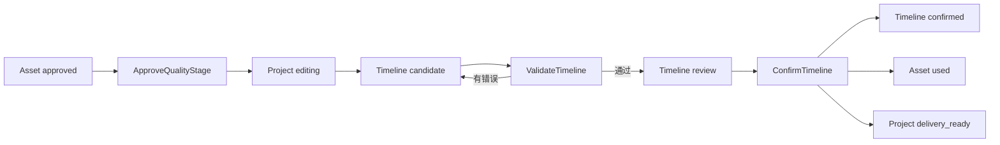

# 片场 V2 时间线剪辑合同实现

版本：v0.2

状态：已实现
实现目录：`v2/backend/app/editor/`、`v2/frontend/src/pages/EditorPage.tsx`

## 1. 目标与边界

剪辑台负责素材取舍和交付前的时间线合同，不实现完整非线性编辑器；可生成无交付副作用的本机低清预览缓存，正式媒体导出仍属于独立交付模块。

本阶段实现：

- 当前活动快照的质量阶段显式放行。
- 主视频、音频和字幕轨道合同。
- 审核通过素材的精确引用。
- 素材源入点、源出点、时间线入点和时间线出点。
- 显式空位、轨道开关、版本修订和确定性校验。
- 用户确认后形成不可变时间线权威版本。
- 引用素材进入 `used`，项目进入 `delivery_ready`。

本阶段不把低清预览登记为媒体导出或正式成片，也不实现自动补空位、自动变速、自动裁切、素材 ID 猜测、跨快照复用、自动重试或供应商调用。

## 2. 权威链路



员工或前端只能提交候选。只有显式命令能够推进权威状态。

## 3. 数据模型

### 3.1 Timeline

```text
id, project_id, snapshot_id, version_number
supersedes_timeline_id nullable
status: candidate | review | confirmed | exported | superseded
source: user | editor_assistant
source_agent_run_id nullable
output_spec, track_config, validation_report
contract_hash nullable, row_version
created_by, created_at, validated_at, confirmed_at
```

约束：

- `(project_id, version_number)` 唯一。
- 首个候选使用创建命令；已有版本后必须从指定版本修订。
- `editor_assistant` 来源必须绑定同项目、角色为 `editor`、状态为 `completed` 的 AgentRun。
- `confirmed` 内容不可原地修改。
- 新确认版本会把此前 `confirmed` 版本标记为 `superseded`。

### 3.2 TimelineItem

```text
id, timeline_id
track_type: main_video | audio | subtitle
sequence_number, asset_id nullable
label, gap_reason nullable
source_in_ms nullable, source_out_ms nullable
timeline_in_ms, timeline_out_ms
transform, created_at
```

`asset_id=null` 表示用户明确保留的空位，不代表系统可以自行补素材。空位可保存为候选，但不能通过校验。

## 4. 命令

| 命令 | 前置条件 | 结果 |
|---|---|---|
| `ApproveQualityStage` | 项目为 `quality_review`；当前快照全部必需媒体节点有 `approved/used` 素材 | 项目进入 `editing` |
| `CreateTimelineCandidate` | 项目为 `editing/delivery_ready`；当前项目没有时间线版本 | 创建 `candidate` |
| `ReviseTimelineCandidate` | 指定版本属于当前快照且行版本匹配 | 创建下一版本；不修改确认版本内容 |
| `ValidateTimeline` | 状态为 `candidate`；行版本匹配 | 通过后进入 `review`，失败仍为 `candidate` |
| `ConfirmTimeline` | 状态为 `review`；合同哈希和行版本匹配；用户明确确认 | 时间线 `confirmed`，素材 `used`，项目 `delivery_ready` |

项目日常编辑不再把浏览器内存当作唯一事实。迁移 `20260730_42` 新增一项目一行的可变 `editor_draft_sessions`：保存基线 Timeline ID/行版本、轨道合同、带稳定客户端 ID 的条目、播放头和更新时间。前端仍即时写本地副本，900ms 空闲后串接服务端保存；恢复时只接受当前最新基线，生成 Timeline 修订或显式丢弃时删除草稿。该表不是审计合同，不参与交付 Manifest，也不改变项目状态。

交付验证仍把本次 Timeline 标成 `exported` 并留下不可变 DeliveryAttempt/Asset，但 `completed` 现在表示“已有已验证成片”而不是永久锁定。用户可从最新 `exported` Timeline 创建下一 `candidate`，状态转移器把项目恢复为 `editing`；旧交付不改写。阶段评估优先读取最新候选/待确认/已确认 Timeline，避免旧 verified Attempt 抢占新一轮剪辑或交付。前端同样按当前确认 Timeline 精确选择 Attempt，不能误把旧成片显示成新版本的交付状态。

所有写命令使用 `CommandReceipt` 幂等。相同命令 ID 不能用于另一命令类型。

## 5. 确定性校验

校验器不改写候选，仅返回结构化错误：

| 错误码 | 条件 |
|---|---|
| `TIMELINE_GAP_UNRESOLVED` | 时间线仍有 `asset_id=null` 的显式空位 |
| `TIMELINE_GAP_REASON_REQUIRED` | 空位没有记录原因 |
| `TIMELINE_ASSET_NOT_FOUND` | 精确素材 ID 不存在 |
| `TIMELINE_ASSET_PROJECT_MISMATCH` | 素材属于其他项目 |
| `TIMELINE_ASSET_SNAPSHOT_MISMATCH` | 素材不属于当前时间线快照 |
| `TIMELINE_ASSET_NOT_APPROVED` | 素材状态不是 `approved/used` |
| `TIMELINE_ASSET_TYPE_MISMATCH` | 素材放入错误轨道 |
| `SOURCE_RANGE_INVALID` | 源区间缺失或无效 |
| `SOURCE_RANGE_EXCEEDS_ASSET` | 源出点超过素材真实时长 |
| `ASSET_DURATION_UNKNOWN` | 视频或音频没有已验证时长 |
| `TIMELINE_SPEED_CHANGE_UNDECLARED` | 源区间和时间线区间不等长 |
| `TIMELINE_ITEMS_OVERLAP` | 同一轨道片段重叠 |
| `MAIN_VIDEO_TRACK_GAP` | 主视频轨有未声明时间空洞 |
| `MAIN_VIDEO_DURATION_INCOMPLETE` | 主视频轨未覆盖完整输出时长 |
| `TIMELINE_OUTPUT_OVERRUN` | 片段超出项目输出时长 |
| `AUDIO_TRACK_DISABLED` | 关闭音频时仍提交音频片段 |
| `SUBTITLE_TRACK_DISABLED` | 关闭字幕时仍提交字幕片段 |
| `AUDIO_TRACK_EMPTY` | 启用音频但没有音频片段 |
| `SUBTITLE_TRACK_EMPTY` | 启用字幕但没有字幕片段 |

首期不支持隐式变速。后续如增加变速，必须引入明确速度字段和新合同版本。

## 6. API

```text
GET  /api/v1/projects/{project_id}/editor-workspace
POST /api/v1/projects/{project_id}/quality-stage:approve
POST /api/v1/projects/{project_id}/timeline-candidates
POST /api/v1/projects/{project_id}/timelines/{timeline_id}:revise
POST /api/v1/projects/{project_id}/timelines/{timeline_id}:validate
POST /api/v1/projects/{project_id}/timelines/{timeline_id}:render-preview
GET  /api/v1/projects/{project_id}/timelines/{timeline_id}/previews/{preview_key}/content
POST /api/v1/projects/{project_id}/timelines/{timeline_id}:confirm
```

`editor-workspace` 返回项目状态、活动快照、输出时长、质量缺口、可用素材、全部时间线版本和唯一下一步操作。

## 7. 前端剪辑台

正式 `/editor` 直接装载完整剪辑工作台：顶部项目切换、输出摘要、预览监视器、批准素材箱、三类轨道、显式空位、时间字段、版本历史、校验结果、修订和合同确认。旧页面和“查看新版原型”二次入口不再参与路由。时间线工具栏为当前选择提供显式“删除所选”，与 Inspector 和 Delete 快捷键共用 `deleteSelected`、锁轨门禁、波纹前移及撤销链；画面、声音和字幕条目均按各自合同删除。高密度工作区所有正文和操作文字最低 11px，真实 1280×720 页面 `scrollWidth == clientWidth == 1280`、`scrollHeight == clientHeight == 720`。

前端排序和时间输入只是候选编辑状态。只有提交成功的版本具有数据库权威性。

`/editor` 提供 `editor-preview.v1` 低清预渲染。它只读取已保存 Timeline，不消费尚未冻结为可导出版本的项目草稿；服务复验行版本、合同哈希、时间线校验、本机渲染合同、输入文件哈希以及缓存 MP4 的格式/尺寸/时长。合法版本按项目画幅生成长边 640、最高 24fps 的本机缓存；首次生成写入按命令隔离的临时 MP4，验证与质量探测完成后原子替换确定性缓存，异常始终清理临时文件。页面生成和重检期间禁用重复提交。该缓存不是 Asset，不创建 DeliveryAttempt、WorkItem、CostEvent，不确认时间线或改变项目状态。

人工复核成功回调必须等待 `editor-prototype-workspace / editor-workspace / editor-prototype-delivery / delivery-workspace` 四类查询完成失效与活动重取，随后才把本地 `previewReviewSaved` 置为真。复核 mutation 进行中，缓存重检和时间线确认保持禁用；因此同一预览刚保存复核时不会被闭包中陈旧的 `sourceTimeline.preview_review` 重新清空。

确认成功后读取 `deliveryWorkspace.refetch()` 的权威结果：已存在 Attempt 时打开交付状态，否则才打开方式授权。授权、外部上传登记和显式验证的成功响应都是完整 DeliveryAttempt；页面先按 Attempt ID 更新 `editor-prototype-delivery / delivery-workspace` 两套缓存，再失效重取。因此弹窗打开时不会先显示旧的“等待授权/等待上传/等待验证”动作，也不会因跨窗口已授权而引导重复提交。

监看时间码从 Timeline `output_spec.fps` 计算，分割与裁切按冻结 `snap_enabled + snap_interval_ms` 磁吸。磁吸开关与缩放同样进入本地草稿，刷新可恢复；保存并检查时两者均写入新的不可变 Timeline 修订，丢弃草稿或切换基线会恢复服务端值并停止当前播放。主画面连续播放以 `source_out_ms` 为片段推进门限，并以当前媒体元素匹配的结束事件兜底；切片时按 TimelineItem ID 重新挂载视频，避免同 Asset 多片段沿用错误源时点。显式空位不启动媒体播放。

暂停定位由 `seekTimeline(positionMs)` 统一处理预览拖动条、时间线背景和首尾跳转：目标时点先解析覆盖的主画面条目（终点允许匹配同终点空位），再原子更新选择、播放头和暂停状态。暂停视频 effect 与 `loadedmetadata` 都按 `source_in + timeline offset` 计算同一源时点，并限制到冻结源出点，避免新视频元素晚加载后重置到源入点。时间尺从 `durationMs / timelineZoom` 派生刻度步长，强制追加非整步终点；首标签不左移、末标签左移自身宽度，保证边界内完整显示。

连续播放切片使用逐帧媒体时钟：可见视频 `preload=auto`，`requestVideoFrameCallback` 每个解码帧按 `mediaTime` 计算成片位置，在距离冻结 `source_out_ms` 一个输出帧时进入 `advancePlayback`；不支持该 API 时以 `requestAnimationFrame + currentTime` 降级。当前条目同时派生下一主画面条目，使用不可见、静音、不可聚焦的独立视频元素提前 `preload=auto` 并在元数据可用时定位 `source_in_ms`，切换后新可见元素直接命中已加载资源。`advancingPlaybackRef` 在切换事务内屏蔽旧元素最后一次 `timeupdate / ended`；到达末片段时保持门禁直到用户重新播放或选择其他条目，避免 15 秒终点被旧媒体时间回写为 14.9 秒。

真实咖啡 v6 在 1280×720 浏览器连续播放验收中，5.0 秒已进入第二片段 SH-001、可见视频 `currentTime=0.449 / readyState=4 / paused=false`；9.7 秒已进入第三片段 SH-003、`currentTime=0.409 / readyState=4 / paused=false`。完整播放后预览与时间线时间码都精确为 `00:15:00`，可见视频停在冻结源出点 0.873 秒；页面 `scrollWidth=clientWidth=1280`，控制台无错误。播放没有写项目草稿或新 Timeline。

相邻主画面的边界预览复用同一逐帧切片链：`previewBoundary` 把播放头定位到左片段出点前 1 秒，并用 `boundaryPreviewEndMs` 保留右片段入点后 1 秒的停止门限；`advancePlayback` 在跨条目选择时保留该门限，逐帧 effect 到点后精确暂停。`setBoundaryTransition` 在一个 `commitItems` 中成对设置左条目的 `transition_out` 和右条目的 `transition_in`，选项只映射既有 `cut/0ms` 或 `fade/200|300|500ms`，因此一条历史记录即可整体撤销。

草稿保存修复了媒体浮点时钟与 Pydantic 整数合同的边界：指纹和 PUT payload 都使用 `Math.max(0, Math.round(playheadMs))`。页面额外记录最后一次尝试指纹，自动保存 effect 在成功或失败后都不再提交相同内容；显式“重试保存”仍可重新提交同一指纹。API 客户端把 FastAPI 422 的 `detail[]` 格式化为 `字段路径：msg`，避免 `[object Object]`。

真实咖啡 v6 在 SH-002 → SH-001 的 `00:04:17` 边界验收：切点预览自动停在 `00:05:16`；选择 0.3 秒柔和过渡后，服务端草稿精确保存 SH-002 `transition_out=fade:300` 与 SH-001 `transition_in=fade:300`，等待后 PUT 计数不再增长，一次撤销恢复双方 `cut:0`。丢弃后 GET 草稿为 `null`；锁定画面轨后衔接下拉禁用、切点预览仍可用且没有新 PUT。前端生产构建通过。

EditorWorkspace 新增 `shot_sequence`，并给每个可用 Asset 投影 `shot_code / shot_sequence_number`。服务端从活动快照读取精确 `plan_version_id`，再以 Asset 的 `dag_node_id` 解析 DAGNode `shot_id` 和正式 Shot；无法映射的补充素材保持 `null`，不从 `node_key` 猜测。前端只按该数值检测已映射主画面的相邻倒序，相关片段与边界同时高亮；显式整理对已映射条目做稳定排序，把未知素材/空位保留在原槽位，再复用 `normalizeMainTrack + commitItems` 重算画面时间线，因此只有一个撤销步骤。声音和字幕保持绝对成片时点，状态栏要求重新复核切点。

`BoundaryFrameStill` 仅在用户展开边界定格时挂载两个静音、暂停、`preload=auto` 的视频元素。前镜定位 `max(source_in, source_out - round(1000/fps))`，后镜定位 `source_in`；`seeked` 后才标记画面就绪，点击定格调用统一 `seekTimeline` 定位主监看。真实咖啡 v6 的倒序边界显示 SH-002 末帧 `4.667s / readyState=4` 与 SH-001 首帧 `0s / readyState=4`，两者均暂停。

真实顺序整理验收从 `SH-002 → SH-001 → SH-003 → provider_output` 得到 `SH-001 → SH-002 → SH-003 → provider_output`，权威 Shot/Asset 映射分别为 `1/2/3`；服务端草稿 row version 增长且一次撤销恢复倒序提示、一次重做恢复正式顺序。锁轨后“按正式分镜整理”禁用，但定格对比保持可用。验收草稿最终删除；1280×720 的页面 `scrollWidth/clientWidth` 与 `scrollHeight/clientHeight` 均相等，浏览器控制台无错误。完整 API `125 passed`、Python compileall 和 Vite 生产构建通过。

镜头衔接面板新增关系合同与人工检查清单。正式相邻边界读取右镜 `continuity_relation`，并在两镜共享非空 `continuity_group_id` 时显示连续组；`same_moment / time_jump / location_change / outfit_change` 分别生成三项针对性检查。当前顺序跳过正式镜头、发生倒序、拆分同一镜头或包含补充素材时不误套正式关系，显示通用主体/动作/变化可读性清单。真实咖啡草稿的 SH-002 → SH-001 倒序边界显示非正式相邻说明和 `0/3` 进度，勾选主体项后变为 `1/3`；等待自动保存窗口后服务端草稿仍为 `row_version=7 / updated_at=2026-08-01T12:51:22.811623`，证明检查状态不写草稿。1280×720 页面尺寸精确等于视口，控制台无错误；完整 API `125 passed`、Python compileall、Vite 生产构建和差异格式检查通过。

镜头衔接面板新增滚动剪辑。`rollBoundary` 以同一个 delta 联动前镜 `source_out_ms / timeline_out_ms` 和后镜 `source_in_ms / timeline_in_ms`，不移动后镜结束点或任何下游条目；边界范围同时受素材尾部余量、后镜源入点、两侧 200ms 最短时长以及已有 fade 两倍时长约束。操作停止播放、定位新切点、清空该边界页面级连续性勾选并通过一次 `commitItems` 写入历史。真实咖啡草稿的同 Asset 拆分边界 SH-003 A → SH-003 B 在 24fps 下后移一帧：切点 `6900→6942ms`、A 源出点 `1782→1824ms`、B 源入点 `1782→1824ms`，B 结束仍为 `9827ms`；一次撤销恢复全部原值，最终服务端草稿保持原条目并把播放头恢复为 0。画面轨锁定后后移按钮禁用；1280×720 页面尺寸等于视口，控制台无错误。完整 API `125 passed`、Python compileall、Vite 生产构建和差异格式检查通过。

切点预览增加 0.5/1/2 秒可选窗口与循环模式。循环会话冻结边界 key、左条目、窗口起止与标签，逐帧时钟到达右侧终点后重新选择左条目并回到窗口起点；停止循环后播放头稳定不再推进。首次真实验收完整往返成立，但暴露媒体元素快速卸载或暂停时未处理 `video.play()` Promise，产生连续 AbortError；主监看播放 effect 随后显式忽略预期 AbortError，只把其他播放失败转为提示。复验咖啡 SH-002 → SH-001 的前后 0.5 秒窗口，样本从 SH-002 `00:04:10/16` 跨到 SH-001 `00:04:19/00:05:01`，随后重新回到 SH-002 `00:04:07`；点击停止后稳定在 `00:04:11`，400ms 无变化，控制台零错误。2 秒窗口选择成功，锁轨时循环预览仍可用；1280×720 页面尺寸等于视口。验收只推进既有草稿播放头，条目切点保持 `1782ms / 6900ms`，最终播放头恢复 0。完整 API `125 passed`、Python compileall、Vite 生产构建和差异格式检查通过。

切点预览继续增加 0.25× / 0.5× / 1× 慢速检查。`boundaryPreviewRate` 只在 `boundaryPreviewEndMs` 有效时写入当前主视频与时间线音频的 `playbackRate`；跨条目新视频在 metadata 就绪时再次应用，停止、完成或普通播放则恢复 1×。真实咖啡 SH-002 → SH-001 的前后 0.5 秒窗口中，0.5× 在前镜实测 `currentTime=4.448495 / playbackRate=0.5 / readyState=4 / paused=false`，跨入 SH-001 后继续为 0.5×；0.25× 跨入后镜实测 `currentTime=0.079003 / readyState=4 / paused=false`，循环重新回到 SH-002 后仍为 0.25×。停止循环得到 `paused=true / playbackRate=1`，随后普通播放实测 `playbackRate=1 / paused=false`。验收结束播放头恢复 0，服务端草稿 `row_version=57 / main_count=6`；1280×720 的页面宽高均精确等于视口。完整 API `125 passed`、Python compileall、Vite 生产构建和差异格式检查通过。

镜头衔接区新增全时间线顺序巡检。`mainBoundaries` 从相邻主画面派生稳定 key，`activeBoundaryIndex` 结合显式焦点与当前片段推导；Header 显示 `当前/总数`，按钮及 `[` / `]` 统一调用 `focusBoundaryAt`。真实咖啡草稿识别 6 个主画面和 5 个切点：初始 `1/5` 且上一项禁用；按钮定位第 2 个 SH-001 → SH-003 A 为 `5118ms`；快捷键从第 3 个 `6900ms` 返回第 2 个 `5118ms`，再前进回 `6900ms`。首次从第 3 个循环预览跳到第 4 个时，前镜实际媒体末帧把 `9827ms` 回写为 `9826.333ms`；修复后导航先暂停并门禁旧会话，选择切后右镜从源入点监看，复验精确保持 `9827ms` 且循环停止。第 5 个 provider_output → 待补素材精确定位 `10700ms`，下一项禁用、上一项仍可用。整个巡检后撤销保持禁用；播放头恢复 0，服务端草稿 `row_version=68 / main_count=6`，五个真实画面双方转场仍为 `cut:0`。完整 API `125 passed`、Python compileall、Vite 生产构建和差异格式检查通过。

全时间线顺序巡检继续增加连续播放会话。真实咖啡 5 个边界中，SH-002 → SH-001 `4709ms`、SH-001 → SH-003 A `5118ms`、SH-003 A → SH-003 B `6900ms`、SH-003 B → provider_output `9827ms` 四个边界可播放，provider_output → 待补素材 `10700ms` 被明确计为 1 个缺口并跳过。首次浏览器验收暴露 effect 依赖 `selectedItem.id`，跨镜选择后会把同一边界反复重置到起点；改为启动会话时一次性选择左镜并移除该变化依赖后，0.5 秒窗口实测依次出现 `1/4 → 2/4 → 3/4 → 4/4`，各阶段主视频均 `paused=false / readyState=4 / playbackRate=1`，最终暂停并提示“已播放 4 个可用切点，跳过 1 个含缺口边界”。中途再次点击和“下一个切点”均立即停止会话；6 项当前可见人工检查保持未勾选，撤销保持禁用。播放头恢复 0 后服务端草稿为 `row_version=75 / main_count=6`，五个真实画面转场仍为 `cut/cut`。

镜头衔接面板继续新增单片段源窗口滑移。`slipBoundaryItem` 在素材边界内把目标片段的 `source_in_ms / source_out_ms` 同步前移或后移 1 帧/1 秒，完全不改 `timeline_in_ms / timeline_out_ms`；操作停止播放和循环预览、重置目标片段前后两个边界的页面级连续性检查，并通过一次 `commitItems` 形成一个撤销步骤。真实咖啡草稿在 SH-002 → SH-001 边界把 SH-001 源区间从 `0..409ms` 后移一帧到 `42..451ms`，时间线继续保持 `4709..5118ms`，切点定格首帧从 `00:00:00` 更新为 `00:00:01`；一次撤销恢复源区间和定格，服务端最终播放头恢复 0。锁定画面轨后前后镜滑移按钮均禁用；1280×720 的 `scrollWidth/clientWidth` 与 `scrollHeight/clientHeight` 分别保持 `1280/1280`、`720/720`。完整 API `125 passed`、Python compileall、Vite 生产构建和差异格式检查通过。

衔接主卡补齐真实 220px 内容宽度约束。诊断发现 `.boundarySlip` 原六列固定最小宽度合计 282px，把 `.boundaryControl` 撑到 268px，并让两侧 `+1帧/+1s` 延伸出 Inspector；正式滚动剪辑固定五列也依赖同一错误的宽卡。初次收缩主卡后，展开同步动作又暴露 `.boundaryRollTrial` 的固定五列把最右 `+1s` 伸到 1277px。现在主卡和直接子项允许收缩，正式滚动与无损试调都改为弹性五列；源窗口滑移不改变 DOM 或事件，只把每侧时间码置于第一行、四个步进按钮置于第二行。所有操作继续调用原页面试调、确定性事务与自动试听，不以隐藏横向溢出掩盖缺失控件。

1280×720 真实页面在基础衔接卡下测得 Inspector `clientWidth/scrollWidth 244/244`、主卡 `218/218`、正式滚动与滑移卡各 `200/200`；每侧滑移行 `186/186`、时间码 `140/140`，四个按钮各 32px 且都在行边界内。展开同步动作、后镜扫描和 ±4 后仍为 Inspector `244/244`、主卡 `218/218`、无损滚动试调与扫描区 `184/184`、导航 `172/172`，没有实际右侧越界元素；粘性导航仍精确定位 `+4` 且保留 `6.75px` 顶部净距。页面日志为空，API 零 editor-draft PUT，权威草稿保持 `row_version=230 / playhead_ms=0 / SH-002 source=0..4709ms / SH-001 source=0..409ms`。

Inspector 片段操作新增三点联动的片段滑动。`slideMainItem` 保持中间画面的源入出点和时长不变，把前镜出点、中间镜时间线入出点和后镜入点同加一个 delta；范围受前镜素材尾部、后镜源入点、两侧最短时长和 fade 合同限制。操作停止播放/循环预览、同时清空两侧页面级连续性检查并通过一次 `commitItems` 保存。真实咖啡草稿把 SH-003 A 后移一帧：其源区间仍为 `0..1782ms`、时间线从 `5118..6900ms` 平移到 `5160..6942ms`；SH-001 源/时间线出点从 `409/5118ms` 变为 `451/5160ms`，SH-003 B 源/时间线入点从 `1782/6900ms` 变为 `1824/6942ms`，下游结束仍为 `9827ms`。两侧各一项连续性勾选均重置，一次撤销恢复全部值，最终服务端草稿 `row_version=30 / playhead_ms=0`。锁轨后滑动按钮禁用；1280×720 页面宽高均无溢出，控制台零日志。完整 API `125 passed`、Python compileall、Vite 生产构建和差异格式检查通过。

源窗口滑移与片段滑动补齐“调整即复检”。`slipBoundaryItem` 现在接收用户所在的 `previewBoundaryKey`，一次 `commitItems` 后登记到既有 `pendingBoundaryPreviewKey`，等新源区间投影完成再调用 `previewBoundary`；因此自动试听不会读取旧条目，也不增加历史。`boundaryReviewSession` 新增 `scope=timeline|affected`，而 `pendingBoundaryReviewKeys` 只在片段滑动成功后暂存入点和出点两组稳定 key；effect 将新投影中仍存在的边界转换为索引并启动 `affected` 局部会话，沿用连续巡检的逐帧终点、停止→下一段门禁和当前切前/切后窗口，但提供独立 `1/2 → 2/2` 与完成文案。重置结构、撤销和重做同时清理单点/双点待预览状态。

当前真实咖啡草稿已被用户调整为 SH-002 `0..4709ms`、SH-001 `4709..5118ms` 与 `5118..15000ms` 缺口。SH-001 源窗口后移一帧得到 `42..451ms` 后，SH-002 → SH-001 立即按切前/切后各 0.25 秒、1× 自动试听，最终后镜停在 `currentTime=0.266 / readyState=4 / paused=true`，一次撤销恢复 `0..409ms`。为隔离验证双边界链路，临时把未使用 SH-003 投入缺口并把 SH-002 右侧裁短 1 秒，再将中间 SH-001 后滑一帧；草稿精确变为 SH-002 `source/timeline out=3751ms`、SH-001 `timeline=3751..4160ms`、SH-003 `source_in=42ms / timeline_in=4160ms`，页面自动依次显示 `片段滑动后试听 1/2`、`2/2` 与“已播放 2 个受影响切点”，活动媒体均为 `readyState=4 / playbackRate=1`，完成后暂停。三次撤销与跳到开头逐字段恢复原 3 段草稿，服务端最终 `row_version=151 / playhead_ms=0`；1280×720 document/body 宽高均等于视口，页面控制台零错误。

切点定格新增同画布叠加对齐。`BoundaryFrameOverlay` 分别把前镜末帧和后镜首帧定位到冻结源时点，两路均完成 `seeked` 后显示；右侧首帧通过页面级 0–100% opacity 控制覆盖左侧末帧，并保留两个独立主监看定位按钮。首次浏览器验收发现当前 WebView 的 range 连续交互不可靠触发 React `change`，改用 `input` 后拖动和键盘填值均实时更新。真实咖啡 SH-002 → SH-001 边界分别停在 `4.667s / 0s`，两路 `readyState=4 / paused=true`；70% 时首帧实际 opacity 为 `0.7`，锁轨后仍可调到 35%。等待自动保存窗口后服务端草稿保持 `row_version=32 / playhead_ms=0 / updated_at=2026-08-01T14:10:03.562583`，证明模式与透明度不写草稿。1280×720 页面宽高均无溢出，控制台零日志。完整 API `125 passed`、Python compileall、Vite 生产构建和差异格式检查通过。

切点定格继续增加动作连续帧带。前镜按真实 24fps 展示切前 3/2/1 帧，后镜展示切后 0/1/2 帧；六格复用静音暂停的 `BoundaryFrameStill`，源时点钳制在各自冻结源区间，点击后把源偏移反算为成片位置并调用统一 seek。真实咖啡 SH-002 → SH-001 边界六路媒体精确停在 `4.583 / 4.625 / 4.667 / 0 / 0.042 / 0.084s`，全部为 `960×1664 / readyState=4 / paused=true`；点击 SH-001 切后 1 帧后主监看定位 `currentTime=0.042s`、成片时间码 `00:04:18`。锁轨后帧带仍可用，撤销保持禁用；1280×720 的页面宽高均等于视口，浏览器零错误。播放头恢复 0 后服务端草稿 `row_version=78 / main_count=6`，五个真实画面转场仍为 `cut/cut`。完整 API `125 passed`、Python compileall、Vite 生产构建和差异格式检查通过。

动作连续帧带继续接入可视化设切点。前镜格子用 `source_time + frame_ms - source_out` 计算目标滚动量，后镜格子用 `source_time - source_in` 计算；当前帧、锁轨或超出既有 `rollMinimumDelta / rollMaximumDelta` 的动作禁用，合法动作统一调用 `rollBoundary`，不复制素材边界、200ms、fade、撤销或连续性逻辑。首次真实页面定位中间片段时发现两个边界的定格按钮同名，现已把前后片段名写入可访问名称。真实 SH-003 A → B 在 `6900ms` 选择后镜切后 2 帧后，双方源切点从 `1782ms` 前进到 `1866ms`、成片切点从 `6900ms` 前进到 `6984ms`，B 结束仍为 `9827ms`，已勾选检查从 `1/3` 重置为 `0/3`；一次撤销恢复、重做重现、再次撤销最终恢复。锁轨时 6 个应用动作全部禁用；1280×720 页面宽高无溢出，浏览器零错误。最终服务端草稿 `row_version=85 / playhead_ms=0 / main_count=6`，SH-003 A/B 恢复 `source 1782ms / timeline 6900ms`，五个真实画面转场保持 `cut/cut`。完整 API `125 passed`、Python compileall、Vite 生产构建和差异格式检查通过。

帧带设切点随后补齐“应用即判断”闭环。`rollBoundary` 返回是否实际提交，只有成功的帧带动作才登记稳定边界 key；effect 等待新条目投影完成后查找同一相邻边界并调用既有 `previewBoundary`，因此自动预览复用当前 `boundaryPreviewWindowMs / boundaryPreviewRate`、固定单次播放且不增加第二个撤销步骤。定格和动作帧带 key 不清理，用户可连续换帧比较。撤销/重做在读历史前先暂停主媒体、结束播放/循环/巡检、清理待预览 key，并用 `advancingPlaybackRef` 阻断旧 `requestVideoFrameCallback`；逐帧检查函数也直接读取该门禁，避免 React effect 清理前的迟到回调推进恢复后的播放头。真实咖啡 v6 在 SH-003 A → B 应用切后 2 帧后得到 `1782→1866ms / 6900→6984ms`，0.5 秒、1× 自动预览达到 `readyState=4 / paused=false / playbackRate=1` 并在窗口末端自动暂停；撤销恢复 `1782/6900ms`。再次应用切后 1 帧后立即撤销，媒体在 `350ms` 后保持暂停，边界稳定为 `1782/6900ms`，没有迟到回写；6 个锁轨动作仍全部禁用，1280×720 无溢出，浏览器零错误。验收结束服务端草稿 `row_version=94 / playhead_ms=0 / main_count=6`，SH-003 B 仍结束于 `9827ms`。

滚动剪辑随后统一为“修剪即试听”。四个 `±1帧/±1秒` 按钮不再直接调用 `rollBoundary`，而是与动作帧带共同调用 `applyBoundaryRoll`；全局 `Comma / Period` 读取当前 `activeBoundaryIndex` 实现 `, / .` 逐帧，Shift 传入 1000ms 粗调，弹窗、表单、文本输入和其他组合键保持隔离。真实咖啡 v6 的 SH-003 A → B 在 0.5 秒、1× 下按 `.` 从 `6900` 前进到 `6942ms`，媒体立即达到 `readyState=4 / paused=false / playbackRate=1`；撤销恢复后按 `Shift+.` 得到 `7900ms` 并自动试听，按钮 `+1帧` 路径同样得到 `6942ms` 和活动媒体。三次撤销均恢复 `1782/6900ms`；锁轨后按 `.` 明确提示阻断，切点保持 `6900ms` 且撤销仍禁用。1280×720 页面宽高无溢出，浏览器零错误；验收结束服务端草稿 `row_version=103 / playhead_ms=0 / main_count=6`，SH-003 B 仍结束于 `9827ms`。

结构编辑新增成对转场重建。`pairedFadeDuration` 只把相邻两条类型和时长一致的 `transition_out / transition_in` 视为一个边界合同；`reconcileStructuralTransitions` 以编辑前后稳定条目 ID 的有序相邻对为准，只保留仍存在的原边界，并把断开边界的两半分别改为 `cut:0`。Inspector 前后移动、拖放重排、正式分镜整理和波纹删除在规范化时间线后统一调用该函数，提示本次清理的边界数量；`resetStructuralPreviewState` 同时停止播放/循环、关闭定格与叠加、清空连续性勾选。分割不走复制语义：左半保留原入场且内部出场归零，右半内部入场归零且保留原出场。真实咖啡 v6 删除同时连接两组成对 `fade:200` 的 SH-001 后，提示清理 2 组，新 SH-002 → SH-003 A 边界双方均为 `cut:0`；分割同时带外侧入场和出场的 SH-003 A 后，外侧两组 `fade:200` 保留，新 A/B 内部边界双方为 `cut:0`。连续撤销恢复最终草稿 `row_version=41 / playhead_ms=0 / main_count=6`，原两个验收边界均为 `cut:0`；1280×720 页面无溢出，控制台零日志。

提交 `8743e135` 推送到 `main` 后使用标准脚本重启 8766：API PID `8036`、Worker PID `2640`。`GET /api/v1/health` 返回 `ok`，8766 监听 PID 精确等于 API PID，Alembic runtime/head 均为 `20260730_42`；API stderr 只有 Uvicorn 正常启动信息，API stdout 只有健康检查，Worker 日志为空，没有实际错误堆栈。

提交 `00182bcb` 推送到 `main` 后使用标准脚本重启 8766：API PID `35224`、Worker PID `6240`。`GET /api/v1/health` 返回 `ok`，8766 监听 PID 精确等于 API PID，Alembic runtime/head 均为 `20260730_42`；API stderr 只有 Uvicorn 正常启动信息，API stdout 只有正常项目列表与健康检查请求，Worker 日志为空，没有实际错误堆栈。

提交 `70097d49` 推送到 `main` 后使用标准脚本重启 8766：API PID `36840`、Worker PID `28948`。`GET /api/v1/health` 返回 `ok`，8766 监听 PID 精确等于 API PID，Alembic runtime/head 均为 `20260730_42`；API stderr 只有 Uvicorn 正常启动信息，API stdout 只有健康检查请求，Worker 日志为空，没有实际错误堆栈。

提交 `2a494a91` 推送到 `main` 后使用标准脚本重启 8766：API PID `36888`、Worker PID `30744`。`GET /api/v1/health` 返回 `ok`，8766 监听 PID 精确等于 API PID，Alembic runtime/head 均为 `20260730_42`；API stderr 只有 Uvicorn 正常启动信息，API stdout 只有健康检查请求，Worker 日志为空，没有实际错误堆栈。

提交 `f70d7509` 推送到 `main` 后使用标准脚本重启 8766：API PID `9680`、Worker PID `8060`。`GET /api/v1/health` 返回 `ok`，8766 监听 PID 精确等于 API PID，Alembic runtime/head 均为 `20260730_42`；API stderr 只有 Uvicorn 正常启动信息，API stdout 只有健康检查请求，Worker 日志为空，没有实际错误堆栈。

提交 `1eab4789` 推送到 `main` 后使用标准脚本重启 8766：API PID `17708`、Worker PID `26784`。`GET /api/v1/health` 返回 `ok`，8766 监听 PID 精确等于 API PID，Alembic runtime/head 均为 `20260730_42`；API stderr 只有 Uvicorn 正常启动信息，API stdout 只有健康检查请求，Worker 日志为空，没有实际错误堆栈。

提交 `0e466325` 推送到 `main` 后使用标准脚本重启 8766：API PID `22092`、Worker PID `36288`。`GET /api/v1/health` 返回 `ok`，8766 监听 PID 精确等于 API PID，Alembic runtime/head 均为 `20260730_42`；API stderr 只有 Uvicorn 正常启动信息，API stdout 只有健康检查请求，Worker 日志为空，没有实际错误堆栈。

提交 `8c79bb0b` 推送到 `main` 后使用标准脚本重启 8766：API PID `27424`、Worker PID `24292`。`GET /api/v1/health` 返回 `ok`，8766 监听 PID 精确等于 API PID，Alembic runtime/head 均为 `20260730_42`；API stderr 只有 Uvicorn 正常启动信息，API stdout 只有健康检查，Worker 日志为空，没有实际错误堆栈。

提交 `9f1dbabf` 推送到 `main` 后使用标准脚本重启 8766：API PID `32052`、Worker PID `37524`。`GET /api/v1/health` 返回 `ok`，8766 监听 PID 精确等于 API PID，Alembic runtime/head 均为 `20260730_42`；API stderr 只有 Uvicorn 正常启动信息，API stdout 只有健康检查，Worker 日志为空，没有实际错误堆栈。

提交 `9c159075` 推送到 `main` 后使用标准启动脚本重启 8766：API PID `66460`、Worker PID `50140`，两个进程创建时间均为 2026-07-30 17:54:02；`GET /api/v1/health` 返回 `ok`，Alembic runtime/head 均为 `20260730_42`。Worker 错误日志为空，API 的 stderr 仅包含 Uvicorn 正常启动信息，没有错误堆栈。

提交 `60aa0139` 推送到 `main` 并发布正式分镜顺序检查与切点定格对比后，本轮发现 8766 已停止监听，随后从仓库根目录重新执行标准启动脚本，恢复为 API PID `15096`、Worker PID `37540`。`GET /api/v1/health` 返回 `ok`，8766 监听 PID 精确等于 API PID，Alembic runtime/head 均为 `20260730_42`；API stderr 只有 Uvicorn 正常启动信息，Worker 日志为空，没有实际错误堆栈。

真实咖啡 v4 浏览器验收在约 9.958 秒定位到 SH-003，暂停源时点 0.547 秒，与 9.418 秒片段入点的差值一致；结尾选择 873ms 显式空位，开头恢复 SH-002/0 秒。15 秒、60px/s 刻度为 `00:00, 00:02, …, 00:14, 00:15`，末标签右边界为 1280px，页面没有横向或纵向溢出。

`beginScrub` 为预览拖动条与时间尺共用指针会话：pointer down 先聚焦 slider，再按初始边界把移动位置映射为成片毫秒；pointer up/cancel 统一移除全局监听。时间尺拖动期间用 ref 暂停自动居中，避免滚动改变指针映射；预览拖动、键盘定位和正常播放则由 viewport effect 在播放头越界时居中。`handleSeekKeyDown` 以真实 fps 计算单帧步长，并提供秒级、五秒和首尾跳转。缩放 range 与 ±20px/s 按钮统一走 `changeTimelineZoom`，限制 40–180px/s 并标记本地草稿。每次缩放前记录 `播放头画布位置 - viewport.scrollLeft`，新宽度提交后按同一锚点反算滚动位置，并把锚点限制在 24px 视口安全边界内。`fitTimelineToViewport` 从 `viewport.clientWidth - 84px 轨道头 - 12px 安全边距` 与总时长计算 px/s；按钮与 `\` 快捷键调用同一函数并回到起点，窗口过窄时停在 40px/s 并保留横向滚动。计算结果等于当前缩放时直接复位 `scrollLeft`，清除待处理锚点且不调用 `setDirty`。刷新从 `editor-local-draft.v2.timeline_zoom` 恢复，丢弃草稿恢复服务端 `track_config.pixels_per_second`。

声音片段移动由 `buildMovedAudioItems` 和 `beginAudioTrackDrag` 组成。前者从会话冻结基线按 `snap_enabled / snap_interval_ms` 计算合法入点、保持片段时长、检查同类声音重叠并按新入点重排音频 `sequence_number`；旁白与 BGM 是唯一允许的交叉重叠组合。后者使用全局 pointer move/up/cancel 会话，把片段内真实抓取偏移映射到轨道毫秒，移动时只更新内存预览，抬起后把原数组一次性压入 history，取消或未移动恢复原数组。Inspector 左右按钮与 `Alt+方向键` 调用同一确定性移动函数；普通步长为磁吸间隔，关闭磁吸时为真实 fps 单帧，Shift 固定 1000ms。真实咖啡 v4 的隔离 3 秒 WAV 从 1.2 秒按钮/键盘精调后按中心抓取拖到 6.0 秒，Inspector、播放头与撤销同步；刷新恢复草稿，1280×720 页面无横向溢出且控制台无错误。验收结束已丢弃草稿并精确删除测试 Asset/WAV，权威 Timeline v4 仍为 0 音频。

声音双侧裁切由 `buildTrimmedAudioItems`、`beginAudioTrim` 与 `handleAudioTrimKeyDown` 共用同一确定性计算。普通音频左裁切同时移动源入点与成片入点，右裁切同时移动源出点与成片出点，源/成片区间保持等长；循环 BGM 调整成片边界但不改变源循环区间，且不能短于一个源循环。所有声音片段最短 200ms。指针会话只在最终值变化时写一个撤销步骤；键盘普通步长读取磁吸间隔，关闭磁吸时按 Timeline fps 单帧，Shift 为 1000ms。`rebaseAudioEnvelope` 对新局部区间的首尾增益做线性插值，裁去区间外关键点并平移保留区间内关键点，最终强制首点为 0、尾点等于新片段时长。`refreshEnabledDucking` 在声音移动、裁切、用途切换和删除后，从当前旁白交集重建所有已启用 BGM 的区间；用途切换还复用同类声音重叠门禁。条目选择按稳定 Item ID 查找，避免本地数组对象重建后 `indexOf` 误选其他声音。

真实咖啡 v4 使用两条隔离 5 秒、24kHz、单声道 PCM16 WAV 验收：BGM 左裁切 1 秒得到源 `1..5s`、成片 `3..7s`，右把手裁到 6.5 秒后撤销恢复；关闭磁吸时左把手右移一帧得到源/成片入点 `00:01:01 / 00:03:01`。左右把手只点击不制造空撤销；删除相交旁白后 Ducking 从 1 区间变 0，撤销恢复 1；把重叠 BGM 改回旁白被明确阻断。刷新恢复草稿，1280×720 页面宽度保持 1280。验收后丢弃草稿并精确删除两个测试 Asset/WAV，API 恢复 3 个视频素材、Timeline v4 保持 0 音频。

迁移 `20260730_41` 把 Timeline 合同升级为 `v2.timeline-contract.v4`：所有字幕条目显式增加 `transform.subtitle_cues=null` 并重算已验证 Timeline 的合同哈希；`null` 表示使用已批准 Asset 原始 SRT，非空列表表示本 Timeline 完整覆盖。验证器要求 1–200 条 cue，字段集合固定为 `sequence/start_ms/end_ms/text`，序号连续、时点严格递增互不重叠、出点不超过字幕片段时长，文字非空且不超过 500 字符。交付 Manifest 重复同一门禁，缺少显式字段不进入旧版兼容分支。本地草稿同步升级为 `editor-local-draft.v3`，旧草稿按既有 schema 门禁丢弃。

新版 Inspector 通过原始 SRT 或冻结覆盖列表派生同一 `SubtitleCue[]`，每条提供定位、开始/结束秒输入和文字 textarea；只在 blur 后一次性提交有效修改，原值或非法值不产生历史。恢复原文把覆盖显式写回 `null`；cue 列表、监看叠加和时间线分段共用同一派生函数。渲染请求将覆盖 cue 传给 `LocalRenderSubtitleInput`，渲染器序列化严格 SRT 到与输出命令隔离的临时文件，以 `charenc=UTF-8 + FontName=Microsoft YaHei` 调用 libass，并在成功、失败或进程启动异常后清理临时文件。

真实咖啡 v4 使用隔离的 3 cue UTF-8 SRT 验收：第一条文字改为“第一条修订字幕”、结束时点从 2.000 秒改为 2.500 秒，监看、轨道分段与 Inspector 同步；尝试改为 3.500 秒因与第二条重叠被阻断且输入恢复 2.500 秒。定位第二条跳到 `00:03:00`，恢复原文后撤销恢复修订，刷新仍保留覆盖列表；1280×720 页面 `scrollWidth/scrollHeight` 精确等于视口。真实 FFmpeg 先暴露测试脚本管道编码造成的问号假象，改用 Unicode 事实后确认 Microsoft YaHei 正确烧录“真实修订字幕一”；临时 Asset/SRT/MP4/帧图与草稿均已清理。完整 API/Worker 回归为 `133 passed`。

`start_v2.ps1` 把进程身份纳入重启验收：旧 API/Worker 必须被成功结束且 8766 实际释放，否则脚本立即失败；本次 API/Worker 进程通过 `PassThru` 跟踪，健康响应只有在 8766 的监听 PID 精确等于本次 API PID 时才算成功。启动失败会清理本次新进程，避免旧实例继续响应 `/health` 时产生假重启记录。

迁移 `20260730_42` 部署时，SQLite 非事务 DDL 曾完整留下空的 `editor_draft_sessions` 表与两个预期索引，但版本账本仍停在 41，后续标准升级因此以 `table already exists` 明确失败。部署只读核对列、主键、三条外键、索引和 0 行数据均与迁移完全一致后，显式 `alembic stamp 20260730_42` 修复开发库账本；没有在迁移或运行时加入“表存在即跳过”的旧状态兼容分支。随后启动 API `15740` / Worker `38476`，runtime/head 均为 42、健康检查为 `ok`。

真实咖啡 v4 验收把预览拖动到 10.500 秒，SH-003 源时点为 1.082 秒；方向键单步为 42ms，Shift 单步为 1000ms。180px/s 下时间线滚动范围为 2789/1056，End 后 `scrollLeft=1733` 且 15 秒播放头可见；直接拖动放大时间尺到 13.472 秒，源时点 4.054 秒，滚动位置仅保留浏览器 5px 原生焦点调整而未自动重心跳转。验收草稿随后丢弃。

画面轨写操作统一经过 `blockMainTrackEdit(item)`。锁定时 `shiftItem / reorderItem / dropAssetOnItem / startGapAssetSelection / updateSelectedTransform / splitSelected / deleteSelected / beginTrim` 都返回同一可读说明；因此即使快捷键、陈旧拖放会话或程序化事件绕过按钮禁用，也不能修改本地条目。锁按钮只改变会话预览状态；UI 同步禁用片段操作、转场控件、工具栏分割、缺口替换和裁切 slider，并把裁切 slider 移出 Tab 序列。撤销/重做不受锁定影响。

真实咖啡 v4 验收锁定 SH-002 后连续触发 Delete、S 和左把手拖动，三个视频条目与 `source_in=0 / source_out=4709` 保持不变且没有本地草稿；873ms 缺口替换入口禁用。解锁后 Inspector 操作、转场与裁切重新可用，锁定往返不改变 Timeline。

轨道监看状态完全独立于 `commitItems`。`videoTrackHidden` 通过 monitor data attribute 以 CSS 强制隐藏视频画面，同时保留 video 元素、`onTimeUpdate` 和连续切段；中央覆盖层与顶部 flag 明确区分“预览隐藏”和缺口。`audioTrackMuted` 继续在同步 effect 中设置每个时间线 audio 的 `muted`，并同步声音轨透明度；`subtitleTrackHidden` 只控制 `TimelineSubtitle` cue overlay。三个 toggle 统一写入可读 notice 与 `aria-pressed`，不进入草稿历史。

真实咖啡 v4 隐藏画面时视频 opacity 为 0，播放约 0.7 秒后源时点推进至 0.932 秒、时间码 `00:00:17`，证明隐藏没有停止时钟；恢复后 opacity=1。声音和字幕当前无条目，本轮验证其按钮、轨道和 monitor flags 往返，不创建测试素材；既有真实音频/字幕同步验收继续作为媒体执行证据。三项开关均未产生本地草稿。

`buildTrimmedItems` 从会话冻结的基线条目计算左右源边界与波纹时间线，不在 pointer move 中叠加增量。`beginTrim` 只在移动期间把派生条目放入内存预览，并在 pointer down 清理旧单次/循环/巡检与待启动复检；pointer up 检测最终值确实变化后才把原始条目压入历史、清空 future、标记 dirty，pointer cancel 或无移动恢复原数组且不产生历史。`handleTrimKeyDown` 对左右把手使用相同方向语义：右键增加对应源时点、左键减少；普通步长为 `round(1000/fps)`，Shift 为 1000ms，每次有效修改通过 `commitItems` 形成独立撤销步骤。slider 暴露源时点 `aria-valuetext` 与焦点轮廓。成功提交后两条路径统一调用 `queueTrimBoundaryReview`：左裁切清理并复检入点/出点，右裁切清理并复检出点；一个可播放边界登记单切点 key，两个边界登记 `scope=trim` 的局部巡检，不增加历史。

真实咖啡 v4 验收中无移动点击保持零草稿；25px 左裁切按 60px/s 与 100ms 磁吸得到 400ms，并可一步撤销。24fps 左把手单帧为 42ms、Shift 为 1000ms；右把手左移一帧把 4709ms 改为 4667ms。最终丢弃草稿恢复 `0..4709ms`。

裁切调整即复检使用当前真实咖啡草稿复验。SH-002 右把手按方向键左移一帧后，源/成片出点从 `4709→4667ms`，SH-001 成片区间波纹到 `4667..5076ms`；页面立即按切前/切后各 0.25 秒、1× 试听 SH-002 → SH-001，开始时前镜 `currentTime=4.514 / readyState=4 / paused=false`，完成后后镜 `currentTime=0.221 / paused=true`。临时把未使用 SH-003 投入缺口后，SH-001 左把手右移一帧得到 `source_in=42ms / timeline=4709..5076ms`，SH-003 从 `5076ms` 开始；局部复检完整显示 `片段裁切后试听 1/2 → 2/2 → 完成`，两段活动媒体均为 `readyState=4 / playbackRate=1`。另用真实指针把 SH-002 右把手左拖 12px，在 60px/s 与 100ms 磁吸下得到 `source/timeline_out=4509ms`，同样自动试听并暂停。所有临时操作逐步撤销，最终服务端草稿恢复 SH-002 `0..4709ms`、SH-001 `4709..5118ms`、缺口 `5118..15000ms`，`row_version=158 / playhead_ms=0`；1280×720 document/body 宽高等于视口，页面控制台零错误。

转场参数现接入调整即复检。成对 `setBoundaryTransition` 和 Inspector `setSelectedTransition` 在有效变化前统一暂停旧媒体、清理循环/巡检/待启动会话，并清除所影响稳定边界的页面连续性检查；前者提交双侧同一 `cut/fade`，后者按入场映射前一边界、按出场映射后一边界，提交后都复用 `pendingBoundaryPreviewKey` 等待新条目投影再单次播放。合同值未变不入历史，首尾外侧或含空位边界不排队媒体。

真实咖啡草稿在 SH-002 → SH-001 选择 `fade:200` 后，页面立即提示“正在以 1× 预览”，从切前 1 秒启动并跨到 SH-001，最终在后镜可用结尾 `00:05:02` 自动暂停；随后先勾选动作/节奏检查，再从 SH-001 Inspector 把入场恢复为 cut，页面显示成对设置不一致、同一边界再次自动播放，检查进度从 `1/3` 重置为 `0/3`。两次撤销恢复原 `cut/cut`，跳到开头后服务端草稿为 `row_version=162 / playhead_ms=0 / main_count=3`，三条主画面转场均恢复 `cut:0`。1280×720 document 宽高等于视口，两个视频元素最终均为 `readyState=4 / paused=true / playbackRate=1`。

`overlayOpen / closeTopOverlay` 汇总版本、保存、检查、预览、交付授权和交付状态六类弹窗。全局 keydown 先处理 Escape，再在任一 overlay 打开时直接返回；无 overlay 时排除文本输入/contenteditable，并让按钮、链接和音视频消费自己的 Space。六类外层均声明命名 dialog 与 `aria-modal=true`。由于当前 WebView 的 CUA Space 不执行原生 button click，播放按钮另设 `handlePlayButtonKeyDown`：只处理 Space，阻止默认与冒泡后调用一次 `togglePlayback`，避免与全局或原生路径叠加。

真实咖啡 v4 在版本 dialog 内连续发送 Delete/S/Space/Ctrl+Z 后保持 3 个视频、暂停和零草稿，版本与检查 dialog 均可 Escape 关闭。播放按钮修复前焦点 Space 未暂停；修复后一次 Space 从播放切到暂停，随后 300ms 媒体时点增量为 0，再次打开 dialog 仍无快捷键穿透。

新版属性面板直接绑定 `transform.transition_in / transition_out`：`cut` 冻结 `duration_ms=0`，`fade` 默认 300ms，并按后端 `100..min(2000, clip/2)` 范围限制。变更通过 `commitItems` 进入本地草稿、50 步历史和不可变修订；主监看用播放头相对片段位置计算淡入/淡出 opacity，低清预览与交付仍由既有 LocalFFmpegRenderer 读取同一冻结值。

浏览器验收在真实 SH-002 上将入场切为 fade：默认 0.3 秒，改为 0.5 秒后播放前 opacity=0、播放中推进到 0.427；两次撤销依次恢复 0.3 秒和 cut/0ms，监看恢复 opacity=1。渲染器 8 条测试继续覆盖 FFmpeg `fade=t=in/out` 滤镜，验收草稿最终丢弃。

监看容器以 `data-scale=fit|actual` 控制显示：fit 保持绝对居中、`max-width/max-height:100%`；actual 使用 Asset 验证宽高、取消最大尺寸并只开启容器滚动。容器 ref 同时作为 Fullscreen API 目标，`fullscreenchange` 驱动按钮状态，显式退出或拒绝都不会改写时间线和本地草稿。

真实竖屏素材验收：fit 为 `145.95×253`，actual 为 `960×1664`；actual 时容器可视区 `537×238`、内部滚动范围 `960×1664`，页面保持 1280 宽无溢出。全屏进入/退出按钮状态完成往返，控制台无错误。

素材搜索为前端只读派生状态：统一规范化输入后，对 `node_key / role / asset_type` 做包含匹配，再与媒体类型和未使用主画面 Asset 集合取交集。搜索区动态占用素材箱内部高度；清空、Escape 和零结果都不写草稿。

浏览器验收输入 `SH-003` 后只保留该素材，输入不存在关键词显示普通零结果；Escape 关闭搜索并恢复全部 3 个视频。页面尺寸仍为 1280×720，无控制台错误。

主画面轨的 Asset ID 必须唯一；`TIMELINE_VIDEO_ASSET_REUSE_NOT_ALLOWED` 会在服务端阻断通过重复镜头填补缺口。前端缺口素材选择模式同步排除已在主画面使用的 Asset，允许点击未使用候选直接替换空位；没有候选时保留空位并给出返回生产或进入需求影响分析的真实入口。

验收矩阵增加重复素材与真实空状态：API 用例构造第二个主画面条目引用首个 Asset，验证错误精确定位 `items.main_video.2` 并保留首次序号证据；咖啡项目的三个已批准视频均已使用，浏览器选择末尾缺口后素材箱只显示“没有可用的新视频”，两个跨流程入口携带精确项目 ID，页面无溢出且无控制台错误。

顶部版本证据抽屉只读列出 EditorWorkspace 返回的全部 Timeline 版本，包括状态、来源、输出规格、轨道统计、创建事实、行版本、合同哈希、校验问题和匹配预览复核。历史版本不能在原型内成为可编辑基线，避免旧合同与当前本地草稿混用。

生成或读取合法缓存时返回 `editor-preview-qc.v1`。报告用冻结 FFmpeg 执行持续黑画面检测；启用声音时复用 EBU R128 实测并检查综合响度、true peak 和音轨实际结束时间；启用字幕时记录烧录成功但保留文字、换行、遮挡和安全区人工复核。视觉连续性与主观音画同步始终是人工项。质量报告的技术阻断不删除预览文件或伪装成渲染失败，用户仍可观看定位问题；预览也不会因此进入正式确认或交付。

合法报告可提交 `ReviewTimelinePreview`。命令要求精确 Timeline 行版本/合同哈希、预览缓存键和预览文件内容哈希，并要求用户逐项确认视觉连续性、主观同步、启用字幕时的可读性和所有警告。服务重新运行输出与质量检查后创建 `timeline.preview_reviewed.v1`；相同命令幂等返回同一 `editor-preview-review.v1`，不创建独立可变审核表。时间线后续修订会改变合同哈希，旧事件因此不能用于新版本。正式交付 `v2.delivery-request.v3` 必须冻结匹配事件，否则授权被 `DELIVERY_PREVIEW_REVIEW_REQUIRED` 阻断。

页面在允许勾选上述人工项之前先建立精确预览观看会话：key 为 `${preview_key}:${content_hash}`，ref 记录最后媒体时钟，状态只保留进度和完成 key。首次 `play` 必须位于零点容差内且速度为 `1×`；`timeupdate` 只接受单调小步前进，`ended` 还要复验最后时钟和真实 duration。暂停保留会话，seek、倍速、非零起播、缓存重检和新预览使未完成会话失效。完成前 checklist 与保存按钮 disabled；mutationFn 再次检查完成 key 后才调用 `ReviewTimelinePreview`。该实现不持久化观看进度，也不改变服务端复核命令和不可变事件合同。

功能提交 `fec8d097` 已发布。真实 Browser 在隔离 Timeline v99 合法缓存上验证 15 秒预览初始门禁、暂停续播、自然 `ended` 解锁、ArrowRight seek 归零和解锁后两项勾选；保存请求进入既有服务端后，被隔离夹具的人为版本/合同差异按哈希门禁拒绝，证明页面门禁没有替代服务端校验。隔离 8767、数据库副本、脚本和日志随后全部删除。完整后端 `305 passed in 151.29s`、compileall、两次 Vite build 和 diff check 通过；最终标准服务 API `1736` / Worker `4208`，健康 `ok`、Alembic runtime/head `20260811_49`、四日志零实际错误，正式项目草稿 `null`、服务周期 PUT `0`，1280×720 无横向溢出且 Inspector 244px。

Timeline 读取投影会从不可变事件中选择当前 Timeline ID 与合同哈希都匹配的最新复核，前端刷新或重新打开相同缓存时据此恢复已复核状态。预览弹窗支持结果单窗和源时间线/结果双窗；结果播放器是唯一主时钟，源窗按 `source_in_ms + preview_ms - timeline_in_ms` 定位，跨主画面条目边界后切换精确 Asset，源窗保持静音。

复核完成后，新版剪辑台继续显式调用时间线确认命令；确认成功才打开交付授权弹窗。授权前重新读取 DeliveryWorkspace，要求确认时间线与精确复核同时存在，再由用户选择 `local_ffmpeg` 或 `external_upload`。这只是把既有合同步骤编排到同一界面，不合并命令、不隐式授权、不自动重试。

授权后剪辑台复用 DeliveryWorkspace 的最新 Attempt。`queued / rendering` 仅以 3 秒间隔轮询只读状态并允许手动刷新；轮询失败立即暂停自动刷新，保留上一次成功状态并显示错误，用户点击重新连接成功后才恢复轮询。`authorized` 提供 MP4 文件选择并调用既有上传登记；`output_registered` 要求显式调用验证；两项 mutation 都在提交前重新读取 DeliveryWorkspace 并使用最新 Attempt 行版本，若 Attempt 已跨窗口或 Worker 变化则刷新 UI 并拒绝旧动作。`blocked` 主区按错误类别显示可读原因、明确不会自动重试/切换方式，并给出返回剪辑和查看时间线证据入口；错误代码与结构化 JSON 只保留在折叠证据区。`verified` 才展示探测规格和 Asset 内容下载。页面不从文件名猜状态，不在上传后自动验证，也不给阻断 Attempt 创建第二次尝试。

真实无缺口整链验收使用咖啡测试项目完成。为 873ms 显式空位提供一条 1 秒、960×1664、24fps 的真实 H.264 补充镜头后，首次从界面投放并保存得到 v5，后端正确返回 `TIMELINE_OUTPUT_OVERRUN`，暴露前端把替换素材全长写入短缺口的问题。`dropAssetOnItem` 现以目标片段长度为上限，同时裁切 `source_out_ms` 与 `timeline_out_ms`，并在状态栏说明自动裁切；修复后同一素材产生 873ms 片段，v6 确定性校验零问题。

v6 随后从界面生成 360×640、24fps 低清预览，格式/画幅/时长及持续黑画面检查通过，真实播放器完整播放后保存视觉连续性和主观音画同步复核；再独立确认时间线、选择 `local_ffmpeg`、等待 Worker 输出、显式验证并点击下载。最终 Timeline v6 为 `exported`，项目为 `completed`，DeliveryAttempt `delivery_76884237a45e4f49a17e6b520fab8a51` 为 `verified`。最终 Asset `asset_03994547e14c4e81a3b74ecca6e414c9` 为 480×848、14959ms、3270030 bytes，下载文件 SHA-256 与登记值 `a102bc3d005cf1720660050220b07d948b789b4f8f42aa341fbe8215ba73c51d` 精确一致。输出已登记但验证前若字节数尚未投影，界面改为“文件大小将在验证时读取”，不再显示误导性的 `0 bytes`。完整 API/Worker `133 passed`、Vite 生产构建和 Python compileall 通过。

切点动态预览把原先对称的 `boundaryPreviewWindowMs` 拆为页面级 `boundaryPreviewBeforeMs / boundaryPreviewAfterMs`，两侧均支持 250、500、1000、2000ms。`previewBoundary` 分别从切点向前后计算并钳制窗口，单次播放、循环播放、`boundaryReviewSession` 连续巡检和滚动剪辑/动作帧带应用后的自动试听统一复用这两个值。显示层使用独立 `previewSeconds` 保留 0.25 秒精度，避免通用 `seconds()` 的一位小数把 0.25 秒显示成 0.3 秒。该状态不保存到 EditorDraftSession，也不扩展 Timeline、迁移或 FFmpeg 合同。

长时间循环验收暴露旧回绕竞态：媒体到达窗口终点后在同一 render 中保持 `playing=true` 并直接修改播放头，偶发不会形成新的媒体播放会话，逐帧回调继续推进到 10700ms 缺口而循环按钮仍显示活动。循环会话现在冻结 `leftItemId / startMs / endMs / beforeMs / afterMs / iteration`；每轮结束先 `pause`、门禁推进回调、清除终点并设置 `playing=false`，随后递增 `iteration`，专用 effect 在下一 render 重新选择前镜、定位窗口并启动播放。真实 SH-003 A → B 以切前 0.25 秒、切后 1 秒循环多轮未再逃逸，停止后媒体保持暂停。

真实咖啡 v6 在 24fps 下验收非对称窗口：SH-003 A → B 单次预览最终停在后镜源时点 2.782 秒，提示精确为“切前 0.25s、切后 1s”；滚动剪辑 `+1帧` 把成片切点从 6900ms 移到 6942ms 后，自动试听最终停在新后镜源入点 1.824 秒加 1 秒的位置 2.824 秒，一次撤销恢复双方源切点 1782ms、成片切点 6900ms 与 B 结束 9827ms。连续巡检依次真实播放 `1/4 → 2/4 → 3/4 → 4/4`，四段媒体均为 `readyState=4 / paused=false / playbackRate=1`，10700ms 含缺口边界未进入媒体播放，完成后会话退出。最终草稿 `row_version=124 / playhead_ms=0`；1280×720 的 document/body 宽度与 document 高度均无溢出，浏览器控制台零页面错误。

时间线相邻完整画面现在直接投影独立滚动剪辑 slider，层级高于片段双侧裁切把手，缺口边界不投影，无可移动范围或锁轨时以 `aria-disabled` 明确禁用。`buildRolledBoundaryItems` 从冻结条目重新取得左右片段，统一计算素材边界、200ms 与 fade 门禁；`beginBoundaryRoll` 在 pointer down 清理旧媒体会话，move 依时间线像素/秒和磁吸间隔实时投影新边界，up 只在有实际 delta 时写一个撤销快照并自动试听，零位移/回原位/cancel 恢复原 items、选择和播放头。键盘 Arrow 与 Shift 粗调继续走 `applyBoundaryRoll`。本轮没有变更 TimelineItem v4、EditorDraftSession、迁移或 FFmpeg 合同。

真实项目 `project_9cd1c4e1fe5c4c8e88466acef2913e72` 先把 SH-001 源窗口从 `0..409ms` 滑移为 `42..451ms`，再用真实指针把 SH-002 → SH-001 时间线把手左拖 12px；受 42ms 后镜源把手限制，切点精确 `4709→4667ms`，SH-002 出点同步为 4667ms，SH-001 源入点回到 0ms，后镜结束仍为 5118ms，并自动以 1× 播放新切点。只点击把手未形成额外历史：第一次撤销恢复切点 4709ms 但保留可前移把手，第二次撤销才恢复 SH-001 源入点 0ms 并禁用切点把手。最终 API 草稿 `row_version=168 / playhead_ms=0`，三个主画面恢复 `0..4709 / 4709..5118 / 5118..15000ms`，所有真实画面转场为 `cut:0`。1280×720 下 html/body 宽高均精确等于视口，两个视频均 `readyState=4 / paused=true / playbackRate=1`，页面日志为空。完整 API `125 passed`、Python compileall、Vite 生产构建和差异格式检查通过。

滚动剪辑拖动现在配套 `BoundaryRollTrimMonitor`。时间线切点把手 hover/focus 时即用当前条目显示双画面；pointer down 后 `showBoundaryRollMonitor` 每次从 `buildRolledBoundaryItems` 结果投影前镜 `source_out_ms - frameStepMs` 与后镜 `source_in_ms`，并展示片段名、源时码和有符号位移量。两路 video 独立 seek、静音且暂停，切线固定在两窗中央；画面轨隐藏时不投影监看。主动手势期间本地 localStorage 与 900ms API 自动保存同时门禁，避免中间态落盘；up 清理定格层再启动动态试听，cancel 与 window `Escape` 共用冻结快照恢复路径。该功能没有扩展后端合同。

真实咖啡项目先把 SH-001 源窗口滑移到 `42..451ms`。悬停 SH-002 → SH-001 切点把手后，1280×720 主监看完整显示前镜末帧 `00:04:16` 与后镜首帧 `00:00:01`，两个 9:16 画面保持固有比例，中央切线、“原切点”和 `Esc 取消 · 松开并试听` 状态可见。真实指针左拖 12px 后切点再次精确 `4709→4667ms`，定格监看在松手后清理，动态切点试听立即进入播放。验收修改全部恢复后，API 草稿为 `row_version=176 / playhead_ms=0`，主画面仍为 `0..4709 / 4709..5118 / 5118..15000ms`且真实画面转场均为 `cut:0`；页面日志为空。完整 API `125 passed`、Python compileall、Vite 生产构建和差异格式检查通过。

定格区新增 `BoundaryActionComparison`，作为并排、叠加对齐和动作帧带后的第四种模式。它以切前/切后配置及两侧可用源区间的最小值计算 `comparisonDurationMs`，让前镜尾部和后镜开头共享 `boundaryPreviewRate` 同时播放；两路不循环、不拉伸、不独立补速。RAF 分别读取真实 `currentTime`，先到终点的一路立即 pause 并精确冻结，双路完成后才显示重播；同步暂停、重播和归位均不改主播放头。启动前停止主时间线、循环、巡检与待启动复检，`playing/items/mode` 变化和组件卸载都会清理或暂停媒体。整个会话只存在于页面状态，不新增 Timeline、EditorDraftSession、撤销历史、迁移或 FFmpeg 合同。

真实项目 `project_9cd1c4e1fe5c4c8e88466acef2913e72` 的 SH-002 → SH-001 边界使用切前/切后各 1 秒，但 SH-001 只有 `0..409ms`，扣除 42ms 输出帧后共同窗口正确为 `367ms`；界面显示前镜 `00:04:07–00:04:16`、后镜 `00:00:00–00:00:08`。1× 完成后两路精确冻结在 `4.667s / 0.367s` 且均 `paused=true / playbackRate=1`；0.5× 重播时两路均为 `paused=false / playbackRate=0.5`，媒体 `readyState=4`。运行中点击主播放会卸载两路比较媒体并由主时间线接管。1280×720 页面宽高均无溢出、页面日志为空；最终 API 草稿 `row_version=179 / playhead_ms=0`，主画面保持 `0..4709 / 4709..5118 / 5118..15000ms`，证明同步模式未修改 TimelineItem。完整 API `125 passed`、Python compileall、Vite 生产构建和差异格式检查通过。

同步动作比较现在支持单侧相位试调。组件内部为前镜和后镜分别保存有符号 delta，并按素材源头/源尾把手钳制 `±1帧 / ±1秒`；有效源区间驱动媒体 seek、显示时间码和共同播放窗口，调整时暂停双方并归零进度，清除则恢复基础相位。这些试调不改条目；用户应用某一侧时回调既有 `slipBoundaryItem`，继续获得一次撤销、锁轨和素材边界门禁、相邻连续性重置，以及条目更新后的自动顺序试听。本轮没有变更 API、TimelineItem v4、EditorDraftSession、迁移或 FFmpeg 合同。

真实项目 `project_9cd1c4e1fe5c4c8e88466acef2913e72` 的 SH-002 → SH-001 边界中，后镜 SH-001 本地后移一帧后显示由 `00:00:00–00:00:08 / 原相位` 变为 `00:00:01–00:00:09 / 后移 00:00:01`，媒体真实定位为前镜 `4.3s`、后镜 `0.042s`；1× 同步播放完成后分别冻结于 `4.667s / 0.409s`。应用后镜相位把 SH-001 源窗口从 `0..409ms` 改为 `42..451ms`，成片区间仍为 `4709..5118ms` 并立即启动真实顺序试听；一次撤销完整恢复源窗口。锁定画面轨后仍可本地试调，但应用按钮明确禁用。1280×720 下 html/body 宽高均等于视口，最终清除试调、解锁并恢复 API 草稿 `row_version=183 / playhead_ms=0`，主画面为 `0..4709 / 4709..5118 / 5118..15000ms`。完整 API `125 passed`、Python compileall、Vite 生产构建和差异格式检查通过；Vite 仅保留既有的大 chunk 警告。

同步动作比较进一步支持把前镜和后镜的当前试调作为一个组合原子应用。`onApplyPhasePair` 把两侧 delta 一次交给父组件；父组件重新验证两侧完整源区间和素材时长、逐侧按最新把手钳制，任一侧没有合法变化就拒绝提交。合法组合只用一次 `commitItems` 同时平移双方源入出点，成片入出点和时长完全不变；两侧片段全部相邻连续性 key 的并集同时清理，一个 history snapshot 覆盖双方变更，并在新条目投影后自动顺序试听当前切点。单侧应用入口继续保留，锁轨只允许本地试调而禁用所有应用。本轮没有新增 API、TimelineItem v4、EditorDraftSession、迁移、FFmpeg 或运行时兼容分支。

真实项目同一 SH-002 → SH-001 边界先把 SH-002 右侧裁切一帧，形成双方各后移一帧的合法素材把手。界面同时显示前镜和后镜 `后移 00:00:01`，组合按钮由禁用变为可用；一次应用后 API 精确记录 SH-002 `0..4667→42..4709ms`、SH-001 `0..409→42..451ms`，而成片仍为 `0..4667 / 4667..5076ms`。第一次撤销同时恢复两侧源窗口，证明组合只有一个历史步骤；第二次撤销恢复验收前裁切。锁定画面轨后双方本地试调仍可用，但组合按钮明确 disabled。1280×720 的 html/body 均为 `1280×720`，无页面级横纵溢出；最终 API 草稿恢复为 `row_version=192 / playhead_ms=0` 和 `0..4709 / 4709..5118 / 5118..15000ms`。完整 API `125 passed`、Python compileall、Vite 生产构建和差异格式检查通过；Vite 仅有既有大 chunk 警告。

同步动作比较新增无损相位 A/B 对照。组件以独立 `phaseView` 区分“A 原相位”和“B 当前试调”，已保存的左右 delta 不随视图切换而重置；媒体源入出点、共同窗口、时间码、RAF 冻结终点和完成提示改为消费当前 active delta。任一侧调整会自动进入 B；切到 A 暂停双方、定位基础源窗口并归零进度，再回 B 精确恢复保留试调。清除才真正把两侧 delta 归零并回 A。单侧和组合应用在 A 视图均禁用，要求用户回到 B 确认当前可见内容后才允许提交；锁轨下 A/B 仍可使用但应用继续禁用。整个对照只属于组件页面状态，不新增 API、草稿字段、撤销记录、迁移或 FFmpeg 分支。

真实项目 `project_9cd1c4e1fe5c4c8e88466acef2913e72` 的 SH-002 → SH-001 后镜先本地后移一帧，B 显示 `00:00:01–00:00:09 / 后移 00:00:01`，真实媒体 `currentTime=0.042s / readyState=4 / paused=true`；切到 A 后显示 `00:00:00–00:00:08 / 原相位` 且媒体精确回到 `0s`，再回 B 恢复 `0.042s` 和可用的后镜应用按钮。两套同步播放分别完成并提示“当前试调”和“原相位”；A 视图应用禁用。锁轨后 A/B 往返仍可用，而应用保持 disabled。1280×720 的 html/body 均等于视口且无横纵溢出；清除试调、解锁后 API 草稿为 `row_version=193 / playhead_ms=0`，内容保持 `0..4709 / 4709..5118 / 5118..15000ms`。完整 API `125 passed`、Python compileall、Vite 生产构建和差异格式检查通过；Vite 仅有既有大 chunk 警告。

同步动作比较新增当前相位同画面顺序试播。组件新增两路独立预载 video 并在一个舞台中叠放，只让当前侧可见；前镜按当前 A/B 有效源窗口的切前范围播放，到达源出点后精确暂停并切换后镜，从当前有效源入点继续播放切后范围。两侧分别按现有切前/切后配置与真实素材范围钳制，总进度为两段之和，不循环、不拉伸、不改变速率。顺序与并排同步播放互斥；A/B 切换、继续调相位、清除和条目变化都会暂停双方、归位并隐藏旧舞台。舞台明确显示当前片段、切前/切后、A/B 和总进度；该静音会话只用于画面动作判断，不包含时间线音频、字幕或转场，也不写草稿和撤销历史。锁轨不影响试播，仍只禁止应用。

真实咖啡 SH-002 → SH-001 在 A 原相位、1×、切前/切后各 1 秒时，开始后前镜真实 `currentTime=4.080148s / paused=false / visible=true`；跨切点后前镜精确冻结 `4.708333s` 并隐藏，后镜从 `0s` 起播，采样时为 `0.23656s / paused=false / visible=true`，最终明确提示原相位顺序试播完成。后镜本地 `+1帧` 后，隐藏舞台预定位精确为 `0.042s`；B 顺序试播跨切点后后镜为 `0.33113s` 并完成当前试调提示。启动并排同步会暂停两路顺序媒体并隐藏舞台，切到 A 同样暂停、隐藏并把后镜恢复到 `0s`。锁轨时舞台仍真实播放，后镜应用 disabled。1280×720 的 html/body 均为视口尺寸；最终清除、解锁，API 草稿为 `row_version=194 / playhead_ms=0` 且片段区间保持 `0..4709 / 4709..5118 / 5118..15000ms`。完整 API `125 passed`、Python compileall、Vite 生产构建和差异格式检查通过；Vite 仅有既有大 chunk 警告。

同步动作比较新增一键 A→B 连续对照。独立的 baseline/tuned 阶段机复用当前顺序舞台：A 原相位完整播放前镜再切后镜，A 后镜结束后自动把视图切到 B、按保留 delta 重新定位并完整播放 B；舞台和按钮分别显示 `1/2`、`2/2`，B 完成后停留在当前试调。会话启动、取消和阶段切换均由同步 ref 与启动 token 门禁，手动 A/B、继续试调、清除、同步播放、普通顺序播放或条目变化会立即失效迟到回调，不会在用户停止后续播。该静音比较不写草稿/撤销，不新增 API、TimelineItem、迁移、FFmpeg 或旧版兼容分支。

真实咖啡 SH-002 → SH-001 后镜本地 `+1帧` 后，一键对照从“A 原相位 · 1/2”完整跨切点，自动进入“B 当前试调 · 2/2”，最终停在 B 后镜与 `00:01:09 / 00:01:09`，应用后镜相位可用。A 播放中手动切 B 或启动同步播放都立即退出整组状态；点击“停止 A（1/2）”后等待 3.2 秒仍保持 A，没有迟到回调续播 B。1280×720 下页面 `scrollWidth=1280 / scrollHeight=720`；清除本地试调后服务端草稿保持 `row_version=195 / playhead_ms=0` 且画面内容不变。完整后端 `305 passed`、Python compileall、Vite 生产构建和 `git diff --check` 通过；Vite 仅有既有大 chunk 警告。

A→B 连续对照完成后新增明确结论区。结论只在两阶段完整结束后出现；“保留 A 原相位”清除本地 delta 且不写草稿，“采用 B 当前试调”按一侧或两侧非零 delta 自动路由到既有单侧滑移或双方组合事务，避免用户在三个分散应用入口之间自行判断。继续调相位或重开对照会清理旧结论；切回 A 时采用 B 禁用，锁轨时同样只允许保留 A。采用 B 后仍只形成一次撤销、重置相邻连续性并自动试听真实写入切点，没有新增后端合同或运行时兼容分支。

真实咖啡 SH-002 → SH-001 后镜 `+1帧` 完成 A→B 后，结论区显示两个明确选择。点击保留 A 后 B 禁用、源窗保持 `0..409ms`，服务端草稿持续为 `row_version=196`，证明零写入；再次比较并采用 B 后，SH-001 源窗一次变为 `42..451ms`、成片仍为 `4709..5118ms`，撤销完整恢复。临时把 SH-002 右侧裁短一帧释放源尾后，双方各 `+1帧` 并采用 B，源窗同时变为 SH-002 `42..4709ms`、SH-001 `42..451ms`；第一次撤销同时恢复双方，第二次才恢复临时裁切，证明组合只占一个 history snapshot。锁轨完成对照时采用 B disabled、保留 A 可用。1280×720 的 html/body 均等于视口；清理试调、裁切与锁轨后最终草稿 `row_version=203 / playhead_ms=0`，恢复 `0..4709 / 4709..5118 / 5118..15000ms`。完整后端 `305 passed`、Python compileall、Vite 生产构建和差异格式检查通过；Vite 仅有既有大 chunk 警告。

滚动剪辑新增本地切位试调。组件接收父级权威滚动范围，提供 `±1帧 / ±1秒` 累积 delta；B 只在比较媒体中联动前镜源出点和后镜源入点，A 继续使用条目原切点，试调期间不投影 `items`。滚动切位与源窗口相位入口互斥，但共用同步动作、顺序舞台、A→B 连播和结论区。采用 B 确定性回调既有 `applyBoundaryRoll`，仍由父级按最新条目重算范围并形成一次撤销与自动复检；锁轨只禁止采用，不禁止本地试调。

真实咖啡 SH-002 → SH-001 先临时把 SH-002 右侧裁短一帧，使基线为 SH-002 `0..4667ms`、SH-001 `timeline 4667..5076 / source 0..409ms`。滚动切位本地 `+1帧` 后，B 媒体窗显示前镜末端恢复到 `4709ms`、后镜首端移到 `42ms`，共同窗口随右镜可用长度从 `0.37s` 变为 `0.33s`，四个源窗口相位按钮全部禁用；服务端条目仍保持基线。A→B 完整播放后结论明确显示“B 将切点后移 00:00:01”；保留 A 后草稿保持 `row_version=206`。再次试调并采用 B 后，服务端一次变为 SH-002 `timeline/source out=4709ms`、SH-001 `timeline/source in=4709/42ms`，`row_version=207`；一次撤销恢复整个滚动事务为基线。画面轨锁定时同一滚动试调与 A/B 可用，而采用 B disabled。1280×720 页面无溢出；清理锁轨和临时裁切后最终草稿 `row_version=210 / playhead_ms=0`，恢复 `0..4709 / 4709..5118 / 5118..15000ms`。完整后端 `305 passed`、Python compileall、Vite 生产构建和差异格式检查通过；Vite 仅有既有大 chunk 警告。

成对转场现改为“先试用、后采用”。边界卡原来的立即提交选择框替换为当前转场摘要和“转场 A/B”入口；同步动作区的 B 可选择直接切换或在双方片段半长内合法的 0.2/0.3/0.5 秒淡出淡入，试用值只在组件内存中保留。A 继续消费双方当前独立参数；顺序舞台按前镜末段剩余时间做 opacity `1→0`，切到黑色底后按后镜已播放时间做 `0→1`，没有把两路视频叠在一起伪装成交叉叠化。转场与滚动/相位入口互斥；A→B 完整结束后的采用动作才回调现有成对转场事务，双方只占一个撤销步骤并沿用自动切点复检。

真实咖啡 SH-002 → SH-001 以当前 `cut/cut` 为 A，本地选择 B `fade:200` 并等待自动保存窗口后，服务端仍保持 `row_version=211 / cut:0 / cut:0`。A→B 的 A 阶段保持直接切换；B 阶段 RAF 实测前镜 opacity `0.929→0.473→0.131→0`，后镜 opacity `0.077→0.420→0.839→1`，证明真实经过黑场淡出淡入。完整对照后结论显示“B 将采用 0.2s 淡出淡入”；保留 A 后 row version 不变。再次完成对照并采用 B 后，服务端一次变为前镜 `transition_out=fade:200`、后镜 `transition_in=fade:200`，`row_version=212`；一次撤销整体恢复 `cut:0`。跳到开头后最终草稿为 `row_version=214 / playhead_ms=0`，主画面区间仍为 `0..4709 / 4709..5118 / 5118..15000ms`。1280×720 下 `scrollWidth=clientWidth=1280 / scrollHeight=clientHeight=720`；完整后端 `305 passed`、Python compileall、Vite 生产构建和差异格式检查通过，仅有既有大 chunk 警告。首次未隔离当前真实执行环境的测试进程得到 `304 passed / 1 failed`，唯一失败为注册表默认关闭断言；仅在 pytest 子进程内显式关闭外部执行与智能体执行后，同一完整 305 项全部通过，运行服务配置未改写。

草稿恢复补齐真实零写入边界。本地 schema 从 `editor-local-draft.v3` 显式升级为 v4 并保存 `playhead_ms`；新增规范化语义指纹只投影基线、条目稳定合同、播放头、磁吸和缩放，递归排序 JSON 对象键，避免服务端条目的 UI Asset 元数据与键序差异。恢复 effect 在远端与本地语义相同或远端不旧于本地时采用远端，并把当前指纹同时写入最近成功/尝试状态；自动保存 useMemo 复用同一函数。旧本地 schema 直接失效，不新增兼容分支。

真实项目首次打开前记录服务端草稿 `row_version=214 / updated_at=2026-08-09T00:45:44.463173 / playhead_ms=0`；等待超过 900ms 后保持完全不变且当前 API 日志没有 editor-draft PUT，刷新再等待仍为 214。播放头键盘前移一帧只产生一次 PUT，草稿变为 `row_version=215 / playhead_ms=42`；刷新恢复 `00:00:01` 且版本不再推进。Home 恢复到开头只再产生一次 PUT，最终为 `row_version=216 / playhead_ms=0`；再次刷新仍保持 216。主画面保持 `0..4709 / 4709..5118 / 5118..15000ms`，双方转场保持 `cut:0`；1280×720 的 html/body `scrollWidth == clientWidth`、`scrollHeight == clientHeight`。

叠加对齐补齐本地确定性像素跳变证据。`BoundaryFrameOverlay` 等待双方定格完成后把视频帧分别绘制到同一离屏 Canvas 的两个 `48×48` 采样区，计算 Rec.709 平均亮度差、平均 RGB 色差和逐像素平均绝对差，并以一位小数百分比展示 low/medium/high 阈值等级。源时点变化会先清空旧结果再于下一 animation frame 重算；Canvas 或安全读取失败只显示可读不可用原因。指标不写草稿、不进入 Timeline/QC/FFmpeg，也不自动勾选或替代人工连续性判断。

真实咖啡 SH-002 → SH-001 的冻结末帧/首帧在叠加模式得到“变化中等”：明暗 `3.8%`、综合色彩 `9.1%`、逐像素 `27.2%`。把 SH-001 源窗口后移一帧后，首帧时码从 `00:00:00` 更新为 `00:00:01` 并重新读取当前帧；一次撤销恢复 `source=0..409ms / timeline=4709..5118ms`。Home 恢复开头后最终服务端草稿为 `row_version=219 / playhead_ms=0`，全部三段仍为 `0..4709 / 4709..5118 / 5118..15000ms`。刷新后的指标恢复上述基线值；1280×720 的 html/body 宽高与视口完全一致。

无损 A/B 区新增切点像素证据对照。`BoundaryPixelProbe` 为 A 当前草稿和按需出现的 B 本地试调分别定位一对离屏静音媒体，继续复用同一 `analyzeBoundaryPixels`；A 读取基础末帧/首帧，B 同时消费左右相位 delta 与滚动 delta，时点变化会清空旧 readiness、结果和错误，并核对 `seeked` 的真实媒体时钟后重算。转场-only B 保持与 A 相同的帧指标，同时明确提示淡出、黑场与淡入改变的是时间呈现。卡片并列源时码、三项一位小数指标及低/中/高人工提示，不生成优劣结论，也不写草稿或新增后端合同。

真实咖啡 SH-002 → SH-001 的 A 基线为明暗 `3.8%`、综合色彩 `9.1%`、逐像素 `27.2%`；后镜本地 `+1帧` 后 B 首帧变为 `00:00:01`，指标重新计算为 `3.6% / 9.0% / 27.1%`，等待超过 900ms 后服务端仍为 `row_version=219 / updated_at=2026-08-09T01:38:35.910380`。切 A/B 时两套结果保持；转场-only `fade:200` 的 A/B 均为基线三项并显示帧未变说明。完整 A→B 后保留 A 零写入；再次采用 B 只写一次到 `row_version=220 / source=42..451ms`，撤销并回到开头后最终草稿 `row_version=221 / playhead_ms=0`，三段恢复 `0..4709 / 4709..5118 / 5118..15000ms` 且双方 `cut:0`。1280×720 的 html/body 宽高均等于视口，页面日志为空。

A/B 像素证据现补齐精确差值与变化来源。`BoundaryPixelProbe` 新增稳定 `onAnalysis` 回调，在时点重置时先上报 `null`，采样成功后再上报完整 `BoundaryPixelAnalysis`；父组件分别保存 A/B 最新结果，仅在双方就绪时显示一位小数的 `B − A` 有符号百分点。来源说明按互斥页面态区分仅后镜相位、仅前镜相位、双方相位、滚动切位和仅转场；正负只描述 B 相对 A 的幅度方向，不生成优劣结论。真实咖啡后镜 `+1帧` 的差值为明暗 `−0.2`、综合色彩 `−0.1`、逐像素 `−0.1` 个百分点；转场-only `fade:200` 为 `0.0 / 0.0 / 0.0` 并明确切点帧不变。等待保存窗口、采用 B 后撤销并回到开头后，服务端仍为 `row_version=221 / updated_at=2026-08-09T02:03:22.128799 / playhead_ms=0`，三段与双方 `cut:0` 完整恢复；1280×720 无页面溢出，浏览器警告/错误为空。

同步动作区新增按需单侧邻帧扫描。展开前镜或后镜时只创建当前侧 `±2帧` 范围内、经既有素材把手上下限过滤后的候选；候选复用 `BoundaryPixelProbe` 计算原始三项证据，并通过共享差值函数显示相对 A 的有符号百分点。列表保持固定帧偏移顺序，不排序、不推荐；点击候选只把该偏移设为单侧本地 B，并把另一侧相位归零，随后继续使用既有 A/B 同步、顺序、连续对照、采用和撤销链。滚动或转场试调会收起候选，扫描本身不进入草稿、history、后端合同或运行时兼容逻辑。同步播放、手动调相位、候选扫描、A/B 切换与清除试调的提示也分别移入真实动作入口，`onBeforePlay` 只负责媒体状态清理，不再用统一文案误报“正在同步对比”。

真实咖啡 SH-002 → SH-001 的后镜扫描得到 `+1帧` 为明暗 `3.6%`、综合色彩 `9.0%`、逐像素 `27.1%`，相对 A 为 `−0.2 / −0.1 / −0.1` 个百分点；`+2帧` 为 `3.1% / 8.9% / 27.1%`，相对 A 为 `−0.7 / −0.2 / −0.1` 个百分点。前镜当前源窗已占满素材把手，明确显示没有合法 `±2帧` 候选。选择后镜 `+2帧` 后 B 首帧为 `00:00:02`，完整 A→B 后采用一次写入 SH-001 `source=84..493ms / timeline=4709..5118ms`，服务端为 `row_version=222`；一次撤销并回到开头后恢复 `row_version=223 / playhead_ms=0`、SH-002 `0..4709ms`、SH-001 `source=0..409ms / timeline=4709..5118ms`、缺口 `5118..15000ms` 和双方 `cut:0`。1280×720 的 html/body 宽高均等于视口，页面警告/错误为空。完整后端 `305 passed`、Python compileall、Vite 生产构建和差异格式检查通过；Vite 仅有既有大 chunk 警告。

邻帧候选卡新增“设为 B 并对照”。点击会设置单侧 delta 与 pending 等待态；父组件把 B 像素证据绑定到由当前末帧/首帧源毫秒组成的 `sourceKey`，只有所选候选、B 视图、当前 key 的 A/B 证据、两路顺序媒体和有效窗口全部就绪时才复用既有 A→B 状态机。统一取消函数同时清除 pending，使改选、调相位、扫描切侧、其他播放或条目投影都不能被迟到采样重新触发。按钮等待文案、完整连播和最终结论仍不写草稿，也不自动采用候选。

真实咖啡 SH-002 → SH-001 先把后镜 `+1帧` 加载为旧 B `3.6 / 9.0 / 27.1%`，再点击后镜 `+2帧` 的“设为 B 并对照”；A 阶段启动时 B 已精确更新为 `3.1 / 8.9 / 27.1%` 与 `−0.7 / −0.2 / −0.1` 个百分点，没有消费上一候选。A→B 完整结束于 `00:01:09 / 00:01:09`、停留 B 并出现结论区。随后启动 `+1帧` 一键对照并立即切到前镜扫描，等待 3.2 秒仍停在普通 A 状态、没有结论或迟到续播。整个过程 API 草稿保持 `row_version=223 / updated_at=2026-08-09T02:44:16.953049 / playhead_ms=0`，日志零 editor-draft PUT，片段与双方 `cut:0` 不变；1280×720 无页面级溢出。完整后端 `305 passed`、Python compileall、Vite 生产构建和差异格式检查通过；Vite 仅有既有大 chunk 警告。

提交 `5857bf51` 推送到 `main` 后使用标准脚本重启 8766：API PID `26180`、Worker PID `23280`，两个进程创建时间均为 2026-08-09 00:15:29。`GET /api/v1/health` 返回 `ok`，8766 监听 PID 精确等于 API PID，Alembic runtime/head 均为 `20260730_42`；API stderr 只有 Uvicorn 正常启动信息，API stdout 只有两次健康检查，Worker 两份日志为空，标准四份日志均无实际错误。

提交 `1db36ab1` 推送到 `main` 后使用标准脚本重启 8766：API PID `42312`、Worker PID `12188`，两个进程创建时间均为 2026-08-09 00:37:57。`GET /api/v1/health` 返回 `ok`，8766 监听 PID 精确等于 API PID，Alembic runtime/head 均为 `20260730_42`；API stderr 只有 Uvicorn 正常启动信息，API stdout 只有两次健康检查，Worker 两份日志为空，标准四份日志均无实际错误。

提交 `0c3d4a5a` 推送到 `main` 后使用标准脚本重启 8766：API PID `41004`、Worker PID `6208`，进程创建时间分别为 2026-08-09 00:58:52 / 00:58:53。`GET /api/v1/health` 返回 `ok`，8766 监听 PID 精确等于 API PID，Alembic runtime/head 均为 `20260730_42`；API stderr 只有 Uvicorn 正常启动信息，API stdout 只有四次健康检查，Worker 两份日志为空，标准四份日志均无实际错误。

提交 `359e7f99` 推送到 `main` 后使用标准脚本重启 8766：API PID `2864`、Worker PID `39516`，两个进程创建时间均为 2026-08-09 01:22:21。`GET /api/v1/health` 返回 `ok`，8766 监听 PID 精确等于 API PID，Alembic runtime/head 均为 `20260730_42`；API stderr 只有 Uvicorn 正常启动信息，API stdout 只有三次健康检查，Worker 两份日志为空，标准四份日志均无实际错误。

提交 `41159af9` 推送到 `main` 后使用标准脚本重启 8766：API PID `17980`、Worker PID `22772`，两个进程创建时间均为 2026-08-09 01:42:30。`GET /api/v1/health` 返回 `ok`，8766 监听 PID 精确等于 API PID，Alembic runtime/head 均为 `20260730_42`；API stderr 只有 Uvicorn 正常启动信息，API stdout 只有两次健康检查，Worker 两份日志为空，标准四份日志均无实际错误。

提交 `102fbbd7` 推送到 `main` 后使用标准脚本重启 8766：API PID `40512`、Worker PID `41104`，两个进程创建时间均为 2026-08-09 01:56:10。`GET /api/v1/health` 返回 `ok`，8766 监听 PID 精确等于 API PID，Alembic runtime/head 均为 `20260730_42`；API stderr 只有 Uvicorn 正常启动信息，API stdout 只有两次健康检查，Worker 两份日志为空，标准四份日志均无实际错误。

提交 `5c4a6f26` 推送到 `main` 后使用标准脚本重启 8766：API PID `26916`、Worker PID `13392`，两个进程创建时间均为 2026-08-09 02:11:53。`GET /api/v1/health` 返回 `ok`，8766 监听 PID 精确等于 API PID，Alembic runtime/head 均为 `20260730_42`；API stderr 只有 Uvicorn 正常启动信息，API stdout 只有两次健康检查，Worker 两份日志为空，标准四份日志均无实际错误。

提交 `9fa8a111` 推送到 `main` 后使用标准脚本重启 8766：API PID `13848`、Worker PID `26852`，两个进程创建时间均为 2026-08-09 02:28:00。`GET /api/v1/health` 返回 `ok`，8766 监听 PID 精确等于 API PID，Alembic runtime/head 均为 `20260730_42`；API stderr 只有 Uvicorn 正常启动信息，API stdout 只有健康检查 200，Worker 两份日志为空，标准四份日志均无实际错误。

提交 `f8231a75` 推送到 `main` 后使用标准脚本重启 8766：API PID `30444`、Worker PID `35880`，两个进程创建时间均为 2026-08-09 08:12:44。`GET /api/v1/health` 返回 `ok`，8766 监听 PID 精确等于 API PID，Alembic runtime/head 均为 `20260730_42`；API stderr 只有 Uvicorn 正常启动信息，API stdout 只有健康检查 200，Worker 两份日志为空，标准四份日志均无实际错误。

提交 `1d91d4ce` 推送到 `main` 后使用标准脚本重启 8766：API PID `35200`、Worker PID `41132`，两个进程创建时间均为 2026-08-09 08:33:09。`GET /api/v1/health` 返回 `ok`，8766 监听 PID 精确等于 API PID，Alembic runtime/head 均为 `20260730_42`；API stderr 只有 Uvicorn 正常启动信息，API stdout 只有健康检查 200，Worker 两份日志为空，标准四份日志均无实际错误。

提交 `3f6fa8ec` 推送到 `main` 后使用标准脚本重启 8766：API PID `19152`、Worker PID `604`，两个进程创建时间均为 2026-08-09 09:03:58。`GET /api/v1/health` 返回 `ok`，8766 监听 PID 精确等于 API PID，Alembic runtime/head 均为 `20260730_42`；API stdout 只有三次健康检查 200，API stderr 只有 Uvicorn 正常启动信息，Worker 两份日志为空，标准四份日志均无实际错误。

提交 `d53ffeb8` 推送到 `main` 后使用标准脚本重启 8766：API PID `18420`、Worker PID `28688`，两个进程创建时间均为 2026-08-09 09:26:57。`GET /api/v1/health` 返回 `ok`，8766 监听 PID 精确等于 API PID，Alembic runtime/head 均为 `20260730_42`；`api.out.log` 只有健康检查 200，`api.err.log` 只有 Uvicorn 正常启动信息，`worker.out.log / worker.err.log` 为空，标准四份日志均无实际错误。

提交 `e478b744` 推送到 `main` 后使用标准脚本重启 8766：API PID `18808`、Worker PID `31356`，两个进程创建时间均为 2026-08-09 09:48:43。`GET /api/v1/health` 返回 `ok`，8766 监听 PID 精确等于 API PID，Alembic runtime/head 均为 `20260730_42`；`api.out.log` 只有健康检查 200，`api.err.log` 只有 Uvicorn 正常启动信息，`worker.out.log / worker.err.log` 为空，标准四份日志均无实际错误。

提交 `2ef3a3f4` 推送到 `main` 后使用标准脚本重启 8766：API PID `32808`、Worker PID `27088`，两个进程创建时间均为 2026-08-09 10:14:02。`GET /api/v1/health` 返回 `ok`，8766 监听 PID 精确等于 API PID，Alembic runtime/head 均为 `20260730_42`；`api.out.log` 只有两次健康检查 200，`api.err.log` 只有 Uvicorn 正常启动信息，`worker.out.log / worker.err.log` 为空，标准四份日志均无实际错误。

提交 `522ee258` 推送到 `main` 后使用标准脚本重启 8766：API PID `34772`、Worker PID `36596`，两个进程创建时间分别为 2026-08-09 10:33:15.540 / 10:33:15.565。`GET /api/v1/health` 返回 `ok`，8766 监听 PID 精确等于 API PID，Alembic runtime/head 均为 `20260730_42`；`api.out.log` 只有三次健康检查 200，`api.err.log` 只有 Uvicorn 正常启动信息，`worker.out.log / worker.err.log` 为空，标准四份日志均无实际错误。

提交 `d425c4fe` 推送到 `main` 后使用标准脚本重启 8766：API PID `39432`、Worker PID `42468`，进程创建时间分别为 2026-08-09 10:57:42.058 / 10:57:42.070。`GET /api/v1/health` 返回 `ok`，8766 监听 PID 精确等于 API PID，Alembic runtime/head 均为 `20260730_42`；`api.out.log` 只有两次健康检查 200，`api.err.log` 只有 Uvicorn 正常启动信息，`worker.out.log / worker.err.log` 为空，标准四份日志均无实际错误。

同步动作 A/B 主证据区新增确定性的切点动作幅度。`BoundaryMotionProbe` 为每套可见方案读取前镜末帧及其前一帧、后镜首帧及其后一帧，四路媒体都按目标时点重置 readiness 并核对 `seeked` 时钟；复用现有 48×48 逐像素变化算法得到前镜末段和后镜开端幅度，再显示 `后镜−前镜` 的有符号百分点。连续帧按有效源把手钳制，不足两个可用帧明确不可用；B 消费相位或滚动 delta，仅转场 B 与 A 同帧。动作幅度只挂在 A/B 主卡，不增加邻帧候选的媒体数量，不推断方向、主体、速度语义或优劣，也不进入草稿、history、Timeline、QC、API、迁移或 FFmpeg。

两步动作轨迹进一步保留四次 `analyzeFrameMotion` 已得到的变化重心，并确定性派生前镜、后镜的变化重心迁移：第二步 X/Y 减第一步 X/Y，距离按画面对角线归一。`BoundaryMotionAnalysis` 保存两侧重心数组与 nullable path，`boundaryMotionDeltas` 只在 A/B 同侧 path 均存在时输出 `ΔX / ΔY / 距离` 差；无变化或边缘缺帧明确不可用，transition-only 因六个源时点相同自然全零。真实 A 前镜为 `X−0.2 / Y−1.0 / 距离0.7%`，后镜为 `X+9.0 / Y+13.5 / 距离11.5%`；后镜本地 `+1帧` 后 B 后镜为 `X−14.4 / Y−21.8 / 距离18.5%`，对应 `B−A X−23.4 / Y−35.3 / 距离+7.0`。后镜 `+2帧` 的 B 后镜为 `X+0.4 / Y−1.5 / 距离1.1%`，对应 `B−A X−8.6 / Y−15.0 / 距离−10.4`。该结果只描述像素变化区域的重心迁移，不识别主体方向、速度、光流或优劣；没有增加媒体、Canvas 遍历、后端合同、迁移、FFmpeg 或草稿写入。

变化重心轨迹进一步派生切点两侧的直接接续摘要。`MotionCentroidContinuity` 保存后镜减前镜的 X/Y/距离差，并通过归一点积计算两条 path 的 `0..180°` 夹角；任一 path 缺失时整组为空，零长度向量只令夹角为空。A 为 `X+9.2 / Y+14.5 / 距离+10.8 / 夹角157.6°`；后镜 `+1帧` 的 B 为 `X−14.2 / Y−20.8 / 距离+17.8 / 夹角22.1°`，对应 `B−A X−23.4 / Y−35.3 / 距离+7.0 / 夹角−135.5°`。后镜 `+2帧` 的 B 为 `X+0.6 / Y−0.5 / 距离+0.4 / 夹角26.2°`，对应 `B−A X−8.6 / Y−15.0 / 距离−10.4 / 夹角−131.4°`；transition-only 四项为零。Inspector 最初四列使距离和夹角截断，真实尺寸检查后改为 2×2，A/B 四项在约 198px 卡片内均完整显示。该摘要不识别主体方向、不自动评价优劣，也不新增媒体、Canvas、门禁、草稿或后端合同。

接续摘要新增纯 SVG 变化重心接续图。组件直接使用分析中保留的四个 centroid 百分比，在固定 `0..100` 坐标里画前镜金色路径、后镜青色路径和跨切点灰色虚线；空心/实心点分别表示每侧第一步/第二步，3×3 网格只作位置参照。真实 A 为前镜 `48.2,31.2 → 48.0,30.2`、切点连接到后镜 `43.1,50.4`、再到 `52.1,63.9`；后镜本地 `+1帧` 后 B 前镜不变，切点改接 `52.1,63.9`，后镜终点为 `37.7,42.1`。transition-only A/B 的 SVG aria-label 与全部坐标完全一致。图形和两行图例在 190px 内容宽度下 `scrollWidth == clientWidth`，页面无横向溢出。任一点缺失时不绘图；实现不新增媒体、Canvas、分析、门禁、草稿、API、迁移或 FFmpeg。

邻帧候选扫描新增页面会话内的已实测动作记忆。只有用户将合法 `±1/±2` 帧候选设为单侧 B、既有六帧 `BoundaryMotionProbe` 完成后，父组件才把完整 `BoundaryMotionAnalysis` 登记到 exact candidate source key；候选卡紧凑展示前/后动作幅度、后减前与切点接续 X/Y/距离/夹角。后镜 `+1帧` 实测为 `前0.6% / 后4.4% / 后−前+3.8点 / 接续X−14.2 / Y−20.8 / 距离+17.8 / 角22.1°`，再选择 `+2帧` 后前者仍保留，后者显示 `前0.6% / 后1.4% / 后−前+0.8点 / 接续X+0.6 / Y−0.5 / 距离+0.4 / 角26.2°`。切换边界再返回后已实测条目为 0；232px 扫描区和两个 82px 摘要均 `scrollWidth == clientWidth`，1280×720 页面无横向溢出。实现不自动扫描动作、不排序推荐、不写草稿、API、迁移或持久缓存。

候选实测摘要进一步直接投影“相对 A”影响：复用主 A/B 卡的 `boundaryMotionDeltas`，显示前镜、后镜、后减前幅度及接续 X/Y/距离/夹角的一位小数候选减 A。真实浏览器中后镜 `+1帧` 为 `前0.0 / 后+2.9 / 差+2.9点 / X−23.4 / Y−35.3 / 距离+7.0 / 角−135.5°`，`+2帧` 为 `前0.0 / 后−0.1 / 差−0.1点 / X−8.6 / Y−15.0 / 距离−10.4 / 角−131.4°`，且切换后前一实测摘要仍保留。两个 82px 摘要、232px 扫描区及 1280×720 页面均无横向溢出，浏览器日志为空；清除试调后权威草稿保持 `playhead_ms=0`、SH-001 源窗 `0–409ms`，没有采用候选。缺失轨迹或夹角时明确不可比，不补零；不增加解码、存储、排序、推荐或采用逻辑。

候选列表的 exact-key 观看记忆升级为 `completed / kept_baseline` 人工结果。只有现有两阶段状态机在 tuned 阶段真实抵达右侧终点、证据仍匹配时才登记 `completed`；结论仍绑定同一 trial 且用户点击保留 A 时才更新为 `kept_baseline`，再次完整播放会覆盖回 `completed`。等待证据、停止、只看 A 或证据失效均不登记。切换候选保留结果，基础条目、素材、源窗、fps 或边界变化时与实测动作缓存一起清空。真实页面已验证 `+1帧` 完整播放后为待决定、保留 A 后转为 `kept_baseline`、再次完整播放后覆盖回待决定，期间 `+2帧` 不误标；completed 164×40、kept 197×40 和 232px 扫描区均无自身溢出，1280×720 页面无横向溢出，页面日志为空，权威草稿保持 `row_version=230 / playhead_ms=0 / SH-001 source=0..409ms`。该结果只帮助用户区分测过、看完和本次保留，不表示系统评价、推荐、采用或正式复核，也不进入草稿、撤销历史、API 或持久存储。

候选扫描区新增逐侧审核进度与“对照下一个未看候选”。已对照数、保留 A 数和 next 全部直接从当前合法候选数组与 exact-key outcome 派生；next 严格使用既有 `−2 / −1 / +1 / +2` 固定时间顺序，不读取像素或动作指标。显式点击才调用既有候选自动对照入口，当前 B 尚未处理时由 `hasComparisonTrial` 禁用；全部看完只把批量入口改成完成文案，单项重看仍保留。真实后镜从 `0/2` 开始先打开 `+1帧`，等待和待决阶段均禁用；保留后成为 `1/2` 并准确打开 `+2帧`，最终为 `2/2 / 本侧候选已看完`，两张单项重看按钮仍可用。218×44 进度条、232px 扫描区和 1280×720 页面无溢出，页面日志为空，草稿保持 `row_version=230 / playhead_ms=0 / SH-001 source=0..409ms`。该编排不增加分析、排序、推荐、自动决定、草稿字段或持久化。

统一候选入口补齐短名单复看闭环：仍先取固定时间序列中第一个缺失 exact-key 结果的候选；未看项为零但存在 `shortlisted` 时，再取序列中的第一个短名单项并显示“复看下一个待复看”；两类都为空才显示“本侧候选已看完”。入口只在用户显式点击后复用原自动 A→B，当前 B 试调、播放或待决时继续禁用。复看完成会由既有状态机用 `completed` 覆盖旧 `shortlisted`，不会自动采用、排序、推荐或写入持久层。真实后镜先暂存 `+1帧`、保留 `+2帧` 后准确出现并启用复看入口；点击后精确复看 `+1帧`，待复看从 1 归零，最终为 `2/2 / 保留 A 2 / 本侧候选已看完`。1280×720 页面与进度区无横向溢出，页面日志为空，权威草稿保持 `row_version=230 / playhead_ms=0 / SH-001 source=0..409ms / cut:0`。

跨观察模式审核记忆发布后，统一入口补齐 `completed` 待决定候选的恢复路径。进度标题显式派生待决定数量；固定顺序入口依次选择未看、待决定、待复看，分别显示“对照下一个未看候选 / 复看下一个待决定 / 复看下一个待复看”。用户在 A→B 完成但未选结论时切到叠加或帧带，组件卸载会清除当前 B 和结论门禁，但父级 exact-key `completed` 仍在；返回后入口不再误报“本侧候选已看完”，而是让用户显式重新对照该候选并完成新结论。三类目标都为空才显示“本侧候选已处理完”。实现只增加同步派生 count/target，不增加 state、媒体、自动播放、排序、推荐或持久化。

真实咖啡 SH-002 → SH-001 后镜先让 `+1帧` 完整 A→B 后清除本地试调，再由统一入口完成 `+2帧`，准确得到 `2/2 已对照 · 待决定 2`；活动 B 存在时“复看下一个待决定”保持 disabled。切到叠加时同步动作扫描区数量为 0，返回同步动作和后镜扫描后没有当前 B，但同一进度与两个 `completed` 结果仍在，入口准确启用“复看下一个待决定”。点击后按固定顺序重新选择 `+1帧` 为当前 B、保留 `+2帧 待决定`，并启动既有自动对照；入口在试调期间重新禁用。清除后全部媒体暂停。1280×720 的 Inspector、html/body 分别为 `244/244`、`1280/1280`，DOM 无越界，页面 warning/error 为空；API 零 editor-draft PUT，草稿保持 `row_version=230 / updated_at=2026-08-09T11:20:59.370282 / playhead_ms=0 / SH-002 source=0..4709ms / SH-001 source=0..409ms`。

四种切点观察模式的共用工具栏新增候选审核记忆摘要。父页面对当前稳定 review session 的 outcomes 和 measured evidence 同步统计待决定、待复看、保留 A、已实测未对照；离开同步动作后仍可看到未完成工作。非同步动作模式存在任一未完成项时显示“继续审核”，只清空叠加/帧带模式 key 并打开当前边界的同步动作，不恢复扫描侧、扩展范围、B、播放或 pending；只有保留 A 结果时继续显示摘要但不显示入口。实现不增加 state、effect、video、API 或持久化。

真实咖啡 SH-002 → SH-001 后镜把 `+1帧` 暂存待复看、`+2帧` 保持待决定后切到叠加，摘要精确显示 `待决定 1 · 待复看 1 · 保留 A 0` 且“继续审核”可用；同步动作扫描区已卸载、无当前 B、全部媒体暂停。点击继续后只切回同步动作和 A 原方案，扫描侧仍未选择、没有当前 B或播放，摘要保留但入口隐藏。另一独立页面把 `+1帧` 只设为 B 等待动作证据后切帧带，摘要显示 `已实测未对照 1` 并提供入口；重新完整对照并保留 A 后再切帧带，摘要改为 `保留 A 1` 且入口数量为 0。两页摘要与 Inspector 均为 `200/200`、`244/244`，html/body 为 `1280/1280`，DOM 无越界、页面 warning/error 为空；API 零 editor-draft PUT，草稿保持 `row_version=230 / updated_at=2026-08-09T11:20:59.370282 / playhead_ms=0`。

边界主卡补齐观察区收起后的候选审核 reminder。当前 review session 有待决定、待复看或已实测未对照时，`framesOpen=false` 仍显示未完成数量和“继续审核”；点击同时展开定格区、清除 overlay/strip 并进入同步动作。新挂载组件仍从空扫描侧、空 B、A 方案和暂停状态开始。kept-only 不显示 reminder；边界 session key 变化后旧待办没有渲染路径。实现复用上一轮同步派生 count，不增加 state、effect、媒体、API 或持久化。

真实咖啡 SH-002 → SH-001 后镜只把 `+1帧` 设为 B 并完成动作实测后收起观察区，边界主卡准确显示 `候选审核未完成 / 待决定 0 · 待复看 0 · 已实测未对照 1 / 继续审核`；同步动作扫描区卸载、当前 B 消失、全部媒体暂停。点击继续后精确进入同步动作 A 原方案，前/后镜扫描按钮均未选中、无当前 B且没有播放。随后完整对照 `+1帧` 并保留 A，再收起时 reminder 数量为 0；另把 `+2帧` 仅实测后收起，reminder 重新出现且为 `200/200 clientWidth/scrollWidth`，Inspector 为 `244/244`。1280×720 html/body 无溢出，页面 warning/error 为空；API 零 editor-draft PUT，草稿保持 `row_version=230 / updated_at=2026-08-09T11:20:59.370282 / playhead_ms=0`。

镜头衔接区新增全时间线候选审核待办投影。页面遍历当前 `mainBoundaries`，只对双方素材完整的边界重新计算稳定 review session key，并把命中的 `completed / shortlisted / measured-only` 聚合为待办边界；旧边界、旧素材或旧源窗 session 即使仍在页面 map 中也不会污染计数。入口按当前活动切点之后的时间线顺序定位首个待办，末尾循环回第一个；点击通过独立只读 focus 路径停止旧媒体并切换 Inspector/边界焦点，再展开定格区并打开同步动作，不复用会设置播放头的普通切点导航。新组件不恢复扫描侧、扩展范围、B、pending 或播放，播放头和草稿指纹保持不变，也不写 API、history 或新状态。

真实跨切点定位首次把 Inspector 切到中间片段时，发现既有 `clipSlide` 五列固定最小宽度总和大于 204px 内容区，使 Inspector `clientWidth/scrollWidth=244/256`。控制现改为可收缩的两组秒/帧按钮与弹性时间码列，并让容器、标题和直接子项显式 `min-width:0`；操作数量与片段滑动逻辑保持不变。

最终真实验收从 SH-002 → SH-001 后镜 `+1帧` 的 measured-only 记忆开始：全局队列显示 `1 项 / 1 个切点`，切到第 2/2 个缺口边界后仍可见；点击下一待办循环回第 1/2 个边界并进入同步动作。扫描侧 pressed 为 0、B 不可用、13 个媒体全暂停。点击前后的服务端草稿精确保持 `row_version=236 / playhead_ms=5118 / updated_at=2026-08-09T15:27:38.209625`，日志 PUT 计数保持 1；验收后用普通“跳到开头”恢复最终 `row_version=237 / playhead_ms=0`，双方源窗仍为 `0..4709 / 0..409ms`。1280×720 下 html/body、Inspector、待办卡和片段滑动分别为 `1280/1280`、`244/244`、`218/218`、`218/218`，页面 warning/error 为空。

全时间线人工连续性检查新增同步派生进度与下一项入口。当前双方都有画面的边界按正式相邻关系选择三项专用检查，否则使用三项通用检查；完成计数会过滤不属于当前关系的旧 ID。队列显示已完成切点数和剩余检查项数，按活动边界之后的时间线顺序循环定位第一个未完成切点；全部完成后保留摘要并禁用入口。定位与候选待办抽取为共用 `focusBoundaryForReviewAt`，frames 模式只打开并排末帧/首帧并卸载同步动作，不修改播放头、草稿或勾选结果。

首次浏览器验证从 SH-002 选中态点击连续性待办时，虽然 focus 函数没有调用 `setPlayheadMs`，新选中的 SH-001 主监看 video 仍在 metadata 定位后派发 `timeupdate`，把播放头隐式写成 4709ms。只读 focus 现增加一次性 selection gate：仅当目标 item 确实变化时保留 advancing 门禁跨过 selected-item effect，拦住新 video 的定位回调；用户主动播放或后续普通选择继续恢复原媒体时钟。该修正不靠 autosave 回写抵消，也不引入延时猜测。

最终 fresh restart 验收中，当前时间线只有 SH-002 → SH-001 是双方画面完整边界，因此进度从 `0/1 / 剩余 3项` 开始，缺口边界不计入。点击下一未完成后仍为切点 1/2，并排定格展开、同步动作数量 0、可见媒体全部暂停；草稿在等待自动保存窗口后仍为 `row_version=239 / playhead_ms=0 / updated_at=2026-08-09T15:44:35.466871`，API 日志零 PUT。逐项点击三个 checkbox 后均为 `aria-checked=true`，全局摘要变为 `1/1 / 已完成` 且按钮 disabled。1280×720 下 html/body、Inspector、进度卡分别为 `1280/1280`、`244/244`、`218/218 clientWidth/scrollWidth`，页面 warning/error 为空。

邻帧扫描新增渐进式范围扩展。首次选择扫描侧仍只挂载素材把手内合法的 `±1/±2` 像素候选；只有存在合法 `±3/±4` 且当前没有 B 试调、播放或待决结论时，才显示并启用“扩展到 ±4 帧”。显式点击后候选数组改为冻结时间序列 `−4..−1 / +1..+4`，已有 exact-key 实测、观看、保留与短名单结果继续命中，进度总数与 next 同步重新派生。切侧、收起或基础边界变化恢复默认范围；额外卡片不会自动产生动作证据，仍需设为 B 后复用主 A/B 探针。真实后镜从默认 `0/2` 开始，保留 `+1` 后扩展为 `1/4` 并准确按 `+2/+3/+4` 推进；`+3/+4` 的动作证据和完整 A/B 均成功，`+3` 短名单在未看 `+4` 后再被精确复看覆盖，最终 `4/4 / 保留 A 4`。切侧返回后恢复默认 `2/2`，再次扩展恢复 `4/4` exact 结果。1280×720 页面、232px 扫描区和 218px 进度区无横向溢出，页面日志为空，API 零 editor-draft PUT，草稿保持 `row_version=230 / playhead_ms=0 / SH-001 source=0..409ms / cut:0`。该扩展不自动扫描整段、不按指标排序、不推荐、不自动对照或采用，也不增加持久化与后端合同。

扩展候选长列表新增固定顺序快速导航。导航项直接从当前选中 delta、exact-key 动作证据和 `completed / kept_baseline / shortlisted` 结果派生 `当前 B / 已实测 / 待决定 / 保留 A / 待复看 / 未看`，没有新增同步 state。每张候选卡以双方 item、侧别、整数帧偏移形成稳定 DOM ID 并允许程序化焦点；导航按钮通过 `aria-controls` 绑定，只执行聚焦与 `scrollIntoView(nearest)`。它不会设置 B、播放、采样、修改结果或持久化，也不改变候选固定顺序。

真实浏览器在 1280×720 下验证后镜默认导航为 `+1/+2`，扩展后严格为 `+1/+2/+3/+4`。点击 `+2` 与 `+4` 分别令 Inspector `scrollTop 2011→2580`、`2164→3073`，`document.activeElement.id` 均精确等于按钮 `aria-controls` 指向的候选卡，目标卡完整进入当前视口；操作前后 B 均未产生且全部媒体保持暂停。随后用真实 A/B 流程验证导航同步投影全部六种状态：`未看、当前 B、保留 A、待复看、已实测、待决定`，导航点击本身不改变这些状态。导航、扫描区和 html/body 的 `clientWidth/scrollWidth` 分别为 `220/220`、`232/232`、`1280/1280`，页面日志为空，API 零 editor-draft PUT；草稿保持 `row_version=230 / updated_at=2026-08-09T11:20:59.370282 / playhead_ms=0 / SH-002 source=0..4709ms / SH-001 source=0..409ms / cut:0`。

候选快速导航在扫描区内升级为纯 CSS 粘性工具条。Inspector 继续作为唯一纵向滚动容器，导航使用 `position: sticky` 且受 `.boundaryPhaseScan` 边界约束；候选卡设置与工具条高度匹配的 `scroll-margin-top`，因此跳到深层候选后工具条仍可继续切换，目标标题和操作不会被遮住。实现不增加滚动事件、observer、React state 或候选逻辑，离开扫描区后也不会覆盖转场、相位和播放控制。

真实浏览器在 1280×720 下确认导航计算样式为 `sticky / top 4px / z-index 3`，候选卡滚动间距为 `70px`。点击扩展后的 `+4` 时 Inspector 从 `scrollTop 2164` 到 `3068`，导航稳定在 `102..161px`，目标卡位于 `168.4..418.1px`；不回到列表顶部直接点击 `+1`，导航仍固定在同一位置，目标卡位于 `163.4..413.1px`。滚到扫描区之后，导航与 section 一起退出到视口上方，后续 footer 完整显示，没有跨区覆盖。导航、扫描区和 html/body 均无横向溢出，页面日志为空；点击前后所有媒体暂停、B disabled，API 零 editor-draft PUT，草稿保持 `row_version=230 / playhead_ms=0 / SH-002 source=0..4709ms / SH-001 source=0..409ms / cut:0`。

合法单侧邻帧候选的 A/B 结论新增“暂存 B 待复看”。按钮只在 `activePhaseCandidateSourceKey` 存在时出现，将同一 exact key 记为 `shortlisted` 后复用 `resetPhase` 清除本地 B；进度同时派生待复看数。候选卡用独立蓝色状态说明这是本页人工短名单，再次完整对照会覆盖回待决定，之后仍可保留 A 或采用 B。真实 `+1帧` 暂存后为 `1/2 / 保留 A 0 / 待复看 1` 并能继续 `+2帧`，单项重看会清除旧短名单；三按钮 action 220×38、结论卡 232×105、shortlisted 标记 203×54 和进度条 218×44 均无溢出。转场-only `fade:200` 结论仍精确只有两项。1280×720 页面无横向溢出、页面日志为空，草稿保持 `row_version=230 / playhead_ms=0 / SH-001 source=0..409ms / cut:0`。滚动、转场和双侧相位继续只有保留/采用两项；短名单不写草稿、撤销、API 或持久化，也不构成排名或推荐。

候选动作证据与人工结果从 `BoundaryActionComparison` 内部 state 提升为 `EditorPrototypePage` 的稳定边界审核会话。页面用 project、双方 item/Asset、基础源窗、frame step、fps 形成 review session key，每个 session 只保存 exact candidate key 对应的 `BoundaryMotionAnalysis` 和 `completed / kept_baseline / shortlisted`；同步动作组件通过受控 props 读写。切到并排、叠加或帧带后组件与隐藏媒体正常卸载，再返回同步动作时恢复“保留 A / 待复看”等审核投影，但扫描侧、扩展范围、当前 B、播放、pending 自动对照与结论门禁全部从空临时状态开始。真实咖啡后镜 `+1帧` 保留 A、`+2帧` 暂存后，分别经过叠加和动作帧带往返仍精确显示 `保留 A / 待复看`；每次返回均为 A、没有当前 B且全部媒体暂停。叠加和帧带模式下同步动作扫描区均卸载；1280×720 的 Inspector、html/body 分别为 `244/244`、`1280/1280`，DOM 无右侧越界，页面 warning/error 为空。该会话不写草稿、API、localStorage、query cache 或后端合同。

动作幅度进一步补齐固定 3×3 局部分区。`readFramePixels` 在现有四路媒体上读取 48×48 RGBA，`analyzeFrameMotion` 一次遍历累计全画面变化，并按 16×16 的九格累计 RGB 平均绝对差；结果以固定方位名展示前镜、后镜百分比，后镜各格同时显示同位置 `后镜−前镜`，热力底色只连续映射数值。没有新增 video、后端合同或运行时兼容分支。真实咖啡 SH-002 → SH-001 的 A 前镜九格为 `1.1 / 1.3 / 0.6 / 0.2 / 0.8 / 0.3 / 0.1 / 0.5 / 0.2%`，后镜为 `3.0 / 0.9 / 0.2 / 1.7 / 2.3 / 1.2 / 1.1 / 1.5 / 1.5%`；后镜本地 `+1帧` 后，B 前镜九格完全不变，后镜更新为 `3.8 / 1.3 / 0.4 / 3.3 / 6.9 / 4.7 / 3.2 / 9.1 / 7.0%`。清除试调恢复仅 A；1280×720 的 html/body 宽度均为 1280，草稿仍为 `row_version=223 / updated_at=2026-08-09T02:44:16.953049 / playhead_ms=0`。

局部分区进一步叠加确定性变化重心。`analyzeFrameMotion` 缓存每个采样像素的 RGB 平均绝对差，以差值为权重累计像素中心坐标；第二遍只在总差大于零时计算到重心的加权平均距离，并按画面对角线归一化分散度。前后镜九格各显示一个定位点、X/Y/分散度和两侧有符号差；X/Y 明确从左上起算，结果不解释为主体位置或运动方向。动作 A/B 卡改为纵向堆叠以保留窄 Inspector 可读性。真实 A 前镜为 `X48.0 / Y30.2 / 分散23.4%`，后镜为 `X43.1 / Y50.4 / 分散24.5%`，差为 `X−4.9 / Y+20.2 / 分散+1.1`；后镜本地 `+1帧` 后 B 前镜不变，后镜更新为 `X52.1 / Y63.9 / 分散21.6%`，差为 `X+4.1 / Y+33.7 / 分散−1.8`。清除后仅 A，服务端仍为 `row_version=223 / updated_at=2026-08-09T02:44:16.953049 / playhead_ms=0`，API 日志零 editor-draft PUT，1280×720 页面无横向溢出。

动作证据补齐与静态像素区一致的 `B − A` 精确影响摘要。两张 `BoundaryMotionProbe` 通过回调复用已完成分析，父级把四个源时点绑定到各自 evidence，避免继续试调时短暂消费旧结果；`boundaryMotionDeltas` 逐项计算前镜末段、后镜开端、后前平衡、两侧各九格及两侧重心 X/Y/分散度的一位小数差。真实后镜 `+1帧` 时前镜总量、九格与重心均为零，后镜开端为 `+2.9点`，九格为 `+0.8 / +0.4 / +0.2 / +1.6 / +4.6 / +3.5 / +2.1 / +7.6 / +5.5`，后镜重心为 `X+9.0 / Y+13.5 / 分散−2.9`；转场-only `fade:200` 的全部总量、18 格和两侧重心差均为 `0.0`。清除后摘要卸载，草稿仍为 `row_version=223 / updated_at=2026-08-09T02:44:16.953049 / playhead_ms=0` 且 API 零 editor-draft PUT；1280×720 无页面横向溢出。该摘要不排序、不推荐，也不新增解码器、后端合同或兼容分支。

真实咖啡 SH-002 → SH-001 的 A 读取 `4.625→4.667s / 0→0.042s`，前镜末段为 `0.6%`、后镜开端为 `1.5%`、`后镜−前镜=+0.9` 个百分点；后镜本地 `+1帧` 后，B 精确更新为 `4.625→4.667s / 0.042→0.084s` 与 `0.6% / 4.4% / +3.8`。清除后回到只显示 A。服务端全程保持 `row_version=223 / updated_at=2026-08-09T02:44:16.953049 / playhead_ms=0`，片段为 SH-002 `0..4709ms`、SH-001 `source=0..409ms / timeline=4709..5118ms`、缺口 `5118..15000ms`、双方 `cut:0`，API 日志零 editor-draft PUT。1280×720 下 html/body 宽高均等于视口，浏览器警告与错误为空。

提交 `0d9bcdb3` 推送到 `main` 后使用标准脚本重启 8766：API PID `22816`、Worker PID `36356`，进程创建时间分别为 2026-08-09 11:16:46.664 / 11:16:46.679。`GET /api/v1/health` 返回 `ok`，8766 监听 PID 精确等于 API PID，Alembic runtime/head 均为 `20260730_42`；`api.out.log` 只有两次健康检查 200，`api.err.log` 只有 Uvicorn 正常启动信息，`worker.out.log / worker.err.log` 为空，标准四份日志均无实际错误。

提交 `de7b2c5e` 推送到 `main` 后使用标准脚本重启 8766：API PID `35936`、Worker PID `42892`，进程创建时间分别为 2026-08-09 15:59:19.250 / 15:59:19.268。`GET /api/v1/health` 返回 `ok`，8766 监听 PID 精确等于 API PID，Alembic runtime/head 均为 `20260730_42`；`api.out.log` 只有两次健康检查 200，`api.err.log` 只有 Uvicorn 正常启动信息，`worker.out.log / worker.err.log` 为空，标准四份日志均无实际错误。

A/B 决策门禁已从“候选快捷操作等待像素”收紧为统一的当前 source-key 状态机。基线像素、B 像素、A 动作和 B 动作 evidence 都同时绑定 Asset ID 与目标帧时点；顺序媒体 readiness 改为绑定 Asset ID 和当前窗口起止点，并在 `seeked` 时复核实际 `currentTime`，避免旧寻帧完成事件冒充新候选。手动 A→B 与候选自动 A→B 都必须等待四套 evidence、两路当前顺序媒体和有效窗口；按钮在等待时显示明确状态。阶段从 A 切到 B 后会重新等待 B 窗口寻帧。结论改为保存完整试调 source key，只有当前条目、素材、基础源窗、相位、滚动和转场参数仍一致且证据仍有效时可见；证据失效会终止活动播放，调整、候选切换、清除与条目变化都会清除旧结论。

真实咖啡 SH-002 → SH-001 在 1280×720 下验证：后镜 `+2帧` 点击“设为 B 并对照”后先显示“等待 A/B 证据”，当前 B 像素 `3.1 / 8.9 / 27.1%`、像素差 `−0.7 / −0.2 / −0.1` 及当前动作差完成后才启动并最终显示结论；随后改为 `+1帧` 时旧结论立即消失，手动按钮在分析期间禁用，完成后才恢复。再次启动候选等待并立即切到前镜，1.8 秒后无迟到播放或结论。转场-only `fade:200` 也先等待证据，动作总量为 `0.0 / 0.0 / 0.0` 且连续帧未变说明出现后按钮才启用，完整 A→B 后才显示结论。清除试调并回到开头后草稿保持 `row_version=223 / updated_at=2026-08-09T02:44:16.953049 / playhead_ms=0`，API 日志零 editor-draft PUT；html/body 均为 `1280×720` 且浏览器警告/错误为空。完整后端 `305 passed`、Python compileall、Vite 生产构建与差异格式检查通过；Vite 仅有既有大 chunk 警告。

提交 `a065a93c` 推送到 `main` 后使用标准脚本重启 8766：API PID `41080`、Worker PID `42496`，进程创建时间分别为 2026-08-09 17:11:51.329 / 17:11:51.347。`GET /api/v1/health` 返回 `ok`，8766 监听 PID 精确等于 API PID，Alembic runtime/head 均为 `20260730_42`；`api.out.log` 只有剪辑台正常项目读取与健康检查 200，`api.err.log` 只有 Uvicorn 正常启动信息，`worker.out.log / worker.err.log` 为空，标准四份日志均无实际错误。

动作证据从四帧扩展为最多六个真实连续帧，并新增“两步节奏轨迹”。前镜计算较早→前一、前一→切点，后镜计算切点→后一、后一→更后；每张 A/B 卡显示四点幅度，影响摘要显示四点 `B − A` 有符号差。父组件 source key 同时绑定两侧 Asset ID 与六个时点，probe 在目标变化时先上报空值，动态 readiness 只等待确实存在的媒体并继续核对实际 seek 时点；因此现有统一 A→B evidence 门禁自然等待当前轨迹。素材把手不足第三帧时结果保留真实内侧步长、外侧步长为不可用，不使用重复帧补零。该实现复用现有 Canvas 分析，不新增后端合同、迁移、FFmpeg、草稿写入或候选卡解码器。

真实咖啡 SH-002 → SH-001 在 1280×720 下验证：A 节奏为前镜 `1.0 / 0.6%`、后镜 `1.5 / 4.4%`；后镜本地 `+1帧` 的 B 为前镜 `1.0 / 0.6%`、后镜 `4.4 / 1.4%`，`B−A` 四点为 `0.0 / 0.0 / +2.9 / −3.0点`。转场-only `fade:200` 四点差全部为零；后镜 `+2帧` 快捷对照的四点差为 `0.0 / 0.0 / −0.1 / −2.9点`，完整连播后出现结论。验收误点外层直接应用造成的单帧临时写入已用界面撤销恢复，最终草稿 `row_version=226 / updated_at=2026-08-09T09:27:08.977394 / playhead_ms=0`、SH-001 源窗 `0..409ms`，没有残留功能修改。html/body 宽度均为 1280 且无页面溢出，浏览器 warning/error 为空；完整后端 `305 passed`、Python compileall、Vite 生产构建和 `git diff --check` 通过，Vite 仅有既有大 chunk 警告。

提交 `f663e17c` 推送到 `main` 后使用标准脚本重启 8766：API PID `27356`、Worker PID `31048`，进程创建时间分别为 2026-08-09 17:37:23.232 / 17:37:23.250。`GET /api/v1/health` 返回 `ok`，8766 监听 PID 精确等于 API PID，Alembic runtime/head 均为 `20260730_42`；`api.out.log` 只有三次健康检查 200，`api.err.log` 只有 Uvicorn 正常启动信息，`worker.out.log / worker.err.log` 为空，标准四份日志均无实际错误。

两步节奏轨迹新增确定性斜率摘要。每套 A/B 分析直接计算前镜第二步减第一步、后镜第二步减第一步及后镜减前镜斜率；`boundaryMotionDeltas` 再计算三项 `B − A`。全部结果沿用六帧 source key 与既有 evidence 门禁，不增加媒体、采样遍历或状态机。边缘缺帧继续使用 `null`，界面显示不可用/不可比；正负只表示靠后步长的幅度变化方向，不冒充主体速度、运动方向或衔接优劣判断。按现有真实四点，A 斜率为前镜 `−0.4点`、后镜 `+2.9点`、后减前 `+3.3点`；后镜 `+1帧` 的 B 为 `−0.4 / −3.0 / −2.6点`，对应 `B−A 0.0 / −5.9 / −5.9点`。

真实咖啡 SH-002 → SH-001 复验确认上述 A 与 `+1帧` 数值；转场-only `fade:200` 三项斜率影响全部 `0.0点`；后镜 `+2帧` 候选四点 `B−A` 为 `0.0 / 0.0 / −0.1 / −2.9点`，派生斜率影响为 `0.0 / −2.8 / −2.8点`。清除并回到开头后，草稿仍为 `row_version=226 / updated_at=2026-08-09T09:27:08.977394 / playhead_ms=0`，SH-001 源窗 `0..409ms`，API 日志零 editor-draft PUT。1280×720 无横向溢出，浏览器 warning/error 为空。完整后端 `305 passed`、Python compileall、Vite 生产构建和差异检查通过；Vite 仅有既有大 chunk 警告。

提交 `213cd2db` 推送到 `main` 后使用标准脚本重启 8766：API PID `37204`、Worker PID `24392`，进程创建时间分别为 2026-08-09 17:50:56.927 / 17:50:56.943。`GET /api/v1/health` 返回 `ok`，8766 监听 PID 精确等于 API PID，Alembic runtime/head 均为 `20260730_42`；`api.out.log` 只有三次健康检查 200，`api.err.log` 只有 Uvicorn 正常启动信息，`worker.out.log / worker.err.log` 为空，标准四份日志均无实际错误。

### 人工连续性三态结果与待处理队列

`EditorPrototypePage` 的人工连续性结果由 `Record<string, string[]>` 改为边界、检查项两级 map，值只允许 `passed | needs_adjustment`，缺失值表示未检查。渲染时仍根据当前正式相邻关系选择三项关系清单，否则使用通用清单；所有统计先以当前清单过滤 ID，再派生边界级 `passedCount / needsAdjustmentCount / unreviewedCount / unresolvedCount`。边界仅在 `unresolvedCount === 0` 时计为通过；全局“下一个待处理”对 unresolved 边界按既有时间线 index 循环。

每项使用三个显式 `aria-pressed` 按钮，避免通过重复点击暗中清除结论。结果卡用 `data-status=unreviewed|passed|needs_adjustment` 提供确定性窄栏样式，三个按钮使用可收缩等宽网格；状态文字、图标、单边界摘要和全局摘要共享同一 render-time 派生，不保存第二份计数。所有结构修改入口继续按 boundary key 清理 map，待办定位继续复用只读 frames focus，因此三态结果不进入自动保存、撤销、API、Timeline、EditorDraftSession、数据库迁移或 FFmpeg。

提交 `f2fba22f` 已把三态结果、全时间线待处理队列和四份合同文档推送到 `main`。完整后端 `305 passed in 162.55s`、Python compileall、Vite 生产构建与 `git diff --check` 通过，Vite 仅有既有大 chunk 警告。真实 1280×720 页面完成“需调整仍阻断 → 其余通过仍阻断 → 全部通过 → 恢复未检查”往返，播放头与草稿不变、媒体暂停、editor-draft PUT 为 0、页面和三态控件无溢出、浏览器日志为空。

最终标准重启的 API PID `14644`、Worker PID `33584`，创建时间分别为 `2026-08-11 09:58:42.964 / 09:58:42.981`。8766 监听 PID 精确等于 API，健康为 `ok`，Alembic runtime/head 均为 `20260730_42`；`api.out.log` 只有健康与草稿只读请求，`api.err.log` 只有 Uvicorn 正常启动，Worker 两份日志为空，四份日志无实际错误。

### 需调整问题的上下文处理入口

三态结果进一步接入确定性观察模式映射。`motion` 使用同步动作，`eyeline / orientation` 使用叠加对齐，其余检查使用并排定格；映射不消费媒体分析结果，也不形成建议或排序。进度投影保留当前关系清单顺序下的 `needsAdjustmentChecks`，全局下一项据第一项打开模式；单项“处理”按钮按自身 check ID 打开模式。`focusBoundaryForReviewAt` 的 mode union 扩为 frames/overlay/action，并以同一事务设置 frame、overlay、strip、action keys，继续暂停媒体、清理旧预览和保持播放头。双方素材不完整时单项处理禁用。

处理入口本身不改 outcome；只有用户明确切回未检查/通过，或真实结构编辑触发既有 boundary key 清理时结果才变化。同步动作重新挂载时内部扫描侧、B、播放与 pending 仍为空；叠加只读取当前源窗末帧/首帧。该实现只增加页面导航与窄栏按钮样式，不进入 Timeline、EditorDraftSession、history、API、迁移、FFmpeg 或运行时兼容分支。

首次 1280×720 验收发现处理按钮为 `186/186`、目标需调整行 `200/200`，但相邻长中文未检查行仍让清单达到 `202/223`。DOM 几何定位到行首标签与 nowrap 状态列的 min-content 竞争；标签增加 `min-width:0` 和 `overflow-wrap:anywhere`，不缩小状态列、不隐藏文字，也不改变处理事务。

第一次仅收紧标签后复验仍为 `202/223`。进一步检查 outerHTML 发现未检查状态省略图标节点，标签因自动布局成为 `auto minmax auto` 的第一项而落入首列 `auto`，不是预期的第二列。最终行首始终渲染空/实图标槽、标签和状态三个稳定子项；标签再使用可收缩与任意断行。该结构使三种 outcome 共用相同网格占位，不依赖是否有图标。

提交 `eda5b3f9` 发布需调整问题到并排/叠加/同步动作的确定性路由，`44d88863` 记录首轮标签换行修复，`5f2cb7a6` 用稳定三列 DOM 修正真正根因，均已推送到 `main`。最终完整后端 `305 passed in 163.40s`、Python compileall、Vite 生产构建和 `git diff --check` 通过，Vite 仅有既有大 chunk 警告。

真实咖啡项目验证主体问题单项入口进入并排、动作问题全局入口进入同步动作；同步动作无扫描侧、无 B、13 路媒体暂停，播放头为 0。缺口边界处理入口 disabled。最终 checklist、三行、三态组、处理按钮、Inspector、html/body 分别为 `202/202`、`200/200`、`188/188`、`186/186`、`244/244`、`1280/1280`，页面 warning/error 为空。验收中的正式排序已用界面撤销，并把播放头恢复 0；权威草稿最终为 `row_version=242 / SH-002 0..4709ms / SH-001 0..409ms / gap 5118..15000ms`。

最终标准重启为 API PID `32424` / Worker PID `19084`，创建时间分别为 `2026-08-11 10:34:33.693 / 10:34:33.713`；8766 监听 PID 精确等于 API，健康为 `ok`，Alembic runtime/head 均为 `20260730_42`。最终服务周期 editor-draft PUT 为 0；`api.out.log` 只有健康与草稿只读请求，`api.err.log` 只有 Uvicorn 正常启动，Worker 两份日志为空，四份日志无实际错误。

### 调整后原问题复检上下文

页面新增 `boundaryContinuityIssueContexts`，每个稳定边界最多记录当前主动处理的一项 check ID、显示标签和 frames/overlay/action 模式。单项处理与全局 needs-adjustment 定位都会登记；只打开普通未检查切点不登记。上下文卡直接结合当前 outcome 派生：仍为 needs-adjustment 时是 handling，编辑事务按既有逻辑清除 outcome 后自然变为 recheck，因此没有给滚动、滑移、相位、转场和裁切各加新的兼容分支。

recheck 卡保留原问题标签和原观察工具，按钮复用只读处理入口。相同 check 明确 passed 时同时删除 context；未检查或仍需调整继续保留。workspace 加载与 discard 清空 map，`mainBoundaries` 变化 effect 裁剪已消失 key；关系清单不含 check ID 时 render 过滤。卡片采用可收缩文本列和固定 52px 复检按钮，不扩大 Inspector。状态不写草稿、history、API、localStorage、迁移或 FFmpeg。

提交 `1cd266c3` 已发布调整后原问题复检上下文并推送到 `main`。最终完整后端 `305 passed in 288.89s`、Python compileall、Vite 生产构建与 `git diff --check` 通过，Vite 仅有既有大 chunk 警告。真实 motion 问题经同步动作入口后，把 SH-001 源窗实际后移一帧至 `42..451ms`；原 outcome 清空而 context 变为 recheck，重新复检仍打开 action、无扫描侧/B、13 路媒体暂停。passed 后 context 消失。卡片/按钮/Inspector/html/body 分别为 `200/200`、`50/50`、`244/244`、`1280/1280`，页面 warning/error 为空。

验收编辑与播放头已通过界面撤销/归零，权威草稿最终为 `row_version=245 / updated_at=2026-08-11T02:51:08.331065 / playhead_ms=0 / SH-002 0..4709ms / SH-001 0..409ms / gap 5118..15000ms`。最终标准重启为 API PID `35608` / Worker PID `13960`，创建时间分别为 `2026-08-11 10:51:59.268 / 10:51:59.287`；8766 监听 PID 精确等于 API，健康 `ok`，Alembic runtime/head `20260730_42`。四份日志无错误，最终服务周期 editor-draft PUT 为 0。

### 同边界多问题复检队列

单 context 会在一次结构编辑同时清空多个 needs-adjustment outcome 时只保住最后打开的问题。页面因此把 map value 改为 context 数组。处理任一项时，从当前 progress 取有序 `needsAdjustmentChecks`，映射各自 review mode 后与旧数组按 check ID 合并；选中项若不是当前 needs 投影则补入。已有待复检项不会被新处理项覆盖，重复打开也不会复制。

上下文卡显示 handling/recheck 聚合计数，并逐项展示原问题、工具和可访问名称包含问题标签的继续/复检按钮。每项状态继续从当前 outcome 派生；passed 只移除本项，其他项保持。列表使用一列容器、每项 `minmax(0,1fr)+38px` 按钮，长标签可断行，不扩大 Inspector。该变化只升级页面内存结构，不新增草稿、history、API、迁移或兼容逻辑。

提交 `404afb45` 已发布同边界多问题复检队列并推送到 `main`。完整后端 `305 passed in 162.58s`、Python compileall、Vite 生产构建和 `git diff --check` 通过，Vite 仅有既有大 chunk 警告。真实 subject+motion 同时需调整时，进入 motion 捕获两项；源窗后移一帧后两项均变 recheck。motion 通过后只剩 subject，subject 通过后 context 才消失；action 无扫描侧/B，媒体暂停。卡片/两行/按钮/Inspector/html/body 为 `200/200`、`188/188`、`36/36`、`244/244`、`1280/1280`，页面 warning/error 为空。

验收编辑已撤销，最终草稿 `row_version=248 / updated_at=2026-08-11T03:03:45.064469 / playhead_ms=0 / SH-002 0..4709ms / SH-001 0..409ms / gap 5118..15000ms`。最终标准重启为 API `4612` / Worker `26180`，创建时间分别为 `2026-08-11 11:04:29.855 / 11:04:29.871`；8766 监听 PID 精确等于 API，健康 `ok`，Alembic runtime/head `20260730_42`，四份日志无错误，最终服务周期 editor-draft PUT 为 0。

### 全时间线待复检投影与导航

进度派生把当前关系内、存在 context 且 outcome 已不是 needs/passed 的项定义为 recheck。unreviewed 明确减去 recheck，避免一项同时显示“未检查”和“待复检”；边界 unresolved 为 needs+recheck+plain-unreviewed。全局卡和单边界摘要都显示四类互斥数量。

全局下一项仍按 boundary index 循环。目标边界内先取 needs，再取 context 数组首个 recheck，最后使用 frames 处理普通未检查；recheck 直接消费保存的 mode/label。该路径不调用 merge、不产生新 context、不改变 outcome，不新增 state、API 或保存副作用。

真实验收结果：subject+motion 编辑后全局/本切点均为 `未检查 1 · 待调整 0 · 待复检 2`；离开切点后全局入口先恢复 subject 并排，通过后待复检为 1，再恢复 motion 同步动作且扫描侧 pressed 0、无 B、无播放残留。两项通过后 context 清空，只剩普通未检查 1。全局卡 `218/218`、Inspector `244/244`、html/body `1280/1280`，页面 warning/error 为空；编辑已通过撤销恢复。

功能提交 `7786b8c6` 已推送。完整验证为后端 `305 passed in 166.35s`、compileall、Vite build 和 diff check。最终标准重启 API `40752` / Worker `38208`，创建时间 `2026-08-11 11:20:34.538 / 11:20:34.556`；健康 `ok`、Alembic runtime/head `20260730_42`、四份日志无错误。草稿 `row_version=251 / updated_at=2026-08-11T03:19:50.837760 / playhead_ms=0 / SH-002 0..4709ms / SH-001 0..409ms / gap 5118..15000ms`，最终服务周期 editor-draft PUT 为 0。

### 连续性结果随剪辑撤销/重做

历史元素改为 `EditorHistorySnapshot`，同时保存条目、人工结果 map 和多问题 context map。统一提交与四处直接写历史的指针手势全部捕获编辑前快照；撤销先保存编辑后完整快照再恢复三部分，重做反向执行。由此修改产生的 recheck 在 undo 后回到原 needs-adjustment/handling，redo 再回到 recheck，不会把已撤销的修改错误投影成仍待复检。候选审核记忆、播放状态和后端草稿合同不进入这次历史扩展。

真实验收链为：motion needs → 同步动作 → SH-001 源窗 `0..409 → 42..451ms` 与 `recheck 1`；undo → `0..409ms / needs 1 / handling 1`；redo → `42..451ms / recheck 1`；最终 undo 并清理页面结果 → `0..409ms / 三项未检查 / playhead 0`。Inspector `244/244`、html/body `1280/1280`，页面日志为空。提交 `3354a27d` 已推送；完整验证 `305 passed in 162.45s`、compileall、Vite build、diff check。最终 API `43548` / Worker `15872`，创建时间 `2026-08-11 11:36:03.854 / 11:36:03.872`，健康 `ok`、Alembic runtime/head `20260730_42`、四份日志无错误；草稿 `row_version=256 / updated_at=2026-08-11T03:35:35.953383 / playhead_ms=0`，最终周期 editor-draft PUT 为 0。

### 撤销/重做按受影响切点恢复

完整 map 快照仍保留用于历史证据，但恢复改为先比较两版主画面边界指纹。指纹只包含该切点左右两条的身份、素材、源窗、时间线区间、fit，以及前镜 out / 后镜 in 转场；边界新增、删除或任一合同值变化才进入恢复 key 集合。两张连续性 map 分别只对这些 key 应用历史值，其他切点在该编辑之后产生的人工结果保持当前值。该逻辑同样覆盖 structural reset 的精确恢复，不增加持久化或旧历史兼容分支。

真实验收临时补入 SH-003.video 形成两个有效切点：第一切点 motion needs → SH-001 入场 `fade:204` → recheck；第二切点随后 subject passed。undo 第一转场只恢复第一切点 `cut:0 / needs 1 / handling 1`，第二切点仍 `passed 1`；redo 第一切点回到 fade/recheck，第二切点仍不变。最终依次 undo 转场、清空两边 outcome/context、undo 临时补片并归零，草稿恢复 SH-002 → SH-001 → 9.9s 缺口。提交 `1937f0f4` 已推送，完整验证 `305 passed in 162.26s`、compileall、Vite build、diff check；最终 API `47496` / Worker `45484`，创建时间 `2026-08-11 11:59:17.060 / 11:59:17.077`，健康 `ok`、Alembic runtime/head `20260730_42`、四份日志无错误。草稿 `row_version=265 / updated_at=2026-08-11T03:58:22.871473 / playhead_ms=0 / SH-001 0..409ms / cut:0`，最终周期 editor-draft PUT 为 0。

### 撤销/重做后受影响切点试听

history 恢复使用已经计算出的 changed boundary key 集合排队，不重新推测影响范围。pending effect 在更新后的时间线上查找 key、过滤缺少双侧素材的边界并按 index 排序，随后复用 `boundaryReviewSession` 的切前/切后窗口、速度、跨媒体推进和结束门禁。scope 只增加 history 文案分支；零合法切点不创建播放会话，多切点依次播放，用户可显式停止。人工结果恢复与媒体试听仍为两条独立职责。

真实验收先用单边界 fade undo/redo 证明 `history 1/1` 与 needs/recheck 同步恢复、完成后媒体停止。随后临时补入 SH-003.video，把 SH-001 源窗后移一帧同时改变两边指纹；undo 和 redo 均观测到 `1/2 SH-002→SH-001`、`2/2 SH-001→SH-003.video` 及“已播放 2 个切点”。最终 undo 源窗并中止试听，再 undo 临时补片，pending 只含已删除 key，安全提示不播放。提交 `32e2eccf` 已推送；完整验证 `305 passed in 162.05s`、compileall、Vite build、diff check。最终 API `18332` / Worker `31200`，创建时间 `2026-08-11 12:14:52.317 / 12:14:52.336`，健康 `ok`、Alembic runtime/head `20260730_42`、四份日志无错误；草稿 `row_version=272 / updated_at=2026-08-11T04:14:12.034501 / playhead_ms=0 / SH-001 0..409ms / 原缺口`，最终周期 editor-draft PUT 为 0。

## 8. 事件

```text
quality.stage_approved.v1
timeline.candidate_created.v1
timeline.validated.v1
timeline.validation_failed.v1
timeline.confirmed.v1
```

## 9. 连续性审核草稿持久化

- 服务端草稿合同升级为 `editor-draft-session.v2`，`EditorDraftSession` 新增非空 JSON `continuity_outcomes` 与 `continuity_issue_contexts`。读写服务在同一次草稿事务中保存并返回两张 map；context 使用严格的 `check_id / check_label / mode(frames|overlay|action)` 合同。
- 前端本地兜底升级为 `editor-local-draft.v5`。远端 snake_case context 在恢复时转换为页面 camelCase，自动保存时再转换回 API 合同；人工结果、处理上下文、条目、播放头、磁吸和缩放共用规范化指纹与 900ms 自动保存。首次恢复会同时初始化最近成功/尝试指纹，相同内容刷新保持零写入。
- 迁移 `20260811_43` 添加两列并把现有开发草稿统一升级为 v2、审核 map 重建为空。开发环境不保留 v1/v4 运行时兼容分支；显式丢弃草稿清空审核状态，结构编辑按现存稳定 boundary key 清理后继续自动保存。
- 发布提交 `a2c72e98` 实现合同与恢复链；真实 Browser 验收发现旧说明仍声称结果不写草稿，提交 `fdb2355f` 将用户文案改为权威自动保存事实。needs/handling、源窗 `+1帧` 后 recheck、passed/context 清除均经刷新验证；最终恢复三项未检查、源窗 `0..409ms`、播放头 0。1280×720 html/body 均 `1280/1280`、Inspector `244/244`，页面 warning/error 为空。
- 完整回归为后端 `305 passed in 164.85s`，Python compileall、Vite 生产构建与 `git diff --check` 通过。最终标准服务 API `13004` / Worker `36596`，创建时间 `2026-08-11 12:43:37.838 / 12:43:37.858`；健康 `ok`，Alembic runtime/head `20260811_43`，四份日志零错误，草稿 `editor-draft-session.v2 / row_version=279 / updated_at=2026-08-11T04:42:56.843950 / playhead_ms=0 / outcomes={} / contexts={}`，最终服务周期 editor-draft PUT 为 0。
- 可导出修订现强制消费完全通过的连续性草稿。客户端主操作在三类未解决检查非零时只定位下一项；全部通过后先保存草稿，再提交 `expected_editor_draft_row_version`。后端复验草稿基线、内容与每个当前双画面边界的三项结果，拒绝未检查、需调整、待复检、context 残留、陈旧行版本或条目不一致。
- 新 Timeline 字段 `continuity_review / continuity_review_hash` 由迁移 `20260811_44` 建立。冻结快照包含来源草稿、稳定边界双方、Asset、关系与 passed 清单，独立哈希用于版本证据；旧 Timeline 回填空值。`/editor/setup` 的已有版本修订入口改为进入正式剪辑台，不能再从无连续性检查的旧表单绕过门禁。
- 功能提交 `cc4a6ecf` 已推送到 `main`。真实 Browser 验收从三项未检查门禁进入，三项通过后确认弹窗显示 `1/1 个切点通过`，实际创建 v7 并冻结 1 个边界；完整哈希为 `ed4205ebfa36026ba2e4dc42182c71203f32dba82b989b524652d051cb9a4461`。原显式缺口继续以 `TIMELINE_GAP_UNRESOLVED` 留在 validation report；setup 入口文案、title 与正式剪辑台跳转通过，1280 宽度无横向溢出，页面 warning/error 为空。完整后端 `305 passed in 164.95s`、API 文件 `125 passed in 157.26s`、针对性 409/冻结哈希测试、compileall、Vite build 和 diff check 通过。最终标准服务 API `45540` / Worker `45176`，创建时间 `2026-08-11 13:17:17.677 / 13:17:17.694`；健康 `ok`，Alembic runtime/head `20260811_44`，四份日志零实际错误。草稿最终为 `schema=v2 / row_version=1 / playhead_ms=0 / SH-001 0..409ms / outcomes={} / contexts={}`，最终服务周期 editor-draft PUT 为 0。
- 连续性通过新增观察证据门禁。`continuityBoundaryFingerprint` 与后端 `_continuity_boundary_fingerprint` 对双方条目视觉合同做同序列规范化；页面级 ready evidence 以 `[boundaryKey, fingerprint]` 隔离。`BoundaryFrameStill` 只有 `frameIsCurrent` 成立才登记左右帧，`BoundaryFrameOverlay` 双方成立才登记 overlay，`BoundaryActionComparison` 只有 A 原方案完整走到共同终点才登记 action。检查行按 check ID 映射所需模式，未满足时通过 disabled 并出现观察直达按钮；点击通过才把指纹和 ISO 时间写入 `continuity_observations`，随后参与本地 v6/服务端 v3 草稿指纹和既有 900ms 保存。
- 迁移 `20260811_45` 增加非空 JSON 列并重建开发审核状态，旧本地 schema 升级为 `editor-local-draft.v6`，不读取 v5；旧 `timeline-continuity-review.v1` 因没有观察证据不继续视为有效审核。服务端冻结逐 check 复验 outcome、context、所需观察模式和当前指纹，成功输出 `timeline-continuity-review.v2` 并冻结观察模式、指纹与时间。针对性测试已覆盖全通过但 frames 指纹陈旧时仍返回 `TIMELINE_CONTINUITY_REVIEW_INCOMPLETE`，以及精确三模式观察后成功冻结并校验独立哈希。
- 动作观察由单一 action ready bit 拆为 `action-synchronous / action-sequence`。同步 RAF 仅在 A 原方案双方自然结束时登记前者；顺序 RAF 仅在 `phaseSequenceCompareStageRef.current==='idle'`、A 原方案前后镜自然结束时登记后者，因此 B 当前试调、A→B baseline/tuned 两阶段、暂停、播放拒绝和 metadata 就绪没有完成路径。passed 同时要求两 bit，写入权威观察时冻结 `completed_steps=['synchronous_action','sequential_cut']`；frames/overlay 同样显式冻结各自严格清单。服务端独立精确比较清单，输出 `timeline-continuity-review.v3`。迁移 `20260811_46` 把草稿升级 v4 并清空旧审核，前端本地草稿升级 v7；针对性 API 测试覆盖只有同步步骤仍被 409 阻断及完整双步骤成功冻结。
- Browser 验收按同步优先、顺序优先和同步中止三条路径核对单项不解锁，并在双项完成后保存 v4 草稿、核对 action 步骤清单，再通过源窗 `+1帧` 证明 fingerprint 失效。清理本地与服务端验收草稿、恢复 `SH-001 0..409ms` 后生成 v9；冻结哈希 `be67d661b27aacd983be60735d752a5af5cf4626b4c73bd96504e81d7898c23a` 与 canonical JSON 一致，缺口验证仍为 `TIMELINE_GAP_UNRESOLVED`。最终重启恢复三项未检查、三枚 passed disabled、播放头 0，且服务周期零草稿 PUT。
- 切点节奏观察进一步区分分析速度与最终成片速度。普通 A 顺序 RAF 自然完成后只在 `rate===1` 登记 `action-sequence-realtime`；慢放完成显示“仍需在 1× 下完整观看”，不触碰 ready evidence。passed 与冻结清单改为 `synchronous_action + sequential_cut_realtime`，避免 0.25×/0.5× 改变节奏感后仍冒充已看过实际切点。草稿、本地和冻结 schema 升级到 v5/v8/v4，迁移 `20260811_47` 重建旧审核；旧步骤名没有兼容分支。
- Browser 验收在 0.5× 下完整播放同步与顺序两路后确认 passed 仍 disabled、慢放提示出现；随后只切回 1× 重播顺序切点即解锁，证明同步证据不因速度切换丢失且慢放顺序不能替代实速步骤。权威 v5 草稿 action 清单为 `synchronous_action,sequential_cut_realtime`。正式 v10 冻结哈希 `49c2c821c14e73dd3d23c4acc2c0b7f38b212b63518eee1635063445dc0fb3b7` 与 canonical JSON 一致；最终重启无草稿、零 PUT、三项 passed disabled、播放头 0。
- 实速顺序证据再增加上下文完整性：组件按当前 A 源窗计算两侧各 `min(1000ms, sourceDuration)` 的要求，实际 sequence duration 同时达到才登记 `action-sequence-realtime-context`。250/500ms 快速窗口仍按既有状态机播放、fade 和切换媒体，但不足时只显示具体所需窗口。权威步骤改为 `sequential_cut_realtime_context`，草稿/本地/冻结升级 v6/v9/v5，迁移 `20260811_48` 清空旧审核且不增加兼容分支。
- Browser 验收把两侧窗口都设为 250ms，在 1× 下完整播放同步和顺序后 passed 仍 disabled，提示从实际 A 源窗计算出切前 1s、切后 0.41s；改为 1000/500ms 后重新播放才解锁。v6 草稿步骤精确为 `synchronous_action,sequential_cut_realtime_context`。正式 v11 冻结哈希 `4e37eb15dacb98a461f8537c8e579baf90292fa0b138bce48fd21431eda04350` 与 canonical JSON 一致；最终重启无草稿、零 PUT、三枚 passed disabled、播放头 0。
- action 顺序 ready evidence 现保存播放参数而非布尔值；自然完成时写入 rate=1 和实际两侧 sequence duration。passed 把对象冻结进 observation，frames/overlay 写 null。服务端基于当前 draft 源窗复算允许区间，步骤正确但参数小于要求或超过源窗仍 409；成功时 Timeline check 保留同一对象并纳入 hash。草稿、本地、冻结升级 v7/v10/v6，迁移 `20260811_49` 重建旧审核。
- 功能提交 `36e52963` 已推送 `main`。真实 Browser 的 v7 草稿 action 步骤为 `synchronous_action,sequential_cut_realtime_context`，参数精确为 `playback_rate=1 / left_context_ms=1000 / right_context_ms=409`；完成两个 frames check 后生成 v12。v12 冻结 1 个边界，两个 frames 参数为 null，审核哈希 `bc72b4aa5ac25004484012f43c638eca1312db001dd472cdbda91d02777b03ce` 与 canonical JSON 精确一致；SH-002 `0..4709ms`、SH-001 `0..409ms`、缺口 `5118..15000ms` 保持不变，缺口继续报告 `TIMELINE_GAP_UNRESOLVED`。完整后端 `305 passed in 163.00s`、API 文件 `125 passed in 157.64s`、针对性迁移与 API `2 passed`、compileall、Vite build、diff check 通过。最终 API `35828` / Worker `42984`，创建时间 `2026-08-11 15:26:54.512 / 15:26:54.527`；健康 `ok`、Alembic runtime/head `20260811_49`、四份日志零实际错误。重载为三项未检查、三枚 passed disabled、播放头 0，html/body `1280/1280`、Inspector 内容宽 244px、页面日志为空；无 editor draft，最终服务周期 PUT 为 0。
- 缺口 Inspector 新增正式缺失分镜推荐。页面从选中缺口左右最近的可识别 Shot 取得上下界，排除时间线已经使用的 Shot，再以活动快照已批准视频的精确 `shot_code` 形成有序候选；单候选直接显示分镜、素材和可覆盖时长，多候选只打开带 Shot 搜索条件的素材箱。推荐按钮复用 `dropAssetOnItem`，因此补入仍形成一次可撤销草稿事务并由 `normalizeMainTrack` 保留剩余缺口；锁轨时按钮与普通缺口替换一起禁用。搜索索引同步纳入 `shot_code`，未映射素材不进入推荐但仍可由用户从普通入口选择。本轮不改 API、数据库、Timeline/草稿 schema、迁移或 FFmpeg 合同。
- 缺口处理同时投影紧邻前镜的未使用源尾。`selectedGapPrecedingExtension` 要求前镜有 Asset、完整源出点/素材时长且 `timeline_out_ms===gap.timeline_in_ms`，按源尾与空位较小值计算延长量；若会留下不足 200ms 的空位则只延长到保留 200ms。用户动作原子增加前镜 source/timeline out 并等量推进 gap in，空位完全覆盖时删除 gap，再经 `normalizeMainTrack + reconcileStructuralTransitions` 和一次 `commitItems` 落入历史；随后复用右裁切的受影响切点清理/复检。该专用事务保持输出终点不变，不把普通裁切的波纹增长误用于缺口消费。
- `selectedGapCombinedRepair` 只接受前镜源尾建议和唯一正式分镜候选，并预先计算插入时长与残余 gap。应用函数在内存中同时扩展前镜、从原 gap 生成新视频及残余空位，再沿用正式顺序整理的稳定槽位算法对所有已映射视频排序；规范化和成对转场协调后形成一个 history snapshot。结构预览和旧 outcome/context/observation 全部清空，新双画面边界以 `pendingBoundaryReview.scope='repair'` 自动顺序试听；开始、停止、零合法边界和完成均有独立文案。该事务不改草稿 schema、API、迁移、后端验证或 FFmpeg。
- `selectedGapCompleteRepair` 只在上述残余 gap 至少 200ms 且过滤后恰有一个补充视频可完整覆盖时产生。补充候选排除已使用 Asset、本次正式插入 Asset 和任何属于当前正式 Shot 序列的素材；它保存精确覆盖量与 `duration - remainingGap` 裁切量。`applySelectedGapCombinedRepair(true)` 从原 gap 同时创建正式条目与补充条目，补充条目的 source/timeline 长度严格等于残余 gap，跳过残余空位；其余正式排序、结构转场协调、history、连续性失效和 repair scope 试听完全复用分步组合路径。完整入口与分步入口并存，锁轨禁用；多候选不排序、不推荐、不自动选择。
- 功能提交 `94cc00f4` 已推送 `main`。真实 Browser 在 v12 的 9882ms gap 上显示唯一完整预案；应用后的 v7 草稿四段精确为 SH-001 `0..4709`、SH-002 `4709..9418`、SH-003 `9418..14127`、provider_output `14127..15000 / source 0..873`，gap 和倒序均为 0，repair scope 完成 3 个边界并登记 3 份顺序观察。一次 undo 恢复 1 个旧边界、原倒序和 gap，redo 恢复 3 个边界；锁轨时按钮 disabled。完整后端 `305 passed in 162.41s`、compileall、Vite build、diff check 通过；最终 API `38004` / Worker `14376`，创建时间 `2026-08-11 20:56:39.281 / 20:56:39.299`，健康 `ok`、Alembic runtime/head `20260811_49`、四日志零实际错误。最终 Browser 仍显示精确预案，html/body `1280/1280`、Inspector 244px、播放头 0、页面日志为空；草稿 null、服务周期 PUT 0。
- `motion` 的 needs-adjustment 处理入口新增瞬时 `boundaryCandidateGuidanceRequest`。单项处理和全局首个待调整动作都会在 `focusBoundaryForReviewAt` 清理旧请求后生成新 token；普通 action 观察、recheck、frames/overlay 处理不生成。`BoundaryActionComparison` 分别以当前双方 `source_in/source_out/asset_duration` 计算默认 `±2` 帧合法集合，在既有边界变化清理 effect 之后消费请求，因此不会被初始化清空；优先打开有候选的前镜，否则后镜，两侧为空则保持收起。引导标签留在组件本地，父请求消费后归零，避免再次打开同步动作时恢复旧问题。当前侧没有下一未看、待决定或待复看候选且另一侧默认集合非空时显示继续入口；不改变既有 `±4` 显式扩展、exact-key 证据、A→B 和人工采用状态机。
- 真实咖啡 v12 的 SH-002→SH-001 正例中，SH-002 完整 `0..4709ms` 无合法相位，SH-001 `0..409ms` 有后移空间；动作需调整处理后后镜 pressed、前镜未选，扫描只列 `+1/+2` 两项，原问题标签可见，当前 B 与活动媒体均为 0。点击下一未看候选后完整 A→B 形成 `1/2 已对照 · 待决定 1`，选择保留 A 后候选显示 `保留 A 1` 且未应用。主体并排反例的 action region 和扫描 region 数均为 0，并排按钮 pressed。最终 1280×720 html/body `1280/1280`、Inspector `244/244`、页面日志为空；草稿已丢弃、播放头 0、服务端 draft null。Vite build、Python compileall、diff check 和隔离 `V2_EXTERNAL_PROVIDER_EXECUTION_ENABLED=false` 的完整后端 `305 passed in 306.66s` 通过；正式服务授权未被测试进程修改。
- 功能提交 `cfa6fd49` 已推送 `main`。重启后正式 Browser 仍得到后镜 pressed、两个候选、无当前 B、视频/音频活动数 0；Timeline v12、播放头 0、html/body `1280/1280`、Inspector `244/244` 与空页面日志通过，草稿删除后服务端返回 null。最终标准服务 API `49916` / Worker `40472`，创建时间均为 `2026-08-13 14:32:30`；8766 监听 PID 等于 API PID，健康 `ok`、Alembic runtime/head `20260811_49`、四日志零实际错误。
- 动作问题引导新增跨侧候选进度感知续办。`pendingDefaultPhaseCandidateCount` 对默认 `±2` 合法候选按 exact source key 读取 `candidateComparisonOutcomes`，仅排除 `kept_baseline`；引导优先左 pending、右 pending，再回退左/右任一合法侧，另一侧继续按钮同样只显示 pending 数。真实咖啡 v12 临时把 SH-002 左源入点推进一帧后，前镜 `−1帧` 与后镜 `+1/+2帧` 同时合法；前镜完整 A→B 后选择保留 A，再点击动作问题“继续”，页面自动打开后镜并显示 `待处理 2 / 合法 2`，notice 明确“前镜默认候选均已保留 A”，无当前 B且全部媒体暂停。主体问题“需调整”只打开并排复核，动作引导与扫描区均为 0。验收后丢弃草稿，恢复 Timeline v12、SH-002 `source 0..4709ms`、播放头 0、draft null；1280×720 html/body `1280/1280`、Inspector `244/244`。
- 功能提交 `fa8b570a` 已推送 `main`。完整后端 `305 passed in 154.29s`、Vite build、compileall、diff check 通过。只读重启复验确认新构建与 Timeline v12 已同步；关闭页面后再次标准重启，最终 API `49224` / Worker `27644`，创建时间均为 `2026-08-13 14:55:22`，健康 `ok`、Alembic runtime/head `20260811_49`、四日志零实际错误、draft null。
- 候选结论按钮新增安全自动续办。当前 exact-key 还有后续待处理项时，按钮文案显示“保留 A 原方案并继续 / 暂存 B 待复看并继续”；结论登记后显式排除刚处理 key，优先同侧未看、待决定、待复看，再在 guided action 上下文续到另一侧默认候选，并复用现有自动 A→B。真实咖啡 v12 后镜 `+1` 完整对照后点击保留 A，立即显示 `+1 保留 A / +2 当前 B` 且真实播放下一轮；`+2` 完成时按钮不再显示“并继续”。临时增加 SH-002 前镜 `−1` 后，前镜保留 A 会直接切换后镜 `+1 当前 B` 并播放。验收后丢弃草稿恢复 Timeline v12、播放头 0、draft null；本轮自动续办不采用 B、不写剪辑草稿、不读取证据数值排序。
- 功能提交 `113ef53a` 已推送 `main`。完整后端 `305 passed in 146.90s`、Vite、compileall、diff check 通过。正式 Browser 只读复验加载 `index-FyXxu-ki.js`，Timeline v12 已同步、播放头 0、无草稿、html/body `1280/1280`、Inspector `244/244`；最终标准重启为 API `48528` / Worker `50784`，创建时间均为 `2026-08-13 15:08:31`，健康 `ok`、Alembic runtime/head `20260811_49`、四日志零实际错误、draft null。
- `±4` 显式扩展入口新增额外候选进度与一键对照。真实咖啡后镜显示 `待处理 2 / 合法 2`；点击一次即展开四项、选择 `+3 当前 B` 并开始 A→B。`+3` 保留 A 后自动进入 `+4 当前 B`，不会回跳仍未看的默认 `+1/+2`；`+4` 是末项，结论按钮不再带“并继续”，完成后媒体活动数 0。收起再打开时 extra 显示 `待处理 0 / 合法 2` 和“扩展到 ±4 帧供复看”，点击后 current B 为 0、播放媒体为 0。验收后恢复 Timeline v12、播放头 0、draft null，1280×720 html/body `1280/1280`、Inspector `244/244`。
- 功能提交 `13d251cd` 已推送 `main`。完整后端 `305 passed in 146.78s`、Vite、compileall、diff check 通过。正式 Browser 加载 `index-CcspH24h.js`，Timeline v12 已同步、播放头 0、无草稿、html/body `1280/1280`、Inspector `244/244`；最终标准重启为 API `44572` / Worker `27612`，创建时间均为 `2026-08-13 15:21:48`，健康 `ok`、Alembic runtime/head `20260811_49`、四日志零实际错误、draft null。
- 缺口素材选择模式新增当前 gap 的精确覆盖投影。横幅冻结选择目标，候选卡以 `asset.duration_ms` 对比目标时长显示完整覆盖/裁切量或覆盖/残余量，不改变 `visibleAssets` 原有顺序。`dropAssetOnItem` 在用户点击后运行 `normalizeMainTrack + reconcileStructuralTransitions`，只过滤旧目标左右 boundary key 的 continuity outcome/context/observation；新条目左右双画面边界统一进入 `pendingBoundaryReview.scope='asset'`，单边界也使用完整会话而不是无完成状态的普通预览。一次 history snapshot 同时覆盖条目、转场协调和连续性失效，undo/redo 继续按差异边界恢复并试听。
- 功能提交 `7cb594a5` 已推送 `main`。真实咖啡 v12 先完成组合修复，再选中 `14127..15000` 的 873ms gap；素材箱横幅显示 `为 0.9s 缺口选择素材`，唯一未使用候选显示 `provider_output / 完整覆盖 0.9s / 裁切 0.1s`。点击后的服务端草稿精确为 SH-001 `0..4709`、SH-002 `4709..9418`、SH-003 `9418..14127`、provider_output `14127..15000 / source 0..873`，gap 数为 0；asset scope 完成提示为已播放 1 个切点。一次 undo 恢复 0.9 秒 gap，redo 再次补齐并以 history scope 试听 1 个切点；锁轨入口 disabled。完整后端 `305 passed in 170.58s`、compileall、Vite build、diff check 通过。最终 API `47808` / Worker `29264`，创建时间 `2026-08-11 16:57:43.019 / 16:57:43.036`；健康 `ok`、Alembic runtime/head `20260811_49`、四份日志零实际错误。最终只读复验中原 9.9 秒 gap 对同一素材精确显示 `覆盖 1.0s / 仍缺 8.9s`，1280×720 html/body 为 `1280/1280`、Inspector 244px、页面日志为空；无 editor draft，最终服务周期 PUT 为 0。
- 自动切点 review session 新增冻结的 `beforeMs / afterMs / playbackRate`。每个边界实际完整播放到冻结终点后，纯函数按双方源窗重算最多 1000ms 的必需上下文；只有 1× 且窗口完整时，当前 `boundary key + fingerprint` 的 ready evidence 登记 `action-sequence-realtime-context` 及精确左右毫秒数。完成提示区分全部、部分和零个合格观察；检查行把半完成状态显示为“同步动作（1× 顺序已完成）”或反向状态。完成剩余同步动作后沿用既有 pass 落账逻辑保存两步证据。试听参数在 session 存续期间禁用；该变更不升级草稿 schema，不把临时证据放入 history、API 或 localStorage。
- 功能提交 `3ab9793b` 已推送 `main`。真实咖啡 v12 的组合修复会话在 1×、双侧 1000ms 下完整试听 2 个新切点并登记 2 个顺序观察；补入 provider_output 后 asset 会话完整试听 1 个新切点并登记 `left_context_ms=1000 / right_context_ms=873`。两类会话进行期间切前、切后和速度均 disabled。动作入口显示“同步动作（1× 顺序已完成）”，通过仍 disabled；只完成同步播放后即解锁，人工通过保存 v7 草稿 action 两步及精确参数，无需重播顺序切点。250ms 切后窗口反例只提示不足，不登记临时证据。完整后端 `305 passed in 159.30s`、compileall、Vite build、diff check 通过。最终 API `44472` / Worker `12120`，创建时间均为 `2026-08-11 17:57:44`；健康 `ok`、Alembic runtime/head `20260811_49`、四份日志零实际错误。最终只读页面 html/body `1280/1280`、Inspector 内容宽 244px、页面日志为空；播放头 0、无 editor draft，最终服务周期 PUT 为 0。
- 普通单切点预览新增冻结的 `boundaryPreviewSession`。`previewBoundary` 在非循环路径保存稳定 key/fingerprint、before/after/rate，视频和音频消费冻结速度，三个参数 select 在会话存续期禁用；任何把 preview end 清空的中止路径同步销毁会话。自然到达终点后重新从当前 `mainBoundaries` 匹配 key/fingerprint，并复用 `boundarySequentialObservationEvidence` 登记 action 顺序 ready evidence。真实 SH-002→SH-001 在 1000/1000ms、1× 下完成后显示“同步动作（1× 顺序已完成）”且通过仍 disabled；250ms 切后窗口和中途停止均不登记。完整后端 `305 passed in 150.10s`、compileall、Vite build、diff check 通过；Browser 1280×720 无溢出、Inspector 244px、页面日志为空、无 editor draft。
- 功能提交 `b3cbf25a` 已推送 `main`。最终 API `45664` / Worker `49028`，创建时间均为 `2026-08-11 18:11:27`；健康 `ok`、Alembic runtime/head `20260811_49`、四份日志零实际错误。最终只读页面 html/body `1280/1280`、Inspector 内容宽 244px、播放头 0、页面日志为空；无 editor draft，最终服务周期 PUT 为 0。
- 普通时间线播放新增页面级连续观察 ref。主播放起点按当前双画面边界冻结 key/fingerprint、切点时点及 `boundarySequentialObservationEvidence(...,1000,1000,1)` 参数，只保留起播位置足够覆盖前镜的候选；RAF 真实到达后镜要求后重新核对当前指纹并登记 ready evidence。正常跨片段保留 ref，暂停、seek、普通选择和结构变化清空；gap/成片终点提示已记录数。真实咖啡从 0 播放到 5118ms gap 登记 1 个顺序观察，SH-002→SH-001 动作入口显示“同步动作（1× 顺序已完成）”且通过仍 disabled；从 4000ms 起播与后镜未看完即暂停均不登记。完整后端 `305 passed in 150.72s`、compileall、Vite build、diff check 通过；Browser 1280×720 无溢出、Inspector 244px、页面日志为空、无 editor draft。
- 普通播放候选进一步按实际可达链收敛。起播时从目标 `mainItems` 下标向后生成 `reachableBoundaryKeys`，相邻任一项为显式 gap 即停止；只有可达 key、合法 1× 双侧完整上下文且起播点覆盖左侧要求的边界进入冻结 ref。开始 notice 显示当前连续范围候选数，RAF 每次登记后显示 `recorded/total`。真实咖啡 v12 从 0 起播只投影缺口前 1 个边界并在 5118ms 报告已记录 1 个；从 4000ms 起播投影 0 个且到 gap 不登记。组合修复临时形成三镜连续链后，普通播放显示 2 个候选并实际出现 `1/2`，到 14127ms gap 报告记录 2 个；随后丢弃草稿恢复 v12 与播放头 0。该变更不改 API、schema、迁移、草稿、Timeline 或 FFmpeg。
- 功能提交 `6739750d` 已推送 `main`。完整后端 `305 passed in 151.34s`、compileall、Vite build、diff check 通过。最终标准服务 API `48428` / Worker `39820`，创建时间 `2026-08-11 18:55:35.839 / 18:55:35.862`；健康 `ok`、Alembic runtime/head `20260811_49`、四份日志零实际错误。最终只读页面 html/body `1280/1280`、Inspector `244/244`、播放头 0、页面日志为空；editor draft 为 null，最终服务周期 PUT 为 0。
- 功能提交 `53ce78c9` 已推送 `main`。最终 API `22284` / Worker `41576`，创建时间均为 `2026-08-11 18:24:03`；健康 `ok`、Alembic runtime/head `20260811_49`、四份日志零实际错误。最终只读页面 html/body `1280/1280`、Inspector 内容宽 244px、播放头 0、页面日志为空；无 editor draft，最终服务周期 PUT 为 0。
- 循环预览状态补入冻结 fingerprint、playbackRate 和 observationRecorded。开始时固定参数，视频/音频/metadata 全部消费同一速度，三个 select 在 loop 存续期禁用。自然完成一轮后先核对当前边界指纹，合法且 1× 完整上下文时登记一次 ready evidence，后续 iteration 只保留已登记标记；指纹变化立即停止。真实 SH-002→SH-001 首轮完成后第二轮显示已登记，停止后动作入口只剩同步动作且通过仍 disabled；首轮前停止、250ms 切后窗口和 0.5× 慢放均不登记。完整后端 `305 passed in 161.98s`、compileall、Vite build、diff check 通过；Browser 1280×720 无溢出、Inspector 244px、页面日志为空、无 editor draft。
- 功能提交 `3d6cfa6d` 已推送 `main`。最终 API `45632` / Worker `48416`，创建时间均为 `2026-08-11 18:35:35`；健康 `ok`、Alembic runtime/head `20260811_49`、四份日志零实际错误。最终只读页面 html/body `1280/1280`、Inspector 内容宽 244px、播放头 0、页面日志为空；无 editor draft，最终服务周期 PUT 为 0。
- 功能提交 `ba3c4e52` 已推送 `main`。真实咖啡 v12 选择 `5118..15000ms` 缺口后出现 `补入正式分镜 SH-003 / SH-003.video / 可覆盖 4.7s`；锁轨时同一入口显示解锁原因并 disabled。点击补入后主画面增加 SH-003，剩余缺口精确为 5.2 秒并新增 SH-001→SH-003 可播放切点；一次 undo 恢复 9.9 秒缺口，丢弃草稿恢复 v12 与播放头 0。完整后端 `305 passed in 148.52s`、compileall、Vite build、diff check 通过。最终 API `41932` / Worker `31316`，创建时间 `2026-08-11 15:52:34.891 / 15:52:34.907`；健康 `ok`、Alembic runtime/head `20260811_49`、四份日志零实际错误。重启后 1280×720 html/body 为 `1280/1280`、Inspector 内容宽 244px、页面日志为空；无 editor draft，最终服务周期 PUT 为 0。
- 功能提交 `f078597f` 已推送 `main`。真实咖啡 v12 的 `5118..15000ms` 缺口显示 SH-001 剩余源尾 4.3 秒、延长后缺口 5.6 秒；点击后草稿精确为 SH-001 `source 0..4709 / timeline 4709..9418` 和 gap `9418..15000`，时间尺最大值继续为 15000ms。锁轨时入口 disabled；一次 undo 恢复原 9.9 秒缺口，草稿丢弃恢复 v12、播放头 0。完整后端 `305 passed in 166.02s`、compileall、Vite build、diff check 通过。最终 API `44320` / Worker `46880`，创建时间 `2026-08-11 16:07:43.921 / 16:07:43.939`；健康 `ok`、Alembic runtime/head `20260811_49`、四份日志零实际错误。重启后 1280×720 html/body 为 `1280/1280`、Inspector 内容宽 244px、页面日志为空；无 editor draft，最终服务周期 PUT 为 0。
- 功能提交 `4275a7ed` 已推送 `main`。真实咖啡 v12 的组合按钮预先显示 SH-001 `+4.3s`、SH-003 `+4.7s`、正式排序和预计剩余 `0.9s`；锁轨后改为解锁提示并 disabled。一次提交后的权威草稿为 SH-001 `0..4709`、SH-002 `4709..9418`、SH-003 `9418..14127`、gap `14127..15000`，倒序警告消失、总终点保持 15000ms；repair scope 完整试听 2 个新切点，人工连续性保持 `0/2`。一次 undo 完整恢复原倒序和 9.9 秒缺口，并试听恢复的 1 个旧切点；丢弃草稿恢复 v12 与播放头 0。完整后端 `305 passed in 180.00s`、compileall、Vite build、diff check 通过。最终 API `45424` / Worker `24348`，创建时间 `2026-08-11 16:33:00.161 / 16:33:00.180`；健康 `ok`、Alembic runtime/head `20260811_49`、四份日志零实际错误。重启后组合入口仍精确可用，1280×720 html/body 为 `1280/1280`、Inspector 内容宽 244px、页面日志为空；无 editor draft，最终服务周期 PUT 为 0。

## 10. 迁移与索引

Alembic 修订：`20260716_09`。

核心索引覆盖项目、快照、状态、合同哈希、来源 AgentRun、时间线项、素材引用和轨道类型。

## 11. 验收矩阵

- 缺少任一必需批准素材时不能进入剪辑。
- 相同命令重放不创建第二份时间线。
- 未批准、跨项目或跨快照素材不能通过校验。
- 显式空位、源区间越界、轨道重叠和输出时长不足不能确认。
- 合同哈希或行版本变化后确认失败。
- 音频关闭时不能提交音频片段。
- 确认后引用素材进入 `used`，项目进入 `delivery_ready`。
- 修订创建新版本，旧确认版本内容不变。
- 全流程不创建 WorkAttempt，不调用供应商，不产生 CostEvent。
- 合法预览的新生成与缓存读取都返回质量报告；启用音轨但分析失败、响度/峰值越限或音画时长偏差超过 250ms 时报告阻断。
- 持续黑画面只形成警告；字幕可读性、视觉连续性和主观音画同步保持人工复核，不自动批准。
- 当前精确预览未完成从头 `1×` 自然播放时，人工复核项与保存均不可用；暂停续播可完成，seek、非零起播、倍速、缓存重检或预览变化会清空未完成观看。
- 缺少人工勾选、预览哈希变化或技术阻断时不能创建复核事件；相同命令重放不创建第二条事件。
- 未冻结同一时间线合同的 `editor-preview-review.v1` 时不能授权正式交付；交付清单重建继续复验原 review ID。
- 双窗结果播放头跨片段时必须切换源素材并按时间线/源入点确定性映射；刷新后相同合同复核必须恢复。
- 新版剪辑台内确认和交付授权仍是两个独立用户动作；未选择交付方式不能授权。
- 外部上传后必须停在 `output_registered` 等待显式验证；本机生成只轮询状态；只有 `verified` 才提供成片下载。
- 活动交付轮询失败必须停止自动轮询并标明当前为上次成功状态；重新连接成功后才能继续。上传和验证不得使用跨窗口陈旧 Attempt。
- 阻断主区不得直接用技术 JSON 代替用户解释；必须说明终态、不自动重试以及通过新时间线版本恢复的合法路径，完整证据仍可折叠查看。
- 时间码必须读取输出 fps；裁切片段到冻结源出点后连续播放下一条目，空位不得启动；磁吸开关必须影响分割和把手裁切。
- 缩放必须保持播放头在视口中的屏幕位置；按钮与 `\` 快捷键适应窗口后时间线起点、合法缩放和横向滚动状态必须一致，刷新/丢弃继续遵守本地草稿合同。
- 版本抽屉必须展示不可变合同与校验证据，但不能把历史版本切成可编辑基线。
- 人工结果设为需调整、进入处理、刷新后必须恢复 outcome 与 handling context；真实剪辑把结果重置后刷新必须恢复 recheck context；重新明确通过后刷新只保留 passed 且原问题 context 消失。
- 服务端与本地草稿语义相同的首次恢复不得产生 editor-draft PUT；连续性 map 的每次真实语义变化仍只允许进入现有自动保存限流一次。

## 12. 后续接口

交付模块只能读取当前活动快照的 `confirmed` 时间线。导出必须另建 `DeliveryAttempt`，并在最终文件登记、验证和规格检查通过后创建 `final_delivery` Asset。导出失败不得修改时间线、移除音频、关闭字幕或替换素材。
## 邻帧候选审核草稿会话

- 草稿合同升级为 `editor-draft-session.v8`，本地草稿升级为 `editor-local-draft.v11`。
- `candidate_review_sessions` 按稳定边界 session key 保存 exact source key 对应的完整 `BoundaryMotionAnalysis` 与 `completed / kept_baseline / shortlisted`。
- Alembic `20260813_50` 新增 JSON 列，已有开发数据显式重建为空，不增加旧合同兼容分支。
- 前端首次恢复只写父级审核缓存；扫描侧、±4 展开、当前 B、媒体状态、pending 与结论门禁不恢复。
- 动作探针返回相同对象或重复写入同一结果时不置脏；真实增改及失效 session 删除才进入 localStorage 和 900ms API 自动保存。
- 后端拒绝额外字段、非法 outcome、超长 key、错误九宫格/节奏数组和越界数值；候选审核不会成为 Timeline 连续性通过证据。
- SPA fallback 的 `index.html` 响应使用 `Cache-Control: no-store`，使刷新必定获取当前 hash bundle；这是严格草稿合同发布边界的一部分，不在 API 中兼容缺失的新字段。
- 不主动删除旧候选 session；当前边界只读取精确稳定 key，旧 key 保留为不可见审计记忆。主动清理会因恢复 effect 时序把权威 session 回写为空。
- 删除 `[items]` effect 的候选 session 全量清空；items 恢复或结构变化仍关闭当前动作工具，但不会删除父级审核记忆。
- 恢复 effect 不依赖 `workspace.data` 整体对象，避免项目列表/工作区刷新反复重跑恢复并覆盖候选 state。
- 不使用独立恢复完成 flag；autosave 仍由 dirty/fingerprint 驱动，恢复安全靠幂等与 session 合并。
- 项目 reset 用 `resetProjectIdRef` 按 project ID 幂等，防止同项目 effect 重放清空已恢复 session。
- 草稿恢复用 `restoredDraftIdentityRef` 按项目/Timeline/row version 幂等，server draft data 引用变化不重放恢复。
- 候选恢复合并 `{...restored, ...currentRef}`，当前 exact-key 记录优先；恢复 fingerprint 使用合并值。
- `candidateReviewSessionsLoadedRef` 在候选字段恢复/真实登记前阻断 `saveCurrentEditorDraft`，初始空 ref 不允许写 API。
- 恢复时同步写 session ref 再 setState；保存函数读取 ref，避免旧 render 闭包发送空 session。
- 远端草稿恢复后 dirty=false；只有本地兜底恢复置脏并上传，首次读取零 PUT。
- `suppressDraftWritesRef` 从 reset 到恢复后下一 macrotask 阻断所有草稿写 effect，覆盖旧 dirty 闭包。
- 服务端更新按 session/exact key 追加合并候选审核；空 payload 不删除，重测同 key 可覆盖，草稿 DELETE 才整体清除。
- 前端恢复按 session 内两张 exact-key map 深合并，禁止空 session 壳覆盖远端记录。
- 最终发布验收：完整后端 `306 passed in 147.71s`，生产 bundle `/assets/index-Csf6vzQ9.js`；真实 v12 对照保存后服务端 session 在刷新前后均为 1，UI 恢复 `2/2 / 保留 A 1 / 待决定 1`，但刷新不恢复 B、扫描或播放。清理后 draft null；最终 API `50644` / Worker `38820`、Alembic `20260813_50`、四日志零错误。
- 只要远端草稿与当前 Timeline 基线匹配就始终优先；localStorage 仅在无匹配远端草稿时兜底，不能按客户端时间覆盖权威候选审核。
- 候选继续入口新增瞬时 `resume` 请求：从当前稳定 session 的合法 ±1..±4 exact-key 中按前镜、后镜和偏移顺序定位首个 `completed / shortlisted / measured-only`，按需展开范围并滚入候选卡；不设置 B、不播放、不自动对照或写结论。收起卡片、跨模式摘要和全时间线待办共用该入口，人工问题引导保留独立 `issue` 语义。
- 发布 `fbb8d281`：完整后端隔离外部执行后 `306 passed in 180.39s`，compileall、Vite `/assets/index-DERCEPFH.js`、diff check 通过；最终 API `53096` / Worker `1892`、Alembic `20260813_50`、draft null、四日志零错误。
- 邻帧审核耗尽后新增确定性无损续办：只有当前双方全部合法 ±1..±4 exact-key 均为 `kept_baseline` 且无 B 时，平铺合法的滚动 ±1 帧及与基线不同的最短转场试用；不读取指标、不选方向、不播放、不采用或写草稿。无合法项时明确回到素材/结构处理。
- 发布 `0192a4a2`：完整后端 `306 passed in 185.53s`，compileall、Vite `/assets/index-ClLmzjZ8.js`、diff check 通过；最终 API `52712` / Worker `50780`、Alembic `20260813_50`、draft null、四日志零错误。
- 草稿合同升级 `editor-draft-session.v9 / editor-local-draft.v12`，迁移 `20260813_51` 重建开发候选 session。`alternative_outcomes` 追加保存续办区滚动/转场完整对照后的 `kept_baseline`；已排除按钮跨刷新隐藏，全部排除后转入素材/镜头结构处理，普通临时试调不登记。
- 发布 `f6906d39`：完整后端 `306 passed in 190.87s`，compileall、Vite `/assets/index-BDgajzuP.js`、diff check 通过；最终 API `39756` / Worker `15780`、Alembic `20260813_51`、draft null、四日志零错误。
- 同步动作区完成渐进式收纳：`evidenceDetailsOpen / candidateDetailsOpen / advancedTrialsOpen` 只作为组件页面态。默认主卡呈现问题、进度和单一下一步；详细像素/动作证据、候选列表和高级试调分层展开。引导任务打开候选，B 产生后候选自动收起并打开高级区，结论卡保持一级可见。收纳不改变 source-key 证据、A→B 状态机、候选/替代审核记忆或草稿合同。
- 发布 `46174f48`：完整后端 `306 passed in 253.76s`，compileall、Vite `/assets/index-B6OAOKKZ.js`、diff check 通过；真实 v12 默认卡约 311px，1280×720 下 html/body `1280/1280`、Inspector `244/244`、动作卡 `200/200`，展开后 B=false、播放媒体 0、页面日志为空。最终 API `26232` / Worker `30492`、Alembic `20260813_51`、健康 `ok`、标准四日志零实际错误。
- 替代方案终态新增真实恢复入口。`BoundaryActionComparison` 只发出替换前镜、替换后镜或调整结构意图；父页面的 `boundaryAssetReplacementTargetId` 投影未使用已批准视频与目标 banner，实际点击候选才复用 `dropAssetOnItem`。结构入口只关闭动作比较并选择前镜，保留现有移动、拖拽和正式顺序整理操作。三项入口锁轨禁用，进入/退出零 history、零草稿写入、零播放，不改变候选或替代审核记忆。
- 发布 `1a11e76f`：完整后端 `306 passed in 264.64s`，compileall、Vite `/assets/index-DMr-4xYx.js`、diff check 通过；真实 v12 终态三入口可见，前镜替换只列 2 个未使用视频，模式切换 row version 11 不变且 undo 禁用，结构入口零重排、播放媒体 0。1280×720 为 `1280/1280`、Inspector `244/244`、页面日志为空；清理后 draft null、播放头 0。最终 API `4972` / Worker `57444`、Alembic `20260813_51`、健康 `ok`、标准四日志零实际错误。
- 正式倒序终态增加局部原子交换。入口由当前相邻 Asset 的正式序号同步派生，命令再次复验倒序后只交换两项，复用结构规范化、成对转场协调、全旧连续性工具状态清理与一次 history 提交；`pendingBoundaryReview.scope='structure'` 自动顺序试听交换后仍可播放的受影响切点。撤销走既有 history 差异恢复与自动复检，不新增持久合同。
